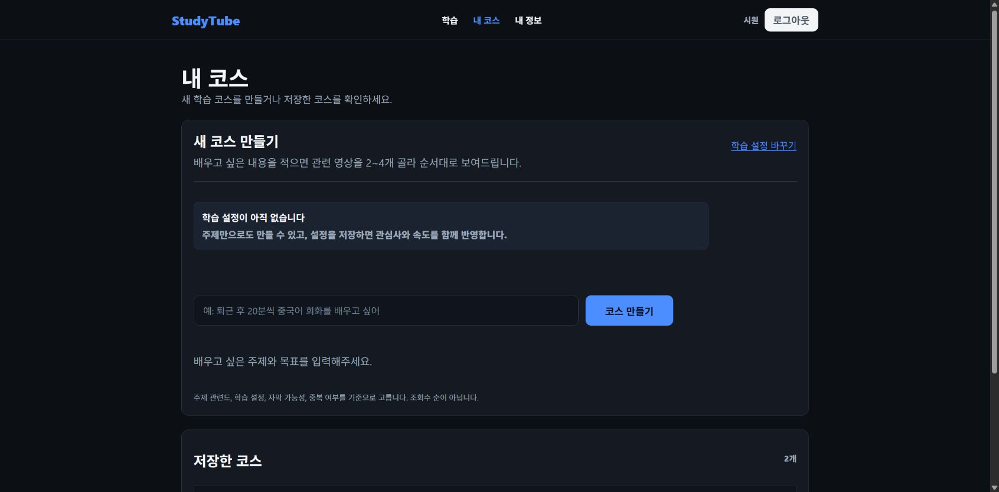
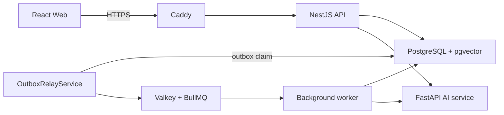
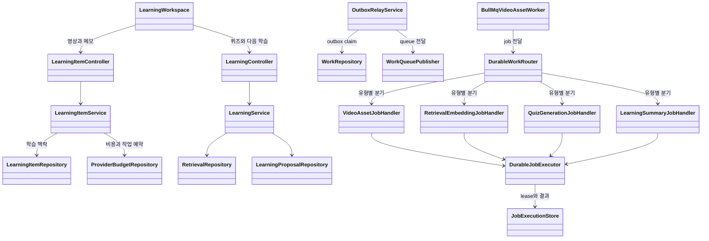
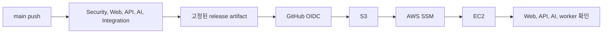

# StudyTube

StudyTube는 외국어 YouTube 영상을 보면서 현재 문장을 확인하고, 메모와 퀴즈를 남기고, 다음에 공부할 영상까지 이어 주는 학습 서비스입니다.

[서비스 바로가기](https://studytube.page) | [API 문서](api/openapi/current.json) | [전체 문서](docs/README.md)

[](https://github.com/NearthYou/studytube/actions/workflows/ci-cd.yml)

## 실제 서비스 화면


영상 옆에서 지금 문장, 내용 정리, 메모, 퀴즈를 전환합니다. 메모는 작성한 시점과 함께 저장되며, 퀴즈는 0초부터 현재 재생 위치까지 준비된 자막을 기준으로 만들어집니다.



학습 목표로 새 Course를 만들고, 저장한 Course를 같은 화면에서 다시 선택합니다.

## 시작한 이유

YouTube에는 외국어 학습 자료가 많지만 실제 공부 과정은 여러 곳으로 나뉩니다. 영상은 YouTube에서 보고, 모르는 표현은 다른 창에서 찾고, 메모는 별도 앱에 적습니다. 며칠 뒤 다시 돌아오면 어디까지 봤는지와 다음에 무엇을 볼지부터 다시 정해야 합니다.

StudyTube는 이 과정을 영상 하나를 소비하는 일이 아니라 이어지는 학습 기록으로 만들기 위해 시작했습니다. 재생 위치를 기준으로 자막, 메모, 퀴즈를 묶고, 사용자의 목표와 학습 기록을 바탕으로 다음 영상 순서를 제안합니다.

## 학습 흐름

1. YouTube 영상 주소를 입력합니다.
2. YouTube가 제공하는 자막을 먼저 가져오고 준비된 문장부터 보여 줍니다.
3. 영상 재생 위치에 맞춰 원문을 먼저 보고, 한국어 번역이 준비되면 함께 확인합니다.
4. 기억할 내용을 해당 시점에 메모합니다.
5. 0초부터 현재 재생 위치까지 준비된 자막으로 퀴즈를 풀고 오답의 근거 시점으로 돌아갑니다.
6. 학습 목표로 만든 Course 초안을 확인하고 제안된 영상 순서를 직접 저장합니다.
7. 퀴즈를 평가한 뒤에는 기존 Course 또는 새 비공개 Course를 선택해 첫 후보 추가를 승인합니다.
8. 같은 브라우저에서는 최근 영상을 이어 보고, 저장한 Course는 다른 기기에서도 다시 선택합니다.

## 전체 구조



브라우저는 화면 상태를 다루고, 사용자별 최근 학습 목록과 standalone 영상의 재생 위치 및 완료 여부는 localStorage에 저장합니다. 저장한 Course, 메모, 자막과 퀴즈는 API와 PostgreSQL이 소유하며 사용자 권한을 확인합니다. 오래 걸리는 자막, 번역, 임베딩, 퀴즈 작업은 요청 처리와 분리해 worker에서 실행합니다. AI 서비스는 자막 처리와 학습 자료 생성을 담당하지만 Course 저장과 같은 최종 변경은 API와 사용자의 승인을 거칩니다.

| 영역 | 사용 기술 | 역할 |
| --- | --- | --- |
| Web | React, TypeScript, Vite | 영상 재생, 자막, 메모, 퀴즈, Course 화면 |
| API | NestJS, TypeScript | 인증, 소유권, 학습 기록, 작업 예약 |
| AI | FastAPI, Python, LangGraph | 자막 처리, 번역, 임베딩, 학습 순서 생성 |
| Data | PostgreSQL, pgvector, Valkey, BullMQ | 영속 데이터, 검색, 작업 전달 |
| Infra | Caddy, Docker Compose, GitHub Actions, AWS | HTTPS, 실행 환경, 검증과 배포 |

## 주요 코드 관계



LearningWorkspace는 영상과 네 가지 학습 도구를 조합합니다. 화면에서 시작한 요청은 controller, service, repository 순서로 내려가며 SQL과 외부 처리 세부사항이 화면까지 새어 나오지 않도록 나눴습니다.

상세 흐름은 [아키텍처 문서](docs/architecture.md)에 정리했습니다.

## 문제 해결 과정

### 번역이 끝날 때까지 학습 화면이 비어 있던 문제

초기에는 원문 자막, 한국어 번역, 검색용 데이터가 모두 준비돼야 학습 화면이 열렸습니다. 영상이 길수록 사용자는 처리 완료까지 아무것도 할 수 없었습니다.

자막 상태를 원문 확인, 음성 인식, 번역, 검색 준비, 부분 완료, 완료로 나눴습니다. 같은 처리 회차의 자막 조각은 기존 결과와 합치고, 준비된 원문부터 화면에 표시했습니다. 번역과 검색이 진행 중이어도 먼저 영상을 보며 메모를 남길 수 있게 됐습니다.

### 자막은 있는데 현재 재생 구간이 비어 있던 문제

영상 전체에 자막 데이터가 있다는 사실만 확인하면 앞부분이나 현재 재생 위치가 비어 있는 경우를 놓쳤습니다. 저장된 첫 문장이 5초 이후에 시작하면 앞부분 보강 작업을 다시 요청하고, 현재 구간과 겹치는 문장이 없으면 YouTube 기본 자막을 우선 사용하도록 바꿨습니다.

자동 보강이 늦을 때는 사용자가 재생 중인 탭 소리로 처음부터 자막을 시작할 수 있습니다. 자막 유무가 아니라 현재 시점에서 학습 가능한지를 기준으로 화면을 결정합니다.

### 작업이 사라지거나 두 번 실행될 수 있던 문제

학습 데이터를 저장한 뒤 별도로 queue에 작업을 보내면 두 동작 사이에서 서버가 중단될 수 있습니다. 반대로 queue가 작업을 다시 전달하면 같은 외부 처리가 중복 실행될 수 있습니다.

provider 작업 예약과 outbox event를 하나의 PostgreSQL transaction에 기록합니다. 이어 별도 transaction에서 learning item과 study context를 만들고 subscription을 context에 연결합니다. context 생성이나 연결에 실패하면 새로 만든 subscription reservation을 release합니다. OutboxRelayService가 event를 Valkey queue로 옮기고 DurableJobExecutor가 lease, heartbeat, 실행 결과를 관리합니다. 같은 작업이 다시 도착하면 저장한 결과를 돌려주고, lease를 잃은 worker는 외부 작업을 중단합니다.

### 일부 자막으로는 퀴즈를 시작할 수 없던 문제

퀴즈가 완성된 전체 자막만 요구하면 긴 영상에서는 현재 재생 위치까지 문장이 충분해도 기다려야 했습니다. 퀴즈 요청 시 0초부터 현재 재생 위치까지를 범위로 저장하고, 그 안에 준비된 자막 문장과 자막 버전을 근거로 고정했습니다.

화면에 원문 문장 5개가 준비되면 번역이나 검색 처리가 진행 중인 상태에서도 퀴즈를 요청할 수 있습니다. API는 ready caption artifact의 버전을 고정하고, 검색용 근거가 부족하면 같은 artifact의 자막 문장을 사용합니다. 답을 확인할 때는 사용한 문장과 시점으로 다시 이동할 수 있습니다.

## AI가 맡는 범위

Course 화면에서는 AI가 사용자의 목표를 검색어로 바꾸고 관련 영상 후보를 정리합니다. 브라우저는 이 후보를 학습 순서 초안으로 구성하며, 사용자가 저장을 눌러야 Course로 확정됩니다. 검색 결과는 관련도, 자막 가능성, 이미 본 영상과의 중복을 기준으로 정리합니다.

퀴즈를 평가한 뒤에는 다음 학습 실행 결과의 첫 후보 하나를 제안합니다. 사용자가 기존 Course 또는 새 비공개 Course를 선택해 후보 추가를 승인해야 반영됩니다. 실행 시간, 도구 호출 수, 토큰과 예상 비용에도 상한을 두어 한 번의 요청이 계속 확장되지 않도록 했습니다.

## 팀 작업과 개인 구현

StudyTube는 여러 contributor가 게시판, 영상, 자막, 검색 흐름을 함께 만들며 시작했습니다. 이후 이시원은 서비스를 영상 학습 중심으로 재구성하고 다음 영역을 확장했습니다.

- 현재 문장 중심의 학습 화면과 Course 이어보기
- 서버 세션, 이메일 인증과 사용자 프로필
- Course 버전 관리와 동시 수정 처리
- 자막 단계 공개, 근거 자막 퀴즈와 다음 학습 제안
- PostgreSQL outbox와 재시도 가능한 worker
- LangGraph 기반 학습 순서 생성
- GitHub Actions에서 AWS까지 이어지는 배포 구조

구현 범위와 시작 코드는 [팀 작업과 구현 범위](docs/contributions.md)에서 확인할 수 있습니다.

## CI/CD와 배포



main에 반영된 소스 그대로 Web, API, AI와 PostgreSQL 및 Valkey 통합 검사를 실행합니다. 검사를 통과한 소스만 release 파일과 SHA-256으로 묶습니다. GitHub Actions는 장기 AWS access key 대신 OIDC 임시 권한을 받아 S3에 release를 올리고 SSM으로 EC2에 배포합니다.

외부에는 Caddy의 80번과 443번 포트만 열고 API, AI, PostgreSQL, Valkey는 내부 경계에 둡니다. 자세한 배포 흐름은 [CI/CD 문서](docs/ci-cd.md)에 있습니다.

## 로컬 실행

Node.js 24.8 이상, Python 3.12, Docker Compose v2가 필요합니다. Web, API와 database는 PowerShell에서 실행할 수 있으며, AI lockfile 설치와 AI 서비스 실행은 Linux 또는 WSL에서 진행합니다.

```powershell
Copy-Item .env.example .env

npm --prefix web ci
npm --prefix api ci

npm run db:up
npm run db:migrate:up
```

Web과 API는 각각 별도 PowerShell 터미널에서 실행합니다.

```powershell
npm run dev:web
npm run dev:api
```

AI 서비스는 Linux 또는 WSL 터미널에서 실행합니다.

```bash
python3 -m venv ai/.venv
ai/.venv/bin/python -m pip install --require-hashes -r ai/requirements.txt
ai/.venv/bin/python -m uvicorn main:app --reload --host 0.0.0.0 --port 8000 --app-dir ai
```

- Web: http://localhost:5173
- API: http://localhost:3000
- AI service: http://localhost:8000

Worker는 API를 빌드한 뒤 별도 터미널에서 실행합니다.

```powershell
npm --prefix api run build
npm --prefix api run start:worker
```

외부 모델을 사용하는 기능에는 OPENAI_API_KEY가 필요합니다.

## 검증

```powershell
npm --prefix web run lint
npm --prefix web run build

npm --prefix api run lint
npm --prefix api test -- --runInBand
npm --prefix api run build

pwsh ./operations/tests/Invoke-OperationsContractTests.ps1
```

AI lockfile 설치와 test는 Linux 또는 WSL에서 실행합니다.

```bash
python3 -m venv ai/.venv
ai/.venv/bin/python -m pip install --require-hashes -r ai/requirements.txt
(
  cd ai
  .venv/bin/python -m unittest discover -s .
)
```

최신 main의 검사와 실제 배포 결과는 [GitHub Actions](https://github.com/NearthYou/studytube/actions/workflows/ci-cd.yml)에서 확인할 수 있습니다. 문서에 사용한 검증 기준은 [verification.md](docs/verification.md)에 정리했습니다.
