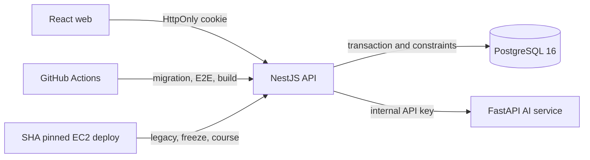

# StudyTube

YouTube 학습 자료를 순서가 있는 Course로 구성하고 공유하는 서비스다. 이 저장소는 화면 기능 수보다 백엔드의 데이터 일관성, 동시성 제어, 인증 경계, 무중단 데이터 전환을 설명할 수 있는 포트폴리오에 초점을 둔다.

## 포트폴리오 핵심

### Course aggregate

기존 playlist와 playlist item 조합을 명시적인 Course aggregate로 확장했다.

- Course root가 owner, 공개 범위, 생명주기, version을 소유한다.
- CourseStep은 `1..N`의 연속 순서와 immutable 영상 snapshot을 가진다.
- 원본 post가 삭제되어도 snapshot은 남아 학습 경로가 보존된다.
- draft와 archived Course는 owner만 읽고, published Course만 public projection으로 조회한다.
- feedback은 published 상태에서만 추가되며 public 응답은 작성자의 비공개 식별자를 선택하지 않는다.

### 동시성 계약

클라이언트는 수정할 때 `expectedVersion`을 보낸다. PostgreSQL transaction과 row lock이 실제 승자를 정하고, 같은 version의 경쟁 요청 중 하나만 commit된다. stale 요청은 저장된 값을 덮어쓰지 않고 409를 받는다.

다음 race를 실제 PostgreSQL E2E로 검증한다.

- metadata patch 대 patch
- step reorder 대 reorder
- publish 대 마지막 step 삭제
- archive 대 feedback
- 같은 idempotency key의 동시 create
- post 삭제 대 Course snapshot 조회

### idempotency와 재시도

`POST /courses`는 owner별 `Idempotency-Key`를 요구한다. plaintext key 대신 SHA-256 digest를 저장하고 canonical payload hash를 함께 비교한다. 같은 key와 payload의 재시도는 같은 Course ID로 수렴하고, 다른 payload 재사용은 409다.

### legacy migration과 cutover

Course 전환은 legacy 테이블을 삭제하지 않는 expand 방식이다.

1. playlist를 private draft Course로 backfill한다.
2. 원본과 대상 fingerprint를 audit에 함께 기록한다.
3. 중단되면 완료된 Course를 건너뛰고 재개한다.
4. freeze 모드에서 두 writer 계열을 막고 advisory lock으로 기존 transaction을 drain한다.
5. delta backfill과 exact verify가 성공한 동일 `DEPLOY_SHA`만 course 모드로 활성화한다.

첫 네이티브 Course 쓰기 뒤에는 legacy로 역기록할 수 없으므로 freeze 후 roll forward가 기본 복구 전략이다. schema down이나 Terraform을 포트폴리오 증적으로 과장하지 않고, 데이터 보존과 검증 가능한 운영 절차에 집중한다.

## 시스템 구성



- `web`: React 기반 사용자 화면과 user-scoped local draft import
- `api`: 인증, Course aggregate, migration, cutover, HTTP boundary
- `ai`: 영상 요약을 담당하는 별도 FastAPI 서비스
- `docs`: 설계 결정, migration runbook, 검증 근거

## 실행

Node.js 24.8 이상, Python 3.12, Docker가 필요하다.

```powershell
npm run db:up
npm --prefix api ci
npm --prefix web ci
python -m pip install -r ai/requirements.txt
npm --prefix api run db:migrate:up
npm run all
```

기본 주소는 web `http://localhost:5173`, API `http://localhost:3000`, AI `http://localhost:8000`이다.

## 검증

```powershell
npm --prefix api run lint
npm --prefix api test -- --runInBand
npm --prefix api run test:e2e -- --runInBand
npm --prefix api run build

npm --prefix web run lint
Set-Location web
node --test tests/*.test.ts
npm run build
```

GitHub Actions는 PostgreSQL 16 service container에서 clean migration, guarded legacy fixture, Course backfill과 exact verifier, HTTP privacy, concurrency race를 실행한다. 기존 cookie-only 인증 경계, Argon2 bound, web test와 production build도 같은 필수 gate로 유지한다.

## 문서

- [API 설명](api/README.md)
- [데이터베이스 마이그레이션 운영 가이드](docs/database-migrations.md)
- [Course aggregate 설계](docs/superpowers/specs/2026-07-29-course-aggregate-design.md)
- [구현 계획과 검증 계약](docs/plans/2026-07-29-001-feat-course-aggregate-plan.md)

## 범위 밖

Terraform, Kubernetes, cloud provisioning, 추천 시스템, quiz, background job 플랫폼은 이번 범위에 포함하지 않는다. 백엔드 지원 역량은 schema invariant, transaction race, resumable migration, CI database gate, readiness 기반 배포와 rollback 판단으로 증명한다.
