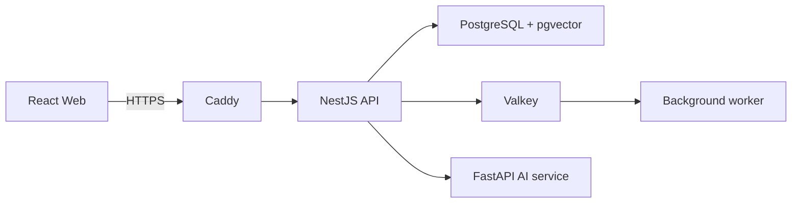

# StudyTube

YouTube로 공부하면서 흩어지는 영상, 메모, 학습 순서, 진도와 퀴즈를 하나의 Course로 관리하는 프로젝트다.

- 서비스: [studytube.page](https://studytube.page)
- 저장소: [github.com/NearthYou/studytube](https://github.com/NearthYou/studytube)
- API 계약: [api/openapi/current.json](api/openapi/current.json)


## 왜 만들었나

YouTube에는 좋은 학습 자료가 많지만 실제 공부는 여러 곳에 흩어지기 쉽다. 영상은 재생목록에, 메모는 다른 앱에, 진도는 기억에 의존하고 다음에 무엇을 볼지도 매번 다시 정해야 한다.

StudyTube는 단순한 영상 북마크가 아니라 다음 흐름을 한곳에 묶는 것을 목표로 했다.

1. 영상을 학습 자료로 저장한다.
2. 자막과 요약을 바탕으로 내용을 찾는다.
3. 여러 영상을 순서가 있는 Course로 구성한다.
4. 구간별 진도와 퀴즈 결과를 이어서 기록한다.
5. AI가 제안한 Course는 근거를 확인한 뒤 사용자가 승인한다.

## 주요 기능

- 이메일 확인과 서버 세션 기반 로그인
- YouTube 영상, 자막, 번역, 요약 관리
- 순서와 공개 범위를 가진 Course 편집
- 키워드와 벡터를 함께 쓰는 검색
- 출처가 붙은 AI Course 초안
- 영상 구간 진도와 퀴즈 기록
- 중단 뒤에도 다시 처리할 수 있는 백그라운드 작업

현재 공개 배포는 개인 프로젝트 데모다. AWS SES 도메인 인증과 production 발송 권한을 사용해 가입 메일을 보낸다.

## 구조



| 영역 | 역할 |
| --- | --- |
| `web` | 인증, 게시물, Course, 학습 화면 |
| `api` | 권한, 데이터 변경, 검색, 진도, worker |
| `ai` | 자막, 번역, 요약, 임베딩 |
| `infra` | Caddy와 production Compose 설정 |
| `scripts` | release 생성과 AWS 배포 |
| `operations` | 복원, 장애 확인, 부하 테스트 스크립트 |

## 선택한 방식과 이유

### Course가 학습 순서를 소유한다

초기 playlist는 게시물 ID 배열만 가지고 있어 동시 수정과 원본 삭제에 약했다. Course가 순서, 공개 범위, 버전과 영상 snapshot을 함께 소유하도록 바꿨다. 원본 게시물이 삭제되어도 Course의 학습 순서는 유지되고, 동시에 수정할 때는 이전 변경을 조용히 덮어쓰지 않는다.

### 로그인 상태는 서버가 관리한다

브라우저 저장소의 token 대신 PostgreSQL에 저장한 서버 세션과 HttpOnly cookie를 사용한다. 매 요청마다 세션을 확인하는 비용은 들지만 로그아웃과 만료를 서버에서 바로 통제할 수 있다.

### 무거운 작업은 transaction 뒤에 처리한다

데이터 변경과 해야 할 작업을 같은 PostgreSQL transaction에 기록하고 worker가 나중에 처리한다. 전달 방식은 exactly-once가 아니라 at-least-once다. 같은 작업이 다시 와도 내부 결과가 하나로 수렴하도록 만들었지만, 외부 API 호출 직후 프로세스가 중단되는 구간까지 exactly-once라고 주장하지 않는다.

### 검색 결과의 권한을 다시 확인한다

키워드 검색과 vector 검색 결과를 합친 뒤 현재 게시물과 Course의 공개 범위를 다시 확인한다. 검색 query는 복잡해지지만 오래된 index만 믿고 비공개 자료를 보여 주는 문제를 피할 수 있다.

## 확인한 결과

2026-08-17 배포 기준으로 다음을 다시 실행했다.

- API 테스트 652건 통과, 환경 의존 테스트 1건 제외
- 실제 PostgreSQL과 Valkey를 사용한 API E2E 68건
- Web 테스트 183건
- AI 테스트 119건 통과, 환경 의존 테스트 6건 제외
- GitHub Actions의 Web, API, Backend Integration, AI, secret scan과 EC2 배포 통과

CI와 배포 기록은 [GitHub Actions](https://github.com/NearthYou/studytube/actions/workflows/ci-cd.yml)에서 확인할 수 있다.

## 로컬 실행

필요한 환경은 Node.js 24.8 이상, Python 3.12, Docker Compose v2다.

```powershell
Copy-Item .env.example .env

npm --prefix api ci
npm --prefix web ci

python -m venv ai/.venv
ai/.venv/Scripts/python.exe -m pip install --require-hashes -r ai/requirements.txt

npm run db:up
npm run db:migrate:up
npm run all
```

- Web: `http://localhost:5173`
- API: `http://localhost:3000`
- AI: `http://localhost:8000`

백그라운드 worker까지 실행하려면 API를 build한 뒤 별도 터미널에서 시작한다.

```powershell
npm --prefix api run build
npm --prefix api run start:worker
```

`OPENAI_API_KEY`가 없으면 외부 모델이 필요한 생성과 임베딩 기능은 사용할 수 없다.

## 테스트

```powershell
npm --prefix web run lint
npm --prefix web run build

npm --prefix api run lint
npm --prefix api test -- --runInBand
npm --prefix api run build

Push-Location ai
.venv/Scripts/python.exe -m unittest discover -s .
Pop-Location
```

PostgreSQL E2E는 migration과 fixture를 변경하므로 공유 database가 아닌 전용 테스트 database에서 실행해야 한다. 자세한 명령은 [api/README.md](api/README.md)에 정리했다.

## 배포와 한계

`main`에 merge하면 GitHub Actions가 commit 기준 release를 만들고 AWS OIDC로 임시 권한을 얻는다. release는 S3에 보관하고 SSM으로 EC2에 전달한다. 서버에는 SSH 포트를 열지 않았고 외부에는 HTTPS 진입점만 노출한다.

비용을 낮추기 위해 단일 EC2 인스턴스에 API, AI, worker, PostgreSQL과 Valkey를 함께 운영한다. 개인 프로젝트 배포에는 맞지만 고가용성 구조는 아니며 인스턴스 장애 동안 서비스가 중단될 수 있다. 예상 비용과 실제 AWS 구성은 [비용 기준 문서](docs/evidence/operations/aws-cost-baseline.md)에 기록했다.

추가 설계 근거는 [아키텍처 문서](docs/evidence/architecture/README.md), 운영 절차는 [operations/README.md](operations/README.md)에서 확인할 수 있다.
