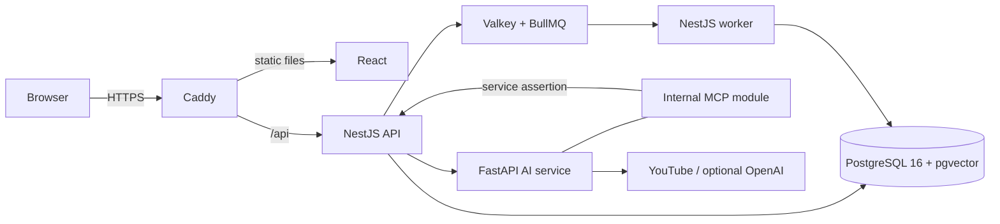
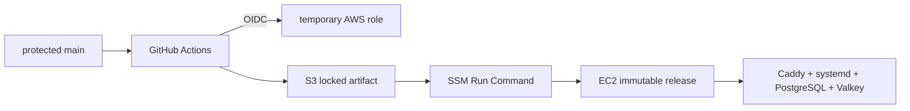

# StudyTube

YouTube로 공부할 때 영상, 메모, 다음에 볼 자료, 진도가 서로 다른 곳에 흩어지는 문제를 하나의 학습 Course로 묶은 프로젝트다. 영상 링크를 저장하는 데서 끝내지 않고 자막과 요약, 근거가 남는 검색, 순서가 있는 학습 경로, 진도와 퀴즈까지 이어지도록 설계했다.

개발 기준일은 2026-07-29다. 현재 코드는 프로덕션 배포 전 최종 회귀 검증과 전환 작업 중이며, 아직 측정하지 않은 운영 성능이나 메일 발송 승인을 완료된 성과처럼 기록하지 않는다.

| 구분 | 주소 | 현재 상태 |
| --- | --- | --- |
| 서비스 | [studytube.page](https://studytube.page) | HTTPS 배포와 공개 smoke test 진행 중 |
| 소스 코드 | [github.com/NearthYou/studytube](https://github.com/NearthYou/studytube) | `main` 보호 규칙과 GitHub Actions 사용 |
| API 계약 | [`api/openapi/current.json`](api/openapi/current.json) | 코드에서 생성하고 호환성을 검사하는 버전 관리 계약 |


위 이미지는 로컬 데모 데이터로 촬영한 제품 화면이다. 운영 가용성이나 성능을 나타내는 자료는 아니다.

## 문제를 다시 정의한 과정

초기 구현은 게시물에 YouTube URL을 저장하고 플레이리스트가 게시물 ID 배열을 들고 있는 구조였다. 화면은 빠르게 만들 수 있었지만 학습 데이터를 오래 유지하고 여러 요청을 안전하게 처리하기에는 다음 문제가 있었다.

- 플레이리스트 항목 위치가 모두 같은 기본값을 가질 수 있었고, 동시에 수정하면 마지막 요청이 앞선 변경을 덮었다.
- 원본 게시물을 삭제하면 학습 순서에서 영상 snapshot까지 사라졌다.
- 한 mutation 경로는 실제 요청 사용자를 확인하지 않아 소유권 경계가 서비스 계층마다 달랐다.
- 세션 원문과 사용자 상태를 브라우저 저장소에 두고 클라이언트 판단을 먼저 신뢰해, 로그아웃과 세션 만료를 서버가 통제할 수 없었다.
- 데이터 변경 뒤 무거운 작업을 바로 실행하면 프로세스가 중단되는 순간 해야 할 일 자체를 잃을 수 있었다.
- 벡터 유사도만으로 찾은 자료는 키워드 일치가 약했고, 오래된 인덱스가 현재 공개 범위를 넘어 노출되지 않는다는 보장이 필요했다.

그래서 StudyTube를 기능 묶음이 아니라 네 개의 일관성 경계로 다시 나눴다.

1. 인증은 브라우저 표시 상태가 아니라 서버가 폐기할 수 있는 세션을 기준으로 삼는다.
2. Course는 순서, 공개 범위, 생명주기, 버전, 학습 snapshot을 함께 소유하는 aggregate다.
3. 후속 작업은 도메인 변경과 같은 PostgreSQL transaction에 의도를 기록하고, worker가 적어도 한 번 처리한다.
4. 검색과 agent 결과는 현재 권한을 다시 확인한 source와 인용을 통해서만 학습 경로에 들어온다.

이 변화의 설계와 구현 근거는 [아키텍처 증적](docs/evidence/architecture/README.md)에 코드와 테스트 단위로 연결해 두었다.

## 학습 흐름

사용자가 경험하는 흐름과 서버가 지키는 경계는 다음과 같다.

1. 이메일 소유권을 확인한 뒤 이름과 비밀번호를 등록하고 HttpOnly 세션을 발급한다.
2. YouTube 영상을 학습 게시물로 저장하면 자막, 번역, 요약과 검색용 chunk를 준비한다.
3. 직접 Course를 구성하거나, 검색 결과의 인용을 바탕으로 만든 agent 제안을 검토한다.
4. 제안을 승인하면 Course와 후속 작업을 한 transaction에서 만들고 worker가 자료를 준비한다.
5. 영상 구간 진도와 퀴즈 시도를 서버에 누적해 중복 요청이나 여러 탭에서도 같은 결과로 수렴시킨다.

Agent는 Course를 바로 공개하지 않는다. 먼저 근거가 붙은 초안을 만들고 사용자의 승인을 기다린다. 호출 횟수, token, 예상 비용, 전체 실행 시간은 재시도를 포함한 run 수명 전체 예산으로 예약한다. 외부 호출 결과를 알 수 없는 timeout은 보수적으로 예약량을 사용한 것으로 처리한다.

## 런타임 구조



브라우저는 Caddy의 같은 origin만 사용한다. 운영 환경에서 NestJS API는 Unix socket, FastAPI와 데이터 저장소는 loopback에만 연결되고 외부에는 80과 443만 연다. `/api/internal/*`와 세부 readiness 경로는 Caddy에서 404로 닫는다.

| 영역 | 책임 | 주요 기술 |
| --- | --- | --- |
| [`web`](web) | 인증, 게시물, Course 구성, 학습 화면 | React, TypeScript, Vite |
| [`api`](api) | 권한, domain transaction, 검색, 학습 상태, worker | NestJS, PostgreSQL, pgvector, BullMQ |
| [`ai`](ai) | 자막, 번역, 요약, 임베딩, MCP 도구 | FastAPI, Python, MCP SDK |
| [`infra`](infra) | edge, production Compose, systemd 경계 | Caddy, Docker Compose, systemd |
| [`scripts`](scripts) | 재현 가능한 release와 SSM 배포 | Bash, GitHub Actions, AWS S3/SSM |
| [`operations`](operations) | 복원, 장애 주입, 부하 검증 | PowerShell, k6, PostgreSQL tools |

## 기술적 결정과 트레이드오프

### 브라우저 세션에서 서버 세션으로

비밀번호는 Argon2id로 해시하고 세션과 이메일 확인 secret은 digest만 PostgreSQL에 저장한다. 프로덕션 브라우저에는 `HttpOnly`, `Secure`, `SameSite=Lax` cookie만 남긴다. 이메일 확인 링크의 fragment는 화면이 읽는 즉시 URL에서 제거하고, 실제 가입 완료에는 별도의 짧은 수명 enrollment cookie를 쓴다.

JWT보다 매 요청의 database lookup 비용이 들지만, 서버가 세션을 즉시 폐기하고 기기별 만료를 통제할 수 있는 쪽을 선택했다. 이메일 존재 여부를 드러내지 않는 동일 응답과 최소 응답 시간, digest 기반 rate limit으로 가입과 로그인 열거 공격도 줄였다.

- 구현: [`AuthService`](api/src/auth/auth.service.ts), [token codec](api/src/auth/auth-token.ts), [cookie policy](api/src/auth/auth-cookie.ts)
- 검증: [`auth.e2e-spec.ts`](api/test/auth.e2e-spec.ts), [`auth-http.spec.ts`](api/src/auth/auth-http.spec.ts), [`verify-auth-boundary.ts`](api/scripts/verify-auth-boundary.ts)

### 배열형 플레이리스트에서 Course aggregate로

Course root가 owner, 상태, 공개 범위와 optimistic version을 소유하고, 변경은 같은 root row를 잠근 뒤 다시 검증한다. 단계 위치는 PostgreSQL constraint가 연속성과 중복을 최종 확인한다. 원본 게시물이 사라져도 `source_post_id`만 비우고 영상 제목, URL, 썸네일 snapshot과 학습 순서는 유지한다.

기존 playlist 데이터를 한 번에 바꾸는 대신 additive migration, 재개 가능한 backfill, fingerprint parity, `legacy → freeze → course` writer mode로 전환한다. 스키마와 운영 절차가 복잡해지는 대신 데이터 손실 없이 전환을 중단하거나 첫 native Course 쓰기 전까지 이전 애플리케이션으로 돌아갈 수 있다.

- 구현: [Course migration](api/migrations/1753660803000_course-aggregate.cjs), [`PostgresCourseRepository`](api/src/course/postgres-course.repository.ts), [backfill](api/scripts/backfill-courses.ts)
- 검증: [`course-schema.e2e-spec.ts`](api/test/course-schema.e2e-spec.ts), [`course-concurrency.e2e-spec.ts`](api/test/course-concurrency.e2e-spec.ts), [`course-migration.e2e-spec.ts`](api/test/course-migration.e2e-spec.ts)

### 직접 실행에서 transactional outbox로

게시물이나 Course 변경과 후속 작업 intent를 같은 PostgreSQL transaction에 기록한다. relay는 `FOR UPDATE SKIP LOCKED`와 lease token으로 event를 claim하고, 결정적인 BullMQ job ID를 사용한다. worker 결과도 event와 handler version의 unique key로 수렴한다.

이 구조는 exactly-once를 주장하지 않는다. queue 전송 뒤 database acknowledgement 전에 프로세스가 죽으면 같은 작업이 다시 전달될 수 있다. 따라서 내부 결과는 중복 안전하게 저장하고, 외부 side effect는 각 handler가 별도 idempotency 계약을 가져야 한다.

- 구현: [`PostgresWorkRepository`](api/src/work/postgres-work.repository.ts), [`OutboxRelayService`](api/src/work/outbox-relay.service.ts), [`DurableWorkRouter`](api/src/work/durable-work.router.ts)
- 검증: [`work-queue.e2e-spec.ts`](api/test/work-queue.e2e-spec.ts), [`postgres-work.repository.spec.ts`](api/src/work/postgres-work.repository.spec.ts), [`durable-work.router.spec.ts`](api/src/work/durable-work.router.spec.ts)

### vector 검색에서 권한 인지 hybrid retrieval로

키워드 후보와 vector 후보를 각각 구한 뒤 reciprocal rank fusion으로 합친다. 어떤 후보도 인덱스 행만 신뢰하지 않고 authoritative post 또는 Course step에 다시 join해 owner, 공개 범위, 상태와 source version을 확인한다. 검색 품질과 공개 범위 안전성을 얻는 대신 query와 index 운영이 복잡해졌고, 실제 품질은 별도 평가 dataset으로 계속 측정해야 한다.

- 구현: [`PostgresRetrievalRepository`](api/src/retrieval/postgres-retrieval.repository.ts), [retrieval migrations](api/migrations/1753660807000_retrieval-chunks-and-source-version.cjs)
- 검증: [`retrieval.e2e-spec.ts`](api/test/retrieval.e2e-spec.ts), [`verify-query-plans.ts`](api/scripts/verify-query-plans.ts), [evaluation runner](api/scripts/evaluate-retrieval.ts)

## 보안 모델

보안 경계는 secret을 숨기는 것과 secret이 없어도 접근할 수 없는 구조를 함께 목표로 한다.

- 실제 환경 파일은 [`.gitignore`](.gitignore)로 제외하고, [root](.env.example), [API](api/.env.example), [Web](web/.env.example), [AI](ai/.env.example) 예시에는 placeholder만 둔다. [메일 설정 검증](api/src/auth/verification-email.config.ts)은 프로덕션에 필수 secret, 정확한 HTTPS origin, SES provider가 없거나 local capture가 선택되면 시작을 거부한다.
- GitHub Actions는 저장된 AWS access key 대신 OIDC 단기 자격 증명을 사용한다. 배포 서버는 SSH와 개인키를 열지 않고 SSM Run Command만 받는다.
- Caddy만 public port를 소유한다. API는 Unix socket, AI, PostgreSQL, Valkey는 loopback에 제한한다. 내부 MCP 호출은 짧은 수명의 서명 assertion과 audit record를 요구하며 `/mcp`와 discovery 경로는 public edge에서 404로 닫는다. 사용자에게 발급할 OAuth 경계 없이 서버 서명 secret을 배포하는 방식은 지원하지 않는다.
- owner ID는 요청 body가 아니라 인증된 principal에서 가져온다. 비공개 Course가 없을 때와 다른 사용자가 조회할 때를 모두 404로 응답해 존재 여부를 감춘다.
- verification token과 session token 원문은 애플리케이션 database와 log에 남기지 않는다. 로컬 `capture` 메일 adapter만 명시적 개발 경계에서 확인 링크를 만들며 프로덕션 설정에서는 허용되지 않는다.
- Python 직접 의존성은 [`requirements.in`](ai/requirements.in)에 고정하고, 전체 전이 의존성은 [`requirements.txt`](ai/requirements.txt)에 SHA-256 hash와 함께 잠근다. audit 도구도 [별도 잠금 파일](ai/requirements-audit.txt)로 격리했다. CI와 EC2는 `--require-hashes`로 설치해 잠금 파일 밖의 package를 허용하지 않는다.
- 배포 artifact는 commit SHA, manifest와 SHA-256을 모두 확인한 뒤 활성화한다. CI는 Git 이력과 현재 tree의 secret, OpenAPI 호환성, migration과 runtime 경계를 독립 job으로 검사한다.

관련 경계는 [Caddyfile](infra/Caddyfile), [production Compose](infra/production.compose.yml), [runtime listener](api/src/runtime-listener.ts), [MCP assertion](api/src/mcp/mcp-service-assertion.ts), [CI/CD workflow](.github/workflows/ci-cd.yml)에서 확인할 수 있다. 운영 계정 ID, instance ID, 연락처와 secret은 문서나 증적에 기록하지 않는다.

## 신뢰성과 관측성

장애를 없다고 가정하지 않고, 중단 뒤 어떤 상태에서 다시 시작할지를 코드와 증적으로 남겼다.

- outbox와 email delivery는 lease 만료 뒤 reclaim하며, 현재 lease holder만 acknowledgement할 수 있다.
- Course, agent run, quiz attempt는 row 또는 advisory lock 안에서 상태와 version을 다시 읽는다.
- agent 비용 예산은 provider 호출 전에 원자적으로 예약해 재시도가 새 예산을 받지 못하게 한다.
- OpenTelemetry trace context를 HTTP, PostgreSQL과 worker 경계에 전달하고 구조화 log, request ID, 내부 Prometheus 형식 지표를 제공한다.
- release는 40자리 commit SHA 단위의 immutable directory에 설치하고 정적 Web symlink를 원자적으로 교체한다. activation 실패나 재부팅 중 중단에는 이전 release 복구 또는 resume 경로가 있다.
- PostgreSQL 복원과 Valkey, worker, AI, database 장애 주입, 읽기 중심 k6 시나리오는 안전 확인값과 정제된 JSON 증적 형식을 사용한다.

[운영 드릴](operations/README.md)은 실행 절차이고 [운영 증적](docs/evidence/operations/README.md)은 결과 형식이다. 코드에 적힌 RPO, RTO와 latency threshold는 목표값이며 실제 운영 측정값이 아니다. 실측 결과가 생기기 전에는 포트폴리오 성과 수치로 사용하지 않는다.

## 검증 전략

테스트 개수를 늘리는 것보다 실패했을 때 데이터가 어떻게 남는지를 검증 대상으로 삼았다.

### 검증 가능한 결과

| 실패 상황 | 코드가 보장하는 결과 | 근거 |
| --- | --- | --- |
| 같은 version으로 두 Course 수정이 경합 | 한 요청만 version을 올리고 다른 요청은 저장값을 덮지 않음 | [`course-concurrency.e2e-spec.ts`](api/test/course-concurrency.e2e-spec.ts) |
| 응답 유실 뒤 같은 key로 Course 생성 재시도 | 같은 payload는 한 Course로 수렴하고 다른 payload는 충돌 | [`course-http.e2e-spec.ts`](api/test/course-http.e2e-spec.ts) |
| legacy backfill 중단 또는 재실행 | 완료 fingerprint가 같은 항목은 건너뛰고 불일치는 다시 검증 | [`course-migration.e2e-spec.ts`](api/test/course-migration.e2e-spec.ts) |
| relay 또는 worker가 acknowledgement 전에 중단 | event를 reclaim하고 동일 handler 결과는 한 행으로 수렴 | [`work-queue.e2e-spec.ts`](api/test/work-queue.e2e-spec.ts) |
| 오래된 private 검색 chunk가 남음 | authoritative source join에서 현재 owner, 공개 범위, version을 다시 확인 | [`retrieval.e2e-spec.ts`](api/test/retrieval.e2e-spec.ts) |
| agent run이 retry되어 외부 호출을 다시 시도 | run 수명 전체의 누적 예산 안에서만 새 사용량을 예약 | [`learning-concurrency.e2e-spec.ts`](api/test/learning-concurrency.e2e-spec.ts) |

| 경계 | 자동 검증 |
| --- | --- |
| Web | production dependency audit, ESLint, Node test runner, TypeScript build |
| API | production dependency audit, unit test, cookie-only auth boundary, Argon2 bounded benchmark, OpenAPI export와 compatibility |
| PostgreSQL | fresh migration, legacy adoption, down-up rehearsal, Course backfill parity, 실제 lock 경쟁 E2E |
| 검색과 학습 | GIN/HNSW planner contract, retrieval visibility, agent lifetime budget, progress와 quiz concurrency |
| worker | outbox lease, queue 중복 전달, process loss 뒤 reclaim과 결과 유일성 |
| AI/MCP | Python unittest, MCP protocol와 service assertion boundary, hash-locked install과 dependency audit |
| 배포 | shell syntax, production Compose와 Caddy validation, immutable release contract, secret scan |

GitHub Actions의 job과 정확한 실행 명령은 [`.github/workflows/ci-cd.yml`](.github/workflows/ci-cd.yml)에 있다. 최종 회귀와 실제 배포 검증이 끝나기 전에는 CI 통과율, latency, RPO/RTO를 완료 성과로 적지 않는다.

Python 3.12의 새 Linux container에서는 2026-07-29 기준 AI/MCP test가 85건 통과하고 6건 skip됐으며, 같은 잠금 파일의 strict dependency audit에서 알려진 취약점이 0건이었다. 이는 [`test_main.py`](ai/test_main.py), [`test_mcp_server.py`](ai/test_mcp_server.py)와 당시 취약점 database를 기준으로 한 결과이며 운영 처리량 수치는 아니다.

로컬에서 핵심 정적 검증을 다시 실행하려면 다음 명령을 사용한다.

```powershell
npm --prefix web run lint
Push-Location web
node --test tests/*.test.ts
npm run build
Pop-Location

npm --prefix api run lint
npm --prefix api test -- --runInBand
npm --prefix api run build

Push-Location ai
.venv/Scripts/python.exe -m unittest discover -s .
Pop-Location

pwsh ./operations/tests/Invoke-OperationsContractTests.ps1
```

Database E2E는 migration과 fixture를 변경한다. 공유 database가 아니라 매번 삭제할 수 있는 전용 PostgreSQL database에서 실행해야 한다. 상세 명령과 안전장치는 [API 문서](api/README.md), [database migration runbook](docs/database-migrations.md)에 있다.

## 로컬 실행

### 요구 사항

- Node.js 24.8 이상과 npm
- Python 3.12
- Docker와 Docker Compose v2
- Windows PowerShell 또는 동등한 shell

PowerShell에서는 다음 순서로 시작한다.

```powershell
Copy-Item .env.example .env

npm --prefix api ci
npm --prefix web ci

python -m venv ai/.venv
ai/.venv/Scripts/python.exe -m pip install --upgrade pip
ai/.venv/Scripts/python.exe -m pip install --require-hashes -r ai/requirements.txt

npm run db:up
npm run db:migrate:up
npm run all
```

`npm run all`은 PostgreSQL 준비 상태를 확인하고 Web, API, AI 개발 서버를 함께 실행한다.

- Web: `http://localhost:5173`
- API: `http://localhost:3000`
- AI: `http://localhost:8000`

`OPENAI_API_KEY`가 없으면 외부 model이 필요한 임베딩과 생성 기능은 사용할 수 없다. 자막과 일부 fallback 경로, provider를 대체한 단위 테스트는 별도로 실행할 수 있다. background worker까지 직접 확인할 때는 다른 터미널에서 API를 먼저 build한 뒤 실행한다.

```powershell
npm --prefix api run build
npm --prefix api run start:worker
```

개발 database volume을 보존한 채 container만 내리려면 `npm run db:down`을 사용한다. `.env`와 로컬 메일 capture, test artifact는 커밋하지 않는다.

## 배포와 비용 설계

배포는 `main`의 검증된 commit SHA 하나를 입력으로 삼는다. GitHub Actions가 deterministic artifact를 만들고 OIDC로 AWS 단기 자격 증명을 얻어 Object Lock이 적용된 S3에 저장한다. SSM이 EC2에서 hash와 manifest를 다시 확인하고 dependency 설치, build, Compose와 Caddy 검증을 끝낸 뒤 systemd service와 Web symlink를 활성화한다.



학생 프로젝트의 고정비를 낮추기 위해 단일 `t3.micro`, 30GB gp3, standard CPU credit, 한 개의 public IPv4와 Route 53 hosted zone을 선택했다. 2026-07-29 서울 리전 기준 추정 고정비는 월 약 16.38달러이고, 소량의 log, S3와 DNS query를 포함한 운영 예산은 월 17~19달러다. 세금, 연 14달러 도메인, OpenAI와 YouTube 외부 사용료는 별도다.

이 선택은 비용을 줄이지만 고가용성을 제공하지 않는다. 배포 중 service 재시작에 짧은 요청 실패가 생길 수 있고, managed database의 자동 failover와 point-in-time recovery도 없다. 현재 단계에서는 scale-out보다 복원 절차, immutable rollback, 비용 상한을 먼저 검증한다. 배포 상세는 [CI/CD runbook](docs/ci-cd.md)을 따른다.

## 현재 한계와 다음 검증

- `studytube.page`의 최종 HTTPS 전환과 실제 브라우저 smoke test는 진행 중이다.
- SES production sending 승인은 완료되지 않았다. 승인 전에는 sandbox 또는 명시적 local capture 경계로 가입 흐름을 검증하며 일반 사용자에게 메일이 간다고 주장하지 않는다.
- 단일 EC2, PostgreSQL, Valkey 구성이라 availability zone 장애를 견디지 못한다.
- database migration은 자동 down 대신 additive change와 roll forward를 기본으로 한다. 첫 native Course write 이후 legacy data로 자동 역복사하지 않는다.
- 운영 부하, RPO와 RTO의 측정 JSON은 아직 성과 수치가 아니다. 승인된 환경에서 같은 Git SHA와 dataset으로 드릴한 뒤 원본 결과를 추가해야 한다.
- YouTube 자막 접근과 외부 model 품질, quota, 가격은 애플리케이션 밖의 변수다. fallback과 timeout은 실패 범위를 줄이지만 외부 의존성을 제거하지는 않는다.

README의 핵심 설계 주장은 [아키텍처 증적](docs/evidence/architecture/README.md), 운영 절차는 [operations](operations/README.md), HTTP 세부 계약은 [API README](api/README.md)에서 구현과 테스트까지 추적할 수 있다.
