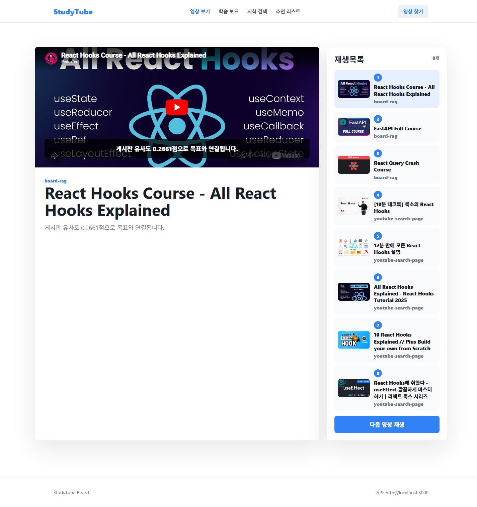
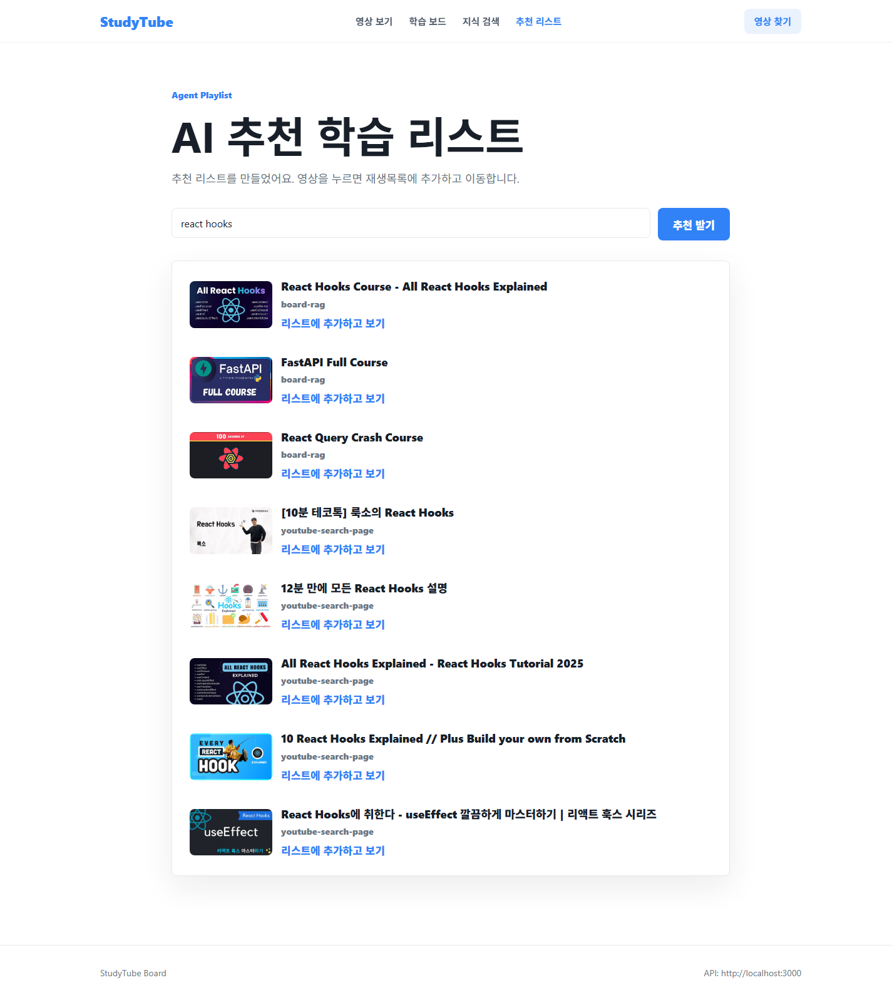
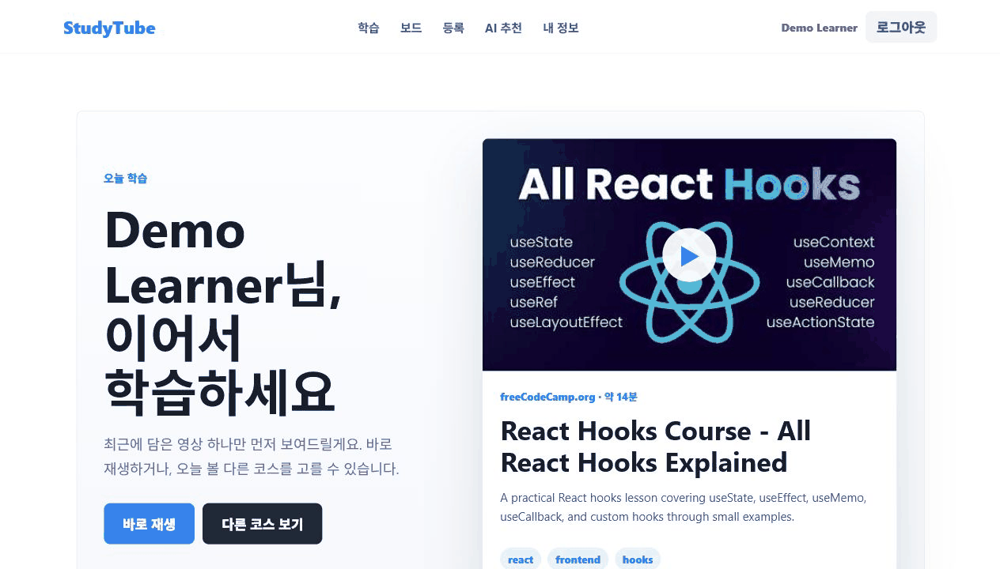
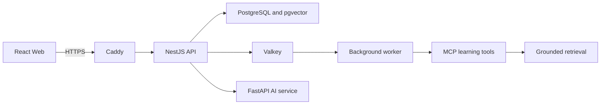
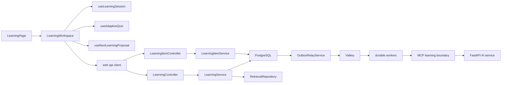

# StudyTube

StudyTube는 외국어 YouTube 영상을 자막, 메모, 퀴즈, 다음 학습 순서까지 이어서 공부하는 웹 서비스입니다.

- 서비스: [studytube.page](https://studytube.page)
- 저장소: [github.com/NearthYou/studytube](https://github.com/NearthYou/studytube)
- API 계약: [api/openapi/current.json](api/openapi/current.json)

## 핵심 기능 화면

| 영상 학습과 재생목록 | AI 추천 학습 리스트 |
| --- | --- |
|  |  |



위 자료는 영상 재생, 다음 학습 순서, AI 추천과 자막 처리라는 서비스 핵심 동작을 보여줍니다.

## 풀고 싶었던 문제

YouTube에서 외국어 영상을 공부하면 재생 화면, 번역, 메모, 복습 자료가 서로 떨어집니다. 무엇을 어디까지 봤는지 기억하기 어렵고, 다음 영상은 검색부터 다시 해야 합니다. StudyTube는 이 흐름을 한 화면과 하나의 학습 기록으로 묶기 위해 시작했습니다.

로그인한 사용자가 영상 주소를 넣으면 원문과 한국어 자막을 준비합니다. 현재 자막을 보며 시점이 붙은 메모를 남기고, 실제로 본 구간에서 퀴즈를 풉니다. 답을 확인한 뒤에는 근거 구간으로 돌아가 복습하거나 다음 영상을 제안받습니다. 제안은 사용자가 기존 Course 또는 새 비공개 Course를 선택해 승인해야 반영됩니다.

## 학습 흐름

1. 로그인 후 YouTube 영상 주소를 등록합니다.
2. YouTube 자막을 먼저 사용하고, 자막이 없을 때만 승인된 STT 경로를 검토합니다.
3. 원문과 한국어 자막을 보며 시점이 붙은 메모를 남깁니다.
4. 시청한 구간과 현재 자막 버전을 고정해 퀴즈를 만듭니다.
5. 오답은 출처 시점으로 돌아가 확인합니다.
6. 학습 기록에 근거한 다음 영상을 확인하고 Course 반영 여부를 직접 결정합니다.

## Agent, MCP, RAG를 사용한 이유

세 기술을 화면 장식이 아니라 학습 흐름의 책임 경계로 사용했습니다.

- RAG는 현재 사용자의 자막, 메모, 퀴즈 근거 중 시청 범위와 자료 버전이 맞는 항목만 찾고 시점을 함께 반환합니다.
- MCP는 검색, 학습 상태 읽기, 퀴즈 요청, 다음 학습 제안을 허용된 도구로 제한합니다. 실행 기록에는 원문 대신 허용된 필드 이름과 개수만 남깁니다.
- Agent는 정해진 실행 시간, 도구 호출 수, token, 예상 비용 안에서 제안을 만듭니다. Course 변경과 영상 재생은 직접 수행하지 않습니다.

추천 결과가 틀렸을 때 근거를 확인할 수 있고, 자동 제안이 사용자 데이터를 바로 변경하는 상황을 막는 것이 핵심입니다.

## 문제 해결 과정

### 학습 자료와 학습 맥락 분리

같은 영상도 혼자 볼 때와 Course 안에서 볼 때 메모, 진도, 퀴즈 근거가 다릅니다. 공유 가능한 영상 원본, 사용자 소유 학습 자료, Course 위치별 학습 맥락을 나눴습니다.

### 단계적 자막 공개

처음에는 원문 자막을 받은 뒤 번역과 검색 준비가 모두 끝날 때까지 학습 화면이 비어 있었습니다. 긴 영상일수록 번역 종료가 학습 시작을 막는 증상이 생겼습니다.

원문, 번역, index artifact는 pending, partial, ready, failed 상태로 저장합니다. API는 이 상태와 retrieval-ready boolean으로 caption phase를 만들어 화면에 보내고 준비된 segment부터 보여줍니다.

### 비용 작업의 사전 예약

같은 영상 요청은 기존 작업에 합류하고, 사용자별 및 전체 한도를 통과한 요청만 외부 처리를 시작합니다. STT는 provider flag 하나만으로 켤 수 없습니다. 승인 기록, 고정 model, production 환경, 최대 금액, 만료 시각, 승인 ID가 모두 유효해야 배포가 진행됩니다.

### at-least-once 작업 전달

API가 학습 데이터를 commit한 뒤 외부 작업을 바로 호출하면, 그 사이 프로세스가 중단돼 작업이 사라질 수 있습니다. 반대로 queue가 다시 전달하면 같은 작업이 두 번 실행될 수 있었습니다.

학습 변경과 outbox event를 PostgreSQL transaction에 함께 기록하고, OutboxRelayService가 Valkey queue로 전달합니다. DurableJobExecutor는 lease와 결과를 기록해 재전달을 수렴시킵니다.

terminal failure와 dead letter를 함께 완료하며 작업 전달 계약은 at-least-once로 유지합니다.

### 배포 비용과 가용성 절충

개인 프로젝트 비용을 낮추기 위해 EC2 한 대에서 API, AI service, worker, PostgreSQL, Valkey를 함께 운영합니다.

## 구조



| 영역 | 책임 |
| --- | --- |
| `web` | 로그인, 영상 등록, 자막, 메모, 퀴즈, Course 승인 |
| `api` | 소유권, 비용 예약, 학습 상태, durable work, MCP 경계 |
| `ai` | 자막 처리, 번역, 임베딩, 퀴즈 생성 |
| `operations` | 복원, 장애, 부하, Prometheus 규칙 검증 |
| `infra`, `scripts` | Caddy, production runtime, immutable EC2 배포 |

상세 class와 service 관계, durable work 흐름은 [아키텍처 문서](docs/architecture.md)에 있습니다.

## 구현 관계



Web hook은 화면 상태와 polling을 맡고 mutation 규칙은 API service에 남깁니다. PostgreSQL transaction에서 학습 변경과 outbox event를 함께 기록하고, worker는 Valkey queue의 중복 delivery를 `DurableJobExecutor` 경계에서 수렴시킵니다.

## 팀 결과와 개인 기여

StudyTube의 초기 게시판, 영상과 자막 흐름은 여러 contributor가 함께 만들었습니다. 이시원은 guided learning, backend hardening과 배포 구조를 확장했습니다.

세부 구현 역할은 [기여 문서](docs/contributions.md)에 정리했습니다.

## 검증 결과

Web 216개, API 720개, AI 126개 test가 통과했습니다. Operations contract는 57개 assertion을 통과했고 Web과 API production dependency audit은 취약점 0건이었습니다.

## 로컬 실행

Node.js 24.8 이상, Python 3.12, Docker Compose v2가 필요합니다.

```powershell
Copy-Item .env.example .env
npm --prefix api ci
npm --prefix web ci
python -m venv ai/.venv
ai/.venv/Scripts/python.exe -m pip install --require-hashes -r ai/requirements.txt
npm run db:up
npm run db:migrate:up
npm run all
```

- Web: `http://localhost:5173`
- API: `http://localhost:3000`
- AI service: `http://localhost:8000`

## 재현 가능한 검증

```powershell
Push-Location web
node --test tests/*.test.ts
npm run lint
npm run build
Pop-Location

Push-Location api
npm test -- --runInBand
npm run lint
npm run build
npm run openapi:export
npm run openapi:verify
Pop-Location

Push-Location ai
.venv/Scripts/python.exe -m unittest discover -s .
Pop-Location

pwsh ./operations/tests/Invoke-OperationsContractTests.ps1
```

PostgreSQL E2E는 migration과 fixture를 바꾸므로 공유 database가 아닌 격리된 test database에서 실행해야 합니다. 실행 방법은 [api/README.md](api/README.md), 운영 드릴은 [operations/README.md](operations/README.md)에 정리했습니다.

전체 문서 안내와 최신 재검증 결과는 [docs/README.md](docs/README.md)에서 확인할 수 있습니다.
