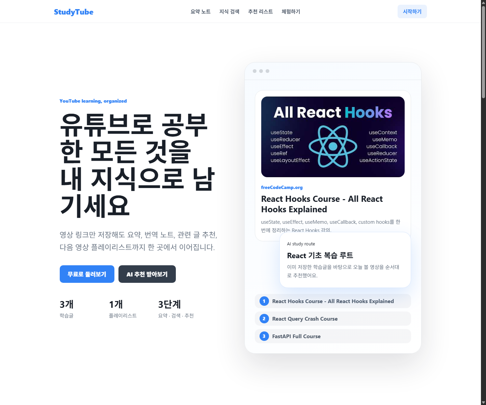
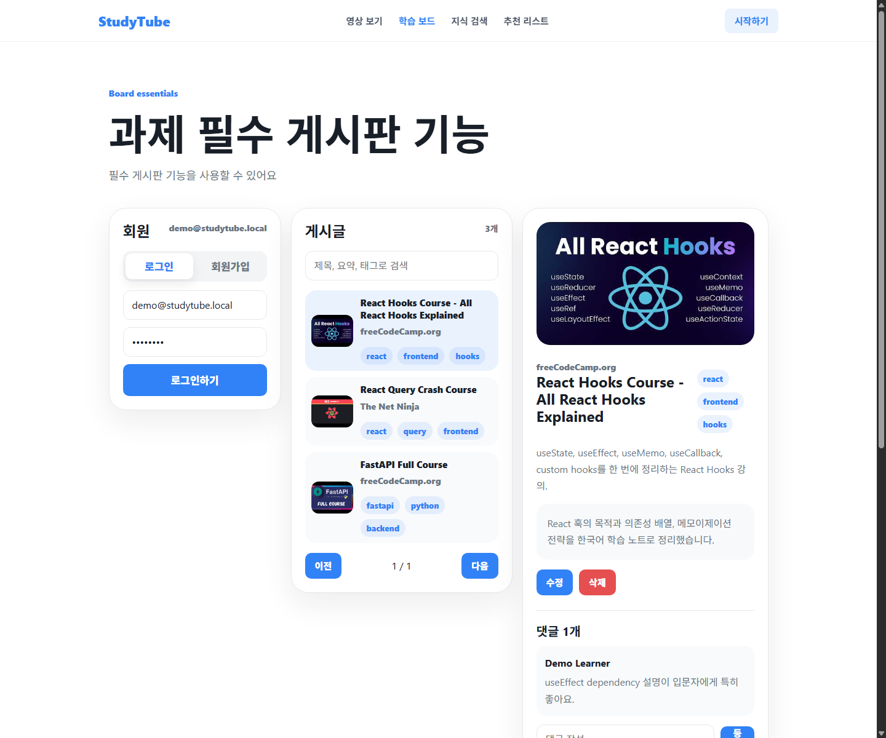

# StudyTube Courses

AI 응용 기술을 활용한 YouTube 학습 코스 공유 게시판입니다. 사용자는 좋은 YouTube 강의를 영상 재료로 등록하고, AI가 자막과 영상 맥락을 분석해 만든 요약을 저장한 뒤, 여러 영상을 순서 있는 플레이리스트 코스로 묶어 다른 사람과 공유하며 완주 피드백을 남길 수 있습니다. AI 기능은 과제 요구사항에 맞춰 RAG, MCP, AI Agent를 각각 분리해 구현했습니다.

## 1. 프로젝트 개요

StudyTube Courses는 YouTube로 공부하는 사람이 “무엇을 어떤 순서로 봐야 하는지”를 공유하는 학습 코스 커뮤니티입니다.

- 영상 URL 기반 지식 카드 작성
- AI 영상 분석 요약 저장
- 태그, 댓글, 검색, 페이징
- 다른 사람이 등록한 플레이리스트 보드형 탐색
- 회원가입 후 관심사/학습 속도 기반 취향 프로필 저장
- 학습 코스 생성과 완주 피드백
- RAG 기반 AI 영상 분석 요약 검색
- MCP 기반 YouTube 메타데이터 조회
- Agent 기반 맞춤형 학습 코스 생성

## 2. 주요 구현 기능

### 기본 게시판 기능

- 회원가입: `POST /auth/signup`
- 로그인: `POST /auth/login`
- 로그인 게이트: React 보호 라우트로 로그인/회원가입 외 모든 서비스 화면 차단
- 데모 계정: `demo@studytube.local` / `demo1234`
- 취향 분석: 사용자별 관심사, 학습 속도, 목표를 브라우저 저장소에 보관하고 코스 추천 기본값에 반영
- 게시물 CRUD: `GET/POST/PUT/DELETE /posts`
- 영상 지식 카드 작성: YouTube URL 입력 시 MCP로 제목, 채널명, 태그, 요약, 썸네일 자동 입력
- 공개 플레이리스트 보드: `GET /playlists`, `GET /explore/posts`
- 댓글: `POST /posts/:id/comments`
- 태그: 게시글 생성/수정 시 자동 정규화
- 페이징: `GET /posts?page=1&pageSize=3`
- 검색: 제목, AI 분석 요약, 채널명, 태그 검색
- 학습 코스: `GET/POST /playlists`
- 완주 피드백: `POST /playlists/:id/feedback`
- 영상 보기: 사이트 내부 YouTube 플레이어, 우측 재생목록, 순차 재생, 항목 삭제, 자막 토글

### AI 활용 기능

- RAG: `POST /ai/rag/recommend`
- MCP: `POST /ai/mcp/youtube`, FastAPI 내부 JSON-RPC `/mcp`
- Agent: `POST /ai/agent/study-plan`

## 3. 전체 아키텍처 구조

```txt
web/ React + Vite + TypeScript
  |
  v
api/ NestJS REST API
  |-- PostgreSQL + pgvector
  |-- in-memory local repository when PostgreSQL is unavailable
  |
  v
ai/ FastAPI
  |-- RAG retrieval
  |-- MCP JSON-RPC server
  |-- bounded Agent loop
  |-- optional OpenAI-compatible LLM / embedding model
```

### 기술 스택

- 프론트엔드: React, Vite, TypeScript
- 백엔드: NestJS
- AI 백엔드: FastAPI
- 데이터베이스: PostgreSQL, pgvector
- ORM 문서화: Prisma schema
- LLM: OpenAI-compatible commercial model 설정 지원
- Embedding: OpenAI-compatible embedding model 설정 지원, 로컬 deterministic embedding 포함
- Vector DB: PostgreSQL pgvector

## 4. AI 활용 기능, 기술, 아키텍처 구조

### RAG 기능

기능명: 기존 코스 우선 탐색을 위한 AI 영상 분석 RAG

흐름:

1. 사용자가 코스 찾기 화면에서 원하는 학습 코스를 입력합니다.
2. 각 영상 재료는 `summary`와 `translatedNotes`에 AI 영상 분석 요약을 저장합니다.
3. FastAPI는 제목 중심 검색이 아니라 영상별 `summary + translated_notes`를 RAG 검색 문서로 사용합니다.
4. 태그, 채널명, 제목은 보조 메타데이터로만 반영합니다.
5. `OPENAI_API_KEY`가 있으면 상용 embedding 모델을 사용할 수 있도록 설정값을 둡니다.
6. 키가 없거나 로컬 데모일 때는 deterministic hash embedding으로 동작합니다.
7. PostgreSQL의 `post_embeddings` 테이블은 `vector(64)` 타입으로 설계했습니다.
8. 이미 게시판에 올라온 코스/영상이 있으면 먼저 `evidenceSnippet` 근거 조각과 함께 보여줍니다.
9. 기존 자료가 없거나 사용자가 새 코스를 원하면 같은 화면에서 Agent가 MCP YouTube 탐색까지 이어받습니다.

관련 파일:

- `ai/main.py`
- `api/src/ai-proxy.service.ts`
- `api/src/database.service.ts`
- `api/prisma/schema.prisma`

### MCP 기능

기능명: YouTube 영상 메타데이터 조회 도구

FastAPI는 JSON-RPC 2.0 형식의 MCP 서버 역할을 하는 `/mcp` 엔드포인트를 제공합니다.

지원 method:

```json
{
  "jsonrpc": "2.0",
  "id": "demo",
  "method": "youtube.lookup",
  "params": {
    "query": "react hooks beginner"
  }
}
```

외부 서비스 연동:

- YouTube URL이 들어오면 YouTube oEmbed API를 호출합니다.
- 검색어가 들어오면 `YOUTUBE_API_KEY`가 있을 때 공식 YouTube Data API를 호출합니다.
- API 키가 없으면 YouTube 검색 페이지의 공개 메타데이터를 파싱해 실제 영상 후보 목록을 가져옵니다.
- 외부 네트워크가 막히면 fake 영상 대신 `youtube-search-unavailable`과 빈 `videos`를 반환합니다.
- API Key는 `.env`의 `YOUTUBE_API_KEY`에 둘 수 있도록 문서화했습니다.

권한 관리 전략:

- 브라우저는 NestJS API만 호출합니다.
- NestJS와 FastAPI 사이 내부 호출에는 `INTERNAL_AI_API_KEY`를 사용할 수 있습니다.
- 외부 API 키와 LLM 키는 서버 `.env`에만 둡니다.

### Agent 기능

기능명: 개인 맞춤형 콘텐츠 큐레이터

Agent는 학습 목표를 받아 도구를 선택하고 새 학습 코스 초안을 만듭니다. 코스 찾기 화면에서 RAG가 기존 자료를 먼저 찾고, 새 코스 생성 요청이 있을 때 Agent가 실행됩니다.

상태:

- goal
- language
- interests
- retrieved transcript evidence
- external video metadata
- trace

도구:

- `retrieve_posts`: RAG로 AI 영상 분석 요약 검색
- `search_video`: MCP로 외부 영상 메타데이터 조회
- `create_playlist_draft`: 추천 결과를 학습 코스 초안으로 정리

루프 방지:

- `maxIterations` 기본 3, 최대 4
- 도구 실패 시 trace에 error를 남기고 다음 단계로 진행
- 최종 응답에 `guardrails.loopStopped` 반환

Function Calling:

- `ai/main.py`의 `AGENT_TOOLS`에 OpenAI function-calling 호환 tool schema를 정의했습니다.
- `OPENAI_API_KEY`가 있으면 LLM tool choice를 시도합니다.
- 키가 없으면 같은 도구 목록을 deterministic loop로 실행합니다.

## 5. 실행 방법

### 1. 의존성 설치

```powershell
npm.cmd --prefix web install
npm.cmd --prefix api install
python -m venv ai\.venv
ai\.venv\Scripts\python.exe -m pip install -r ai\requirements.txt
```

### 2. 환경 변수

```powershell
Copy-Item .env.example .env
Copy-Item api\.env.example api\.env
Copy-Item ai\.env.example ai\.env
Copy-Item web\.env.example web\.env
```

### 3. PostgreSQL 실행

```powershell
npm.cmd run db:up
```

DB가 꺼져 있어도 NestJS API는 로컬 메모리 저장소로 실행할 수 있습니다. 다만 제출 시에는 Docker PostgreSQL을 켜고 실행하는 것을 권장합니다.

### 4. 개발 서버 실행

터미널 3개에서 실행합니다.

```powershell
npm.cmd run dev:ai
npm.cmd run dev:api
npm.cmd run dev:web
```

접속 URL:

- Web: http://localhost:5173
- API Health: http://localhost:3000/health
- AI Health: http://localhost:8000/health

## 6. 데모

서비스형 첫 화면:



필수 게시판 기능 화면:



Agent + MCP 실제 YouTube 추천 결과:


영상 보기와 우측 재생목록:


데모에서 확인할 것:

- 로그인하지 않으면 `/explore`, `/board`, `/search`, `/playlists`, `/watch` 접근 시 로그인 페이지로 이동
- 데모 계정 버튼으로 별도 회원가입 없이 바로 로그인
- 첫 화면에서 관심사와 학습 속도를 저장해 개인화된 코스 추천 기본값 확인
- `/explore`에서 다른 사람이 등록한 영상 지식 카드를 보드형으로 탐색
- `/board`에서 URL 붙여넣기 → MCP 자동 입력 → AI 분석 요약 저장 → 플레이리스트 코스 발행 과정을 확인
- 중앙 영상 요약, 추천 난이도, 대상 사용자, AI 영상 분석 요약, 댓글
- 하단 영상 지식 카드 작성/수정/삭제
- 영상 상세에서 영상을 바로 학습 코스 재료로 담고 내부 플레이어로 이동
- `/playlists`의 코스 찾기 화면에서 RAG가 기존 플레이리스트와 영상 분석 요약을 먼저 검색
- 원하는 코스가 이미 있으면 기존 코스와 AI 분석 기반 영상을 먼저 안내
- 새로 만들어 달라고 하면 Agent 추천과 MCP 실제 YouTube 검색 결과가 하나의 학습 코스 초안으로 합쳐짐
- Agent 추천 결과를 저장된 학습 코스로 만들고, 각 코스에 완주 피드백 작성
- 추천 결과를 누르면 선택한 영상부터 재생하고, 우측 재생목록에서 순서 재생/직접 선택 가능
- 영상 재생 중 실시간 번역 자막 또는 저장된 번역/자막 노트 기반 오버레이 표시
- 자막 켜기/끄기, 재생목록 항목 삭제, 전체 재생목록 비우기

페이지별 검증 캡처는 `docs/demo/pages/`에 저장했습니다.

## 7. 검증

현재 확인한 명령:

```powershell
npm.cmd --prefix web run build
npm.cmd --prefix web run lint
npm.cmd --prefix api test -- study-board.service.spec.ts cors-options.spec.ts
npm.cmd --prefix api run build
npm.cmd --prefix api run lint
C:\Users\cad87\AppData\Local\Programs\Python\Python313\python.exe -m unittest discover -s ai
```

추가 확인:

- `POST http://localhost:3000/ai/mcp/youtube`에 `react hooks`를 보내 실제 YouTube 검색 결과 `videos` 배열이 반환되는지 확인했습니다.
- Chrome headless로 추천 결과 클릭 후 `/watch` 이동, 우측 재생목록 8개 표시를 확인했습니다.
- `POST http://localhost:3000/auth/demo`로 데모 로그인이 정상 동작하는지 확인했습니다.
- 저장된 학습 코스 생성과 피드백 등록 API를 smoke test로 확인했습니다.

참고: 기존 `ai\.venv`의 Python 실행 파일이 깨져 있어 시스템 Python으로 AI unit test를 실행했습니다. 가상환경은 README의 설치 명령으로 재생성하면 됩니다.

## 8. 회고, 한계점, 개선 아이디어

### 회고

이번 프로젝트는 단순 게시판에 AI 기능을 덧붙이는 방식이 아니라, 영상 재료마다 AI 분석 요약을 저장하고 RAG가 그 요약 조각을 검색하도록 설계했습니다. MCP는 영상 메타데이터를 채우고, Agent는 기존 영상 분석 요약과 외부 YouTube 후보를 조합해 공유 가능한 학습 코스를 만듭니다. 프론트엔드, NestJS API, FastAPI AI 서비스를 분리하면서 실제 서비스형 아키텍처를 경험할 수 있습니다.

### 한계점

- 인증은 과제 데모용 bearer session 방식이며 운영용 JWT/refresh token 구조는 아닙니다.
- LLM API 키가 없을 때 deterministic tool loop로 동작하므로 실제 생성형 추론 품질과는 차이가 있습니다.
- API 키 없이 사용하는 YouTube 검색 페이지 파서는 YouTube HTML 구조 변경에 영향을 받을 수 있어, 배포 시에는 `YOUTUBE_API_KEY` 사용을 권장합니다.
- pgvector 테이블은 준비되어 있지만 대량 데이터 색인, chunking, background embedding job은 간소화했습니다.

### 개선 아이디어

- 영상 지식 카드 저장 시 FastAPI background task로 embedding을 갱신합니다.
- YouTube 자막 수집과 번역을 더 안정적으로 연동해 실제 영상 분석 요약을 자동 생성합니다.
- LangGraph로 Agent 상태 그래프를 명시적으로 모델링합니다.
- 관리자 화면에서 Agent 추천 이벤트나 캠페인을 승인하도록 만듭니다.
- refresh token, RBAC, rate limiting을 추가해 배포 수준 보안을 강화합니다.
