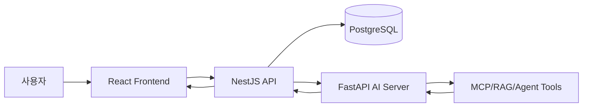

# Agentic Board Portfolio

AI 응용 기술을 각자 다른 도메인의 게시판 서비스에 접목한 팀 포트폴리오 저장소입니다. 단순 CRUD 게시판을 넘어 인증, 검색, 댓글, 좋아요/팔로우, 도메인 데이터, RAG, MCP, Agent 흐름을 실제 서비스 구조로 연결했습니다.

## 프로젝트 개요

이 저장소는 하나의 통합 서비스가 아니라, 팀원별 개인 과제를 한 저장소에 모은 모노레포 형태입니다. 각 디렉터리는 독립 실행 가능한 프론트엔드, 백엔드, AI 서버 또는 보조 서비스를 포함합니다.

| 디렉터리 | 프로젝트 | 핵심 도메인 | 주요 구현 |
| --- | --- | --- | --- |
| `ck/` | 뮤지컬 좌석 후기 게시판 | 공연장 좌석 리뷰, 시야/음향 평가 | 좌석 단위 후기, 댓글/대댓글/신고/관리자, RAG 질의, 좌석 추천 Agent |
| `gg/` | AI 운동 기록 인증 게시판 | 운동 기록과 점진적 과부하 | 운동 기록 CRUD, 이전 기록 기반 분석, 구조화 검색 RAG, MCP-style 운동명 정규화 |
| `jh/` | 반려동물 커뮤니티 게시판 | 반려동물 게시글, 장소, 행동 Q&A | 게시글/댓글/좋아요/카테고리, 이미지 업로드, 반려동물 행동 RAG, 안전 응답 흐름 |
| `ys/` | Tripy 여행 커뮤니티/AI 플래너 | 여행 후기, 일정 추천, 날씨 기반 플래닝 | 여행 게시글/댓글/북마크/팔로우, RAG, MCP 여행 도구, AI 채팅/일정 Agent |
| `siwon/` | StudyTube Courses | YouTube 학습 코스 공유 | 영상 URL 등록, AI 자막/요약, 플레이리스트 학습 코스, RAG 검색, MCP YouTube 조회, Agent 코스 생성 |

## 공통 기술 스택

- Frontend: React, Vite, TypeScript
- Backend: NestJS, TypeScript
- AI Server: FastAPI, Python
- Database: PostgreSQL
- AI Patterns: RAG, MCP-style tool endpoint, Agent workflow
- Infra/Dev: Docker Compose, npm scripts, 테스트/빌드 스크립트

프로젝트마다 ORM과 보조 라이브러리는 다릅니다. 예를 들어 `ck`와 `gg`는 Prisma 기반 구성이 있고, `jh`는 TypeORM 기반 백엔드 구성을 사용합니다. `siwon`은 PostgreSQL + pgvector와 파일 기반 fallback 저장소를 함께 둔 구조이며, `ys`는 NestJS API, FastAPI AI 서버, Python MCP 서버를 분리했습니다.

## 아키텍처 패턴



공통적으로 프론트엔드는 NestJS API를 호출하고, AI 서버는 내부 API 호출 또는 MCP/RAG 도구 호출을 통해 응답을 생성합니다. 이 구조는 API Key 노출을 막고, 인증/권한/데이터 조회를 백엔드에서 일관되게 처리하기 위한 선택입니다.

## 개인 구현 요약

### `ck/` 뮤지컬 좌석 후기 게시판

뮤지컬 관람 후기를 좌석 단위로 추적하고, 사용자가 좌석 선택 전에 시야와 음향 정보를 비교할 수 있게 만든 서비스입니다.

- 극장, 공연, 층, 구역, 열, 번호 기반 좌석 후기 작성
- 시야, 음향, 몰입도, 시야 제한, 무대 가시성 등 좌석 경험 평가
- 댓글, 대댓글, 좋아요, 신고, 관리자 숨김/복구 기능
- 후기 문서 기반 RAG 질의 응답
- FastAPI 좌석 추천 Agent와 좌석 배치 MCP API
- React/Vite, NestJS, FastAPI, PostgreSQL + pgvector 구성

상세 실행법: [`ck/README.md`](ck/README.md)

### `gg/` AI 운동 기록 인증 게시판

운동 기록을 게시글처럼 남기고, 이전 기록과 비교해 다음 운동 목표를 추천하는 서비스입니다.

- 회원가입, 로그인, JWT 인증
- 운동 기록 게시글 CRUD와 검색
- 운동명, 세트, 중량, 반복 수 기반 운동 기록 저장
- 같은 사용자, 같은 운동명, 과거 날짜의 최근 기록을 조회하는 구조화 검색 기반 RAG
- FastAPI 내부 MCP-style 운동명 정규화 tool
- 5단계 Agent workflow로 현재 기록 분석, 이전 기록 비교, 다음 목표 추천
- OpenAI 호출 실패 시 rule-based fallback 제공

상세 실행법: [`gg/README.md`](gg/README.md)

### `jh/` 반려동물 커뮤니티 게시판

일반 커뮤니티 게시판 기능과 반려동물 행동 Q&A, 장소 탐색 기능을 결합한 서비스입니다.

- 회원가입, 로그인, 게시글 CRUD
- 댓글, 태그/카테고리, 좋아요, 검색, 페이지네이션
- 이미지 업로드와 게시글 첨부 이미지 메타데이터 관리
- 반려동물 관련 장소 탐색 기능
- 고양이/강아지 행동 문제에 대한 RAG 기반 Q&A
- 응급/진료 우선 상황을 먼저 분류하는 안전 응답 흐름
- NestJS, React, FastAPI AI worker, PostgreSQL 구성

상세 실행법: [`jh/README.md`](jh/README.md)

### `ys/` Tripy 여행 커뮤니티/AI 플래너

여행 후기를 커뮤니티 게시글로 공유하고, 게시글 데이터와 날씨 정보를 바탕으로 AI 여행 상담과 일정 추천을 제공하는 서비스입니다.

- 회원가입, 로그인, 사용자 프로필
- 여행 게시글 CRUD, 댓글/대댓글, 북마크, 팔로우
- 지역, 예산, 테마, 계절, 동행자, 여행 날짜 기반 게시글 필터링
- Chat 화면에서 여행 조건 기반 AI 상담
- Planner 화면에서 일정표, 날씨 요약, 참고 게시글을 함께 제시
- FastAPI AI 서버의 Agent, RAG, LLM, guardrail, chat memory 서비스
- Python MCP 서버 도구: 게시글 검색, 게시글 상세 조회, 댓글 조회, 날씨 조회
- NestJS `ai-sync` 모듈로 게시글 데이터를 RAG 서버와 동기화
- React/Vite, NestJS, FastAPI, PostgreSQL, Python MCP server 구성

실행 진입점: [`ys/start.ps1`](ys/start.ps1), [`ys/docker-compose.yml`](ys/docker-compose.yml)

### `siwon/` StudyTube Courses

YouTube 학습 영상을 코스 단위로 등록하고 공유하는 학습 보드입니다.

- YouTube URL 기반 영상 카드 작성
- AI 자막 수집, 번역, 영상 요약, 태그 자동화
- 플레이리스트 기반 학습 코스 작성과 공개 보드
- 학습 화면의 YouTube 플레이어, 자막, 메모, 반복 구간, 재생목록
- RAG로 기존 영상 분석 요약을 먼저 검색
- MCP-style YouTube 메타데이터 조회
- Agent 기반 맞춤형 학습 코스 생성
- PostgreSQL + pgvector, fallback repository, EC2 실행 스크립트 구성

상세 실행법: [`siwon/README.md`](siwon/README.md)

## 저장소 구조

```text
agentic-board/
  ck/       musical seat review board
  gg/       AI workout record board
  jh/       pet community and behavior Q&A board
  ys/       Tripy travel community and AI planner board
  siwon/    StudyTube YouTube learning course board
```

각 프로젝트는 독립적인 의존성, 환경 변수, DB 설정을 갖습니다. 실행 전 해당 디렉터리의 README, `.env.example`, `package.json`, 실행 스크립트를 먼저 확인해야 합니다.

## 실행 가이드

### `ck`

```powershell
cd ck
npm run db:up
npm run nest:install
npm run web:install
npm run nest:start
npm run web:dev
```

FastAPI 서버는 `ck/README.md`의 Python 환경 설정을 참고합니다.

### `gg`

```powershell
cd gg/backend
npm install
npm run start:dev

cd ../frontend
npm install
npm run dev
```

AI 서버는 `gg/ai-server`에서 `uvicorn`으로 실행합니다.

### `jh`

```powershell
cd jh/backend
npm install
npm run migration:run
npm run start:dev

cd ../frontend
npm install
npm run dev
```

AI worker는 `jh/AI`에서 FastAPI로 실행합니다.

### `ys`

```powershell
cd ys
.\start.ps1
```

`start.ps1`은 Tripy 백엔드, AI 백엔드, 프론트엔드를 각각 별도 PowerShell 창으로 실행합니다. DB는 `ys/docker-compose.yml`과 `ys/.env.example` 설정을 확인한 뒤 준비합니다.

### `siwon`

```powershell
cd siwon
npm run db:up
npm run all
```

개별 실행:

```powershell
npm run dev:web
npm run dev:api
npm run dev:ai
```

## 포트폴리오 관점의 구현 포인트

- CRUD 게시판을 도메인 문제에 맞게 확장했습니다.
- 인증, 권한, 검색, 댓글, 좋아요, 팔로우, 관리자 기능처럼 실제 서비스에 필요한 주변 기능을 포함했습니다.
- AI 기능을 화면에 붙이는 수준에서 끝내지 않고, 백엔드 데이터 조회와 AI 서버 도구 호출을 분리했습니다.
- RAG, MCP, Agent를 각 도메인에 맞는 형태로 해석해 구현했습니다.
- 각 프로젝트가 독립 실행 가능한 구조라 기술 선택과 아키텍처 비교가 가능합니다.

## 참고

- 이 저장소는 학습/포트폴리오 목적의 개인 과제 모음입니다.
- 외부 API Key, JWT secret, DB URL 등 민감 정보는 각 프로젝트의 `.env.example`을 기준으로 별도 설정해야 합니다.
- 세부 기능, API, 테스트 방법은 각 디렉터리 README와 문서를 기준으로 확인합니다.
