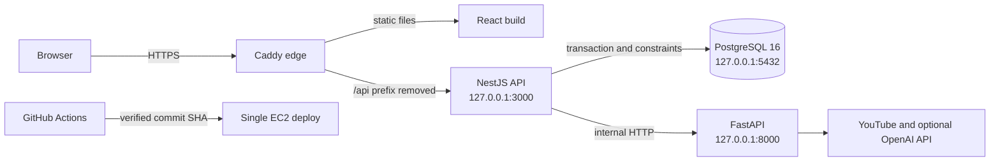

# StudyTube

StudyTube는 흩어진 YouTube 영상을 순서가 있는 학습 Course로 구성하고 공유하는 서비스다. 작성자는 영상을 단계별로 묶어 공개하고, 학습자는 공개 Course를 탐색해 피드백을 남길 수 있다. 원본 게시물이 삭제되어도 Course에 저장한 영상 정보와 학습 순서는 유지된다.

## 핵심 요약

| 문제 | 결정 | 검증 기준 |
|---|---|---|
| 여러 테이블에 흩어진 재생 목록 상태 | owner, 상태, 공개 범위, version을 Course aggregate가 소유 | schema invariant E2E |
| 동시에 도착한 수정 요청의 lost update | expected version 비교와 row lock을 작업 단위에 맞게 분리 | 실제 PostgreSQL race E2E |
| 응답 유실 뒤 재시도로 생기는 중복 Course | owner와 idempotency key digest를 유일하게 만들고 payload digest 비교 | 동시 create와 replay E2E |
| 운영 중인 legacy 데이터 전환 | 재개 가능한 backfill, fingerprint audit, freeze, exact verifier | migration과 cutover E2E |
| 브라우저에서 API, AI, DB 포트 직접 노출 | Caddy 단일 진입점과 loopback listener | runtime 단위 테스트와 CI 설정 검증 |
| 검증한 코드와 배포한 코드의 불일치 | 워크플로가 전달한 40자리 SHA와 원격 main HEAD가 일치할 때만 detached checkout | 배포 계약 테스트 |

## 시스템 구성



| 영역 | 책임 | 경계 |
|---|---|---|
| `web` | Course 작성, 공개 탐색, 학습 화면, 브라우저 재시도 상태 | 원격 환경에서는 같은 출처의 `/api`만 호출 |
| `api` | 인증, Course 규칙, transaction, migration, 공개 응답 projection | PostgreSQL을 유일한 영속 상태로 사용 |
| `ai` | 자막 수집, 번역, 요약, 추천 | API를 통해서만 호출하고 외부 포트는 열지 않음 |
| `infra` | Caddy, PostgreSQL Compose, systemd unit | 80과 443 외 애플리케이션 포트는 loopback에 한정 |

## 문제 해결 과정

### 재생 목록을 Course aggregate로 바꾼 이유

초기 재생 목록은 게시물 ID 배열에 가까웠다. 이 구조에서는 공개 상태, 작성자 권한, 학습 순서, 원본 삭제 뒤 보존 범위를 한 transaction에서 설명하기 어려웠다. 게시물 삭제가 곧 학습 경로 손실로 이어지는 문제도 있었다.

Course root가 owner, `draft → published → archived` 생명주기, 공개 범위, version을 소유하도록 경계를 다시 잡았다. 하위 `CourseStep`은 다음 정보를 저장한다.

- `1..N`의 연속된 위치
- 영상 URL, 제목, 채널, 썸네일 snapshot
- 원본 게시물을 추적하는 nullable source ID
- 작성자에게만 보이는 학습 상태

원본 게시물이 삭제되면 source ID만 `NULL`이 되고 snapshot은 남는다. 공개 응답은 owner ID, source ID, 작성자 학습 상태, 이메일을 제거한 별도 projection을 사용한다. published Course가 비어 있거나 step 위치에 빈틈이 생기는 상태는 commit 시점의 PostgreSQL 제약이 거부한다.

구현 근거:

- [Course schema migration](api/migrations/1753660803000_course-aggregate.cjs)
- [Course policy](api/src/course/course.policy.ts)
- [Schema invariant E2E](api/test/course-schema.e2e-spec.ts)

### 모든 수정을 같은 lock으로 처리하지 않은 이유

단일 SQL로 끝나는 metadata 수정과 여러 SQL이 필요한 step 교체는 실패 형태가 다르다. 둘을 같은 방식으로 묶으면 단순 수정에도 lock 범위가 커지고, 반대로 모두 read-then-write로 처리하면 동시에 읽은 두 요청이 서로의 변경을 덮는다.

metadata 수정은 `expectedVersion`을 조건에 포함한 update가 한 요청만 성공시키고 version을 증가시킨다. step 교체, publish, archive처럼 여러 문장을 실행하는 작업은 Course root를 `FOR UPDATE`로 잠근 뒤 owner, 상태, version을 다시 검사한다. stale 요청은 저장된 값을 덮지 않고 HTTP 409로 변환된다.

step 순서를 교체하는 transaction 중에는 위치가 잠시 중복되거나 비어 보일 수 있다. 위치와 aggregate 검사를 commit 시점까지 미뤄 transaction 내부의 중간 상태는 허용하되, 최종 상태만 `1..N`인지 검사한다.

검증은 mock repository가 아니라 실제 PostgreSQL에서 다음 경합을 동시에 실행한다.

- 같은 version의 metadata patch 두 건
- publish와 마지막 step 제거
- archive와 feedback 생성
- 같은 idempotency key를 사용한 create 두 건

구현 근거:

- [PostgreSQL Course repository](api/src/course/postgres-course.repository.ts)
- [Concurrency E2E](api/test/course-concurrency.e2e-spec.ts)
- [Course HTTP E2E](api/test/course-http.e2e-spec.ts)

### 재시도를 중복 생성으로 만들지 않는 방법

네트워크가 끊기면 서버는 Course를 만들었지만 브라우저는 응답을 받지 못할 수 있다. 단순 재시도는 같은 Course를 두 번 만든다.

`POST /courses`는 `Idempotency-Key`를 요구한다. 서버는 plaintext key를 저장하지 않고 SHA-256 digest를 저장하며, 정규화한 payload의 digest도 함께 기록한다. 유일성 범위는 owner와 key digest다.

- 같은 key와 같은 payload는 기존 Course ID로 수렴한다.
- 같은 key와 다른 payload는 409를 반환한다.
- 동시에 들어온 같은 요청은 database unique constraint가 한 건으로 만든다.

브라우저는 user, draft, revision을 묶은 재시도 envelope를 로컬에 저장한다. create 응답을 먼저 기록하므로 publish에서 실패해도 Course를 다시 만들지 않는다. 계정이 바뀌거나 draft revision이 증가하면 늦게 도착한 이전 응답이 현재 작업을 지우지 못한다.

구현 근거:

- [Course service](api/src/course/course.service.ts)
- [Draft import state machine](web/src/courseDraftImport.ts)
- [Browser retry tests](web/tests/courseDraftImport.test.ts)

### 인증 경계를 애플리케이션 코드 밖에서도 확인한 이유

인증은 로그인 성공 여부만으로 검증하지 않았다. production session cookie는 `__Host-` prefix, `HttpOnly`, `Secure`, `SameSite=Lax`, `/` path를 사용한다. 상태를 바꾸는 요청은 허용한 Origin과 JSON content type을 검사한다. 비밀번호 hash와 인증 시도 제한은 설정 누락 시 production 시작을 거부한다.

CI는 cookie 이외의 인증 우회가 없는지 source boundary를 검사하고, Argon2 작업이 설정한 동시성 범위에서 실행되는지 benchmark를 수행한다. 공개 Course와 작성자 Course의 HTTP 테스트는 outsider에게 내부 식별자나 작성자 전용 상태가 노출되지 않는지도 확인한다.

구현 근거:

- [Cookie policy](api/src/auth/auth-cookie.ts)
- [Origin guard](api/src/auth/origin.guard.ts)
- [Authentication boundary verifier](api/scripts/verify-auth-boundary.ts)

### legacy 데이터를 중단 후 일괄 변환하지 않은 이유

데이터가 있는 테이블을 한 번에 바꾸면 중간 실패 뒤 어디서 재개해야 하는지 알기 어렵고, source와 target이 실제로 같은지도 확인하기 어렵다. 전환은 expand와 검증 단계를 분리했다.

1. legacy playlist를 private draft Course로 복사한다.
2. 연속 position을 신뢰할 수 없으면 post ID 순서로 결정적인 fallback을 적용한다.
3. playlist마다 repeatable-read transaction과 source row lock을 사용한다.
4. source와 target의 SHA-256 fingerprint를 audit row에 기록한다.
5. 같은 fingerprint의 완료 항목은 건너뛰고, source 변경이나 target 손상이 있으면 해당 Course만 다시 만든다.
6. verifier가 전체 수, owner별 수, root, step snapshot, feedback, audit, sequence를 비교한다.
7. freeze 모드에서 새 writer를 막고 exclusive advisory lock으로 진행 중인 writer가 끝날 때까지 기다린다.
8. exact verifier가 성공한 `DEPLOY_SHA`와 database identity를 marker에 기록한다.
9. 같은 SHA의 course 배포만 새 writer authority를 활성화한다.

첫 course write 뒤에는 legacy writer로 돌아가지 않는다. 복구는 freeze 상태에서 원인을 확인한 뒤 roll forward한다. 인증 schema를 처음 적용할 때도 배포 SHA와 migration 이름이 일치하는 backup 복구 검증 marker가 없으면 migration 전에 중단한다.

구현 근거:

- [Backfill](api/scripts/backfill-courses.ts)
- [Exact verifier](api/scripts/verify-course-backfill.ts)
- [Cutover E2E](api/test/course-cutover.e2e-spec.ts)
- [Migration runbook](docs/database-migrations.md)

### 개발 서버를 운영에 재사용하지 않는 방법

운영 프로세스에서 Vite dev server, Nest watch, Uvicorn reload를 제거했다. Caddy만 80과 443을 받고, `/api/*`의 prefix를 제거해 loopback API로 전달한다. API와 AI는 systemd가 관리하고 비정상 종료 시 재시작한다. PostgreSQL은 기존 `studytube_pgdata` volume을 유지하면서 host의 `127.0.0.1:5432`에만 publish한다.

Web build는 `/var/www/studytube/releases/<sha>`에 완성한 뒤 `current` symlink를 원자적으로 바꾼다. dependency 설치, build, PostgreSQL 준비, Caddy 설정 검증은 기존 API와 AI를 멈추기 전에 끝낸다. migration, API readiness, AI health, Course verifier 중 하나라도 실패하면 새 Web release를 현재 경로로 바꾸지 않는다. pull 방식 자동 배포도 Git HEAD가 아니라 성공 marker와 실제 서비스 상태를 확인하므로, checkout 뒤 실패한 SHA를 배포 완료로 오인하지 않는다.

구현 근거:

- [Caddy edge](infra/Caddyfile)
- [Production Compose](infra/production.compose.yml)
- [API systemd unit](infra/systemd/studytube-api.service.in)
- [Deployment script](scripts/deploy-ec2.sh)

## 검증

| 계약 | 검증 파일 |
|---|---|
| schema와 aggregate invariant | `api/test/course-schema.e2e-spec.ts` |
| 공개 범위, idempotency, HTTP conflict | `api/test/course-http.e2e-spec.ts` |
| transaction race | `api/test/course-concurrency.e2e-spec.ts` |
| writer authority와 drain | `api/test/course-cutover.e2e-spec.ts` |
| backfill 재개와 corruption 탐지 | `api/test/course-migration.e2e-spec.ts` |
| 브라우저 재시도와 계정 전환 | `web/tests/courseDraftImport.test.ts` |
| listener와 배포 순서 | `api/src/runtime-listener.spec.ts`, `api/src/deploy-script.spec.ts` |
| AI 환경 변수 우선순위 | `ai/test_runtime_environment.py` |

전체 검증 명령:

```powershell
npm run db:up
npm run db:migrate:up

npm --prefix api run lint
npm --prefix api test -- --runInBand
npm --prefix api run test:e2e -- --runInBand
npm --prefix api run build

npm --prefix web run lint
Push-Location web
node --test tests/*.test.ts
npm run build
Pop-Location

Push-Location ai
\.venv\Scripts\python.exe -m unittest discover -s .
Pop-Location
```

GitHub Actions는 clean PostgreSQL에서 migration, legacy fixture, backfill, exact verifier, race E2E, 인증 경계, runtime 설정, build를 다시 실행한다.

## 로컬 실행

필수 버전은 Node.js 24.8 이상, Python 3.12, Docker Compose v2다.

```powershell
Copy-Item .env.example .env
Copy-Item api/.env.example api/.env
Copy-Item web/.env.example web/.env

npm --prefix api ci
npm --prefix web ci

python -m venv ai/.venv
ai\.venv\Scripts\python.exe -m pip install -r ai/requirements.txt

npm run db:up
npm run db:migrate:up
npm run all
```

로컬에서 Course 쓰기를 확인하려면 `api/.env`의 `COURSE_CUTOVER_MODE`를 `course`로 바꾼다. `npm run all`은 로컬 개발 명령이며 운영 배포에서는 사용하지 않는다.

- Web: `http://localhost:5173`
- API: `http://localhost:3000`
- AI: `http://localhost:8000`

## 단일 EC2 배포

호스트에는 Docker Compose v2, Node.js 24.8 이상, Python 3.12, `psql`, `curl`, `lsof`, `flock`, systemd가 필요하다. `.env`에는 최소한 다음 운영 값을 설정한다.

- `WEB_ORIGIN=https://<domain>`
- `STUDYTUBE_SITE_ADDRESS=<domain>`
- `STUDYTUBE_PUBLIC_URL=https://<domain>`
- `DATABASE_URL`, `POSTGRES_USER`, `POSTGRES_PASSWORD`, `POSTGRES_DB`
- 서로 다른 production authentication pepper
- `AI_SERVICE_URL=http://127.0.0.1:8000`

세 공개 주소 설정은 같은 HTTPS origin을 가리켜야 한다. `STUDYTUBE_SITE_ADDRESS`만 scheme을 생략한 domain 형식을 허용한다.

배포 스크립트는 워크플로가 전달한 40자리 SHA가 원격 `main` HEAD와 일치할 때만 진행한다.

```bash
DEPLOY_SHA=<verified-commit-sha> \
COURSE_CUTOVER_MODE=legacy \
bash scripts/deploy-ec2.sh main
```

legacy 전환이 필요한 기존 DB는 같은 SHA로 `legacy → freeze → course`를 실행한다. freeze가 exact parity marker를 기록하기 전에는 course 모드가 거부된다. 첫 인증 migration 전에는 [migration runbook](docs/database-migrations.md)에 정의한 backup과 restore 검증 marker가 먼저 있어야 한다.

## 현재 한계

- 단일 EC2와 단일 PostgreSQL 구성이며 고가용성이나 무중단 배포를 제공하지 않는다.
- API와 AI 재시작 구간에는 짧은 요청 실패가 발생할 수 있고 자동 application rollback은 없다.
- AI 영상 처리 queue는 프로세스 메모리에 있어 재시작 내구성과 다중 인스턴스 조정이 없다.
- API가 붙이는 내부 AI key를 FastAPI endpoint가 아직 검증하지 않는다. 현재 경계는 loopback bind와 Caddy 비노출이다.
- step snapshot은 API 경로에서 보존되지만 database 열 자체가 immutable인 것은 아니다.
- 외부 YouTube와 OpenAI 호출의 비용, 품질, 최대 처리량 수치는 아직 측정하지 않았다.
