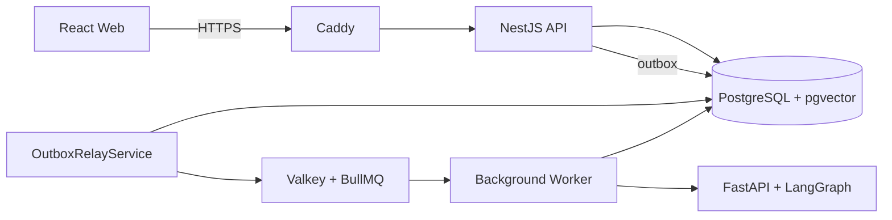
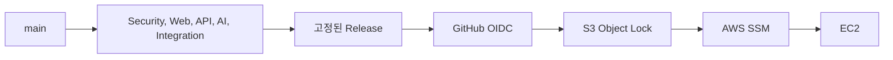

# StudyTube

YouTube 영상을 보며 자막, 메모, 내용 정리와 퀴즈를 한 화면에서 사용하는 학습 서비스입니다. 관심 분야와 학습 시간에 맞는 영상을 묶어 코스로 저장하고 다음 접속에서도 이어서 볼 수 있습니다.

[서비스 바로가기](https://studytube.page) | [CI/CD](https://github.com/NearthYou/Studytube/actions/workflows/ci-cd.yml) | [API 계약](api/openapi/current.json)

`React 19` `TypeScript` `NestJS` `FastAPI` `Python` `LangGraph` `PostgreSQL` `pgvector` `Valkey` `BullMQ` `AWS`


영상 아래에서 자막 표시 여부, 크기와 배경 진하기를 조절합니다. 오른쪽에서는 현재 문장, 내용 정리, 메모와 퀴즈를 바꿔 가며 학습합니다.

## 시작한 이유

외국어 영상을 공부할 때는 재생 화면과 번역, 메모, 복습 자료가 서로 떨어져 있습니다. 며칠 뒤 다시 열면 어디까지 봤는지, 다음에는 무엇을 볼지부터 다시 찾아야 합니다.

StudyTube는 재생 위치를 기준으로 자막과 메모를 묶고 한 영상의 학습 결과를 다음 영상까지 이어 주기 위해 만들었습니다. 코스 추천은 먼저 초안으로 보여 주며, 코스 저장과 다음 영상 반영은 사용자가 직접 결정합니다.

## 사용 흐름

1. YouTube 영상 주소를 넣거나 배우고 싶은 내용을 적습니다.
2. 원문 자막이 준비되는 대로 영상을 보며 문장을 확인합니다.
3. 필요한 문장은 재생 시점과 함께 메모로 저장합니다.
4. 영상 전체 자막이 준비되면 근거가 붙은 퀴즈를 풉니다.
5. 추천 영상을 코스로 저장하고 다음 학습을 이어 갑니다.

| 배우고 싶은 내용으로 코스 만들기 | 저장한 코스에서 이어 보기 |
| --- | --- |
|  |  |

## 주요 기능

| 영역 | 구현 내용 |
| --- | --- |
| 영상 학습 | 현재 문장, 전체 자막, 내용 정리, 시점 메모, 퀴즈 |
| 자막 | 원문 우선 공개, 번역 병합, 앞부분 보강, 표시와 크기 및 배경 설정 |
| 코스 | 학습 목표 기반 추천, 영상 순서 저장, 검색과 필터 및 보관함 |
| 계정 | Google 로그인, 학습 설정, 본인 확인을 거친 계정 삭제 |
| 작업 처리 | PostgreSQL outbox, Valkey와 BullMQ, lease와 heartbeat 및 재시도 |
| 운영 | GitHub Actions, OIDC, S3 Object Lock, SSM 기반 EC2 배포 |

## 문제 해결 과정

### 번역이 끝날 때까지 화면이 비어 있던 문제

처음에는 원문, 번역과 검색 데이터가 모두 준비돼야 학습 화면을 열었습니다. 영상이 길수록 처리 시간만큼 학습 시작도 늦어졌습니다.

원문, 번역과 검색 준비 상태를 나누고 같은 처리 회차에서 나온 결과만 합치도록 바꿨습니다. 이제 원문부터 먼저 보여 주고 번역은 준비되는 대로 같은 문장에 붙입니다.

### 영상 앞부분만 보고도 퀴즈가 만들어지던 문제

일부 자막만으로 문제를 만들면 영상 뒤쪽 내용이 빠질 수 있었습니다. 화면과 API 양쪽에서 자막이 시작과 끝을 모두 덮는지 확인하고 전체 구간을 다섯 부분으로 나눠 근거 문장을 고릅니다.

FastAPI의 퀴즈 그래프는 초안을 만든 뒤 보기와 정답이 자막 근거에 맞는지 다시 검사합니다. 출제에 사용한 자막 버전과 시점을 저장하므로 답을 확인한 뒤 해당 장면으로 돌아갈 수 있습니다.

### 작업이 사라지거나 두 번 실행될 수 있던 문제

DB 저장 뒤 별도로 작업 큐에 넣으면 두 단계 사이에서 프로세스가 멈출 수 있습니다. 큐가 같은 작업을 다시 전달했을 때 외부 처리가 중복되는 문제도 있었습니다.

학습 변경과 outbox event를 PostgreSQL에 함께 기록하고 relay가 Valkey 큐로 전달합니다. Worker는 lease와 heartbeat를 갱신하며 실행하고 완료된 작업이 다시 오면 저장한 결과를 돌려줍니다.

### 관련 없는 영상으로 코스가 채워지던 문제

추천 개수를 맞추기 위해 후보를 채우면 학습 목표와 거리가 먼 영상도 코스에 들어갔습니다. 지금은 주제 관련도가 낮거나 최근 본 영상, 저장한 코스의 영상, 재생할 수 없는 영상과 지나치게 긴 영상을 먼저 제외합니다.

남은 후보는 자막 제공 여부, 최근 학습과의 연결, 난이도, 영상 길이와 실습 여부를 함께 점수화합니다. 조건을 통과한 영상이 하나뿐이면 억지로 코스를 만들지 않고 그 영상만 보여 줍니다.

## 구조



Web은 재생 화면과 입력 상태를 맡고 API는 사용자 권한과 코스, 메모, 퀴즈 데이터를 관리합니다. 오래 걸리는 자막, 번역, 임베딩과 퀴즈 생성은 Worker로 분리했습니다.

클래스 관계와 요청 흐름은 [아키텍처 문서](docs/architecture.md)에서 볼 수 있습니다.

## AI를 붙인 위치

- 코스 추천은 학습 목표, 관심 분야, 학습 시간과 최근 영상을 입력으로 받아 후보를 정렬합니다.
- 퀴즈는 영상 전체 자막에서 고른 다섯 근거를 바탕으로 만들고 생성 뒤 근거 일치 여부를 검사합니다.
- MCP는 검색과 학습 상태 조회처럼 허용한 도구만 열며 사용자와 학습 맥락을 함께 확인합니다.
- 코스 저장과 다음 영상 추가는 사용자가 승인해야 실행됩니다.

## 팀 작업과 개인 구현

초기 게시판, 영상 등록과 자막 흐름은 팀이 함께 만들었습니다. 이후 이시원은 서비스를 영상 학습 중심으로 재구성하고 Web, API, AI 작업 처리와 배포 구조를 확장했습니다.

구체적인 구현 범위와 코드 위치는 [팀 작업과 개인 구현](docs/contributions.md)에 정리했습니다.

## CI/CD



CI가 통과한 커밋만 release로 만들고 AWS 장기 키나 SSH 없이 OIDC와 SSM으로 배포합니다. 최신 main에서는 Web 313개, API 843개, AI 184개 테스트와 운영 계약 57개 항목을 통과했습니다.

검증 명령과 최근 실행 결과는 [검증 기록](docs/verification.md), 배포 흐름은 [CI/CD 문서](docs/ci-cd.md)에 있습니다.

## 로컬 실행

Node.js 24.8 이상, Python 3.12, Docker Compose v2가 필요합니다. AI 의존성까지 같은 조건으로 맞추려면 Linux 또는 WSL 환경을 권장합니다.

```bash
cp .env.example .env
cp api/.env.example api/.env
npm --prefix api ci
npm --prefix web ci
python3 -m venv ai/.venv
ai/.venv/bin/python -m pip install --require-hashes -r ai/requirements.txt
npm run db:up
npm run db:migrate:up
npm run all
```

- Web: `http://localhost:5173`
- API: `http://localhost:3000`
- AI: `http://localhost:8000`

세부 설정은 [개발 환경 문서](docs/environment-setup.md), API와 운영 명령은 [API README](api/README.md)와 [Operations README](operations/README.md)에 있습니다.
