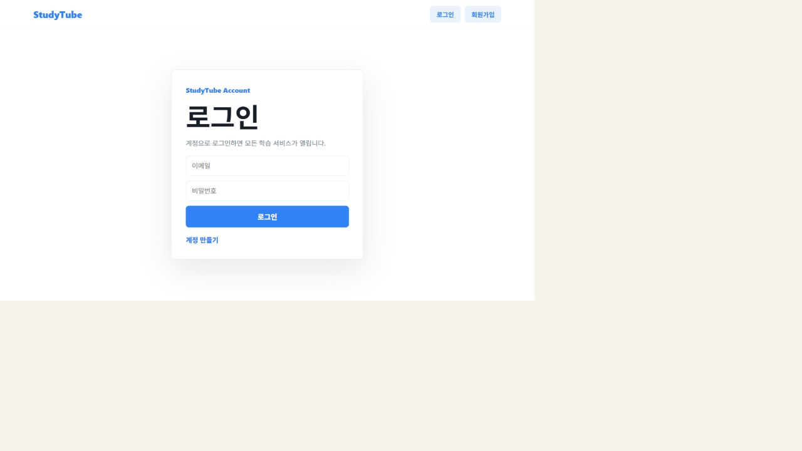
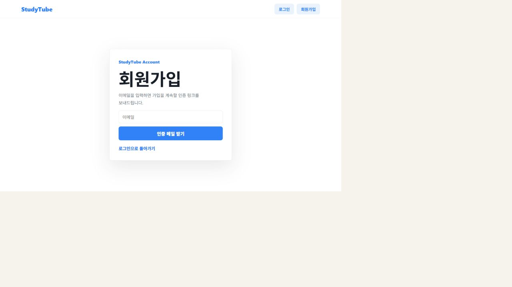
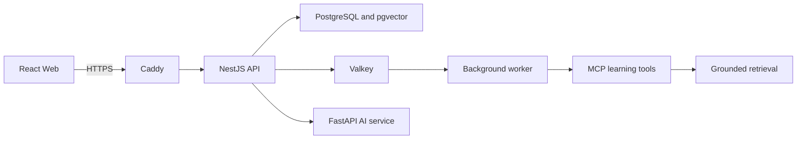
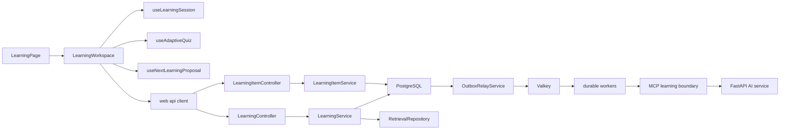

# StudyTube

StudyTube는 외국어 YouTube 영상을 자막, 메모, 퀴즈, 다음 학습 순서까지 이어서 공부하는 웹 서비스다.

- 서비스: [studytube.page](https://studytube.page)
- 저장소: [github.com/NearthYou/studytube](https://github.com/NearthYou/studytube)
- API 계약: [api/openapi/current.json](api/openapi/current.json)

| 현재 main의 로그인 화면 | 현재 main의 가입 시작 화면 |
| --- | --- |
|  |  |

[자막 처리 E2E 영상](docs/demo/studytube-caption-e2e-2026-06-13T05-53-17-277Z.webm)은 실제 이전 interface를 기록한 자료다. 현재 main의 공개 인증 화면은 위와 같고, 새 학습 workspace는 API와 PostgreSQL이 필요한 인증 경로라 이번 문서 작업에서 새 end-to-end 영상을 만들지 않았다.

## 풀고 싶었던 문제

YouTube에서 외국어 영상을 공부하면 재생 화면, 번역, 메모, 복습 자료가 서로 떨어진다. 무엇을 어디까지 봤는지 기억하기 어렵고, 다음 영상은 검색부터 다시 해야 한다. StudyTube는 이 흐름을 한 화면과 하나의 학습 기록으로 묶기 위해 시작했다.

로그인한 사용자가 영상 주소를 넣으면 원문과 한국어 자막을 준비한다. 현재 자막을 보며 시점이 붙은 메모를 남기고, 실제로 본 구간에서 퀴즈를 푼다. 답을 확인한 뒤에는 근거 구간으로 돌아가 복습하거나 다음 영상을 제안받는다. 제안은 사용자가 기존 Course 또는 새 비공개 Course를 선택해 승인해야 반영된다.

## 학습 흐름

1. 로그인 후 YouTube 영상 주소를 등록한다.
2. YouTube 자막을 먼저 사용하고, 자막이 없을 때만 승인된 STT 경로를 검토한다.
3. 원문과 한국어 자막을 보며 시점이 붙은 메모를 남긴다.
4. 시청한 구간과 현재 자막 버전을 고정해 퀴즈를 만든다.
5. 오답은 출처 시점으로 돌아가 확인한다.
6. 학습 기록에 근거한 다음 영상을 확인하고 Course 반영 여부를 직접 결정한다.

공개 게시판, 댓글, 좋아요 기능은 최종 학습 흐름에서 제거했다. 기존 데이터는 삭제하지 않았고 공개된 Course의 읽기 계약은 유지한다.

## Agent, MCP, RAG를 사용한 이유

세 기술을 화면 장식이 아니라 학습 흐름의 책임 경계로 사용했다.

- RAG는 현재 사용자의 자막, 메모, 퀴즈 근거 중 시청 범위와 자료 버전이 맞는 항목만 찾고 시점을 함께 반환한다.
- MCP는 검색, 학습 상태 읽기, 퀴즈 요청, 다음 학습 제안을 허용된 도구로 제한한다. 감사 기록에는 원문 대신 허용된 필드 이름과 개수만 남긴다.
- Agent는 정해진 실행 시간, 도구 호출 수, token, 예상 비용 안에서 제안을 만든다. Course 변경과 영상 재생은 직접 수행하지 않는다.

추천 결과가 틀렸을 때 근거를 확인할 수 있고, 자동 제안이 사용자 데이터를 바로 변경하는 상황을 막는 것이 핵심이다.

## 주요 선택과 트레이드오프

### 학습 자료와 학습 맥락을 분리했다

같은 영상도 혼자 볼 때와 Course 안에서 볼 때 메모, 진도, 퀴즈 근거가 다르다. 공유 가능한 영상 원본, 사용자 소유 학습 자료, Course 위치별 학습 맥락을 나눴다. 테이블과 전환 과정은 늘었지만 소유권과 근거 버전을 명확하게 확인할 수 있다.

### 자막은 단계적으로 보여준다

모든 번역이 끝날 때까지 빈 화면을 보여주지 않는다. 원문 자막, 한국어 번역, 검색 준비 상태를 단계별로 저장하고 준비된 구간부터 보여준다. 중간 상태 처리가 복잡해지는 대신 긴 영상을 기다리는 동안 먼저 학습을 시작할 수 있다.

### 비용이 생기는 작업은 먼저 예약한다

같은 영상 요청은 기존 작업에 합류하고, 사용자별 및 전체 한도를 통과한 요청만 외부 처리를 시작한다. STT는 provider flag 하나만으로 켤 수 없다. 승인 기록, 고정 model, production 환경, 최대 금액, 만료 시각, 승인 ID가 모두 유효해야 배포가 진행된다.

### 작업 전달은 at-least-once로 다룬다

데이터 변경과 후속 작업을 같은 PostgreSQL transaction에 기록한 뒤 worker가 처리한다. 재시도 결과는 내부에서 하나로 수렴하지만 외부 API 응답 직후 프로세스가 중단되는 구간까지 exactly-once라고 주장하지 않는다.

### 배포 비용과 가용성을 맞바꿨다

개인 프로젝트 비용을 낮추기 위해 EC2 한 대에서 API, AI service, worker, PostgreSQL, Valkey를 운영한다. 구성은 단순하고 저렴하지만 인스턴스 장애 동안 서비스가 중단될 수 있으며 고가용성 구조는 아니다.

## 구조



| 영역 | 책임 |
| --- | --- |
| `web` | 로그인, 영상 등록, 자막, 메모, 퀴즈, Course 승인 |
| `api` | 소유권, 비용 예약, 학습 상태, durable work, MCP 경계 |
| `ai` | 자막 처리, 번역, 임베딩, 퀴즈 생성 |
| `operations` | 복원, 장애, 부하, Prometheus 규칙 검증 |
| `infra`, `scripts` | Caddy, production runtime, immutable EC2 배포 |

상세 class와 service 관계, durable work 흐름은 [아키텍처 문서](docs/architecture.md)에 있다.

## 구현 관계



Web hook은 화면 상태와 polling을 맡고 mutation 규칙은 API service에 남긴다. PostgreSQL transaction에서 학습 변경과 outbox event를 함께 기록하고, worker는 Valkey queue의 중복 delivery를 `DurableJobExecutor` 경계에서 수렴시킨다.

## 팀 결과와 개인 기여

StudyTube의 초기 게시판, 영상과 자막 흐름은 여러 contributor가 함께 만든 팀 프로젝트다. 현재 저장소의 guided learning, backend hardening과 배포 정리는 이시원이 후속 PR로 확장했지만 원래 제품 전체를 개인 단독 결과로 표시하지 않는다.

PR과 source 기준의 구분은 [기여 문서](docs/contributions.md)에 있다.

## 현재 검증 범위

`c065bda`의 GitHub Actions에서 Security, Web, API, Backend Integration과 AI job은 통과했다. deployment는 AWS 임시 자격 증명 구성 단계에서 실패해 release upload와 SSM 배포가 실행되지 않았다. 따라서 이 commit이 현재 live service에 반영됐다고 쓰지 않는다.

2026년 8월 23일 문서 branch에서 Web 216개, API 720개와 AI 126개 test가 통과했다. API 1개와 AI 6개는 environment 조건으로 skip됐다. Operations contract는 57개 assertion을 통과했고 Web과 API production dependency audit은 취약점 0건이었다.

- 실제 도메인의 HTTPS와 TLS
- 실제 가입부터 Course 승인까지의 브라우저 흐름
- production 비용과 남은 credit
- 부하 수치, 장애 복구 시간, 백업 복원 시간

## 로컬 실행

Node.js 24.8 이상, Python 3.12, Docker Compose v2가 필요하다.

```powershell
Copy-Item .env.example .env
npm --prefix api ci
npm --prefix web ci
python -m venv ai/.venv
ai/.venv/Scripts/python.exe -m pip install --require-hashes -r ai/requirements.txt
npm run db:up
npm run db:migrate:up
npm run all
```

- Web: `http://localhost:5173`
- API: `http://localhost:3000`
- AI service: `http://localhost:8000`

## 재현 가능한 검증

```powershell
Push-Location web
node --test tests/*.test.ts
npm run lint
npm run build
Pop-Location

Push-Location api
npm test -- --runInBand
npm run lint
npm run build
npm run openapi:export
npm run openapi:verify
Pop-Location

Push-Location ai
.venv/Scripts/python.exe -m unittest discover -s .
Pop-Location

pwsh ./operations/tests/Invoke-OperationsContractTests.ps1
```

PostgreSQL E2E는 migration과 fixture를 바꾸므로 공유 database가 아닌 격리된 test database에서 실행해야 한다. 실행 방법은 [api/README.md](api/README.md), 운영 드릴은 [operations/README.md](operations/README.md)에 정리했다.

전체 문서 안내와 최신 재검증 결과는 [docs/README.md](docs/README.md)에서 확인할 수 있다.
