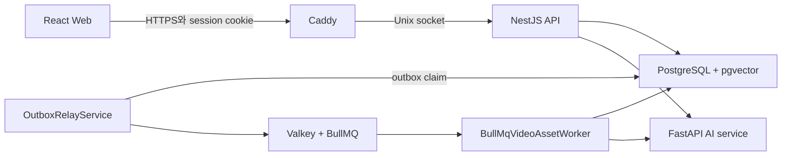
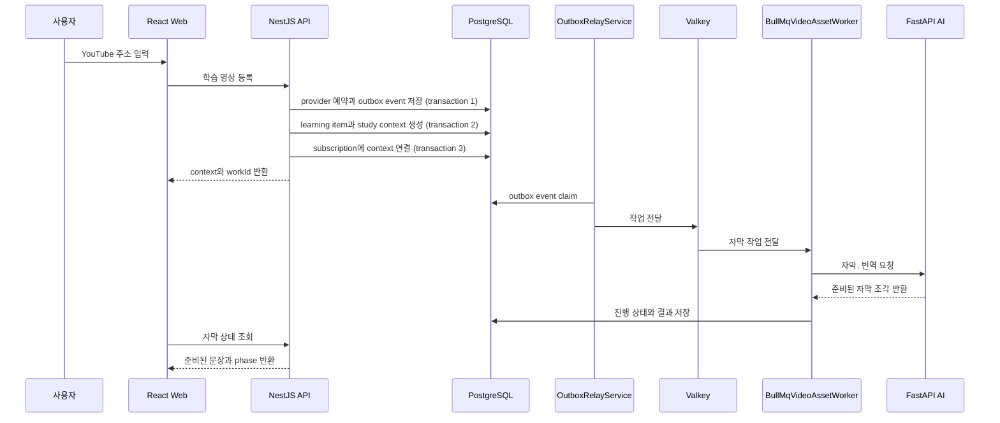
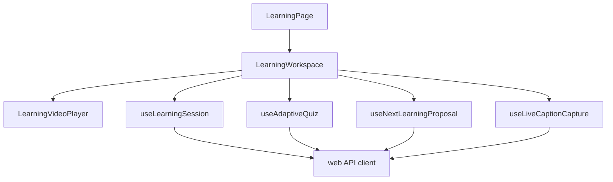
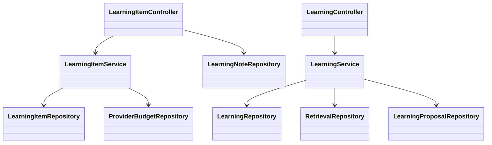
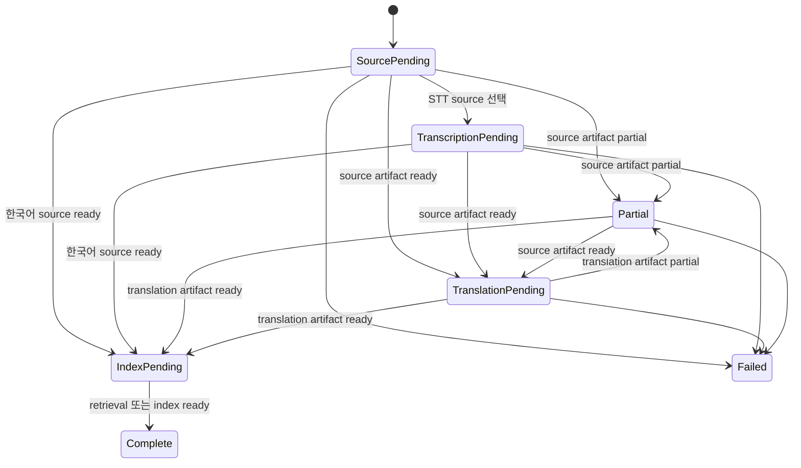
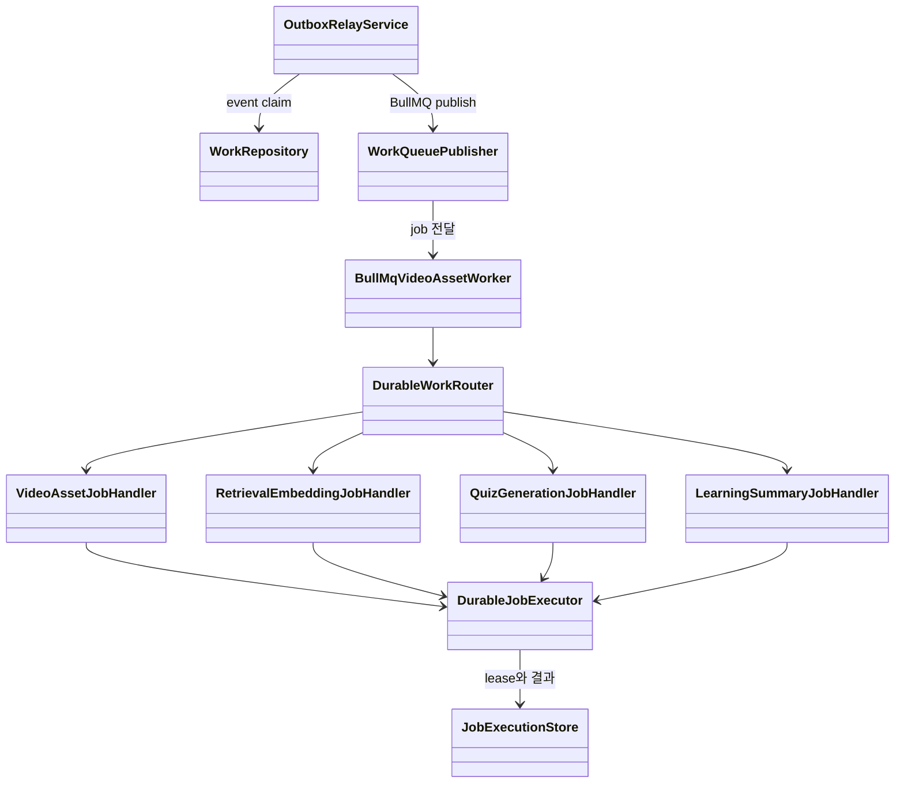
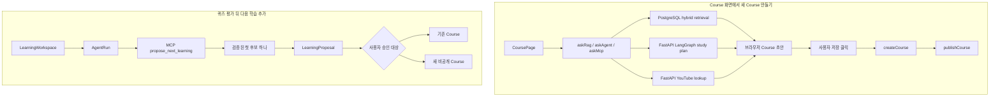
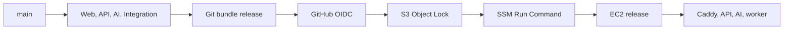

# StudyTube 아키텍처

이 문서는 사용자가 YouTube 주소를 등록한 뒤 자막, 메모, 퀴즈와 다음 학습 순서를 받기까지 어떤 코드가 연결되는지 설명합니다.

## 실행 구조

Caddy가 외부 HTTPS 요청을 받고 Web과 API로 나눕니다. API, AI와 worker는 EC2 내부에서만 통신합니다. PostgreSQL은 사용자와 학습 기록뿐 아니라 실행해야 할 작업도 저장합니다. Valkey는 저장된 작업을 worker에 전달합니다.

## 한 번의 학습 요청이 처리되는 과정

영상 등록 요청은 외부 자막 처리를 기다리지 않습니다. 첫 transaction은 provider work와 subscription을 예약하고, 새 work라면 outbox event도 함께 기록합니다. 다음 transaction에서 learning item과 study context를 만들고, 마지막 transaction에서 subscription을 context에 연결합니다. context 생성이나 연결에 실패하면 이 요청에서 새로 만든 subscription reservation을 release합니다. Web은 연결된 context를 받은 뒤 준비 상태를 다시 조회하며 사용할 수 있는 문장부터 보여 줍니다.

## Web 학습 화면

LearningWorkspace가 영상 플레이어와 지금 문장, 내용 정리, 메모, 퀴즈 탭을 조합합니다.

- useLearningSession은 현재 탭, 재생 위치, 메모 초안과 자막 상태를 sessionStorage에서 관리합니다.
- useAdaptiveQuiz는 0초부터 현재 재생 위치까지의 범위를 고정해 퀴즈를 요청하고 결과를 확인합니다.
- useNextLearningProposal은 퀴즈가 끝난 뒤 다음 학습 순서를 요청합니다.
- useLiveCaptionCapture는 저장된 자막으로 현재 구간을 채울 수 없을 때 사용자가 시작하는 실시간 자막을 처리합니다.

사용자별 최근 학습 목록과 standalone 영상의 재생 위치 및 완료 여부는 브라우저 localStorage에 저장합니다. 저장한 Course, 메모, 자막과 퀴즈는 API와 PostgreSQL이 소유하고 사용자 권한을 확인합니다.

## API 클래스 관계

LearningItemService는 YouTube 주소를 검증하고 외부 처리 한도를 예약한 뒤 학습 항목을 만듭니다. 같은 영상을 다시 요청하면 기존 작업에 합류해 중복 비용을 막습니다.

LearningService는 퀴즈, 다음 학습 실행과 Course 반영을 관리합니다. 퀴즈에는 0초부터 현재 재생 위치까지의 범위를, 다음 학습 실행에는 목표와 실행 한도를 함께 저장합니다. LearningProposalRepository는 검증된 실행 결과의 첫 후보 하나를 사용자가 승인하기 전까지 별도 제안 상태로 보관합니다.

Controller는 HTTP 입력과 권한 경계를 맡고 Service는 작업 규칙을 맡습니다. PostgreSQL 쿼리는 Repository 구현 안에 둡니다.

## 자막 상태와 현재 문장

자막 phase는 source, translation, index artifact 상태를 화면용으로 투영한 값입니다. partial은 index_pending과 complete 사이의 선형 단계가 아니라 source artifact 또는 translation artifact가 partial일 때 나타납니다. 해당 artifact가 ready가 되면 언어와 번역 여부에 따라 translation_pending 또는 index_pending으로 이어집니다.

같은 generation의 자막 조각은 기존 결과와 합칩니다. 현재 재생 시간과 겹치는 저장 문장이 없으면 YouTube 기본 자막을 먼저 확인합니다. 저장된 첫 문장이 5초 이후에 시작하면 앞부분 보강 작업을 별도 작업 키로 요청합니다.

이 구조로 긴 영상도 전체 번역을 기다리지 않고 준비된 문장부터 학습할 수 있습니다.

## 작업 전달과 중복 실행 처리

학습 등록에서는 provider work 예약과 outbox event를 같은 transaction에 저장합니다. 퀴즈처럼 후속 작업을 만드는 다른 mutation도 해당 aggregate 변경과 outbox event를 같은 transaction에 기록합니다. OutboxRelayService는 저장된 event를 claim해 BullMQ로 전달합니다.

DurableJobExecutor는 job을 실행하기 전에 lease를 얻습니다. 실행 중에는 lease를 주기적으로 연장하고, 연장에 실패하면 AbortSignal로 외부 작업을 중단합니다. 이미 완료한 job이 다시 들어오면 저장한 결과를 반환합니다. 다시 실행해도 내부 결과가 하나로 모이도록 만든 at-least-once 처리입니다.

## 퀴즈와 근거 구간

퀴즈는 영상 전체가 아니라 0초부터 사용자의 현재 재생 위치까지를 기준으로 만듭니다.

1. Web phase가 translation_pending, index_pending, partial 또는 complete이고 현재 재생 위치까지 끝난 원문 문장 5개가 있으면 퀴즈 요청을 열 수 있습니다.
2. Web이 0초부터 현재 재생 위치까지의 구간을 보내면 LearningService가 요청 내용을 해시로 고정합니다.
3. API는 ready caption artifact의 ID와 generation을 고정하고 같은 범위의 retrieval evidence 5개를 선택합니다.
4. retrieval evidence가 5개보다 적으면 같은 ready caption artifact의 caption segment 5개를 근거로 사용합니다.
5. worker가 근거마다 문제를 만들고 자막 버전과 시점을 함께 저장합니다.
6. 사용자는 결과 화면에서 근거 시점으로 돌아갈 수 있습니다.

자막 전체가 끝나기 전에도 현재 학습 범위에 원문 문장 5개가 있으면 퀴즈 준비 상태로 넘어갑니다. 이후 자막이 추가돼도 이미 출제된 문제의 근거는 바뀌지 않습니다.

## Course 초안과 퀴즈 뒤 다음 학습

CoursePage는 askRag, askAgent와 askMcp를 병렬 호출합니다. 이 중 askAgent가 FastAPI의 study_plan_graph.py를 실행하며, 브라우저가 각 응답의 영상 후보를 합쳐 Course 초안을 구성합니다. 이 초안은 LearningProposal이 아니며 사용자가 저장을 클릭한 뒤 createCourse와 publishCourse를 호출해야 서버 Course가 됩니다.

퀴즈 평가 뒤에는 LearningWorkspace가 시청 context를 포함한 AgentRun을 만들고, AgentRunProcessor가 MCP 도구로 근거 있는 다음 학습 후보를 준비합니다. 검증된 결과 중 첫 후보 하나만 LearningProposal로 저장하며, 사용자가 기존 Course의 현재 버전 또는 새 비공개 Course를 선택해 승인해야 추가됩니다. AI 서비스는 Course를 직접 수정하지 않습니다.

## 인증과 외부 경계

브라우저는 HttpOnly session cookie를 사용합니다. API는 세션, Origin과 JSON 요청 형식을 확인한 뒤 controller를 실행합니다.

MCP 학습 도구는 검색, 학습 상태 조회, 퀴즈와 다음 학습 요청만 노출합니다. 도구 호출에는 사용자, 학습 맥락, 요청 범위와 버전 검사가 적용됩니다. 영상 재생과 Course 승인은 사용자가 직접 수행합니다.

## 배포 구조

CI가 검증한 변경분만 release 파일로 만듭니다. GitHub Actions는 OIDC 임시 권한을 사용하며 SSH 개인키를 사용하지 않습니다. EC2는 release의 checksum과 내용을 다시 확인하고 Web, API, AI, worker, PostgreSQL과 Valkey가 준비된 뒤 현재 release를 전환합니다.

세부 배포 절차는 [ci-cd.md](ci-cd.md), 운영 확인은 [operations README](../operations/README.md)에 있습니다.

## 코드 읽기 순서

1. [LearningWorkspace.tsx](../web/src/features/learning/LearningWorkspace.tsx)
2. [captionState.ts](../web/src/features/learning/captionState.ts)
3. [learning-item.service.ts](../api/src/learning/learning-item.service.ts)
4. [learning.service.ts](../api/src/learning/learning.service.ts)
5. [outbox-relay.service.ts](../api/src/work/outbox-relay.service.ts)
6. [durable-job.executor.ts](../api/src/work/durable-job.executor.ts)
7. [study_plan_graph.py](../ai/study_plan_graph.py)
