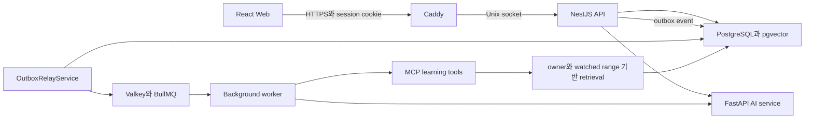
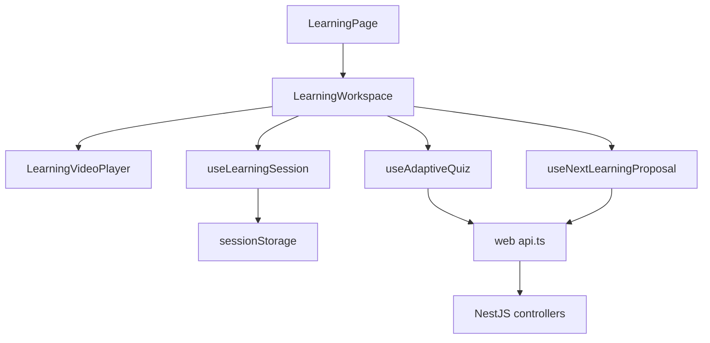
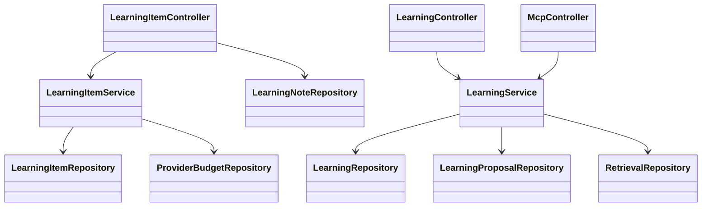
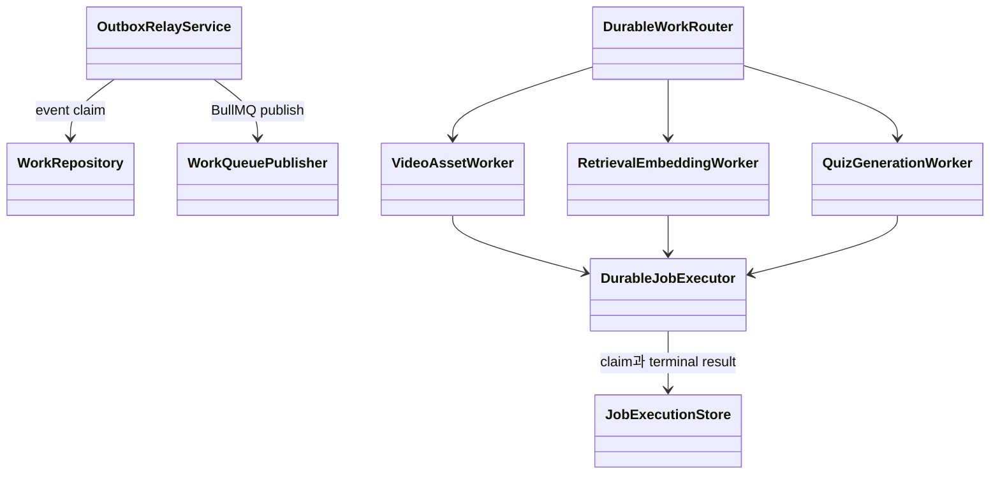

# StudyTube 아키텍처

StudyTube는 Browser, NestJS API, PostgreSQL, Valkey worker와 FastAPI AI service를 분리한다. 사용자 승인, 비용 예약과 데이터 mutation은 API가 소유하고 AI와 MCP는 허용된 학습 도구만 실행한다.

## 실행 구조

Caddy만 외부 HTTPS를 받는다. API, AI와 worker는 loopback 또는 Unix socket 경계 안에서 실행된다. 단일 EC2 운영은 비용을 낮추지만 한 instance 장애가 전체 서비스 중단으로 이어진다.

## Web 학습 workspace

`LearningWorkspace`가 player, 자막, 메모, 퀴즈와 다음 학습 제안을 조합한다. browser storage는 현재 tab과 재생 위치 같은 UI session만 보존한다. authoritative 학습 기록과 mutation은 API에 남는다.

## API class와 repository 관계

`LearningItemService`는 YouTube URL과 외부 처리 비용을 확인한 뒤 학습 자료를 만든다. `LearningService`는 bounded Agent run, quiz와 proposal lifecycle을 관리한다. PostgreSQL 구현은 interface 뒤에 있어 controller가 SQL과 worker 세부사항을 직접 알지 않는다.

## durable work 관계

delivery는 at-least-once다. `DurableJobExecutor`는 같은 job claim 아래 result와 dead letter를 기록하고 heartbeat가 lease를 잃으면 외부 작업을 중단한다. 외부 API 응답 직후 crash window까지 exactly-once라고 주장하지 않는다.

## 학습 자료와 Course 관계

공유 가능한 video source와 사용자 소유 learning item을 분리한다. standalone 학습과 Course step은 각각 study context를 가지며 note, progress, caption generation과 quiz evidence가 이 context에 귀속된다.

다음 영상 proposal은 사용자가 기존 Course 또는 새 비공개 Course를 고른 뒤에만 반영된다. proposal 소비와 Course version 변경을 같은 PostgreSQL transaction에서 처리해 승인 전 자동 mutation을 막는다.

## 인증과 MCP 경계

Browser는 HttpOnly session cookie만 사용한다. API는 session, exact Origin과 JSON boundary를 검사한 뒤 controller를 실행한다.

Agent는 repository와 AI proxy를 임의로 호출하지 않는다. MCP controller가 tool schema, owner scope, context version, watched range와 audit field를 검사한다. 영상 재생과 Course 승인 endpoint는 사람이 직접 수행한다.

## source 탐색 순서

1. `web/src/features/learning/LearningWorkspace.tsx`
2. `api/src/learning/learning-item.service.ts`
3. `api/src/learning/learning.service.ts`
4. `api/src/work/outbox-relay.service.ts`
5. `api/src/work/durable-job.executor.ts`
6. `api/src/mcp/mcp.controller.ts`
7. `ai/mcp_server.py`

## 현재 운영 한계

- production은 단일 EC2에 의존한다.
- STT production 활성화는 model, 최대 금액과 만료가 포함된 별도 비용 승인이 필요하다.
- `c065bda` deployment는 AWS 자격 증명 단계에서 실패해 live revision으로 확인되지 않았다.
- current main의 인증 이후 전체 학습 흐름은 이번 문서 작업에서 새 browser E2E로 재현하지 않았다.
