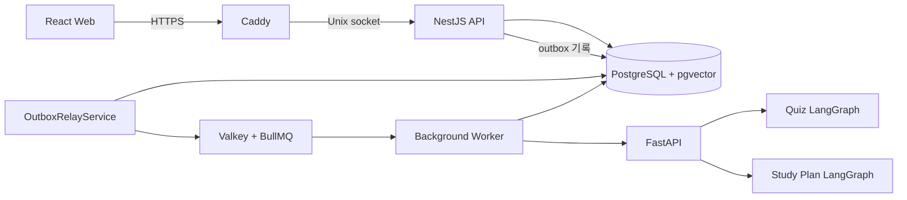
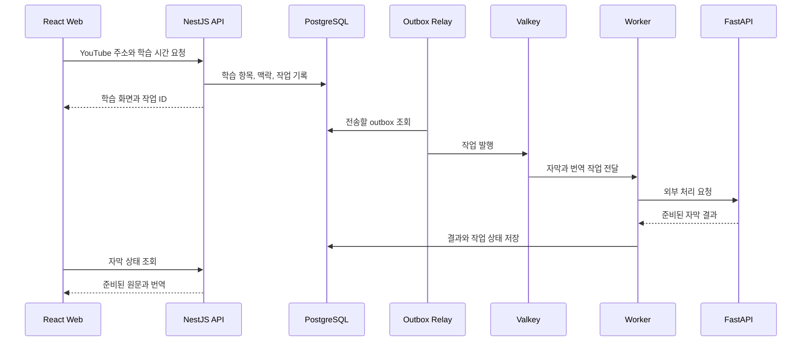
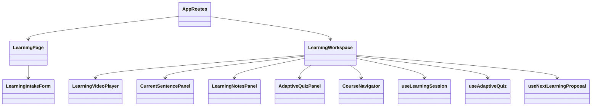
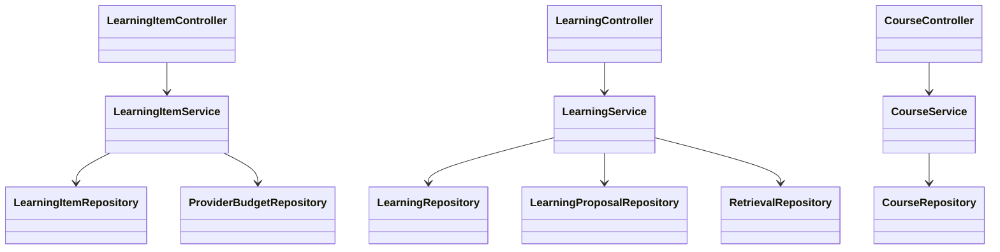
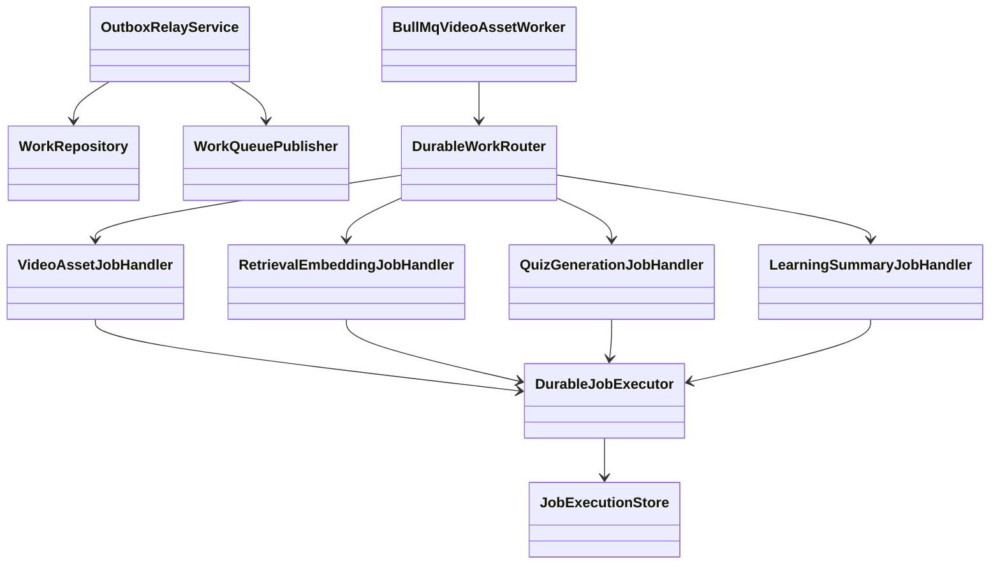
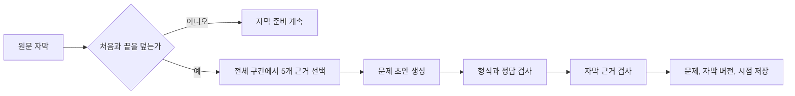
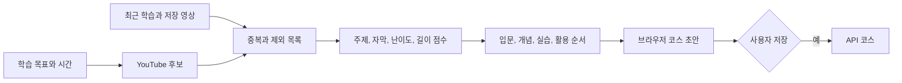
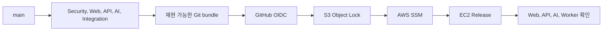

# StudyTube 아키텍처

StudyTube는 화면, API, 백그라운드 작업과 AI 처리를 나눠 운영합니다. 사용자의 데이터와 최종 변경은 NestJS API가 관리하고 시간이 오래 걸리는 작업만 Valkey 큐와 Worker를 거칩니다.

## 실행 구조

Caddy만 외부 요청을 받습니다. API, AI와 Worker는 loopback 또는 Unix socket 안에서 통신합니다. PostgreSQL에는 사용자 데이터와 작업 상태를 저장하고 Valkey는 실행할 작업을 Worker에 전달합니다.

## 영상을 열었을 때

사용자는 작업 전체가 끝날 때까지 기다리지 않습니다. API가 학습 맥락을 만든 뒤 바로 화면을 열고 Web은 자막 상태를 조회하며 준비된 문장부터 보여 줍니다.

## Web 클래스 관계

`LearningWorkspace`가 영상과 네 가지 학습 도구를 조합합니다. 재생 위치와 현재 탭은 사용자별 브라우저 저장소에 남기고 코스, 메모, 자막과 퀴즈는 API를 통해 PostgreSQL에 저장합니다.

자막 설정은 `captionPreferences.ts`가 관리합니다. 표시 여부, 세 단계 크기와 0~100% 배경 진하기를 저장하며 YouTube 조작 버튼을 가리지 않도록 재생 상태에 따라 위치를 조정합니다.

## API 클래스 관계

Controller는 요청 형식과 로그인 상태를 확인하고 Service는 소유권과 변경 규칙을 처리합니다. Repository가 SQL을 맡기 때문에 화면과 Controller에는 테이블 구조가 드러나지 않습니다.

코스를 수정하거나 보관함에서 지울 때는 화면에 표시된 버전을 함께 보냅니다. API는 현재 버전과 다르면 변경을 거절해 다른 기기에서 수정한 내용을 이전 상태로 덮어쓰지 않게 합니다.

## 중단돼도 이어지는 작업

API는 데이터 변경과 outbox event를 같은 PostgreSQL transaction에 기록합니다. `OutboxRelayService`가 아직 보내지 않은 event를 가져가 BullMQ에 넣으므로 DB 저장 뒤 프로세스가 멈춰도 작업이 남습니다.

`DurableJobExecutor`는 작업마다 lease를 얻고 실행 중 heartbeat를 갱신합니다. lease를 잃으면 현재 작업을 중단하고, 완료 상태가 저장된 작업이 다시 들어오면 기존 결과를 돌려줍니다.

## 전체 자막을 사용하는 퀴즈

Web과 API가 영상 길이와 자막 범위를 각각 확인합니다. 시작 5초 안에서 자막이 시작하고 영상 끝부분까지 이어져야 퀴즈를 요청할 수 있습니다.

API는 전체 자막을 시간순 다섯 구간으로 나눠 근거를 고릅니다. FastAPI의 `quiz_generation_graph.py`는 문제 초안을 만든 뒤 형식과 자막 근거를 검사하고 통과한 문제만 저장합니다.

## 코스 추천과 승인

`video_recommendation.py`는 재생할 수 없는 영상, 최근 본 영상, 저장한 코스의 영상과 주제 관련도가 낮은 영상을 먼저 제외합니다. 남은 후보는 자막, 최근 학습, 난이도, 길이와 실습 여부를 기준으로 정렬합니다.

추천 결과는 브라우저 초안입니다. 사용자가 저장을 누른 뒤에만 API가 코스를 만들고 저장을 완료합니다. 퀴즈 뒤 제안되는 다음 영상도 기존 코스 또는 새 비공개 코스를 선택해 승인해야 반영됩니다.

## 인증과 계정 데이터

운영 환경은 Google 로그인을 사용합니다. 인증 자격 증명은 HttpOnly 세션 쿠키에만 두고 Web은 화면 표시용 사용자 정보와 학습 설정을 localStorage에 저장합니다. API는 Origin과 요청 형식을 다시 확인합니다.

계정을 삭제할 때는 같은 Google 계정으로 다시 본인 확인을 거칩니다. API는 최근 본인 확인이 남아 있는지 검사하고 사용자와 학습 데이터를 하나의 PostgreSQL transaction에서 지운 뒤 세션 쿠키를 만료합니다.

## 배포

CI가 확인한 커밋만 고정된 release로 만듭니다. GitHub Actions는 OIDC 임시 권한으로 S3에 올리고 SSM이 EC2에서 checksum과 구성 파일을 다시 확인한 뒤 서비스를 전환합니다.

자세한 배포와 복구 순서는 [CI/CD 문서](ci-cd.md), 운영 점검은 [Operations README](../operations/README.md)에 있습니다.

## 코드 읽기 순서

1. [LearningWorkspace.tsx](../web/src/features/learning/LearningWorkspace.tsx)
2. [captionState.ts](../web/src/features/learning/captionState.ts)
3. [CoursePage.tsx](../web/src/features/course/CoursePage.tsx)
4. [learning-item.service.ts](../api/src/learning/learning-item.service.ts)
5. [postgres-quiz.repository.ts](../api/src/learning/postgres-quiz.repository.ts)
6. [outbox-relay.service.ts](../api/src/work/outbox-relay.service.ts)
7. [durable-job.executor.ts](../api/src/work/durable-job.executor.ts)
8. [quiz_generation_graph.py](../ai/quiz_generation_graph.py)
9. [video_recommendation.py](../ai/video_recommendation.py)
