# StudyTube CI/CD runbook

StudyTube는 GitHub Actions, GitHub OIDC, S3 Object Lock, AWS Systems Manager Run Command를 사용해 `https://studytube.page`에 배포한다. SSH, EC2 개인키, 고정 host 주소는 배포 경로에 포함하지 않는다.

## 배포 경계

```mermaid
flowchart LR
  Main["GitHub main commit"] --> CI["Security, Web, API, Backend Integration, AI"]
  CI --> Artifact["Deterministic Git bundle artifact"]
  Artifact --> OIDC["GitHub OIDC temporary AWS credentials"]
  OIDC --> S3["S3 Object Lock"]
  S3 --> SSM["SSM Run Command"]
  SSM --> EC2["StudyTube EC2"]
  EC2 --> Verify["Verify, stage, activate, health check"]
  Verify --> Site["studytube.page"]
```



관련 구현은 다음 파일에 있다.

- Workflow: [`.github/workflows/ci-cd.yml`](../.github/workflows/ci-cd.yml)
- Artifact builder: [`scripts/build-release-artifact.sh`](../scripts/build-release-artifact.sh)
- S3 upload와 SSM sender: [`scripts/send-ssm-deployment.sh`](../scripts/send-ssm-deployment.sh)
- EC2 release runner: [`scripts/ssm-deploy-release.sh`](../scripts/ssm-deploy-release.sh)
- Application activation: [`scripts/deploy-ec2.sh`](../scripts/deploy-ec2.sh)
- Contract test: [`scripts/tests/immutable-deploy-contract.sh`](../scripts/tests/immutable-deploy-contract.sh)

## Workflow trigger와 required checks

`CI/CD` workflow는 다음 이벤트에서 실행한다.

- `main` 대상 pull request
- `main` push
- `workflow_dispatch`

같은 ref의 새 실행이 시작돼도 진행 중인 실행을 취소하지 않는다. 배포는 검증된 commit을 명시적으로 운반하므로 오래 실행된 workflow가 최신 release를 암묵적으로 가져오지 않는다.

Branch protection에는 다음 다섯 check를 required로 설정한다.

| Check | 검증 범위 |
| --- | --- |
| `Security` | Gitleaks 전체 Git 이력과 현재 tree, 고정된 외부 Action과 container image, dependency lock 계약 |
| `Web` | npm clean install, production dependency audit, ESLint, Node tests, Vite production build |
| `API` | production dependency audit, 배포 script, Compose, Caddy contract, OpenAPI export와 breaking diff, runtime DB boundary, ESLint, unit tests, Nest build |
| `AI` | Python 3.12 hash-locked dependency install, strict vulnerability audit, unittest discovery |
| `Backend Integration` | PostgreSQL pgvector와 Valkey, fresh 및 legacy migration, down-up rehearsal, 네 핵심 query plan, E2E |

`Deploy immutable release with SSM` job은 Security, Web, API, Backend Integration, AI의 다섯 검증 job이 모두 성공한 `main` push와 `main`의 수동 실행에서만 동작한다. pull request에서는 deploy job을 required check로 사용하지 않는다.

Backend Integration은 auth lookup, Course detail, outbox claim, hybrid retrieval의 index 사용 contract를 검사한다. 실패 시 server와 migration 상태, table 및 index 통계, activity, schema-only dump, PostgreSQL 및 Valkey log를 `backend-integration-evidence-<run-id>-<attempt>` artifact로 보존한다. 행 dump와 runtime secret은 포함하지 않는다. API가 생성한 OpenAPI 문서와 deploy job의 허용 목록 기반 공개 요약도 14일 보존한다. 원본 SSM 응답과 출력은 공개 GitHub artifact나 workflow log에 복사하지 않는다. CI job 결과 자체가 실패한 경우에는 별도 failure summary artifact를 남긴다.

## AWS 구성

현재 운영 리전과 리소스 이름은 다음과 같다.

| 항목 | 값 |
| --- | --- |
| AWS account | repository 밖에서 관리하는 현재 운영 계정 |
| Region | `ap-northeast-2` |
| GitHub deploy role | `StudyTubeGitHubDeployRole` |
| EC2 runtime role | `StudyTubeEc2RuntimeRole` |
| Release bucket | `studytube-releases-<aws-account-id>-ap-northeast-2` |
| CloudWatch log group | `/studytube/deploy` |
| Public origin | `https://studytube.page` |

Release bucket은 versioning, SSE-S3, 모든 public access 차단, Object Lock을 사용한다. 기본 retention과 workflow upload는 Governance mode 30일을 사용한다. release 경로의 object를 덮어쓰거나 삭제하는 권한은 배포 역할에 주지 않는다.

CloudWatch log group `/studytube/deploy`는 Standard log class, 30일 retention, deletion protection을 사용한다. SSM output은 같은 실행의 S3 diagnostics와 함께 추적한다.

EC2 security group은 80과 443만 public inbound로 허용한다. 22번 포트와 애플리케이션 포트는 열지 않는다. 인스턴스 관리는 `StudyTubeEc2RuntimeRole`과 Systems Manager로 수행한다.

### GitHub OIDC trust

GitHub deploy role은 기존 GitHub OIDC provider를 사용하고 `NearthYou/studytube`의 `main` branch만 role을 assume할 수 있어야 한다.

```json
{
  "Version": "2012-10-17",
  "Statement": [
    {
      "Effect": "Allow",
      "Principal": {
        "Federated": "arn:aws:iam::<aws-account-id>:oidc-provider/token.actions.githubusercontent.com"
      },
      "Action": "sts:AssumeRoleWithWebIdentity",
      "Condition": {
        "StringEquals": {
          "token.actions.githubusercontent.com:aud": "sts.amazonaws.com",
          "token.actions.githubusercontent.com:sub": "repo:NearthYou/studytube:ref:refs/heads/main"
        }
      }
    }
  ]
}
```

Workflow deploy job만 `id-token: write`를 가진다. `aws-actions/configure-aws-credentials`가 run마다 단기 자격 증명을 교환하며 장기 AWS access key를 GitHub에 저장하지 않는다.

### 최소 IAM 권한

GitHub deploy role에는 다음 범위만 필요하다.

- bucket 자체의 `s3:ListBucket`, `s3:GetBucketLocation`
- `releases/*`, `deploy-tools/*`의 `s3:GetObject`, `s3:PutObject`, `s3:PutObjectRetention`
- `ssm-output/*`의 목록과 읽기
- 지정된 EC2 instance와 `AWS-RunShellScript` document에 대한 `ssm:SendCommand`
- 실행 결과 조회를 위한 `ssm:GetCommandInvocation`, `ssm:ListCommandInvocations`

EC2 runtime role에는 `AmazonSSMManagedInstanceCore`와 다음 범위가 필요하다.

- `releases/*`, `deploy-tools/*` 읽기
- `ssm-output/*` 쓰기
- `/studytube/deploy` log stream 생성, 조회, event 쓰기
- 설정된 sender의 검증된 SES identity에 한정한 `ses:SendEmail`

SES 권한은 배포 리전과 실제 `AUTH_EMAIL_SENDER` identity ARN만 resource로 허용한다. Worker는 단순 verification mail만 보내므로 `ses:SendRawEmail`, identity 관리, credential 관리 권한은 주지 않는다.

IAM policy는 release bucket 삭제, EC2 mutation, 다른 instance의 Run Command, 다른 repository branch의 role assumption을 허용하지 않는다.

## GitHub Actions configuration

AWS 장기 access key나 SSH secret은 저장하지 않는다. 다만 account, bucket, instance 식별자가 공개 workflow log에 그대로 나타나지 않도록 다음 세 값은 Actions secret으로 마스킹한다. 이 값들은 자격 증명이 아니며 실제 권한 경계는 OIDC trust와 IAM policy다.

| Actions secret | 값 또는 형식 | 필수 |
| --- | --- | --- |
| `AWS_DEPLOY_ROLE_ARN` | `arn:aws:iam::<aws-account-id>:role/StudyTubeGitHubDeployRole` | 예 |
| `AWS_RELEASE_BUCKET` | `studytube-releases-<aws-account-id>-ap-northeast-2` | 예 |
| `AWS_SSM_INSTANCE_ID` | 현재 운영 instance의 `i-...` ID | 예 |

나머지는 Actions variable로 저장한다.

| Actions variable | 값 또는 형식 | 필수 |
| --- | --- | --- |
| `AWS_REGION` | `ap-northeast-2` | 예 |
| `AWS_CLOUDWATCH_LOG_GROUP` | `/studytube/deploy` | 권장 |
| `STUDYTUBE_CONFIG_FILE` | `/etc/studytube/deployment.env` | 기본값 사용 가능 |
| `STUDYTUBE_DEPLOY_ROOT` | `/opt/studytube` | 기본값 사용 가능 |
| `STUDYTUBE_RELEASE_RETENTION` | `5` | 기본값 사용 가능 |
| `STUDYTUBE_MINIMUM_FREE_BYTES` | `3221225472` | 기본값 사용 가능 |
| `AWS_ARTIFACT_OBJECT_LOCK_DAYS` | `30` | 기본값 사용 가능 |

GitHub CLI로 값을 설정하는 예시는 다음과 같다. secret 값은 명령 인자나 shell history에 남기지 말고 각 명령의 입력 prompt로 전달한다.

```bash
gh secret set AWS_DEPLOY_ROLE_ARN
gh secret set AWS_RELEASE_BUCKET
gh secret set AWS_SSM_INSTANCE_ID

gh variable set AWS_REGION --body 'ap-northeast-2'
gh variable set AWS_CLOUDWATCH_LOG_GROUP --body '/studytube/deploy'
gh variable set STUDYTUBE_CONFIG_FILE --body '/etc/studytube/deployment.env'
gh variable set STUDYTUBE_DEPLOY_ROOT --body '/opt/studytube'
gh variable set STUDYTUBE_RELEASE_RETENTION --body '5'
gh variable set STUDYTUBE_MINIMUM_FREE_BYTES --body '3221225472'
gh variable set AWS_ARTIFACT_OBJECT_LOCK_DAYS --body '30'
```

## EC2 runtime config

Runtime secret은 GitHub Actions가 생성하거나 전송하지 않는다. 인스턴스의 `/etc/studytube/deployment.env`를 root 소유, mode `0600`으로 만들고 `KEY=value` 형식만 사용한다. SSM runner는 command substitution이 들어간 config를 거부하고 release별 root-only snapshot을 만든다.

운영에 필요한 핵심 항목은 다음과 같다.

```dotenv
APP_USER=ubuntu
APP_GROUP=ubuntu

WEB_ORIGIN=https://studytube.page
STUDYTUBE_SITE_ADDRESS=studytube.page
STUDYTUBE_PUBLIC_URL=https://studytube.page

DATABASE_URL=postgresql://app:<url-encoded-password>@127.0.0.1:5432/app
POSTGRES_USER=app
POSTGRES_PASSWORD=<random-secret>
POSTGRES_DB=app
VALKEY_URL=redis://127.0.0.1:6379

COURSE_CUTOVER_MODE=course
COURSE_CUTOVER_STATE_DIR=/var/lib/studytube/course-cutover
AI_SERVICE_URL=http://127.0.0.1:8000
INTERNAL_AI_API_KEY=<random-secret>
AUTH_VERIFICATION_PEPPER=<random-secret>
AUTH_RATE_LIMIT_PEPPER=<different-random-secret>
IRREVERSIBLE_MIGRATIONS_VERIFIED_BACKUP_MARKER=/var/lib/studytube/migration-backup/verified-backup

MCP_SERVICE_ASSERTION_SECRET=<random-secret>
STUDYTUBE_API_SOCKET_PATH=/run/studytube/api.sock
MCP_ALLOWED_HOSTS=127.0.0.1:*,localhost:*,[::1]:*
```

`POSTGRES_PASSWORD`의 URL 예약 문자는 `DATABASE_URL`에서 percent encoding해야 한다. `INTERNAL_AI_API_KEY`는 NestJS와 FastAPI가 같은 config snapshot을 읽으므로 한 값으로 일치한다. 인증 pepper와 MCP secret은 서로 다른 난수 값을 사용한다.

MCP는 현재 서버 내부 agent integration 경계다. Caddy는 `/mcp`와 protected-resource discovery 경로를 404로 닫고, FastAPI listener의 loopback 경로에서만 짧은 수명의 service assertion을 검증한다. 기본 설정은 OAuth protected-resource metadata route를 등록하지 않는다. 사용자 bound OAuth issuer와 token lifecycle이 구현된 뒤에만 `MCP_RESOURCE_SERVER_URL`을 설정하며, 그전에는 public MCP endpoint나 signing secret을 client에 제공하지 않는다.

`1753660802000_auth-hardening` 또는 중복 검색 임베딩을 삭제하는 `1753660805000_retrieval-source-model-key`가 아직 적용되지 않은 첫 배포는 backup과 restore rehearsal을 먼저 완료해야 한다. `IRREVERSIBLE_MIGRATIONS_VERIFIED_BACKUP_MARKER`가 가리키는 regular non-symlink 파일에는 `backup_verified=true`, `deploy_sha=<exact-deploy-sha>`, 그리고 적용 예정인 각 irreversible migration의 `migration=<migration-name>`이 각각 한 줄로 있어야 한다. migration 적용 이후에는 배포 스크립트가 migration history를 확인한다. 기존 `AUTH_CUTOVER_VERIFIED_BACKUP_MARKER`는 전환 호환성만 위해 fallback으로 인식한다.

`OPENAI_API_KEY`, `YOUTUBE_API_KEY`, YouTube PO token 계열 값은 해당 외부 기능을 사용할 때만 추가한다. 값을 workflow log, SSM command 본문, GitHub variable에 넣지 않는다.

OTLP trace collector를 운영할 때는 표준 OpenTelemetry 환경 변수를 같은 config에 추가한다.

```dotenv
OTEL_EXPORTER_OTLP_ENDPOINT=https://<approved-collector-endpoint>
```

`OTEL_EXPORTER_OTLP_TRACES_ENDPOINT`를 개별 설정하거나 `OTEL_TRACES_EXPORTER` 목록에 `otlp`를 넣어도 export가 활성화된다. `OTEL_SDK_DISABLED=true` 또는 `OTEL_TRACES_EXPORTER=none`이면 SDK export를 비활성화한다. `OTEL_SERVICE_NAME`을 생략하면 API는 `studytube-api`, worker는 `studytube-worker`를 사용한다. exporter 인증 header 등은 표준 `OTEL_EXPORTER_OTLP_*` 환경 변수를 사용하고 저장소나 workflow log에 넣지 않는다.

Prometheus 형식 지표는 EC2 내부의 API Unix socket에서 `GET /internal/metrics`로 조회한다. 요청의 `X-Internal-Api-Key`는 `INTERNAL_AI_API_KEY`와 일치해야 한다. DB pool은 `studytube_db_pool_connections{state=total|idle|busy}`, `studytube_db_pool_waiting`, `studytube_db_pool_wait_ms`를 노출하며 외부 Caddy 경로에서는 접근할 수 없다.

초기 legacy 전환이 필요한 database는 [database migration runbook](database-migrations.md)에 따라 `legacy`, `freeze`, `course` 순서를 지킨다. 이미 Course writer가 활성화된 database를 `legacy`로 되돌리지 않는다.

## Immutable release 흐름

1. Deploy job은 `fetch-depth: 0`으로 검증된 `github.sha`를 checkout한다.
2. `build-release-artifact.sh`는 그 SHA만 노출하는 Git bundle, format version, bundle digest를 포함한 deterministic tar.gz를 만든다.
3. tar.gz와 SHA-256 파일은 GitHub artifact로 14일 보존한다.
4. OIDC로 받은 단기 AWS 자격 증명으로 artifact, digest, digest에 고정된 SSM runner를 S3에 올린다.
5. upload는 `If-None-Match: *`, SHA-256 checksum, AES256 server-side encryption, Governance retention을 사용한다. 같은 key에 다른 content가 있으면 중단한다.
6. `AWS-RunShellScript`가 EC2에서 runner를 내려받아 digest를 검사한 뒤 root로 실행한다. SSH host나 개인키는 사용하지 않는다.
7. runner는 artifact SHA-256, archive member 목록, manifest, bundle SHA-256, bundle commit을 다시 검사한다.
8. root-owned config snapshot을 release에 연결하고 dependency install, Web와 API build, production Compose, Caddy validation을 activation 전에 끝낸다.
9. `deploy-ec2.sh`가 PostgreSQL과 Valkey를 준비하고 migration을 적용한 뒤 API, AI, worker를 systemd로 시작한다.
10. API Unix socket readiness, AI health, worker active 상태, Valkey PONG, public API, public Web가 모두 성공해야 `current`와 success marker가 확정된다.

Release는 `/opt/studytube/releases/<sha>`에 보존한다. 기본적으로 최신 5개를 유지하며 현재 release와 last known good release는 pruning 대상에서 제외한다. Web build는 `/var/www/studytube/releases/<sha>`에 만든 뒤 `/var/www/studytube/current` symlink를 원자적으로 교체한다.

## 실패, resume, rollback

SSM runner는 deployment phase, cutover 시작 여부, Course 활성화 기준값, 이전 성공 release를 `/opt/studytube/deployment-state`에 기록한다. cutover 전에 준비가 실패하면 현재 release와 public edge를 계속 유지한다. 재부팅으로 준비 단계가 끊기면 `studytube-deploy-resume.service`가 같은 release를 이어서 처리한다.

cutover 이후 health gate가 실패했고 schema barrier와 Course 활성화 경계를 넘지 않았다면, runner는 이미 빌드와 검증을 마친 이전 release를 재활성화한다. 이 경로는 dependency install, build, migration, Course backfill을 다시 실행하지 않는다. 이전 release가 이 bounded reactivation 계약을 지원하지 않으면 서비스를 sealed 상태로 두고 같은 release를 roll forward한다. 최초 immutable 전환은 자동 legacy downgrade를 하지 않으며, 보존한 legacy snapshot은 진단과 수동 복구 판단을 위한 증거로만 사용한다.

시간 상한은 신규 activation 110분, prepared reactivation 25분, 마무리 5분, watchdog lease 145분, SSM 160분, CI deploy job 175분 순서로 잡는다. 시간 초과 시 watchdog가 application과 public edge를 sealed 상태로 전환한다.

자동 rollback은 application release를 복원하지만 적용한 database migration을 자동으로 down하지 않는다. migration은 이전 application과 함께 동작하도록 additive하게 작성하고 schema 문제는 roll forward한다. 운영자가 `current` symlink나 state 파일을 수동 수정하지 않는다.

실패 원인은 다음 위치에서 확인한다.

- GitHub run의 `deployment-diagnostics-<run-id>-<attempt>` artifact에는 repository, run, SHA, 실행 여부, SSM 상태, 응답 코드, 시작 및 종료 시각만 기록한다.
- S3의 `ssm-output/<deploy-sha>/<run-id>-<attempt>/`
- CloudWatch Logs의 `/studytube/deploy`
- EC2의 `/opt/studytube/deployment-diagnostics/<deploy-sha>/`
- systemd journal의 `studytube-api`, `studytube-ai`, `studytube-worker`

원격 실행의 원본 표준 출력과 표준 오류는 접근이 제한된 S3와 CloudWatch에서만 확인한다. runner에 임시 저장한 SSM API 응답과 AWS CLI 오류는 GitHub에 업로드하지 않는다. GitHub artifact 생성기는 저장소 밖의 runner 임시 경로에 허용 목록 기반 `summary.json`을 새로 만들고 그 파일 하나만 업로드하므로 account, bucket, instance, command ID, 출력 본문을 전달하지 않는다. 생성 단계가 실패하면 artifact 업로드도 실행하지 않는다.

## 수동 배포와 확인

운영 배포는 `main`에서 workflow를 다시 실행한다.

```bash
gh workflow run ci-cd.yml --ref main
gh run list --workflow ci-cd.yml --branch main --limit 5
gh run watch <run-id> --exit-status
```

SSM managed 상태는 로컬 AWS CLI에서 확인할 수 있다.

```bash
aws ssm describe-instance-information \
  --region ap-northeast-2 \
  --filters Key=InstanceIds,Values=<current-instance-id>
```

배포 뒤 외부에서 확인할 공개 경로는 다음 두 개다.

```bash
curl -fsS https://studytube.page/api/health/live
curl -fsS https://studytube.page/
```

내부 readiness와 service 상태가 필요하면 SSH 대신 Session Manager를 사용한다.

```bash
aws ssm start-session \
  --region ap-northeast-2 \
  --target <current-instance-id>

sudo systemctl status studytube-api studytube-ai studytube-worker --no-pager
sudo docker ps --filter name=studytube
```

`/api/health/ready`, `/api/health/ai`, `/api/health/db`, `/api/internal/*`는 외부 검증 URL이 아니다. Caddy가 의도적으로 404를 반환한다.

## 운영 체크리스트

배포 전:

- 다섯 required check가 같은 full commit SHA에서 성공했는지 확인한다.
- GitHub OIDC trust가 `NearthYou/studytube`의 `main`으로 제한됐는지 확인한다.
- `AWS_SSM_INSTANCE_ID`가 현재 managed instance와 일치하는지 확인한다.
- S3 Object Lock, versioning, public access block이 유지되는지 확인한다.
- root-owned runtime config와 database cutover marker가 준비됐는지 확인한다.

배포 후:

- workflow가 출력한 `deployed_sha`가 GitHub `main` SHA와 일치하는지 확인한다.
- HTTPS Web과 `/api/health/live`가 성공하는지 확인한다.
- API, AI, worker, PostgreSQL, Valkey, Caddy가 정상인지 확인한다.
- SSM diagnostics와 CloudWatch output에 secret이 없는지 확인한다.
- [운영 드릴](../operations/README.md)의 backup, restore, failure recovery, k6 evidence를 필요한 점검 창에서 실행한다.
