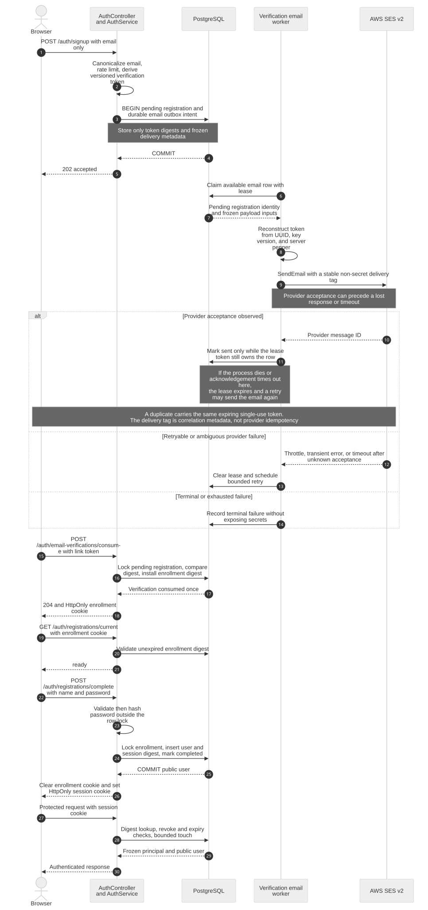
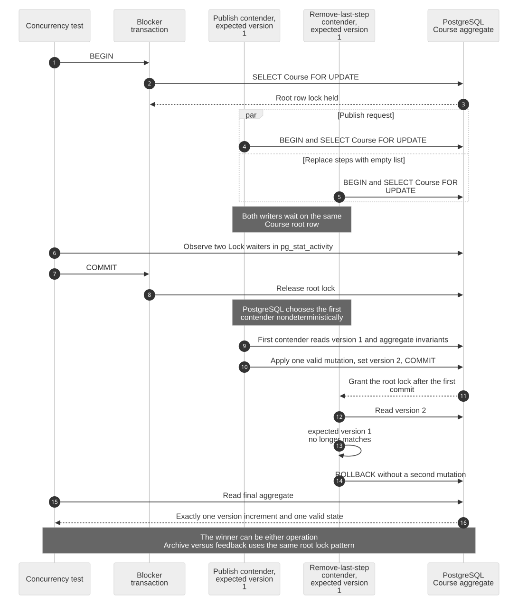
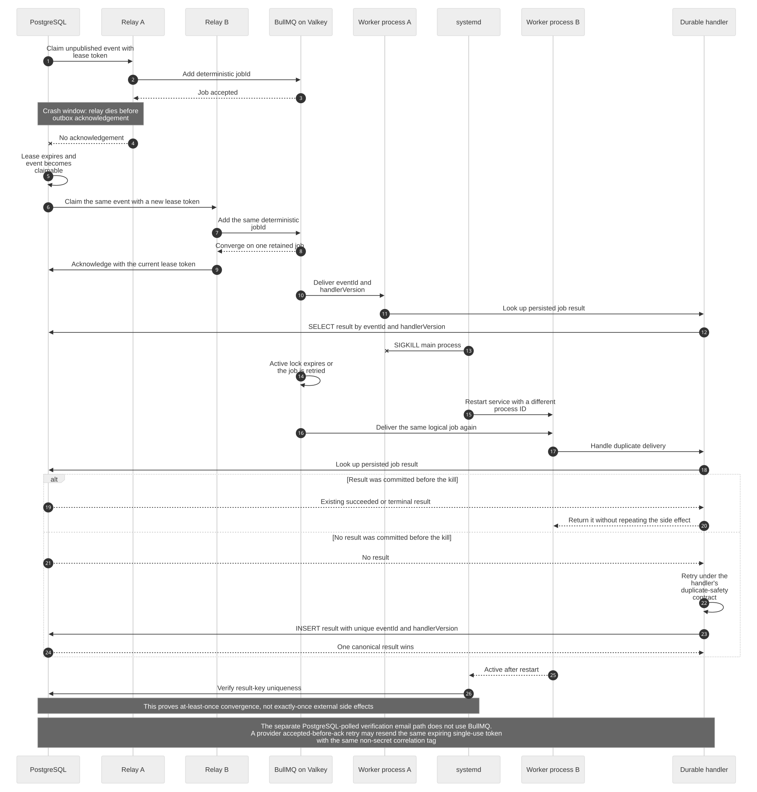

# StudyTube backend architecture evidence

This directory supplies the code-to-test evidence requested by [GitHub issue #5](https://github.com/NearthYou/studytube/issues/5). Each diagram has an editable Mermaid source and a rendered SVG with the same basename. The sections below connect every architectural claim to its implementation and verification anchors.

These are structural design artifacts, not production measurement results. They do not claim current public deployment health, DNS convergence, throughput, latency, queue lag, or recovery duration. The learning thresholds shown below are product rules, not observed service metrics.

## Evidence index

| Concern | Mermaid source | Rendered artifact |
| --- | --- | --- |
| Authentication, enrollment, and verification email | [auth-session-email-verification-sequence.mmd](./auth-session-email-verification-sequence.mmd) | [auth-session-email-verification-sequence.svg](./auth-session-email-verification-sequence.svg) |
| Course aggregate expand-contract cutover | [course-expand-contract-cutover.mmd](./course-expand-contract-cutover.mmd) | [course-expand-contract-cutover.svg](./course-expand-contract-cutover.svg) |
| PostgreSQL outbox and BullMQ transitions | [outbox-bullmq-state-transition.mmd](./outbox-bullmq-state-transition.mmd) | [outbox-bullmq-state-transition.svg](./outbox-bullmq-state-transition.svg) |
| Hybrid retrieval, RRF, and visibility | [hybrid-retrieval-rrf-visibility.mmd](./hybrid-retrieval-rrf-visibility.mmd) | [hybrid-retrieval-rrf-visibility.svg](./hybrid-retrieval-rrf-visibility.svg) |
| AgentRun, approval, progress, quiz, and budget states | [agent-learning-state-machine.mmd](./agent-learning-state-machine.mmd) | [agent-learning-state-machine.svg](./agent-learning-state-machine.svg) |
| Course writer concurrency | [course-concurrency-lock-timeline.mmd](./course-concurrency-lock-timeline.mmd) | [course-concurrency-lock-timeline.svg](./course-concurrency-lock-timeline.svg) |
| Relay and worker recovery after process loss | [worker-kill-duplicate-recovery-timeline.mmd](./worker-kill-duplicate-recovery-timeline.mmd) | [worker-kill-duplicate-recovery-timeline.svg](./worker-kill-duplicate-recovery-timeline.svg) |

## 1. Authentication, enrollment, and verification email



The enrollment path deliberately separates proof of mailbox ownership from credential creation:

1. Email-only signup stores a pending registration and a durable email delivery intent in the same PostgreSQL transaction. The database stores a token digest and frozen delivery inputs, not the plaintext verification token.
2. A lease-based worker reconstructs the versioned token from the pending-registration identity and server pepper, verifies the frozen payload hash, and sends through the configured provider.
3. Consuming the verification link installs a digest-backed, expiring enrollment cookie. Registration readiness and completion use that cookie. Completion creates the user and first digest-backed session atomically, then replaces the enrollment cookie with the session cookie.

The SES v2 `EmailTags` value is a stable, non-secret correlation tag. It is not provider idempotency. If SES accepts a message but the worker loses the response or cannot acknowledge PostgreSQL before losing its lease, the row can be reclaimed and the email can be sent again. A duplicate contains the same expiring, single-use verification token, so delivery is at-least-once while token consumption remains single-use.

| Claim | Implementation evidence | Verification evidence |
| --- | --- | --- |
| Pending registration and delivery intent share one commit | [`AuthService`](../../../api/src/auth/auth.service.ts), [`DatabaseService`](../../../api/src/database.service.ts), [auth hardening migration](../../../api/migrations/1753660802000_auth-hardening.cjs) | [`auth.e2e-spec.ts`](../../../api/test/auth.e2e-spec.ts), [`auth.service.spec.ts`](../../../api/src/auth/auth.service.spec.ts), [`database.service.spec.ts`](../../../api/src/database.service.spec.ts) |
| Delivery claims, leases, payload verification, retries, and terminal outcomes are durable | [`VerificationEmailOutboxWorker`](../../../api/src/auth/verification-email-outbox.worker.ts), [`PostgresVerificationEmailOutboxRepository`](../../../api/src/auth/verification-email-outbox.repository.ts), [email configuration](../../../api/src/auth/verification-email.config.ts) | [worker spec](../../../api/src/auth/verification-email-outbox.worker.spec.ts), [repository spec](../../../api/src/auth/verification-email-outbox.repository.spec.ts), [configuration spec](../../../api/src/auth/verification-email.config.spec.ts) |
| SES and local capture providers preserve the frozen message contract | [verification email renderer](../../../api/src/auth/verification-email.ts), [verification email sender](../../../api/src/auth/verification-email-sender.ts) | [renderer spec](../../../api/src/auth/verification-email.spec.ts), [sender spec](../../../api/src/auth/verification-email-sender.spec.ts) |
| Verification, enrollment completion, and authenticated session use separate digest-backed tokens | [`AuthController`](../../../api/src/auth/auth.controller.ts), [`AuthService`](../../../api/src/auth/auth.service.ts), [token codec](../../../api/src/auth/auth-token.ts), [cookie policy](../../../api/src/auth/auth-cookie.ts) | [`auth-http.spec.ts`](../../../api/src/auth/auth-http.spec.ts), [`auth-token.spec.ts`](../../../api/src/auth/auth-token.spec.ts), [`auth-cookie.spec.ts`](../../../api/src/auth/auth-cookie.spec.ts), [`auth.e2e-spec.ts`](../../../api/test/auth.e2e-spec.ts) |

## 2. Course aggregate expand-contract cutover



The Course schema is introduced additively before native Course traffic is activated. The backfill transforms one legacy playlist aggregate at a time, writes source and target fingerprints into the audit trail, and can skip an aggregate only when the fingerprints still match. The shadow verifier checks counts, ordered snapshots, feedback, and identifier sequences.

Cutover uses three explicit modes. `legacy` admits legacy mutation routes, `freeze` rejects both mutation families while admitted writers drain, and `course` admits Course writers while retiring legacy mutation routes. Shared writer leases and the cutover's exclusive advisory lease close the gap between the final delta backfill and activation. Before the first native Course write, retained legacy tables support audit and bounded rollback. After activation, recovery is freeze and roll forward so stale legacy data cannot overwrite native edits.

| Claim | Implementation evidence | Verification evidence |
| --- | --- | --- |
| Course is an aggregate rooted in additive schema | [Course aggregate migration](../../../api/migrations/1753660803000_course-aggregate.cjs), [`PostgresCourseRepository`](../../../api/src/course/postgres-course.repository.ts) | [`course-schema.e2e-spec.ts`](../../../api/test/course-schema.e2e-spec.ts), [`course-http.e2e-spec.ts`](../../../api/test/course-http.e2e-spec.ts) |
| Backfill is resumable and fingerprint checked | [backfill script](../../../api/scripts/backfill-courses.ts), [shared migration helpers](../../../api/scripts/course-migration.shared.ts), [shadow verifier](../../../api/scripts/verify-course-backfill.ts) | [`course-migration.e2e-spec.ts`](../../../api/test/course-migration.e2e-spec.ts) |
| Cutover modes and writer admission are explicit | [cutover policy](../../../api/src/course/course-cutover.policy.ts), [`DatabaseService`](../../../api/src/database.service.ts), [deployment script](../../../scripts/deploy-ec2.sh) | [cutover policy spec](../../../api/src/course/course-cutover.policy.spec.ts), [`course-cutover.e2e-spec.ts`](../../../api/test/course-cutover.e2e-spec.ts), [`deploy-script.spec.ts`](../../../api/src/deploy-script.spec.ts) |

## 3. PostgreSQL outbox to BullMQ



Domain mutations append `work_outbox_events` in their database transaction. A relay claims available rows with `FOR UPDATE SKIP LOCKED`, gives each claim a lease token, and publishes a retained BullMQ job whose ID combines the event identity with the handler version. PostgreSQL acknowledgement succeeds only for the current lease holder. A relay crash after queue acceptance therefore leaves a reclaimable row; republishing the same retained job ID converges on the same logical queue job.

Workers address results by `(event_id, handler_version)`. An already persisted result short-circuits duplicate handling, and PostgreSQL uniqueness chooses one canonical result when deliveries race. This is an at-least-once design. The result table and retained job identity do not provide exactly-once guarantees for arbitrary external side effects, so each handler still owns an explicit duplicate-safety contract.

| Claim | Implementation evidence | Verification evidence |
| --- | --- | --- |
| Outbox claims and acknowledgements are lease fenced | [`PostgresWorkRepository`](../../../api/src/work/postgres-work.repository.ts), [reliability migration](../../../api/migrations/1753660804000_reliability-learning.cjs) | [repository spec](../../../api/src/work/postgres-work.repository.spec.ts) |
| Queue identity is deterministic and completed jobs are retained | [`OutboxRelayService`](../../../api/src/work/outbox-relay.service.ts), [`BullMqWorkQueue`](../../../api/src/work/bullmq-work.queue.ts), [work queue contracts](../../../api/src/work/work.queue.ts) | [relay spec](../../../api/src/work/outbox-relay.service.spec.ts), [BullMQ queue spec](../../../api/src/work/bullmq-work.queue.spec.ts), [`work-queue.e2e-spec.ts`](../../../api/test/work-queue.e2e-spec.ts) |
| Versioned handlers converge on a unique durable result | [durable router](../../../api/src/work/durable-work.router.ts), [video asset worker](../../../api/src/work/video-asset.worker.ts), [BullMQ worker adapter](../../../api/src/work/bullmq-video-asset.worker.ts) | [router spec](../../../api/src/work/durable-work.router.spec.ts), [worker spec](../../../api/src/work/video-asset.worker.spec.ts), [adapter spec](../../../api/src/work/bullmq-video-asset.worker.spec.ts) |

## 4. Hybrid retrieval, RRF, and visibility



Lexical and vector candidate paths both apply owner scope to private pools and independently admit eligible public pools. Each candidate is joined back to the authoritative post or Course step so owner, visibility, lifecycle status, and source version must still match. That authoritative join prevents a stale or orphaned chunk from becoming visible before cleanup finishes.

Lexical candidates use trigram similarity order. Vector candidates use strict cosine-distance order compatible with the vector index. Reciprocal rank fusion combines both ranks by chunk identity, the highest scoring chunk is selected per source, and the caller's private results fill the requested limit before public results. Returned citations identify the matched chunk, source URL, and source timestamp.

| Claim | Implementation evidence | Verification evidence |
| --- | --- | --- |
| Visibility and current-source checks exist in every retrieval branch | [`PostgresRetrievalRepository`](../../../api/src/retrieval/postgres-retrieval.repository.ts), [source/model key migration](../../../api/migrations/1753660805000_retrieval-source-model-key.cjs), [chunk/source-version migration](../../../api/migrations/1753660807000_retrieval-chunks-and-source-version.cjs) | [repository spec](../../../api/src/retrieval/postgres-retrieval.repository.spec.ts), [`retrieval.e2e-spec.ts`](../../../api/test/retrieval.e2e-spec.ts) |
| Lexical and vector ranks fuse, deduplicate, and cite the matched chunk | [`PostgresRetrievalRepository`](../../../api/src/retrieval/postgres-retrieval.repository.ts), [retrieval types](../../../api/src/retrieval/retrieval.types.ts) | [repository spec](../../../api/src/retrieval/postgres-retrieval.repository.spec.ts), [`retrieval.e2e-spec.ts`](../../../api/test/retrieval.e2e-spec.ts) |
| Protected query shapes have an executable plan contract | [query-plan verifier](../../../api/scripts/verify-query-plans.ts), [query-plan analysis](../../../api/src/database-query-plan.ts) | [query-plan spec](../../../api/src/database-query-plan.spec.ts) |

No retrieval quality score or latency claim is inferred from this diagram. Those require a versioned evaluation run or an observed runtime artifact.

## 5. AgentRun, approval, progress, quiz, and lifetime budgets



An AgentRun is claimed as a leased attempt. Before the processor starts a paid recommendation call, the repository locks the leased run and attempt, validates cumulative usage against the immutable run-level limits, and atomically reserves tool-call, token, and estimated-cost usage. The returned lifetime wall-time deadline bounds the call. Retries append attempts but reconcile against cumulative run usage, so they cannot reset the original budget.

A grounded plan moves to `awaiting_approval`. Approval creates and publishes the Course, materializes cited step snapshots, creates the asynchronous work items, and appends their outbox events in one transaction. Settlement drives the approved run to `completed` only after every required work item succeeds, or to `failed` when a required work item fails. Retry after approval requeues failed materialization work instead of creating a second Course.

Learning progress stores idempotent raw intervals, takes a user-and-step advisory lock, clips and merges ranges, and derives coverage without double counting. Published quizzes contain exactly five cited questions. Attempts are serialized per user and quiz, answers remain private, and the best score is retained. Completion is a server-side product rule: watched coverage at least 80 percent and best quiz score at least 70 percent.

| Claim | Implementation evidence | Verification evidence |
| --- | --- | --- |
| Run transitions are versioned and attempts are lease fenced | [`PostgresLearningRepository`](../../../api/src/learning/postgres-learning.repository.ts), [learning migrations](../../../api/migrations/1753660804000_reliability-learning.cjs), [learning-loop migration](../../../api/migrations/1753660808000_learning-loop-contract.cjs) | [`learning-concurrency.e2e-spec.ts`](../../../api/test/learning-concurrency.e2e-spec.ts), [`learning-http.e2e-spec.ts`](../../../api/test/learning-http.e2e-spec.ts) |
| Lifetime budget is atomically reserved before the paid call | [`AgentRunProcessor`](../../../api/src/learning/agent-run.processor.ts), [`PostgresLearningRepository`](../../../api/src/learning/postgres-learning.repository.ts), [budget domain rules](../../../api/src/learning/learning.domain.ts) | [processor spec](../../../api/src/learning/agent-run.processor.spec.ts), [domain spec](../../../api/src/learning/learning.domain.spec.ts), [`learning-concurrency.e2e-spec.ts`](../../../api/test/learning-concurrency.e2e-spec.ts) |
| Approval and materialization use the Course and durable-work boundaries | [`PostgresLearningRepository`](../../../api/src/learning/postgres-learning.repository.ts), [quiz worker](../../../api/src/learning/quiz-generation.worker.ts), [durable router](../../../api/src/work/durable-work.router.ts) | [quiz worker spec](../../../api/src/learning/quiz-generation.worker.spec.ts), [durable router spec](../../../api/src/work/durable-work.router.spec.ts), [`learning-http.e2e-spec.ts`](../../../api/test/learning-http.e2e-spec.ts) |
| Progress and quiz transitions are idempotent, serialized, and server derived | [`PostgresLearningRepository`](../../../api/src/learning/postgres-learning.repository.ts), [learning domain rules](../../../api/src/learning/learning.domain.ts), [`LearningService`](../../../api/src/learning/learning.service.ts) | [domain spec](../../../api/src/learning/learning.domain.spec.ts), [`learning-concurrency.e2e-spec.ts`](../../../api/test/learning-concurrency.e2e-spec.ts), [`learning-http.e2e-spec.ts`](../../../api/test/learning-http.e2e-spec.ts) |

## 6. Course writer concurrency



Every aggregate mutation locks the same Course root row before checking the expected aggregate version and lifecycle invariants. The concurrency test holds that root lock, starts two incompatible version-1 writers, observes both waiting at PostgreSQL, and then releases the blocker. Whichever contender PostgreSQL admits first performs the single valid mutation and increments the aggregate version. The second contender reads the new version and exits without a second mutation. The winner is intentionally nondeterministic; the invariant is one version increment and one valid final aggregate state.

| Claim | Implementation evidence | Verification evidence |
| --- | --- | --- |
| Mutations serialize on the Course root and enforce expected version | [`PostgresCourseRepository`](../../../api/src/course/postgres-course.repository.ts), [Course service](../../../api/src/course/course.service.ts) | [`course-concurrency.e2e-spec.ts`](../../../api/test/course-concurrency.e2e-spec.ts), [Course service spec](../../../api/src/course/course.service.spec.ts) |
| Publish versus last-step removal and archive versus feedback share the lock boundary | [`PostgresCourseRepository`](../../../api/src/course/postgres-course.repository.ts) | [`course-concurrency.e2e-spec.ts`](../../../api/test/course-concurrency.e2e-spec.ts) |

## 7. Relay and worker recovery after process loss



The first half of the timeline covers a relay dying after BullMQ accepts a job but before PostgreSQL records publication. Lease expiry allows another relay to claim the event, and the deterministic retained job ID converges on the same logical job. The second half covers a worker process being killed during handling. BullMQ can deliver the logical job again after lock expiry or retry, and the replacement worker checks the durable result key before handling it.

If the first worker committed a result before process loss, the replacement returns it without repeating handler work. If no result exists, the replacement may perform the work again and PostgreSQL uniqueness selects one result. This proves an at-least-once convergence boundary, not exactly-once external effects. The separately polled verification-email outbox does not use BullMQ, but has an analogous accepted-before-ack window: a retry can resend the same expiring, single-use token with the same non-secret correlation tag.

| Claim | Implementation evidence | Verification evidence |
| --- | --- | --- |
| Relay crash-after-publish converges through lease expiry and deterministic queue identity | [`PostgresWorkRepository`](../../../api/src/work/postgres-work.repository.ts), [`OutboxRelayService`](../../../api/src/work/outbox-relay.service.ts), [work queue contracts](../../../api/src/work/work.queue.ts) | [`work-queue.e2e-spec.ts`](../../../api/test/work-queue.e2e-spec.ts), [relay spec](../../../api/src/work/outbox-relay.service.spec.ts) |
| Duplicate worker deliveries converge through persisted result keys | [durable router](../../../api/src/work/durable-work.router.ts), [video asset worker](../../../api/src/work/video-asset.worker.ts), [`PostgresWorkRepository`](../../../api/src/work/postgres-work.repository.ts) | [router spec](../../../api/src/work/durable-work.router.spec.ts), [worker spec](../../../api/src/work/video-asset.worker.spec.ts), [repository spec](../../../api/src/work/postgres-work.repository.spec.ts) |
| A process-kill drill defines restart and uniqueness checks | [service failure drill](../../../operations/resilience/Invoke-ServiceFailureDrill.ps1), [systemd worker unit](../../../infra/systemd/studytube-worker.service.in) | The drill script is an executable verification procedure. No recovery-time result is claimed here because this repository does not yet contain a matching measured result artifact. |
| Verification email retries preserve token semantics without claiming SES idempotency | [email worker](../../../api/src/auth/verification-email-outbox.worker.ts), [SES sender](../../../api/src/auth/verification-email-sender.ts), [email outbox repository](../../../api/src/auth/verification-email-outbox.repository.ts) | [worker spec](../../../api/src/auth/verification-email-outbox.worker.spec.ts), [sender spec](../../../api/src/auth/verification-email-sender.spec.ts), [repository spec](../../../api/src/auth/verification-email-outbox.repository.spec.ts) |

## Reproduce and verify the rendered artifacts

The rendering script pins `@mermaid-js/mermaid-cli` to `11.16.0`; the repository does not depend on whichever Mermaid CLI happens to be installed globally. [`mermaid.config.json`](./mermaid.config.json) fixes strict SVG rendering, font selection, and deterministic IDs.

From the repository root, regenerate every SVG:

```powershell
powershell -NoProfile -ExecutionPolicy Bypass -File docs/evidence/architecture/render.ps1
```

Verify that every committed SVG is byte-for-byte current with its Mermaid source:

```powershell
powershell -NoProfile -ExecutionPolicy Bypass -File docs/evidence/architecture/render.ps1 -Check
```

[`render.ps1`](./render.ps1) discovers all `.mmd` files in this directory, rejects orphaned SVG artifacts, renders each source to a same-basename `.svg`, checks that the output is a complete SVG, and in `-Check` mode compares SHA-256 hashes from a safely isolated temporary directory. The first invocation can populate the local npm cache for the pinned CLI.

Database-backed end-to-end specs require the repository's PostgreSQL and Valkey test dependencies. The links above identify the narrowest unit and integration evidence for each diagram; passing tests demonstrate the coded contract, while real service health and timing still require separately captured deployment evidence.
