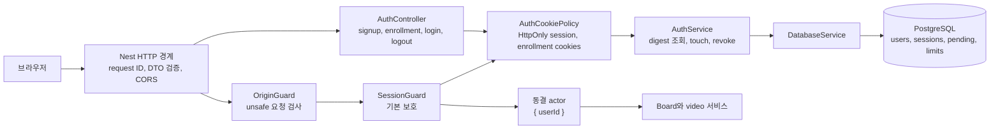
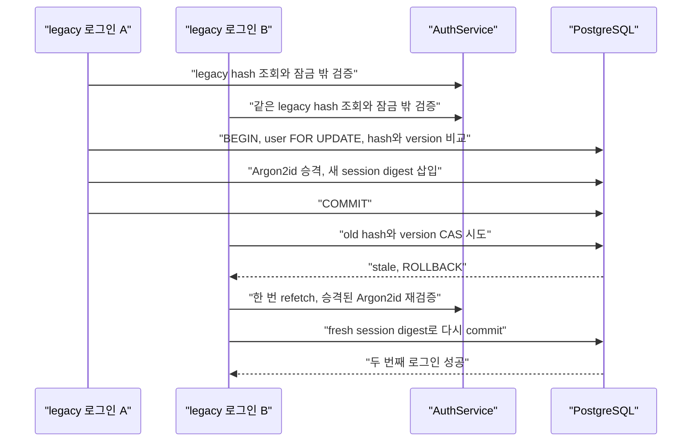

# 인증 경계 근거

기준은 `codex/issue-7-auth 최종 변경`의 검증 시점이다. 이 문서는 현재 코드, 단위 테스트, 정적 검사, benchmark가 직접 보여 주는 사실과 PostgreSQL CI에서 아직 확인해야 할 사실을 구분한다.

## Cookie-only HTTP 아키텍처



컨트롤러만 Express request와 response, 쿠키를 다룬다. Session guard는 exact session cookie를 다이제스트 조회한 뒤 public user와 principal을 동결한다. 보호된 board와 video 서비스에는 session ID, 쿠키, Authorization 헤더가 아니라 `{ userId }` actor만 전달된다.

공개 메타데이터가 붙은 explore와 기본 health 경로 외에는 Session guard가 기본으로 적용된다.

가입, 검증, 등록 완료, 로그인, `/me`, logout, enrollment readiness까지 HttpOnly 쿠키 흐름이 연결됐다. 정적 경계 검사는 production TypeScript 36개에서 Authorization 또는 Bearer 소비자와 `sessions.token` SQL이 없음을 확인한다.

## 로그인 CAS 경쟁



비밀번호 검증과 필요한 Argon2id 해싱은 데이터베이스 잠금 밖에서 실행된다. commit은 검증한 password hash와 version을 사용자 잠금 아래에서 다시 비교한다. 다른 로그인이 먼저 legacy 승격을 끝내면 stale 결과를 받은 요청은 새 자격 증명을 한 번만 다시 읽고 검증하며, 잃어버린 시도의 세션 재료는 재사용하지 않는다. 비밀번호가 달라졌다면 두 번째 검증이 실패해 세션이 생성되지 않는다.

등록 완료 경쟁은 별도의 pending registration 행 잠금과 `users.email_canonical` 유일 제약으로 선형화한다. 같은 canonical email을 가진 두 완료 요청 중 유일 제약을 이긴 요청만 사용자와 첫 세션을 남기며, 패자는 rollback 후 conflict로 정규화된다.

## 주장과 테스트

| 주장 | 직접 근거 | 상태 |
| --- | --- | --- |
| 이메일 증명 전에는 비밀번호를 해싱하거나 사용자를 만들지 않는다 | `auth.service.spec.ts`의 live enrollment 사전 확인, `database.service.spec.ts`의 pending completion 순서 | 단위 테스트 통과 |
| signup부터 enrollment, completion까지 identity는 쿠키와 digest로만 이어진다 | `auth-http.spec.ts`, `auth-cookie.spec.ts`, `auth.service.spec.ts` | 단위 경계 테스트 통과 |
| 로그인과 `/me`, logout은 HttpOnly session cookie만 사용한다 | `auth-http.spec.ts`의 login cookie, `/me`, logout 재사용 거부 | 단위 경계 테스트 통과 |
| Authorization 또는 Bearer 입력은 인증 수단이 아니다 | `auth-http.spec.ts`의 Bearer-only 401, production TypeScript 36개 정적 검사 | 단위와 정적 검사 통과 |
| 원문 session token SQL이 production source에 없다 | auth boundary source scan의 `sessions.token`과 raw token SQL 검사 | 정적 검사 통과 |
| 세션 조회는 revoke, idle, absolute expiry를 검사하고 touch를 absolute expiry로 제한한다 | `auth.service.spec.ts`, `database.service.spec.ts` | 단위 테스트 통과 |
| legacy SHA-256 성공은 Argon2id 승격과 session 삽입을 같은 CAS 트랜잭션에서 수행한다 | `auth.service.spec.ts`의 stale retry, `database.service.spec.ts`의 query order와 CAS predicate | 단위 테스트 통과 |
| 미등록 사용자, disabled 사용자, 잘못된 비밀번호는 generic invalid를 반환한다 | `auth.service.spec.ts`의 dummy Argon2와 validation error 테스트 | 단위 테스트 통과 |
| Origin, DTO whitelist, request ID, sanitized error mapping이 HTTP 경계에 설치된다 | `auth-http.spec.ts`, `origin.guard.spec.ts`, `configureApplication()` | 단위 경계 테스트 통과 |
| Argon2 작업 제한이 192MiB 예산과 overload 거부를 지킨다 | short benchmark median 133.67ms, peak RSS 129.14MiB, overload rejected | benchmark 통과 |
| 전체 API unit과 TypeScript가 함께 성립한다 | 22 suites, 278 tests, TypeScript 검증 | 통과 |
| 실제 PostgreSQL에서 6개 인증 시나리오와 smoke가 동작한다 | E2E 2 suites, 10 tests compile과 collection 완료 | CI pending |

## 검증 요약

`codex/issue-7-auth 최종 변경` 검증 시점의 기록이다.

| 항목 | 결과 |
| --- | --- |
| API 단위 테스트 | 22 suites, 278 tests 통과 |
| TypeScript | 통과 |
| auth boundary scan | production TypeScript 36개 통과 |
| Argon2 short benchmark | median 133.67ms |
| Argon2 memory | peak RSS 129.14MiB / 192MiB |
| overload 정책 | rejected 확인 |
| E2E compile과 collection | 2 suites, 10 tests 완료 |
| 실제 E2E 실행 | 로컬 PostgreSQL 부재로 CI pending |

E2E 코드는 수집과 컴파일까지 확인됐다. 실제 데이터베이스 실행은 pgvector 기반 PostgreSQL 16을 제공하는 CI에서 수행할 예정이다. CI 범위는 6개 인증 시나리오와 health, board smoke다. CI 결과가 생기기 전에는 migration adoption, 실제 행 잠금, HTTP와 데이터베이스를 함께 통과한 결과를 완료로 표시하지 않는다.

## 재실행

```powershell
npm --prefix api test -- --runInBand
npm --prefix api run build
npm --prefix api run test:e2e -- --runInBand
npm --prefix api run db:migrate:test-adoption
```

PostgreSQL 검증에는 테스트 데이터베이스, `DATABASE_URL`, 적용된 인증 마이그레이션이 필요하다.

## 보류 범위

Resend 프로덕션 전송과 재시도 운영, React 클라이언트의 cookie-only 전환, 실제 HTTPS와 reverse proxy 환경의 Secure 쿠키 브라우저 검증은 후속 작업이다. Terraform은 사용하지 않는다.
