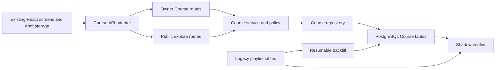
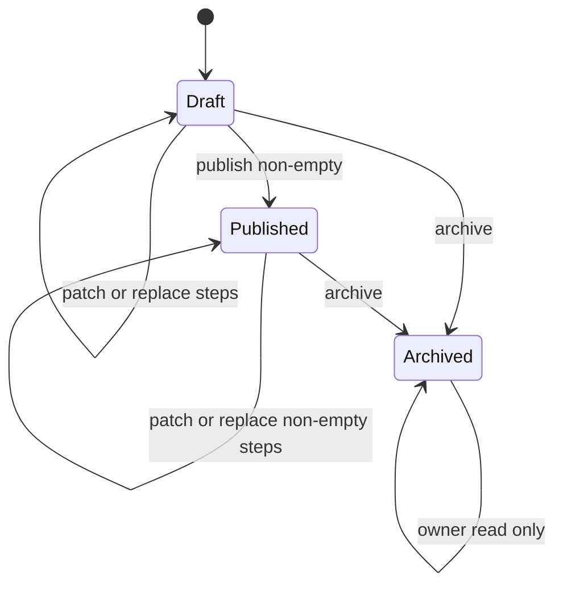
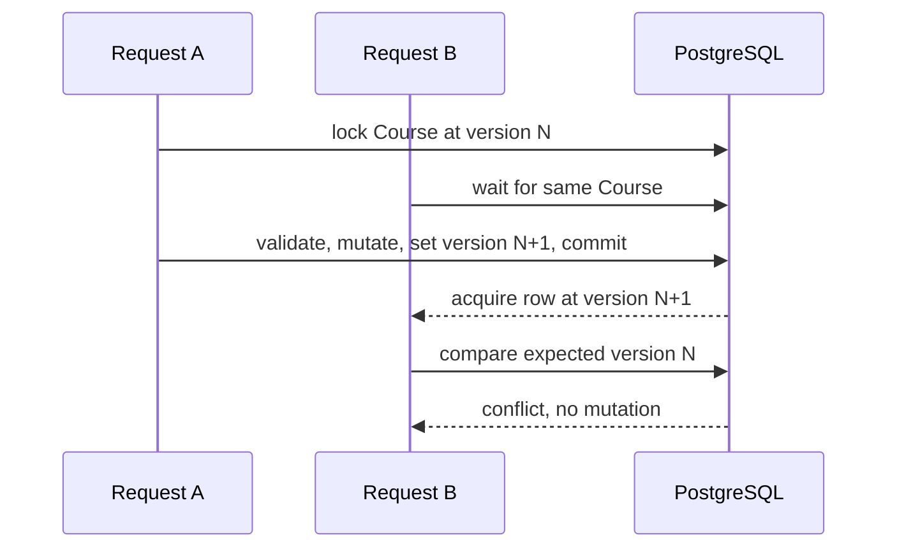
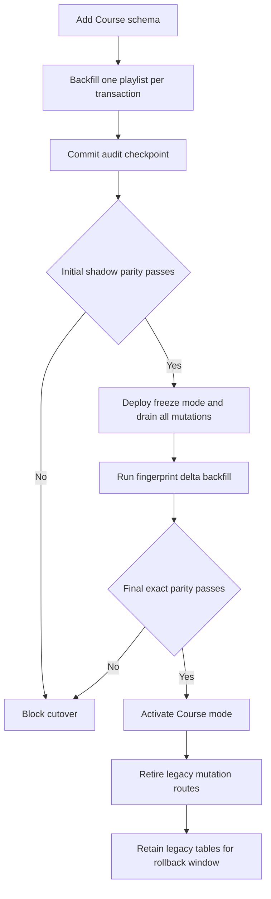

# Concurrency-Safe Course Aggregate Migration - Plan

## Goal Capsule

### Objective

Replace the playlist array contract with a PostgreSQL-backed Course aggregate that preserves legacy data, enforces ordering and lifecycle invariants under concurrency, protects owner-only learning state, and can be released through a resumable expand-backfill-cutover sequence.

### Authority hierarchy

1. GitHub issue #8 owns product behavior and completion criteria.
2. `docs/superpowers/specs/2026-07-29-course-aggregate-design.md` owns the approved design boundary.
3. This plan owns implementation sequencing, file boundaries, and verification evidence.
4. Existing repository conventions govern details not settled above.

### Execution profile

- Backend portfolio evidence is the primary outcome. Infrastructure work is limited to migration, CI, and operational proof that directly supports the backend.
- Each behavior-bearing unit follows test-first or characterization-first execution. A new or corrected test must fail for the intended reason before production behavior changes.
- Work stays on the issue #8 branch and lands through its pull request after CI passes.
- The implementation tail includes code simplification, focused review, GitHub issue evidence, merge, post-merge CI verification, and a Korean Notion development journal.

### Stop conditions

- Stop cutover if shadow verification cannot reconcile legacy IDs, owners, timestamps, steps, feedback, or snapshot completeness.
- Stop release if owner authorization, public projection privacy, or stale-write protection cannot be demonstrated through real HTTP and PostgreSQL tests.
- Treat a contradiction with issue #8 or the approved design as a planning blocker. Ordinary implementation details are resolved from repository patterns without reopening scope.

## Product Contract

### Summary

StudyTube will treat a learning course as one aggregate rather than a playlist row plus a browser-side join. The aggregate keeps ordered snapshots, lifecycle state, versioned owner edits, public projections, feedback, and local learning-state import behind explicit authorization boundaries.

### Problem Frame

The current `playlists` and `playlist_items` design does not express Course invariants. Item positions can all default to zero, deleting a post cascades away the playlist item, a service path ignores the mutation actor, and competing updates are last-write-wins. Retried creates can duplicate data, draft learning state has no server privacy boundary, and there is no observable migration path from legacy rows.

### Actors

- Course owner: creates, reads, edits, publishes, and archives their Course, including owner-only learning state.
- Public learner: reads published Course snapshots without authentication and never receives private learning state.
- Migration operator: runs additive schema migration, resumable backfill, shadow verification, and cutover checks.
- Previous application release: remains a lossless rollback path only until the first native Course write; after that boundary operators freeze and roll forward unless an explicit reverse migration is designed.

### Requirements

#### Aggregate and persistence

- R1: A Course aggregate root stores the preserved numeric ID, owner, title, description, visibility, lifecycle status, optimistic version, and lifecycle timestamps.
- R2: Each CourseStep stores an optional source post reference plus immutable title, video URL, thumbnail URL, and channel snapshots. Deleting the source post must null only the reference and preserve the step.
- R3: Step positions are derived from request order, start at 1, remain contiguous, and are unique inside a Course after every committed transaction.

#### Runtime behavior and access

- R4: Draft Courses are owner-only, published Courses are publicly readable, and archived Courses remain owner-readable but private. Publishing requires at least one step and archive is a soft terminal transition.
- R5: Every private mutation derives the owner from the cookie principal. Missing and non-owned resources return the same not-found contract.
- R6: Metadata changes, step replacement, publish, and archive require `expectedVersion`. Exactly one request may win from a given version and a loser receives a conflict without overwriting the winner.
- R7: Native Course creation requires an owner-scoped idempotency key. Same-key retries with the same canonical payload converge on one Course, while same-key reuse with a different payload is a conflict. Backfilled Courses have no synthetic key and store both idempotency digests as null.
- R8: Owner and public lists use opaque cursor pagination with a stable timestamp and ID tie-breaker. Malformed cursors are rejected.
- R9: New feedback is append-only for published Courses, remains associated with the preserved Course ID, and does not increment the owner-edit version. Its lifecycle check is serialized with archive so it either commits before archive or is rejected after archive. A principal may append at most five feedback rows per Course in a rolling ten-minute window, with stable 429 and `Retry-After` on excess. Historical legacy feedback remains preserved on private backfilled drafts. Public feedback exposes only ID, rating, body, creation time, and author display name, never author ID, email, or private profile data.

#### Migration and cutover

- R10: The expand migration is additive. It creates Course structures and validation without dropping or rewriting legacy playlist tables.
- R11: Backfill preserves playlist ID, owner, creation time, step snapshots, and every feedback field. Legacy rows default to private drafts. The backfill records ordering plus canonical source and target fingerprints per playlist, resumes safely after interruption, and transactionally refreshes a previously completed Course when legacy data changed before write freeze.
- R12: Shadow verification exactly compares old and new root fields, IDs, total and owner counts, ordered step snapshots, every feedback field, missing references, and snapshot completeness. Any mismatch or stale audit blocks cutover.
- R15: Cutover has three explicit modes: legacy permits only legacy mutations, freeze rejects both legacy and native Course mutations while transactions drain and final verification runs, and course permits Course mutations while legacy mutation routes are retired. Once a playlist has a backfill audit, legacy deletion of one of its source posts is rejected until Course mode can preserve the snapshot reference correctly. The previous release is a lossless rollback only before the first native Course write; afterward recovery defaults to freeze and roll-forward unless an explicit reverse migration is performed.

#### Browser, errors, and release evidence

- R13: A local draft import preserves browser order and validated learning state for only the active user. Its immutable envelope includes user scope, draft ID, revision, idempotency key, payload, and any returned server draft ID and version. Local data remains after failure and is cleared or marked imported only when the full acknowledgement matches that envelope.
- R14: Validation, not-found, conflict, and unexpected database failures map to stable HTTP behavior without leaking raw PostgreSQL errors.
- R16: Repository documentation and CI provide reproducible migration, race, rollback, and smoke-test evidence suitable for a backend portfolio review.

### Key Flows

- F1, create or import: an authenticated owner submits title, description, ordered steps, and an idempotency key; the server atomically returns one private draft with version 1.
- F2, edit: an owner submits a mutation with the representation's current version; the server validates ownership and state, commits the full invariant-preserving change, and returns the next version.
- F3, publish and discover: an owner publishes a non-empty draft; anonymous readers can then page and read its public snapshot projection while owner learning state stays hidden.
- F4, archive: an owner archives a draft or published Course; owner reads retain history while public reads return not found.
- F5, migrate and cut over: an operator expands the schema, runs initial backfill, enters freeze mode, drains all in-flight mutation transactions, runs the final delta and parity gate, activates Course traffic, retires legacy mutation routes, and retains old tables for rollback.

### Acceptance Examples

- AE1: Given two metadata patches with `expectedVersion = 3`, when both race, one returns the representation at version 4 and the other returns 409; the stored title is the winner's value.
- AE2: Given two full step replacements from one version, when both race, one ordered array commits and positions are exactly `1..N`; the other returns 409 rather than a raw unique-violation response.
- AE3: Given a draft one-step Course, when step removal races with a publish transition from the same version, no commit can leave a published Course empty.
- AE4: Given a CourseStep linked to a post, when that post is deleted concurrently with a Course read, the eventual Course still contains the same ordered snapshot and has a null source reference.
- AE5: Given concurrent creates from one owner with one key and one payload, all successful responses identify the same Course and the database contains one root and one step set.
- AE6: Given an interrupted backfill after some audit rows commit, when it runs again, completed Course IDs, counts, feedback, timestamps, and ordering do not change.
- AE7: Given learning drafts for users A and B in one browser, when A imports, only A's scoped draft and learning state reach A's Course; B's data stays local and absent from public projections.
- AE8: Given a completed initial backfill followed by a legacy title, item, or feedback write, when the delta pass runs under write freeze, the changed source fingerprint causes that Course to refresh and final shadow verification agrees without dual-write.
- AE9: Given a step whose source post is already deleted, when the owner reorders by that Course-owned step ID, the immutable snapshot and learning state remain and positions commit as `1..N`; a foreign or duplicate step ID is rejected without a version change.
- AE10: Given archive and feedback requests racing on a published Course, feedback either commits before archive or observes archived state and fails; no orphan feedback, 500 response, or feedback-driven version increment occurs.

### Success Criteria

- All nine completion checkboxes in GitHub issue #8 have direct automated or operational evidence.
- PostgreSQL integration tests repeatedly prove stale-write, reorder, publish-versus-step, post-deletion, idempotency, and resume behavior.
- A clean legacy fixture can be migrated, backfilled, shadow-verified, and read through Course HTTP endpoints in CI.
- Existing non-Course API, auth, web lint, and build gates remain green.

### Scope Boundaries

Included:

- Course schema, service, repository, HTTP endpoints, legacy backfill, shadow verifier, cutover adapter, local draft import, tests, CI, and operational documentation.
- Minimal browser API and component changes required to consume Course endpoints without rewriting the entire visual experience.

Excluded:

- Terraform, Kubernetes, cloud database provisioning, or deployment-platform redesign.
- Background jobs, outbox infrastructure, hybrid search, progress aggregation, quizzes, recommendations, or AI-authored Course editing.
- Destructive removal of legacy playlist tables.
- Full account onboarding redesign or unrelated browser styling.

### Dependencies

- Issue #7 cookie principal and authentication boundary are already merged into main.
- PostgreSQL 16 is available in CI and through the repository Docker Compose setup.
- Node 24.8 or newer is the supported API runtime.
- The current browser draft and watch queue modules remain the source for user-scoped learning state.

### Sources

- GitHub issue #8: <https://github.com/NearthYou/studytube/issues/8>
- Course design: `docs/superpowers/specs/2026-07-29-course-aggregate-design.md`
- Legacy schema: `api/migrations/1753660800000_baseline-schema.cjs`
- Existing repository implementation: `api/src/database.service.ts`, `api/src/study-board.service.ts`, `api/src/study-board.controller.ts`
- Browser draft sources: `web/src/playlistDrafts.ts`, `web/src/localStudyStorage.ts`, `web/src/watchQueue.ts`, `web/src/watchQueueStorage.ts`
- PostgreSQL constraints: <https://www.postgresql.org/docs/current/ddl-constraints.html>
- PostgreSQL explicit locking: <https://www.postgresql.org/docs/current/explicit-locking.html>
- PostgreSQL transaction isolation: <https://www.postgresql.org/docs/current/transaction-iso.html>
- PostgreSQL `INSERT ... ON CONFLICT`: <https://www.postgresql.org/docs/current/sql-insert.html>
- node-pg-migrate migration behavior: <https://salsita.github.io/node-pg-migrate/migrations/>

## Planning Contract

### Assumptions Resolved During Planning

- The user explicitly selected a backend-developer portfolio focus, with infrastructure as supporting evidence and Terraform excluded.
- The approved issue and design are sufficiently specific to proceed without another scope confirmation.
- The Course public surface uses `/explore/courses` while owner-only reads use `/courses`; this avoids optional-auth ambiguity and matches the established public-route convention.
- Owner list ordering uses immutable `created_at DESC, id DESC`. Public list ordering uses immutable first-publish time `published_at DESC, id DESC`.
- Archived Courses are not restored in this issue.
- The legacy `/playlists` route is authenticated and owner-scoped, so migrating legacy rows as private drafts preserves the actual access boundary rather than withdrawing an established public catalog.
- New Course writes are not reverse-copied into legacy playlists. After production Course writes begin, rollback requires a maintenance decision or a roll-forward fix.

### Key Technical Decisions

- KTD1: Add an isolated `CourseModule` and `CourseRepository` boundary without registering a second database provider. `AuthModule` remains the sole owner and exporter of the singleton `DatabaseService`; `CourseModule` imports it. `DatabaseService` constructs and caches one PostgreSQL Course repository from its private pool, while Course service depends only on a repository injection token and port. The PostgreSQL adapter never imports `DatabaseService` back. This prevents a circular module, duplicate pools, and further growth of the board repository surface.
- KTD2: Enforce local row properties with ordinary constraints and cross-row Course invariants with a deferrable unique constraint plus deferred triggers on both Course status changes and step insert, update, and delete paths. Child moves schedule checks for old and new roots, while root cascade deletion is ignored after the parent disappears. Application validation supplies readable early errors, while PostgreSQL remains the final authority for alternate writers and race conditions.
- KTD3: Keep optimistic versioning as the client contract and use short Course-row locks inside compound transactions. Compare-and-set handles single-row metadata changes; lock, validate, replace, increment handles steps and state transitions without exposing lock management to clients.
- KTD4: Use a non-deferrable unique key on owner plus a SHA-256 idempotency-key digest, with a canonical payload hash stored beside it. The digests are either both null for legacy rows or both valid 32-byte values for native creates. PostgreSQL `ON CONFLICT` is the concurrency arbiter; plaintext keys are never stored and backfill does not invent collision-prone keys.
- KTD5: Separate owner and public routes, repository queries, and projection types. Each detail read uses one SQL statement or one repeatable database snapshot so root version, steps, and feedback cannot tear across concurrent mutations. Public SQL does not select owner learning state at all, removing optional-auth branches and preventing privacy from depending on serializer omission.
- KTD6: Treat display snapshots as Course-owned immutable history and the post foreign key as optional. Storage duplication is accepted so source deletion cannot destroy the learning route.
- KTD7: Use additive schema migration, per-playlist transactional backfill, source-and-target fingerprinted audit checkpoints, and a separate exact shadow verifier. A completed playlist is skipped only while both fingerprints match. The mutating backfill refuses to run in Course mode so it cannot overwrite native edits. Cutover freezes all mutations, drains transactions, runs a delta pass, rechecks every audit and sequence, and requires final parity before native writers activate. One-shot transformation and dual-write were rejected because the former cannot resume and the latter creates two authorities with partial-failure risk.
- KTD8: Normalize request arrays into positions rather than accepting client position integers. Existing entries use Course-owned step IDs so a deleted source reference can still be reordered without accepting client-overwritten snapshots; new entries use a source post or complete local snapshot. A Course mutation replaces the full ordered set so contiguity is simple to validate and no partial reorder state can escape a transaction.
- KTD9: Store validated owner learning state as JSONB on the step, but expose it only in owner projections. This preserves current browser marks and playback settings without prematurely designing a progress-tracking aggregate.
- KTD10: Move browser reads and writes to Course projections before closing legacy mutation routes, then retire those mutations in the cutover deployment. Any temporary playlist-shaped compatibility lives only in the web adapter and is built from Course snapshots, version, status, and step IDs. The server never maps Course data back to lossy `postIds`, and it never dual-writes.
- KTD11: Feedback uses its own append transaction and does not advance Course edit version. An indexed persisted-timestamp query enforces the per-principal and per-Course rolling limit across application instances before the transaction locks the Course root. The root lock then checks published state so archive and feedback have a deterministic serialized outcome without false optimistic-edit conflicts.
- KTD12: Use immutable route-specific cursor keys plus ID and a versioned opaque encoding. Mutable `updated_at` was rejected because edits could move rows between pages and create duplicates or skips.
- KTD13: Use concrete validated DTO classes at the HTTP boundary and typed repository outcomes below it. Inline TypeScript body annotations do not activate runtime whitelist validation, and PostgreSQL adapters must not throw HTTP exceptions. A Course error mapper converts validation, ownership, lifecycle, stale version, and known constraint outcomes into 400, 404, or 409.
- KTD14: Represent rollout authority with one fail-closed Course cutover mode instead of two independent booleans. Production requires an explicit `legacy`, `freeze`, or `course` value; tests and local development can select the intended mode directly. Every mutation also acquires one shared PostgreSQL advisory transaction lock. Freeze rejects new admissions and acquires the exclusive lock before verification, draining both legacy and Course mutations across app instances.
- KTD15: Separate disposable schema down from operational rollback. Down may remove Course structures only when Course and audit tables are empty; migrated or native data makes it fail without deletion. Operational rollback leaves additive schema in place, and after native Course writes begin the default recovery is freeze plus roll-forward.

### High-Level Technical Design

This sketch defines boundaries and data flow, not exact class signatures.

### Sequencing

1. Establish additive schema and database-owned invariants before any Course writer exists.
2. Build resumable backfill and verification against that schema before HTTP cutover.
3. Add the Course module, policy, projections, and repository seam.
4. Add create and read contracts, then versioned compound mutations and lifecycle behavior.
5. Switch every browser read and write through the Course adapter while legacy mutation routes still exist.
6. Freeze legacy writes operationally, run the fingerprint delta pass and final shadow verification, deploy Course traffic, then retire the legacy mutation routes.
7. Run full verification, document rollout and rollback, review the diff, and land through the issue pull request.

### System-Wide Impact

| Surface | Change | Failure handling |
| --- | --- | --- |
| Database lifecycle | New Course tables, constraints, triggers, indexes, and audits | Additive migration remains rollback-safe for the previous app |
| Persistent data | Legacy rows copied with stable IDs and snapshots | Per-playlist transaction plus checkpoint prevents partial completion |
| Authentication | Owner routes rely on cookie principal; public routes are explicit | Non-owner and missing resources converge on 404 |
| HTTP contract | Course endpoints add cursor, idempotency, and version semantics | Domain errors translate to 400, 404, or 409 |
| Browser storage | Active user's draft can be imported to a server Course | Local state survives timeouts and errors |
| Existing UI | API adapter maps Course projections into the existing learning view where practical | Build and browser-focused tests catch compatibility regressions |
| Operations | Backfill, shadow verification, cutover, and rollback become scripted and documented | Any mismatch blocks release before legacy writes close |
| Writer authority | One cutover mode selects legacy, frozen, or Course mutation authority | Missing or invalid production mode fails closed |
| CI | PostgreSQL-backed migration and race suites join existing lint, unit, E2E, and build gates | Red Course gate prevents merge |

### Risks and Mitigations

- Risk: a deferred trigger is correct in production but untested through the actual migration runner. Mitigation: migrate a fresh PostgreSQL database in E2E, then attempt gap, duplicate, and empty-published commits through real transactions.
- Risk: a backfill retry duplicates feedback or changes sequence state. Mitigation: preserve primary keys where available, use one Course transaction per legacy ID, record completion atomically, and rerun the same fixture after forced interruption.
- Risk: legacy data changes after an initial backfill and is silently lost at cutover. Mitigation: store a canonical source fingerprint, refresh mismatched audited Courses, freeze legacy writes, and require one final delta pass plus shadow verification before enabling Course traffic.
- Risk: count-based parity passes while text, snapshots, or feedback content is corrupt. Mitigation: store source and target digests and exact-compare root fields, ordered snapshot fields, and every feedback field.
- Risk: a detail read combines an old root with new children during reorder. Mitigation: build the aggregate in one SQL statement or one repeatable snapshot and race that read against mutation in E2E.
- Risk: a legacy post delete cascades away a playlist item after its snapshot was audited. Mitigation: reject deletion for posts referenced by audited playlists until Course mode owns deletion and preserves steps with `ON DELETE SET NULL`.
- Risk: an operator reruns backfill after native owner edits. Mitigation: the mutating script checks cutover authority before opening a transaction and refuses in Course mode.
- Risk: concurrent idempotent create returns before child steps are visible. Mitigation: create root and children in one transaction and resolve the conflict winner only after the competing transaction commits.
- Risk: a Course patch and full reorder use inconsistent lock ordering. Mitigation: every compound owner mutation locks the Course root first and never acquires roots in a second order.
- Risk: owner learning state leaks through shared serialization. Mitigation: use separate owner and public projection builders with negative tests that inspect every nested step field.
- Risk: switching off legacy writes breaks the current large React screen. Mitigation: preserve its view model behind a focused API adapter and change components only where expected version or lifecycle actions are required.
- Risk: rollback after accepting new Course writes loses those writes in the old application. Mitigation: document the irreversible traffic boundary and prefer roll-forward after cutover.
- Risk: the implementation expands into infrastructure or UI redesign. Mitigation: keep Terraform, hosting, visual redesign, and unrelated auth onboarding outside R1-R16.

## Implementation Units

### U1. Add the Course schema and transaction-time invariants

Goal:

Create the additive PostgreSQL structures that make Course identity, lifecycle, ordering, snapshot retention, and idempotency enforceable before application writers are introduced.

Requirements: R1, R2, R3, R4, R7, R9, R10, R14

Dependencies: none

Files:

- `api/migrations/1753660803000_course-aggregate.cjs`
- `api/src/migration-files.spec.ts`
- `api/scripts/verify-migration-adoption.ts`
- `api/test/course-schema.e2e-spec.ts`
- `api/test/jest-e2e.json`

Approach:

- Add `courses`, `course_steps`, `course_feedback`, and `course_backfill_audits` with explicit lifecycle checks, foreign-key behavior, timestamps, version bounds, and owner-scoped idempotency uniqueness.
- Index Course feedback by Course, author, and creation time so the rolling abuse bound is enforced through persisted multi-instance state.
- Constrain idempotency key and payload digests to be either a paired null for backfill or paired 32-byte values for native creates.
- Use a deferrable `(course_id, position)` constraint and a deferred trigger that validates contiguity and the non-empty published invariant at transaction commit.
- Keep legacy tables and their data untouched. Down migration removes newly added structures only on an empty disposable database and refuses once a Course or audit row exists.
- Extend the existing migration-adoption verifier through the fourth migration while proving prior legacy fingerprints and sequence state remain intact.
- Advance Course-related sequences safely after explicit-ID backfill without moving a sequence backward.

Test scenarios:

- A fresh baseline plus Course migration succeeds and can roll down without altering legacy tables.
- A valid draft with positions 1 through N commits.
- Duplicate or gapped positions fail at commit even if individual statements temporarily pass.
- An empty published Course and an invalid status-visibility pair fail at commit.
- A row with one null digest, an invalid digest length, or a native create missing either digest fails its named constraint; a paired-null legacy row succeeds.
- Root-only publish, last-step delete, child position move, and child movement between Courses all schedule the correct deferred root checks; Course cascade delete does not fail on a missing parent.
- Deleting a source post sets the reference to null while snapshot columns and step order remain.
- Down succeeds on an empty disposable schema and refuses without deleting data after a backfill row exists.

Verification:

- Migration file discovery and static safety tests identify the new additive migration.
- PostgreSQL E2E observes the expected constraint names and transaction failures, not generic application validation alone.

Execution note: Write the migration E2E expectations first and record their missing-schema failure before adding the migration.

### U2. Implement resumable backfill and shadow verification

Goal:

Copy legacy playlists into Course aggregates with preserved identity and an auditable, restart-safe ordering decision, then prove old and new representations agree before cutover.

Requirements: R2, R3, R9, R10, R11, R12, R16

Dependencies: U1

Files:

- `api/scripts/backfill-courses.ts`
- `api/scripts/verify-course-backfill.ts`
- `api/scripts/course-migration.shared.ts`
- `api/test/course-migration.e2e-spec.ts`
- `api/package.json`
- `.github/workflows/ci-cd.yml`

Approach:

- Acquire one process-wide PostgreSQL advisory lock, inspect every legacy playlist audit fingerprint, and migrate each missing or mismatched playlist in its own transaction.
- Preserve Course IDs, owners, creation timestamps, feedback, and step snapshots. Use positive unique legacy position then post ID when trustworthy; otherwise use post ID and record the fallback strategy.
- Write the audit row plus canonical source and target fingerprints in the same transaction after all Course children succeed. Skip only matching fingerprints, rebuild changed audited Courses transactionally before writer activation, and support a deterministic test-only interruption seam without embedding production failure behavior.
- Build a read-only verifier that exact-compares root values, IDs, totals, owner grouping, ordered snapshots, every feedback field, source-reference orphans, and required snapshots. Return nonzero on any mismatch.
- Place Course and feedback sequences beyond legacy maxima before native writers can run, then recheck without moving either sequence backward during the final freeze.
- Refuse before opening a migration transaction when cutover authority is already `course`.

Test scenarios:

- Trustworthy legacy positions normalize to contiguous `1..N` while preserving relative order and record the position strategy.
- Zero, duplicate, or missing legacy positions fall back to post ID order and record the fallback strategy.
- Every legacy playlist becomes version 1, draft, and private; anonymous reads return 404 while the owner sees preserved historical feedback with unchanged ID, author, rating, body, and timestamp.
- A forced stop after N completed playlists leaves only those audit rows; rerun completes the remainder without changing completed rows or duplicating feedback.
- A legacy title, item, or feedback write after initial completion changes the fingerprint; a delta run refreshes only that Course, and a final run under write freeze is a no-op.
- Explicit IDs advance sequences only when needed, and a later insert receives a free ID.
- Deliberate owner, count, order, feedback, or snapshot corruption makes the shadow verifier fail with a targeted diagnostic.
- Same-count corruption of a root title, snapshot URL, feedback author, rating, body, or timestamp changes the target digest and fails exact verification.
- Sequence values behind, equal to, or ahead of the legacy maximum are advanced only when needed; a native insert after activation receives a collision-free ID.
- Invoking mutating backfill in Course mode fails without changing a native owner edit or its target fingerprint.

Verification:

- A seeded legacy fixture passes backfill and shadow verification twice with identical Course output.
- CI runs the real scripts against PostgreSQL rather than mocks.

Execution note: Create the interrupted-resume and mismatch tests first. Observe that no backfill entry point exists before implementing the scripts.

### U3. Establish the Course domain, repository seam, and projection policy

Goal:

Create a focused Course module whose validation, authorization-independent domain rules, cursor encoding, and public-versus-owner projections can be tested without extending the existing board service monolith.

Requirements: R1, R2, R3, R4, R5, R8, R13, R14

Dependencies: U1

Files:

- `api/src/course/course.module.ts`
- `api/src/course/course.controller.ts`
- `api/src/course/course.service.ts`
- `api/src/course/course.repository.ts`
- `api/src/course/postgres-course.repository.ts`
- `api/src/course/course.types.ts`
- `api/src/course/course.policy.ts`
- `api/src/course/course.errors.ts`
- `api/src/course/course-error.mapper.ts`
- `api/src/course/dto/*.ts`
- `api/src/course/course.policy.spec.ts`
- `api/src/course/course.dto.spec.ts`
- `api/src/course/course.service.spec.ts`
- `api/src/database.service.ts`
- `api/src/app.module.ts`

Approach:

- Define request, aggregate, owner projection, public projection, and repository types inside the Course domain.
- Keep `DatabaseService` registered only by `AuthModule`. Construct and cache one PostgreSQL repository from its existing private pool, expose that instance through a Course repository injection token, and avoid making the raw pool a general application dependency or importing `DatabaseService` back into the adapter.
- Centralize text, snapshot, learning-state, version, lifecycle, and cursor validation in Course policy helpers.
- Define class-validator DTOs for every body, header-derived input, and cursor query so the global whitelist rejects unknown or malformed transport fields before domain execution.
- Build separate projection functions so public serialization cannot accidentally inherit owner-only JSON fields.
- Translate known PostgreSQL constraint outcomes into typed persistence or domain failures at the repository boundary, then map those outcomes to HTTP only at the controller boundary.

Test scenarios:

- Blank titles, invalid snapshots, duplicate source entries where disallowed, malformed learning-state fields, invalid versions, and malformed cursors are rejected with stable errors.
- Owner projections contain validated learning state while public projections contain only snapshots and public metadata.
- Cursor round trips preserve timestamp and ID, reject wrong version or route kind, and do not accept trailing garbage.
- DTO tests reject unknown properties, non-integer versions, oversized text, malformed nested steps, and invalid learning-state shapes through the same validation configuration used by the application.
- Repository error translation recognizes known constraint and serialization outcomes while leaving unexpected failures for the existing sanitized 500 boundary.
- Starting and closing the full Nest application creates and destroys the database pool once even when both AuthModule and CourseModule consume it.

Verification:

- Course unit tests run without PostgreSQL for policy and projection behavior.
- Nest application compilation resolves Course providers through the module boundary without exposing the pool to controllers.

Execution note: Start with policy and projection tests. Keep SQL methods out until those contracts fail for the expected missing behavior.

### U4. Add idempotent create and owner/public read APIs

Goal:

Deliver the first complete HTTP slice: one idempotent private draft creation path and privacy-safe owner and public reads with stable cursor pagination.

Requirements: R1, R2, R4, R5, R7, R8, R13, R14

Dependencies: U2, U3

Files:

- `api/src/course/course.controller.ts`
- `api/src/course/course.service.ts`
- `api/src/course/postgres-course.repository.ts`
- `api/src/course/course-http.spec.ts`
- `api/test/course-http.e2e-spec.ts`

Approach:

- Require `Idempotency-Key`, hash it and a canonicalized payload, and atomically create the Course root and optional ordered steps.
- For referenced posts, load authoritative snapshot values in the transaction. For unreferenced local videos, require complete validated snapshot input.
- Add owner list/detail under `/courses` and anonymous published list/detail under `/explore/courses`.
- Apply immutable route-specific ordering and opaque next cursors. Owner queries include all lifecycle states; public queries include published rows only.
- Assemble each detail from one SQL statement or one repeatable database snapshot. Use a dedicated public select list and public result type that never hydrate `owner_learning_state`.

Test scenarios:

- Concurrent same-owner, same-key, same-payload creates return one Course ID and one child set.
- Same key with a different canonical payload returns 409 and leaves the original unchanged; the same key used by another owner creates an independent Course.
- Missing idempotency key, missing local snapshot fields, and an invalid cursor return 400.
- A second authenticated user receives no owner-list row and 404 owner detail for another owner's draft, published, and archived Courses; an anonymous caller cannot enter owner routes.
- Anonymous reads see published snapshot fields only; draft and archived IDs return 404 and no owner learning state appears anywhere in public JSON.
- Public feedback exposes only ID, rating, body, creation time, and author display name; raw public repository results contain no author ID, email, or private profile data.
- Cursor traversal over equal timestamps returns each Course exactly once in deterministic order.
- A detail read racing with reorder yields either the old version with old order or the new version with new order, never a hybrid aggregate.
- Recursive inspection of the raw public repository result finds no owner-learning-state key before controller serialization.

Verification:

- Supertest exercises the real guard, controller, service, repository, and PostgreSQL chain.
- A direct database count proves idempotent requests do not leave orphan roots or duplicate steps.

Execution note: Add concurrent-create and public-projection E2E failures before repository or controller implementation.

### U5. Add versioned edits, reordering, and lifecycle race safety

Goal:

Make every owner edit atomic and conflict-aware, including the races that currently permit last-write-wins or empty published Courses.

Requirements: R3, R4, R5, R6, R14

Dependencies: U4

Files:

- `api/src/course/course.controller.ts`
- `api/src/course/course.service.ts`
- `api/src/course/postgres-course.repository.ts`
- `api/src/course/course.service.spec.ts`
- `api/test/course-concurrency.e2e-spec.ts`
- `api/test/course-http.e2e-spec.ts`

Approach:

- Use compare-and-set for metadata-only patches and Course-row lock first for full step replacement, publish, and archive.
- Recheck owner, expected version, lifecycle, and ownership of every existing step ID after acquiring the lock. Increment the root version exactly once per successful owner mutation.
- Replace steps as one ordered set and let deferred database validation protect final contiguity.
- Translate stale versions and invalid transitions into stable 409 responses; preserve 404 for non-owner mutation attempts.

Test scenarios:

- Two title patches from one version yield one success and one 409, with exactly one version increment.
- Two different reorder requests from one version yield one committed order, contiguous positions, one 409, and no 500.
- Publishing an empty draft returns 409 and does not change status or version.
- Publish and last-step removal from one version cannot produce an empty published Course regardless of which request wins.
- A non-owner PATCH, step replacement, publish, and archive each return the same 404 shape as a missing ID.
- Archived Course mutations return 409 and never restore public visibility.
- A null-source existing step can be reordered by its Course-owned step ID with snapshots and learning state preserved; foreign or duplicate step IDs return 400 without changing version.

Verification:

- PostgreSQL race tests use separate clients and a synchronization barrier so overlap is proven rather than assumed.
- Repeated execution preserves the one-winner invariant and leaves no transaction open after failures.

Execution note: Write each race as a failing PostgreSQL E2E test before its production mutation path. Do not substitute sequential requests for concurrency proof.

### U6. Preserve feedback and snapshots under lifecycle races

Goal:

Complete Course feedback and snapshot behavior, including the lifecycle and deletion races that must be safe before browser or route cutover.

Requirements: R2, R4, R5, R9, R12, R14

Dependencies: U2, U4, U5

Files:

- `api/src/course/course.controller.ts`
- `api/src/course/course.service.ts`
- `api/src/course/postgres-course.repository.ts`
- `api/test/course-http.e2e-spec.ts`
- `api/test/course-concurrency.e2e-spec.ts`

Approach:

- Add published-Course feedback with independent transactions and preserved author attribution. Lock the Course root for the lifecycle check so archive and feedback cannot cross a stale published check.
- Before taking the Course root lock, query the indexed persisted feedback window for the authenticated principal and reject a sixth write inside ten minutes with 429 and `Retry-After`.
- Prove source post deletion retains snapshots and ordering under read overlap.
- Replace the existing test that permits outsider playlist mutation with the Course 404 authorization contract.

Test scenarios:

- Authenticated feedback on a published Course succeeds without changing Course version; draft, archived, or missing Course feedback is rejected.
- Five feedback writes inside ten minutes succeed; the sixth returns 429 without invoking the root-locking append path, and the next write after the window succeeds.
- Feedback and archive racing end with either preserved feedback committed before archive or feedback rejected after archive, never an orphan or 500.
- Post deletion sets `sourcePostId` to null while title, URLs, channel, position, and owner learning state remain readable.
- A Course read racing with post deletion returns either the pre-delete reference or null, but always returns the full snapshot and order.

Verification:

- A database comparison proves Course feedback and snapshot rows survive the relevant lifecycle events.

Execution note: Write the archive-feedback and post-delete-read barriers before changing the repository paths, then observe the unprotected race behavior.

### U7. Connect user-scoped browser drafts to the Course API

Goal:

Move the existing publish and read flows onto Course semantics while preserving draft order, learning state, cookie transport, and retry safety with minimal UI churn.

Requirements: R5, R7, R8, R13, R15

Dependencies: U4, U5, U6

Files:

- `web/src/courseApi.ts`
- `web/src/courseDraftImport.ts`
- `web/src/api.ts`
- `web/src/authSession.ts`
- `web/src/types.ts`
- `web/src/App.tsx`
- `web/src/playlistDrafts.ts`
- `web/src/watchQueue.ts`
- `web/tests/courseDraftImport.test.ts`
- `web/tests/api.test.ts`
- `web/tests/authSession.test.ts`
- `web/tests/playlistDrafts.test.ts`
- `web/tests/watchQueueStorage.test.ts`

Approach:

- Convert the shared browser transport to cookie credentials, remove bearer-token assumptions from the Session model, and cover existing protected API calls as well as Course calls. Login and session restore consume the backend's `{ user }` response instead of expecting a token field.
- Add a Course client that carries expected versions, sends idempotency keys, and maps stable HTTP errors.
- Convert the active user's local draft videos in displayed order into complete Course step inputs. Copy only validated marks, loop, playback rate, captions, and notes into owner learning state.
- Derive a deterministic owner-scoped idempotency key from the local draft revision and persist user scope, draft ID, revision, key, and canonical payload as an immutable pending-import envelope before dispatch. Treat an already-created or already-published response as a successful retry; later draft edits create a new revision rather than changing an in-flight envelope.
- If create succeeds but publish fails, persist the returned Course ID and version as a saved-private state and retry only publish. Complete or clear only the exact matching user-scope, draft-ID, and revision envelope.
- Keep compatibility inside the web layer. Build replay view data from Course snapshots so null-source local steps remain usable, while edit state retains Course ID, version, status, and every step ID required for reorder. Do not collapse server projections back to `postIds`.
- Drain all cursor pages atomically in the temporary array adapter used by the current screens, with duplicate-cursor protection. Retain the prior list during refresh, replace it only when every page succeeds, and expose a retry state for initial or mid-drain failure. This preserves current client-side filtering without weakening the server cursor contract; a later UI pagination redesign is outside this issue.
- Update mutation call sites to carry Course version and archive instead of physical delete.
- Mark or remove the local draft only after create and any required publish transition are acknowledged. Preserve it unchanged on network, validation, or conflict failure.
- On protected-request 401, clear active authenticated UI state but preserve that user's scoped drafts and envelopes, route to login, and resume an import only when the restored cookie principal has the same user ID.

Test scenarios:

- Draft video order becomes Course step order without sorting or deduplication side effects.
- Valid learning state is included for the active user; malformed fields are dropped or rejected according to policy and another user's scoped draft is never read.
- Two retries for one local draft use the same idempotency key and converge on one server Course.
- A timeout after request dispatch leaves local data intact; a confirmed server response marks only the imported draft complete.
- A response lost after server commit retries the same immutable envelope and receives the same Course; reusing its key for an edited payload returns 409 and preserves the local draft.
- Create success followed by publish failure records one saved private Course and retries only publish; it neither creates again nor clears the local revision.
- A late response after draft editing or account switching can complete only its original user-scope, draft-ID, and revision envelope.
- Owner requests include cookie credentials and public discovery requests do not attach an Authorization header.
- Login, session restore, posts, profile, and Course calls all work without a browser-stored bearer token.
- A two-page Course fixture is drained without omission or duplication, and a repeated cursor is rejected instead of looping forever.
- Failure on the second cursor page preserves the prior complete list and exposes retry instead of publishing a partial replacement.
- A 401 preserves scoped drafts, clears active session state, and resumes a pending import only after the same user signs in again.
- A Course containing a null-source snapshot remains playable, while reorder keeps its step ID and expected version.
- Existing playlist-management, explore, and watch-queue tests continue to pass through the adapter.

Verification:

- Node tests exercise conversion and failure behavior without a browser.
- Web lint and production build prove the existing React screen compiles against Course projections.

Execution note: Add focused conversion and failed-import tests before changing the publish handler or API calls.

### U9. Freeze writes, verify final parity, and retire legacy mutation routes

Goal:

Perform the authority cutover only after the browser uses Course contracts and the final frozen legacy state exactly matches Course data.

Requirements: R11, R12, R15, R16

Dependencies: U2, U6, U7

Files:

- `api/src/course/course-cutover.policy.ts`
- `api/src/course/course-cutover.policy.spec.ts`
- `api/src/course/course.controller.ts`
- `api/src/study-board.controller.ts`
- `api/src/study-board.service.ts`
- `api/src/study-board.types.ts`
- `api/src/study-board.service.spec.ts`
- `api/test/course-cutover.e2e-spec.ts`
- `api/.env.example`
- `api/src/deploy-script.spec.ts`
- `scripts/deploy-ec2.sh`
- `docs/database-migrations.md`

Approach:

- Add one fail-closed cutover mode with `legacy`, `freeze`, and `course` states. Production startup requires an explicit valid value.
- Make every legacy and Course mutation take the same shared PostgreSQL advisory transaction lock. In legacy mode, legacy mutations remain available and native Course mutations are rejected. In freeze mode, new admissions from both families are rejected and the operator acquires the exclusive lock to drain in-flight mutations before source fingerprints are reread, the delta pass runs, sequences are checked, and exact shadow verification passes. In course mode, Course mutations are enabled and legacy mutation routes are retired.
- Reject legacy post deletion when the post belongs to any playlist with a completed audit. Permit it after Course activation, where the Course foreign key preserves the snapshot.
- Make the mutating backfill fail before transaction start in Course mode.
- Remove legacy create, update, delete, item-add, and feedback handlers only after U7 has moved all browser call sites. Do not retain a server-side `postIds` compatibility projection.
- Keep legacy tables and read evidence intact for rollback; never perform schema down as part of cutover or rollback.
- Wire the same release SHA through freeze and Course restarts in the environment example and existing EC2 deployment script, with delta and final verification between them.

Test scenarios:

- Legacy mode accepts a legacy write and rejects Course create without changing Course tables.
- Freeze mode rejects a legacy mutation racing with final verification, rejects Course create, drains the prior transaction, detects the changed source fingerprint, and leaves both authorities equal after the delta pass.
- Freeze mode waits for an already-admitted Course patch as well as a legacy mutation, then holds exclusive authority through repair and verification.
- Course mode accepts Course create and every former legacy mutation route is absent or retired without changing legacy tables.
- An audited legacy source-post deletion is rejected without changing either authority; deletion in Course mode nulls only the source reference.
- Backfill invoked in Course mode refuses and leaves a native Course edit byte-for-byte unchanged.
- Invalid or missing production mode fails closed before serving mutation traffic.
- A backfilled database refuses Course schema down without deleting Course, feedback, or audit evidence.

Verification:

- PostgreSQL and HTTP E2E demonstrate that no mode enables both writer families and that activation cannot precede final parity.
- The documented deployment sequence moves from legacy to freeze to course and names the post-native-write roll-forward boundary.

Execution note: Characterize the existing route surface and add mode-matrix failures before wiring the cutover policy or removing handlers.

### U8. Add release evidence, runbook, and CI gates

Goal:

Make the migration and concurrency work reproducible for reviewers and safe to land, operate, and explain as backend portfolio evidence.

Requirements: R11, R12, R16

Dependencies: U1, U2, U3, U4, U5, U6, U7, U9

Files:

- `.github/workflows/ci-cd.yml`
- `docs/database-migrations.md`
- `docs/course-aggregate.md`
- `docs/evidence/course-aggregate/README.md`
- `README.md`

Approach:

- Add CI gates for fresh migration, resumable backfill, shadow verification, HTTP privacy, and actual PostgreSQL races while retaining existing API, web, auth, and build jobs.
- Document schema expansion, ordering fallback, checkpoints, cutover gate, smoke tests, and the rollback boundary after new Course writes begin.
- Capture concise command output and diagrams needed for GitHub issue and Notion evidence without committing secrets or environment-specific database contents.
- Update the project README to present the Course aggregate, optimistic concurrency, idempotency, and migration proof as the backend portfolio core.

Test scenarios:

- A clean CI database migrates and verifies from the baseline.
- A legacy fixture backfills and shadow-verifies in CI, then a second run is a no-op.
- The documented smoke sequence can create, publish, read publicly, reject a stale update, archive, and hide the Course publicly.
- Rollback documentation names the exact pre-cutover and post-write boundaries and never suggests dropping schema as the first response.

Verification:

- All commands in the Verification Contract pass locally or in the matching CI PostgreSQL job.
- The GitHub issue and pull request link each completion criterion to a test, script, or runbook section.
- The Korean Notion journal records problem discovery, alternatives, tradeoffs, diagrams, test evidence, and final metrics after merge.

Execution note: Documentation and CI wiring may follow implementation, but claims must be backed by captured command or GitHub Actions evidence.

## Verification Contract

### Focused red-green gates

- Schema and migration: `npm --prefix api run test:e2e -- --runInBand course-schema.e2e-spec.ts`
- Backfill and resume: `npm --prefix api run test:e2e -- --runInBand course-migration.e2e-spec.ts`
- HTTP contract: `npm --prefix api run test:e2e -- --runInBand course-http.e2e-spec.ts`
- PostgreSQL races: `npm --prefix api run test:e2e -- --runInBand course-concurrency.e2e-spec.ts`
- Cutover authority: `npm --prefix api run test:e2e -- --runInBand course-cutover.e2e-spec.ts`
- Course policy and service: `npm --prefix api test -- --runInBand course`
- Browser draft import: `node --test web/tests/courseDraftImport.test.ts`

Each behavior-bearing unit records the intended failing assertion before implementation and the passing command afterward.

### Full local gates

- `npm --prefix api run lint`
- `npm --prefix api test -- --runInBand`
- `npm --prefix api run test:e2e -- --runInBand`
- `npm --prefix api run build`
- `npm --prefix web run lint`
- Run `node --test tests/*.test.ts` from `web`.
- `npm --prefix web run build`
- `git diff --check`

### Migration and operational gates

- Start the repository PostgreSQL service and apply every migration from a clean database.
- Seed the legacy migration fixture, run Course backfill, mutate one audited legacy playlist, verify its fingerprint is detected, run the delta pass under a simulated write freeze, run it again, and run final shadow verification.
- Force the documented interruption point, resume, and compare stable IDs, timestamps, step order, feedback, and row counts.
- Exercise the legacy, freeze, and course mode matrix and prove that final exact parity precedes native Course writes.
- Execute the Course smoke flow through HTTP with one owner, one second authenticated user, and one anonymous caller.
- Confirm the rollback path does not mutate or drop legacy playlist tables.

### CI and landing gates

- Every required GitHub Actions check on the issue #8 pull request is green.
- No unresolved P0 or P1 review finding remains.
- The issue checklist is updated with direct evidence links before merge.
- Main branch CI is green after merge.

## Definition of Done

### Global completion

- R1 through R16 are implemented and traceable to automated tests or explicit operational evidence.
- AE1 through AE10 pass through real PostgreSQL and HTTP boundaries where applicable.
- Legacy playlist IDs, owners, creation times, and feedback are preserved by a resumable backfill. Trustworthy relative step order is preserved, while zero, duplicate, or missing positions are deterministically reconstructed through the recorded post-ID fallback.
- Step contiguity, snapshot retention, owner privacy, stale-write conflicts, idempotent create, and lifecycle behavior are database- and application-enforced.
- Existing application lint, unit, E2E, and production build gates pass.
- The issue #8 branch is reviewed, pushed, merged through a PR that closes the issue, and followed by green main CI.
- GitHub issue evidence and the Korean Notion journal are complete and linked where possible.
- No Terraform, unrelated UI redesign, presentation artifact, dead-end experiment, debug hook, secret, or abandoned implementation remains in the diff.

### Per-unit completion

- U1: A fresh database proves additive schema and transaction-time Course invariants.
- U2: Backfill resumes after interruption and shadow verification detects every defined mismatch class.
- U3: Course policy, projections, errors, and repository injection are isolated and unit-tested.
- U4: Idempotent create and owner/public reads pass real HTTP and PostgreSQL tests.
- U5: Versioned mutations and all named races yield one winner, stable conflicts, and valid committed state.
- U6: Feedback and snapshots survive archive, source deletion, and concurrent read lifecycle events.
- U7: Existing browser flows use cookie-backed Course semantics, preserve active-user local learning state and step identity, and remain buildable.
- U9: Cutover modes never enable both writer families, final frozen parity gates Course activation, and no successful legacy mutation path remains in Course mode.
- U8: CI, runbook, README, issue evidence, PR evidence, and Notion journal accurately describe the verified result.
