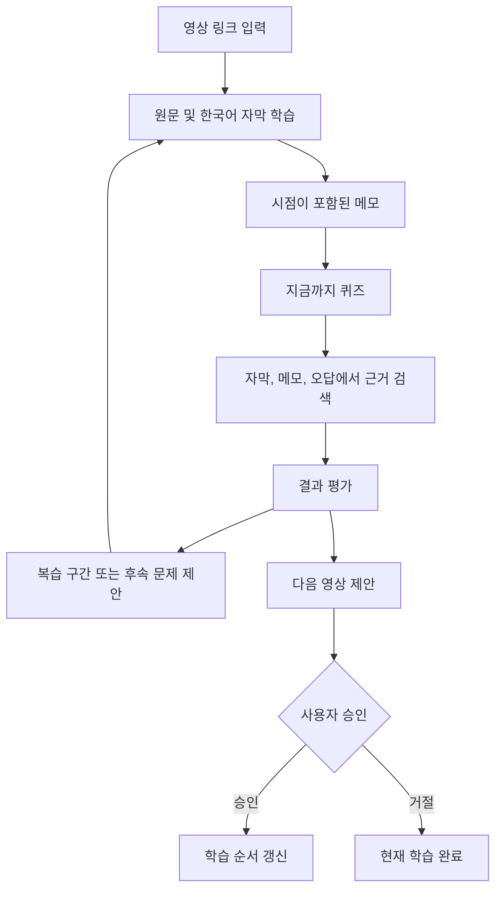
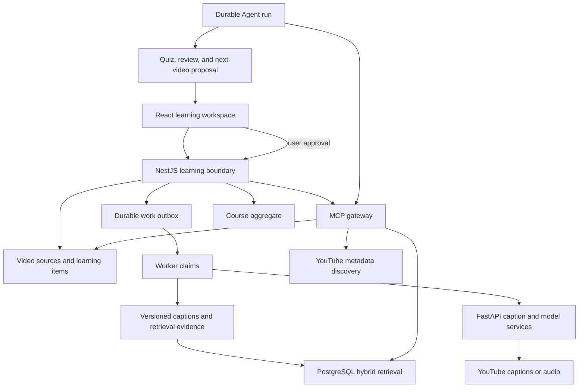
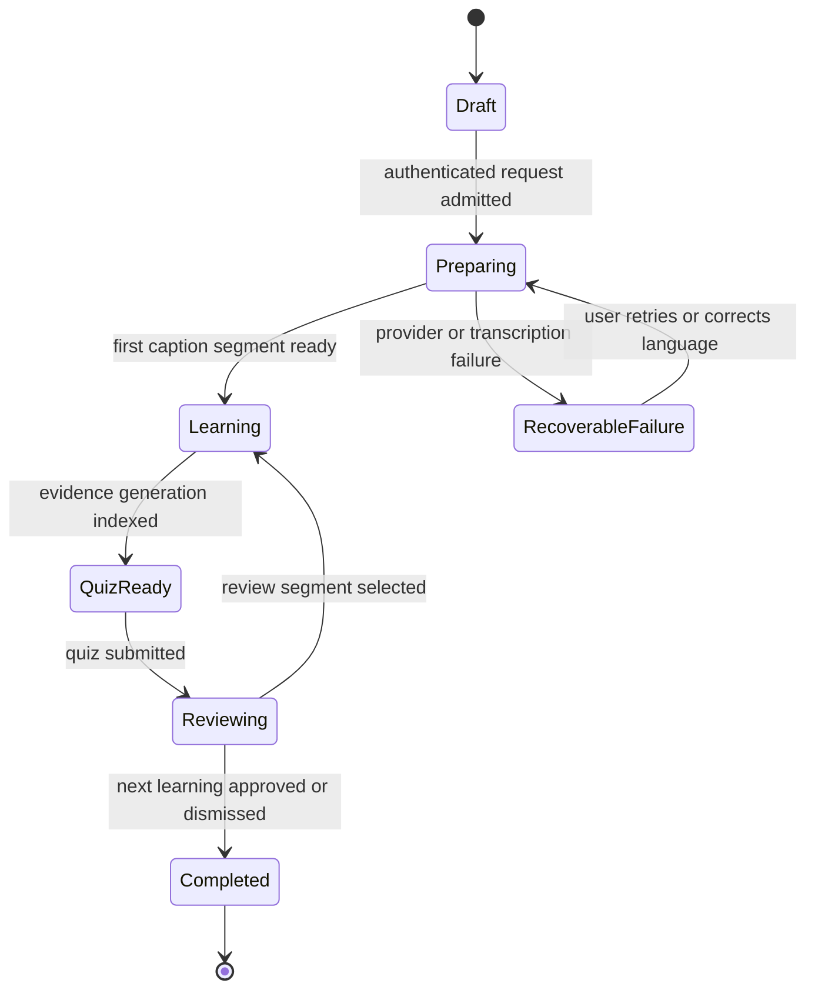
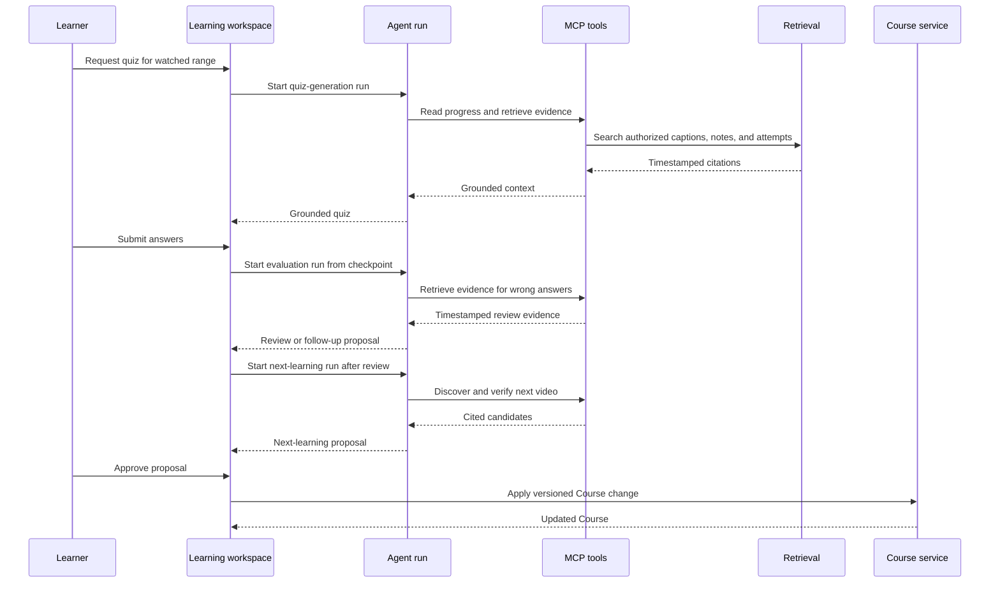

# StudyTube 학습 경험 개편 - Plan

## Goal Capsule

- **Objective:** 사용자가 외국어 영상을 원문과 한국어 자막으로 공부하고, 학습 결과에 맞춰 복습할 부분과 다음 학습 순서를 자연스럽게 이어갈 수 있다.
- **Means:** 학습 자료 경계, progressive caption pipeline과 근거 기반 Agent·MCP·RAG 순환으로 개편한다. KTD1–KTD10이 구현 방식을 소유한다.
- **Authority hierarchy:** Product Contract가 사용자 행동과 범위를 소유하고 Planning Contract가 구현 방식을 소유하며 Implementation Units는 둘을 변경하지 않는다.
- **Execution profile:** `code`, Deep, characterization-first와 migration rehearsal을 포함한다.
- **Stop conditions:** 학습 데이터 parity, 사용자별 비용 admission, 근거 citation 또는 새 비용 승인이 충족되지 않으면 cutover와 배포를 진행하지 않는다.
- **Tail ownership:** 구현자는 plan 검증, PR, CI, main 배포와 실서비스 확인까지 소유하며 외부 문서 동기화는 별도 승인 전 수행하지 않는다.
- **Open blockers:** production STT 활성화에는 별도 비용 승인이 필요하다. Adapter 구현과 provider-disabled 검증은 승인 전에도 진행할 수 있다.

---

## Product Contract

### Summary

StudyTube를 외국어 영상의 자막 학습, 메모, 근거 기반 퀴즈와 다음 학습 순서를 하나의 흐름으로 연결하는 서비스로 개편한다. 사용자는 기술 구조를 이해하지 않아도 영상 학습과 복습에 집중할 수 있다.

### Problem Frame

현재 서비스는 게시판, Course, 검색과 AI 관련 화면이 같은 비중으로 노출되어 사용자가 무엇부터 해야 하는지 알기 어렵다. 자막이 준비되지 않거나 일부만 제공될 때도 상태와 대안이 충분히 드러나지 않아 핵심 학습 경험이 중단된다.

Agent·MCP·RAG는 각각 존재하지만 하나의 사용자 결과를 위해 협력한다는 설명이 약하다. 퀴즈 생성이나 영상 추천에 기술을 단순히 연결하는 수준으로는 일반 모델 호출이나 고정 workflow와의 차이를 설명하기 어렵다.

### Key Decisions

- **처음부터 로그인** (session-settled: user-directed — chosen over anonymous caption access: caption translation and transcription have real cost). Governs R1, R8.
- **집중형 학습 화면** (session-settled: user-directed — chosen over persistent side-by-side panels: the learner should focus on the video and current captions). Governs R2, R3.
- **퀴즈 중심 학습 확인** (session-settled: user-directed — chosen over a general question interface: quizzes provide a clearer learning outcome). Governs R8, R9.
- **Agent·MCP·RAG를 핵심 학습 순환에 사용** (session-settled: user-directed — chosen over removing them from the active product path: the project exists to demonstrate meaningful AI technology use). Governs R7–R11.
- **한국어 번역 고정** (session-settled: user-directed — chosen over user-selectable target languages: the first release should keep the experience simple). Governs R4, R5.
- **기존 학습 데이터 보존** (session-settled: user-directed — chosen over a clean data reset: existing accounts and learning history must remain useful). Governs R14, R16.
- **제품 문구에서 기술 용어를 앞세우지 않음** (session-settled: user-directed — chosen over AI-forward product copy: users should understand the learning value before the implementation). Governs R15.
- **Course 목적지 직접 선택** (session-settled: user-directed — chosen over automatic Course creation: the learner should control where the next video is added). Governs R13.

### Actors

- A1. **학습자:** 외국어 YouTube 영상으로 공부하고 원문과 한국어 자막, 메모, 퀴즈와 학습 순서를 사용한다.
- A2. **학습 Agent:** 학습자의 요청과 결과를 바탕으로 복습, 후속 문제와 다음 영상 중 적절한 행동을 제안한다.
- A3. **외부 영상·자막 제공자:** 영상 재생, 기존 자막과 영상 음성을 제공하며 요청 제한이나 제공 불가 상태를 반환할 수 있다.

### Requirements

**학습 진입과 화면**

- R1. 사용자는 로그인한 뒤 YouTube 링크를 입력해 영상 재생, 자막 처리와 학습 기록을 시작한다.
- R2. 학습 화면은 영상을 중심에 두고 현재 원문·한국어 자막을 바로 아래에 표시하며, 하단 작업 공간은 `전체 자막`, `메모`, `퀴즈` 탭으로 구성한다.
- R3. 원문 자막을 선택하면 영상이 해당 시점으로 이동하고, 메모에는 작성 시점의 영상 위치가 함께 저장된다.

**자막과 번역**

- R4. 원문 언어는 자동으로 감지하고 한국어로 번역하며, 자동 감지가 틀렸을 때 학습자가 원문 언어를 수정할 수 있다.
- R5. 기존 YouTube 자막을 우선 사용하고 가져오지 못하면 영상 음성을 전사하며, 준비된 구간부터 원문과 번역 자막을 순차적으로 표시한다.
- R6. 자막 준비, 전사, 번역과 색인 상태를 한국어로 설명하고, 실패한 단계와 다시 시도할 수 있는 행동을 빈 화면 대신 제공한다.

**근거 기반 학습 순환**

- R7. RAG는 현재 영상과 이전 학습 기록의 자막, 메모와 오답에서 관련 근거를 찾고 영상 시점을 유지한다.
- R8. 퀴즈는 학습자가 시청한 범위와 검색된 근거를 사용해 사용자가 요청할 때 생성한다.
- R9. 모든 문제와 해설은 근거 자막과 영상 시점을 제공하고, 틀린 답에는 해당 구간으로 돌아가는 행동을 제공한다.
- R10. Agent는 퀴즈 결과를 바탕으로 복습, 후속 문제와 다음 영상 중 다음 행동을 제안하되 영상을 임의로 멈추거나 Course를 직접 변경하지 않는다.
- R11. MCP는 Agent가 사용할 자막 검색, 진도 조회, 메모 조회, 영상 탐색, 퀴즈 생성과 Course 변경 제안 도구의 경계를 제공한다.

**학습 경로와 기존 데이터**

- R12. 퀴즈를 마친 뒤 Agent는 학습 목표와 지금까지의 기록에 맞는 다음 영상을 이유와 근거와 함께 제안한다.
- R13. 학습자는 다음 영상을 승인할 때 기존 Course를 선택하거나 새 비공개 Course를 만들며, 승인한 변경만 반영된다.
- R14. 기존 계정, 진도와 Course는 보존하고 기존 게시물의 영상과 메모는 기본 비공개인 `내 학습` 자료로 전환한다.

**제품 범위와 언어**

- R15. 사용자 화면과 서비스 소개는 Agent·MCP·RAG 같은 기술명보다 자막 학습, 복습과 다음 학습 순서를 설명한다.
- R16. 기본 내비게이션은 `학습 시작`, `내 학습`, `내 정보`를 중심으로 구성하고 공개 게시판, 댓글과 좋아요는 제거한다.

### Key Flows

- F1. 영상 학습 시작
  - **Trigger:** 로그인한 학습자가 YouTube 링크를 입력한다.
  - **Actors:** A1, A3
  - **Steps:** 사용자별·전체 비용 한도를 예약한 뒤 영상을 재생하고 원문 언어와 기존 자막을 확인한다. 자막을 가져오지 못하면 승인된 범위에서 음성 전사를 시작한다. 준비된 구간부터 원문과 한국어 자막을 표시한다.
  - **Outcome:** 학습자는 비용 한도 안에서 영상과 자막 학습을 시작한다.
  - **Covers:** R1–R6.

- F3. 퀴즈와 복습
  - **Trigger:** 학습자가 `지금까지 퀴즈`를 요청한다.
  - **Actors:** A1, A2
  - **Steps:** 시청 범위와 관련 기록에서 근거를 찾고 문제를 생성한다. 답변을 평가한 뒤 근거 자막과 영상 시점을 보여준다. 오답이면 복습 구간이나 후속 문제를 제안한다.
  - **Outcome:** 학습자는 정답 여부뿐 아니라 무엇을 다시 봐야 하는지 안다.
  - **Covers:** R7–R11.

- F4. 다음 학습 이어가기
  - **Trigger:** 학습자가 퀴즈를 마친다.
  - **Actors:** A1, A2
  - **Steps:** 학습 목표, 자막, 메모와 퀴즈 결과를 바탕으로 다음 영상을 제안한다. 학습자가 이유와 연결 근거를 확인하고 승인하거나 거절한다.
  - **Outcome:** 승인한 영상만 Course와 다음 학습 순서에 반영된다.
  - **Covers:** R10, R12, R13.

### Acceptance Examples

- AE1. **Covers R1, R2, R5.** 로그인한 사용자가 자막이 있는 영상을 입력하면 비용 예약 뒤 영상이 재생되고 준비된 원문과 한국어 자막이 학습 화면에 표시된다.
- AE2. **Covers R5, R6.** YouTube 자막을 가져오지 못하면 음성 전사 상태가 표시되고 첫 구간이 준비되는 즉시 자막이 나타나며 영상 재생은 계속된다.
- AE3. **Covers R6, R8.** 근거 자막과 색인이 준비되지 않은 상태에서 퀴즈를 요청하면 비활성 이유와 현재 처리 단계가 표시된다.
- AE4. **Covers R7–R10.** 학습자가 문제를 틀리면 Agent가 관련 자막과 영상 시점을 제시하고 해당 구간 복습이나 후속 문제를 제안한다.
- AE5. **Covers R12, R13.** Agent가 다음 영상을 제안해도 사용자가 승인하기 전에는 Course와 학습 순서가 바뀌지 않는다.
- AE7. **Covers R14, R16.** 기존 사용자가 로그인하면 계정, 진도와 Course가 유지되고 기존 영상과 메모는 비공개 `내 학습` 자료에서 확인되며 공개 게시판은 표시되지 않는다.

### Success Criteria

- 인증되지 않은 요청은 번역, 전사, RAG와 Agent 비용을 발생시키지 않는다.
- 자막 수집이나 번역이 진행 중이거나 실패해도 빈 화면이 나타나지 않는다.
- 퀴즈 문제와 해설은 사용자가 이동할 수 있는 근거 영상 시점을 제공한다.
- Agent가 제안한 복습과 학습 순서 변경은 사용자의 승인 없이 적용되지 않는다.
- 기존 계정, 진도, Course와 영상 메모가 개편 뒤에도 유지된다.
- 사용자 화면만 본 사람은 Agent·MCP·RAG 용어를 몰라도 학습 흐름을 이해할 수 있다.

### Scope Boundaries

**Deferred for later**

- 한국어 외 번역 대상 언어 선택
- 여러 사용자가 함께 편집하는 Course
- 별도 모바일 애플리케이션
- 자막 파일 직접 업로드

**Outside this product's identity**

- 공개 게시판, 댓글, 좋아요와 팔로우 중심의 소셜 기능
- 범용 질문에 답하는 일반 채팅 서비스
- 기술 시연을 위해 Agent·MCP·RAG를 별도 메뉴로 노출하는 화면
- 사용자 승인 없이 영상을 등록하거나 Course를 바꾸는 자동화

### Dependencies / Assumptions

- 외부 영상 제공자가 자막과 음성 접근을 제한할 수 있으며, 이 경우 서비스는 실패 원인과 가능한 다음 행동을 알려야 한다.
- 음성 전사와 번역은 영상 길이와 언어에 따라 처리 시간과 사용 비용이 달라질 수 있다.
- 모든 번역과 전사 요청은 사용자별·전체 hard cap 안에서 원자적으로 예약된 경우에만 외부 작업을 시작한다.
- 지원 가능한 원문 언어 범위는 실제 전사·번역 제공자의 지원 범위를 따른다.
- 기존 게시물의 영상과 메모를 학습 자료로 전환할 수 있을 만큼 현재 데이터에 식별 가능한 영상 정보가 남아 있다고 가정한다.

### Sources / Research

- `README.md`
- `web/src/App.tsx`
- `web/src/api.ts`
- `ai/main.py`
- `api/src/video-asset.service.ts`
- `docs/plans/2026-07-29-001-feat-course-aggregate-plan.md`
- `https://developers.openai.com/api/docs/models/gpt-4o-mini-transcribe`

---

## Planning Contract

### Product Contract preservation

Product Contract changed: R1, R13 and F1 updated; F2 and AE6 removed — the user chose login-first cost control and explicit existing-or-new private Course selection during planning.

### Key Technical Decisions

- KTD1. **공유 영상 source, 사용자 학습 자료와 학습 맥락을 분리한다.** learning item은 사용자 library의 영상을, study context는 standalone 또는 Course occurrence를 나타내며 진도·메모·퀴즈는 context에 귀속된다. Governs R1, R3, R14.
- KTD2. **자막을 immutable generation 계보로 관리한다.** source capture는 video source에 공유하고 언어 override와 active translation·index pointer는 study context에 귀속하며 교체는 expected generation과 worker lease를 조건으로 한다. Governs R4–R6.
- KTD3. **무거운 자막 처리는 기존 durable work 경계에서 실행한다.** 공유 work와 사용자 subscription을 분리하고 전사·번역·색인은 outbox, claim, lease, retry와 dead-letter 계약을 재사용하며 외부 호출은 at-least-once로 취급한다. Governs R5, R6.
- KTD4. **RAG의 권한 단위를 학습 자료와 context snapshot으로 일반화한다.** Agent run이 고정한 learning item, watched range와 caption generation의 부분집합만 검색하고 artifact FK와 영상 시점을 citation에 유지한다. Governs R7–R9.
- KTD5. **MCP를 Agent의 유일한 도구 경계로 확장한다.** Agent는 repository와 AI proxy를 직접 호출하지 않으며 도구별 capability scope, schema, idempotency와 allowlist audit summary를 API transaction에서 검증한다. Governs R10, R11.
- KTD6. **사람의 응답을 기다리는 구간은 별도 durable run으로 나눈다.** 퀴즈 생성, 답변 평가와 다음 영상 제안을 learning-loop aggregate가 연결하고 각 run은 checkpoint와 독립 budget을 가져 사용자 대기가 wall-time을 소모하지 않는다. Governs R8–R12.
- KTD7. **데이터 전환은 expand-bulk-backfill-delta-freeze-cutover로 진행한다.** live bulk backfill과 watermark delta catch-up 뒤 짧은 최종 freeze에서 parity를 검증하고 영구 marker로 read·write authority를 전환한다. Governs R14, R16.
- KTD8. **학습 화면을 독립 feature boundary로 분리한다.** 현재 대형 화면 컴포넌트의 player, caption, note, quiz와 progression 상태를 분리해 모든 인증 사용자가 같은 workspace를 사용하게 한다. Governs R1–R3, R15, R16.
- KTD9. **Course 승인은 proposal과 Course 변경을 한 transaction으로 처리한다.** 학습자가 기존 Course 또는 새 비공개 Course를 선택하면 proposal 소비, step 추가, version 증가와 retrieval outbox를 함께 커밋한다. Governs R12, R13.
- KTD10. **음성 전사는 기존 OpenAI 연결의 고정 snapshot adapter를 사용한다.** `gpt-4o-mini-transcribe-2025-12-15`과 transcription endpoint를 사용하되 production 활성화는 model 단가, 최대 spend와 만료가 기록된 비용 승인 뒤에만 허용한다. Governs R5, R6.

### High-Level Technical Design

#### Component topology

#### Learning item lifecycle

#### Grounded learning loop

#### Legacy ownership mapping

| Legacy source | Target ownership | Merge and provenance rule |
| --- | --- | --- |
| Post video and translated notes | post author의 learning item과 standalone study context | video source는 canonical ID로 재사용하고 note는 post ID와 기존 timestamp를 보존한다. |
| Course step snapshot | shared video source와 Course occurrence study context | source post가 없어도 snapshot URL로 source를 만들고 Course·step ID를 provenance로 남긴다. |
| Course step owner learning marks | Course owner의 occurrence context | 각 mark를 별도 timestamp note로 보존하고 동일 시점도 삭제하지 않는다. |
| Learning progress and events | progress user의 occurrence context | watched range는 union하고 last position은 최신 occurred-at event를 사용한다. |
| Quiz and attempts | quiz evidence artifact와 attempt user의 occurrence context | quiz definition은 보존하고 attempt·answer·score는 사용자 context에 그대로 연결한다. |
| Same user and video in multiple Courses | 하나의 learning item과 Course별 study context | library metadata는 공유하되 진도, 메모, quiz와 proposal은 context별로 분리한다. |

### System-Wide Impact

- **Authentication:** 모든 학습 route는 기존 server session, exact Origin과 JSON boundary를 요구하고 인증되지 않은 요청은 외부 비용 예약 전에 거부한다.
- **Data lifecycle:** 게시물, video asset, Course 단계, 진도, 퀴즈와 retrieval source가 학습 자료 ID로 수렴하므로 migration과 cutover가 같은 배포 경계에서 검증되어야 한다.
- **Retention:** 사용자 삭제는 learning item, context, note, progress, quiz attempt와 private Agent record를 제거하고 shared source artifact는 다른 active reference와 provider 보존 정책이 허용하는 동안만 유지한다.
- **Worker reliability:** 음성 전사는 긴 외부 작업이므로 lease renewal, cancellation, transient retry, final-attempt terminalization과 error redaction 계약을 유지해야 한다.
- **Privacy:** Agent context snapshot은 현재 학습 자료와 watched range만 허용하고 MCP audit은 ID, count, version, range와 outcome만 저장한다.
- **Operations:** 자막 단계별 지연, fallback 비율, 비용 reservation, Agent/MCP 실패와 승인 충돌을 기존 metrics와 structured log에 추가한다.

### Agent capability boundaries

- **Agent-accessible now:** authorized evidence, 진도, 메모와 quiz outcome 조회, quiz work 요청, 복습·후속 문제·다음 영상 proposal 생성.
- **Human-only:** 로그인, 퀴즈 답변 제출, target Course 선택, Course 변경 승인과 거절.
- **Never agent-accessible:** 영상 재생 제어, Course 직접 mutation, approval endpoint 호출, 비용·권한 상한 변경.

### Risks and Mitigations

- **외부 영상 접근 제한:** 자막과 음성 모두 막힐 수 있다. 단계별 provider 결과를 보존하고 사용자에게 재시도, 언어 수정 또는 다른 영상 선택을 제공한다.
- **전사 비용과 처리 시간:** 긴 영상이 작은 EC2와 외부 모델 예산을 압박할 수 있다. watched-window 우선 처리, 길이 제한, 사용량 예약과 취소 가능한 work item으로 경계를 둔다.
- **비용 승인 누락:** 코드가 준비되어도 승인되지 않은 provider 사용을 활성화할 수 있다. 승인 기록은 승인자, model snapshot, 환경, 최대 금액, 만료와 식별자를 포함하고 배포 gate가 검증한다.
- **비용 abuse:** 인증 계정도 반복 요청으로 비용을 발생시킬 수 있다. 사용자·영상·시간 구간별 reservation, 중복 work 공유, 영상 길이·동시 작업·일일 전사량 hard cap과 kill switch를 적용한다.
- **이중 데이터 모델 drift:** 게시물과 학습 자료가 동시에 쓰이면 불일치가 생긴다. legacy mutation과 backfill이 같은 advisory lock protocol에 참여하고 freeze snapshot 검증 후 single-write cutover를 사용한다.
- **Course 기록 손실:** 기존 Course step 삭제는 진도와 퀴즈를 cascade하거나 mutation을 막을 수 있다. 사용자 기록을 stable learning item과 immutable evidence root로 옮긴 뒤 Course mutation을 활성화한다.
- **근거 없는 Agent 제안:** 검색 결과가 부족하거나 도구가 실패할 수 있다. citation과 source version을 검증하지 못하면 제안을 만들지 않고 run을 안전한 실패 상태로 종료한다.

### Sequencing

1. 공유 영상 source, 사용자 학습 자료와 비용 reservation의 데이터·권한 경계를 먼저 만든다.
2. 자막 pipeline과 학습 화면을 새 경계에 연결해 로그인한 사용자의 핵심 흐름을 완성한다.
3. RAG와 MCP를 학습 자료 기준으로 확장한 뒤 퀴즈와 Agent 제안 순환을 연결한다.
4. 기존 데이터를 backfill하고 공개 게시판 경로를 닫은 다음 운영 지표와 문서를 갱신한다.

### Phased Delivery

- **Checkpoint A — dark data and captions:** U11, U1–U3을 배포하되 새 route와 STT를 비활성화한다. Schema와 provider-disabled 경로만 검증하며 rollback은 새 writer가 없으므로 구버전 배포로 가능하다.
- **Checkpoint B — authenticated workspace canary:** U4를 인증된 내부 canary route로 열고 기존 사용자 route는 유지한다. Caption·note와 비용 admission을 확인하고 flag를 끄면 즉시 기존 UI로 돌아간다.
- **Checkpoint C — grounded learning loop:** U5–U8의 RAG, MCP, quiz와 proposal을 shadow mode로 검증한 뒤 read, quiz, proposal, Course approval capability를 순서대로 활성화한다. 각 capability는 독립 kill switch와 rollback boundary를 가진다.
- **Checkpoint D — data and product cutover:** U9의 watermark·freeze parity와 marker를 통과한 뒤 U10의 새 navigation과 writer를 활성화한다. Marker 이후 write가 발생하면 legacy rollback 없이 roll-forward한다.

---

## Implementation Units

| Unit | Title | Key files | Depends on |
| --- | --- | --- | --- |
| U11 | Migration source preflight | read-only source audit and fixtures | None |
| U1 | First-class learning context | learning item migration and repositories | U11 |
| U2 | Authenticated intake and cost admission | learning item API, URL policy, budget repository | U1 |
| U3 | Progressive caption and transcription | caption artifacts, worker, AI service | U1, U2 |
| U4 | Focused learning workspace | React learning feature and caption state | U2, U3 |
| U5 | Learning evidence retrieval | retrieval source persistence and search | U1, U3 |
| U6 | MCP learning tool boundary | MCP gateway, assertion, Agent MCP client | U2, U5 |
| U7 | Grounded adaptive quiz loop | quiz worker, learning loop, Agent processor | U5, U6 |
| U8 | Next-learning Course approval | proposal, Course transaction and UI | U6, U7 |
| U9 | Frozen data backfill and cutover | backfill, parity, cutover authority | U1, U5, U7, U8 |
| U10 | Product route cutover and operations | routes, monitoring, docs and browser proof | U2–U9 |

### U11. Migration source preflight

**Goal:** production snapshot의 기존 영상과 학습 기록이 결정적으로 전환 가능한지 구현 시작 전에 확인한다.

**Requirements:** R14; AE7; KTD1, KTD7.

**Dependencies:** 없음.

**Files:**

- Create `api/scripts/audit-learning-migration-source.ts`
- Create `api/scripts/audit-learning-migration-source.spec.ts`
- Modify `api/test/fixtures/legacy-runtime-schema.sql`

**Approach:**

1. read-only snapshot에서 entity별 canonical video ID 식별률, source post 없는 Course step, 중복·모호 URL, Course owner·post author·progress user 조합과 owner 없는 row를 계수한다.
2. 모든 학습-bearing row는 mapping matrix에 따라 전환 가능하거나 원문 row와 이유를 보존하는 explicit legacy exception으로 분류되어야 한다.
3. owner 없는 progress·quiz attempt와 식별할 수 없는 active video source는 0건이어야 U1을 시작한다.
4. 결과는 row content가 아닌 count, fingerprint와 low-cardinality reason code만 증거로 남긴다.

**Execution note:** production 데이터에는 쓰지 않는 audit를 먼저 실행하고 blocker가 있으면 Product Contract를 변경하지 말고 mapping 규칙을 보강한다.

**Patterns to follow:** `api/scripts/verify-migration-adoption.ts`, `api/scripts/verify-course-backfill.ts`.

**Test scenarios:**

- valid legacy fixture가 canonical video와 owner mapping 100% 결과를 낸다.
- malformed URL, source 없는 step, owner mismatch와 duplicate video fixture가 각각 분리된 reason count를 낸다.
- audit output과 log에 post note, email, raw URL query와 자막 원문이 나타나지 않는다.
- production snapshot을 read-only transaction으로 열고 mutation statement를 실행하지 않는다.

**Verification:** preflight evidence가 모든 학습-bearing row의 mapping 또는 explicit preservation을 증명하고 U1 start gate를 통과한다.

### U1. First-class learning context

**Goal:** 공유 영상 source와 사용자 소유 학습 자료를 만들고 기존 게시물·Course·진도·퀴즈가 새 경계로 전환될 expand-only 기반을 제공한다.

**Requirements:** R1, R3, R14; A1; F1; AE7; KTD1, KTD7.

**Dependencies:** U11.

**Files:**

- Create `api/migrations/1753660813000_video-sources-and-learning-items.cjs`
- Create `api/src/learning/learning-item.types.ts`
- Create `api/src/learning/learning-item.repository.ts`
- Create `api/src/learning/postgres-learning-item.repository.ts`
- Modify `api/src/learning/learning.module.ts`
- Modify `api/src/database.service.ts`
- Modify `api/src/course/postgres-course.repository.ts`
- Modify `api/src/learning/postgres-learning-progress.repository.ts`
- Modify `api/src/learning/postgres-quiz.repository.ts`
- Create `api/src/learning/postgres-learning-item.repository.spec.ts`
- Create `api/test/learning-item-migration.e2e-spec.ts`
- Modify `api/src/migration-files.spec.ts`

**Approach:**

1. canonical video ID를 가진 공유 video source, `(user, video source)` library learning item과 Course occurrence를 표현하는 study context를 분리한다.
2. Course step은 video source를 가리키고 진도·메모·quiz attempt는 실제 학습자의 study context를 가리키도록 nullable 전환 FK와 mapping table을 추가한다.
3. source post가 없거나 Course owner·post author·progress user가 다른 기존 행을 결정적으로 mapping할 규칙과 uniqueness·ownership invariant를 정의한다.
4. U1은 schema와 repository capability만 추가하고 production backfill과 read·write authority 변경은 U9까지 수행하지 않는다.
5. migration은 짧은 lock timeout, statement timeout과 NOT VALID constraint 패턴을 사용한다.

**Execution note:** 기존 migration fixture와 adoption 검증을 먼저 확장한 뒤 새 migration을 작성한다.

**Patterns to follow:** `api/migrations/1753660803000_course-aggregate.cjs`, `api/migrations/1753660808000_learning-loop-contract.cjs`, `api/src/course/postgres-course.repository.ts`.

**Test scenarios:**

- Course owner와 post author가 달라도 각 progress user의 learning item 소유권이 올바르게 생성될 mapping을 계산한다.
- source post가 없는 Course step도 video source를 만들 수 있고 provenance가 손실되지 않는다.
- 같은 사용자가 같은 영상을 두 Course에서 학습하면 하나의 learning item과 서로 다른 두 study context가 생성되고 진도·메모가 섞이지 않는다.
- 다른 사용자의 learning item에 진도, 메모 또는 quiz attempt를 연결하려 하면 DB constraint가 거부한다.
- 사용자 삭제는 개인 learning context와 evidence를 제거하지만 다른 사용자가 참조하는 shared video source artifact를 삭제하지 않는다.
- 기존 Course step을 삭제하거나 교체해도 stable learning item의 진도와 quiz attempt는 cascade 삭제되지 않는다.
- legacy fixture와 fresh database 모두 migration 후 schema invariant를 만족한다.

**Verification:** expand schema가 fresh install과 legacy adoption 양쪽에서 생성되고 ownership·provenance constraint가 기존 관계를 표현할 수 있다.

### U2. Authenticated learning intake and cost admission

**Goal:** 로그인한 사용자의 영상 요청을 canonicalize하고 사용자별·전체 비용 한도를 원자적으로 예약한 뒤 학습 자료를 시작한다.

**Requirements:** R1, R3, R8; F1; AE1, AE3; KTD1, KTD8.

**Dependencies:** U1.

**Files:**

- Create `api/migrations/1753660814000_ai-cost-reservations.cjs`
- Create `api/src/learning/learning-item.controller.ts`
- Create `api/src/learning/learning-item.service.ts`
- Create `api/src/learning/learning-item.dto.ts`
- Create `api/src/learning/youtube-url.policy.ts`
- Create `api/src/learning/provider-budget.repository.ts`
- Create `api/src/learning/postgres-provider-budget.repository.ts`
- Create `api/src/learning/learning-note.repository.ts`
- Create `api/src/learning/postgres-learning-note.repository.ts`
- Modify `api/src/auth/session.guard.ts`
- Modify `api/src/auth/origin.guard.spec.ts`
- Modify `api/src/openapi.ts`
- Create `api/src/learning/learning-item-http.spec.ts`
- Create `api/src/learning/youtube-url.policy.spec.ts`
- Create `api/src/learning/postgres-provider-budget.repository.spec.ts`
- Create `api/src/learning/postgres-learning-note.repository.spec.ts`
- Create `api/test/learning-intake.e2e-spec.ts`
- Modify `web/src/api.ts`
- Create `web/src/learningIntake.ts`
- Create `web/tests/learningIntake.test.ts`

**Approach:**

1. 기존 SessionGuard와 OriginGuard를 통과한 요청만 학습 intake에 진입하게 하고 AI·learning·Course route의 public allowlist가 넓어지지 않게 한다.
2. HTTPS, 정확한 YouTube host와 canonical video ID만 허용하고 worker에는 raw URL 대신 canonical ID를 전달한다.
3. 사용자, canonical video, 처리 구간과 시간 window별 사용량을 PostgreSQL에서 예약한 뒤에만 metadata, 번역 또는 전사 work를 만든다.
4. 같은 video source의 ready artifact와 진행 중 work를 여러 사용자 요청이 공유해 중복 비용을 막는다.
5. 사용자별 공정 지분과 대기열을 전체 동시 작업, 영상 길이, 일일 전사량과 비용 hard cap 안에서 적용하고 provider 호출 전에 거부한다.
6. 학습 자료의 메모 create, update와 delete는 사용자 소유권을 확인하고 영상 시점과 함께 저장한다.
7. work ledger는 provider 예상·실제 비용을 한 번 기록하고 subscription ledger는 공유 여부와 관계없이 사용자별 요청 audio seconds를 예약한다.
8. work 합류는 global provider reservation을 늘리지 않으며 success는 actual cost를 commit하고 terminal failure·취소는 처리하지 않은 사용자 quota를 release한다.

**Execution note:** 인증·URL·비용 admission 실패 테스트를 먼저 작성하고 외부 호출이 0회인지 증명한다.

**Patterns to follow:** `api/src/auth/session.guard.ts`, `api/src/auth/origin.guard.ts`, `api/src/auth/client-address.resolver.ts`, `ai/mcp_server.py`의 YouTube URL 검증.

**Test scenarios:**

- Covers AE1. 인증된 사용자가 허용된 YouTube URL을 제출하면 비용 reservation과 학습 자료를 받는다.
- 인증되지 않은 `/ai`, `/learning`, `/courses`와 학습 intake 요청은 외부 호출과 work 생성 전에 거부된다.
- userinfo, private IP, 비표준 port, 잘못된 host와 중복·encoded video ID는 canonicalization 전에 거부된다.
- 동일 사용자의 동시 요청은 허용량만 reservation하고 동일 video source에는 하나의 work item만 만든다.
- 여러 계정이 동시에 요청해도 한 사용자 또는 작은 계정 집단이 전체 budget과 worker slot을 독점하지 못한다.
- 초장편, live 영상, daily hard cap과 kill switch 상태는 provider 호출 전에 명시적 unavailable 결과로 끝난다.
- 비용 reservation 뒤 worker crash와 응답 유실이 발생해도 이중 예약·이중 청구 없이 같은 결과를 재사용한다.
- 두 사용자가 하나의 work를 공유하면 global actual cost는 한 번 기록되고 각 사용자의 logical usage quota는 독립적으로 차감된다.
- 마지막 subscriber 취소, terminal failure와 crash recovery가 reservation을 정해진 commit·release 상태로 수렴시킨다.
- 메모를 생성·수정·삭제하면 같은 사용자의 MCP context에 즉시 반영되고 다른 사용자는 읽을 수 없다.
- 허용되지 않은 Origin과 non-JSON unsafe 요청은 학습 자료를 만들지 않는다.

**Verification:** 인증, canonical URL과 비용 reservation이 하나의 admission gate로 동작하고 거부된 요청은 외부 비용과 durable work를 만들지 않는다.

### U3. Progressive caption and transcription pipeline

**Goal:** 기존 자막이 없거나 제한된 영상도 음성 전사로 복구하고 준비된 원문·한국어 구간을 지속적으로 제공한다.

**Requirements:** R4–R6; A3; F1; AE1–AE3; KTD2, KTD3.

**Dependencies:** U1, U2.

**Files:**

- Create `api/migrations/1753660815000_learning-caption-artifacts.cjs`
- Modify `api/src/video-asset.types.ts`
- Modify `api/src/video-asset.service.ts`
- Modify `api/src/work/video-asset.worker.ts`
- Modify `api/src/work/work.queue.ts`
- Modify `api/src/ai-proxy.service.ts`
- Modify `ai/main.py`
- Modify `ai/.env.example`
- Modify `scripts/install-production-runtime.sh`
- Modify `api/src/video-asset.service.spec.ts`
- Modify `api/src/work/video-asset.worker.spec.ts`
- Modify `ai/test_main.py`
- Create `api/test/learning-caption.e2e-spec.ts`

**Approach:**

1. video source 아래 source capture, transcription, translation과 index generation을 immutable artifact로 저장하고 parent generation FK를 유지한다.
2. 기존 YouTube caption 경로가 usable source segment를 주지 못할 때만 음성 전사를 요청한다.
3. media acquisition capability를 자막 조회와 별도로 검사하고 live, 연령·지역 제한, 인증 요구와 최대 길이를 provider 호출 전에 분류한다.
4. approved model snapshot과 audio token 단가를 cost reservation에 고정하고 승인 기록이 없으면 STT adapter를 disabled로 유지한다.
5. 현재 재생 구간과 다음 구간을 우선 처리하고 artifact와 ordinal unique key로 segment batch를 append한다.
6. current generation pointer는 expected generation과 active lease를 조건으로 compare-and-set해 늦은 worker가 새 결과를 덮어쓰지 못하게 한다.
7. retrieval과 quiz citation은 URL과 숫자 version 대신 immutable artifact 또는 segment FK를 참조한다.
8. 언어 수정은 source artifact를 재사용한 새 translation generation을 만들고 해당 study context의 pointer만 교체하며 이전 결과는 보존하되 active 조회에서 제외한다.
9. 외부 오류 원문은 process memory 밖에 남기지 않고 allowlist error code만 persistence, response와 log에 기록한다.
10. 사용자 취소는 자신의 subscription만 종료하고 활성 subscription이 0개일 때만 공유 work를 취소하며 운영자 kill switch는 별도 권한으로 둔다.

**Execution note:** provider별 characterization test를 보존하고 STT fallback을 추가한 뒤 실제 worker 통합을 검증한다.

**Patterns to follow:** `docs/solutions/integration-issues/caption-window-translation-troubleshooting.md`, `ai/main.py`의 window translation, `api/src/work/durable-job.executor.ts`.

**Test scenarios:**

- Covers AE1. 기존 source caption이 있으면 전사를 호출하지 않고 원문과 번역 segment가 순서대로 저장된다.
- Covers AE2. source caption이 비어 있거나 rate limited이면 전사가 시작되고 첫 batch가 준비되는 즉시 조회된다.
- STT 승인 기록이 없거나 만료되면 source caption 경로만 동작하고 audio upload는 발생하지 않는다.
- media capability 표본에서 live, 제한 영상과 초장편은 정해진 safe code로 전사 전에 거부된다.
- 전사 batch가 중복 또는 순서가 바뀌어 도착해도 segment version과 시간 범위가 중복되지 않는다.
- lease를 잃은 이전 generation worker가 current pointer를 교체하려 하면 compare-and-set이 실패한다.
- 사용자가 영상을 바꾸거나 작업을 취소하면 lease를 잃은 worker가 이후 batch를 저장하지 않는다.
- 같은 공유 work를 구독한 두 사용자 중 한 명이 취소해도 다른 사용자의 처리와 비용 reservation은 유지된다.
- 언어 수정 뒤 이전 번역과 quiz evidence는 사용되지 않고 새 version이 준비될 때까지 상태가 명확히 표시된다.
- 같은 video source를 학습하는 두 사용자가 서로 다른 원문 언어 override를 선택해도 각 study context의 번역과 quiz evidence가 독립적이다.
- provider exception에 credential, private URL과 query token canary가 있어도 저장·응답·log에 나타나지 않는다.
- final attempt의 일시 오류는 같은 claim 안에서 terminal 처리되고 무한 재시도되지 않는다.
- orphan segment, parent generation mismatch와 존재하지 않는 artifact를 가리키는 quiz·retrieval citation이 0건이다.

**Verification:** 자막 성공, 전사 fallback, 취소, 재시도와 실패 상태가 모두 durable artifact로 수렴하고 첫 segment가 전체 완료 전에 조회된다.

### U4. Focused learning workspace

**Goal:** 영상, 현재 이중 자막과 전체 자막·메모·퀴즈 탭을 중심으로 학습 화면과 기본 내비게이션을 재구성한다.

**Requirements:** R1–R6, R15, R16; F1; AE1–AE3; KTD8.

**Dependencies:** U2, U3.

**Files:**

- Modify `web/src/App.tsx`
- Modify `web/src/App.css`
- Modify `web/src/api.ts`
- Modify `web/src/types.ts`
- Create `web/src/features/learning/LearningPage.tsx`
- Create `web/src/features/learning/LearningWorkspace.tsx`
- Create `web/src/features/learning/useLearningSession.ts`
- Create `web/src/features/learning/captionState.ts`
- Modify `web/src/captions.ts`
- Modify `web/src/watchQueue.ts`
- Create `web/tests/learningWorkspace.test.ts`
- Modify `web/tests/captions.test.ts`
- Modify `web/tests/watchAccessibility.test.ts`
- Create `web/tests/authenticatedLearningFlow.test.ts`

**Approach:**

1. 로그인 후 `/`를 링크 입력과 최근 학습 진입점으로 바꾸고 `/watch`는 기존 ProtectedRoute 안에서 새 workspace를 연다.
2. 새 링크 입력을 첫 화면의 primary action으로 두고 최근 학습은 기록이 있을 때만 secondary resume section으로 표시한다.
3. player와 현재 원문·한국어 자막을 고정된 학습 중심으로 두고 하단 workspace state를 탭으로 분리한다.
4. caption polling은 artifact generation을 기준으로 새 segment만 병합하고 단계별 상태를 한국어로 표시한다.
5. 메모 tab은 현재 재생 시점을 포함해 U2의 learning-item note API에 저장하고 같은 MCP context에서 읽을 수 있게 한다.
6. 세션이 만료되면 return URL, 선택 tab, 영상 시점과 미저장 메모 draft를 browser-scoped 상태로 보존하고 재인증 뒤 기존 learning item과 work를 재사용한다.
7. tablist·tabpanel 관계, polite live region, 오류·완료 focus 이동과 자막 갱신 중 focus 보존을 접근성 계약으로 둔다.
8. 비용 admission이 거부되면 provider 호출 없이 한도와 다음 사용 가능 행동을 한국어로 표시한다.
9. 기존 queue와 player adapter를 재사용하되 Course 편집, 검색과 Agent trace UI를 학습 화면에서 제거한다.

**Caption state contract:**

| State | Workspace behavior | User action |
| --- | --- | --- |
| Source pending | player를 유지하고 현재 자막 영역에 `원문 자막 확인 중` 상태를 표시한다. | 기다리기 또는 취소 |
| Transcription pending | 준비된 source segment를 시간 순서로 표시하고 아직 없는 구간은 상태 문구를 유지한다. | 영상 계속 보기 또는 취소 |
| Translation pending | 원문을 표시하고 같은 시간 범위의 한국어 칸에는 번역 중 상태를 표시한다. | 원문으로 계속 학습 |
| Index pending | 자막과 메모는 사용할 수 있지만 quiz tab은 근거 준비 중으로 표시한다. | 기다리기 |
| Partial | 준비된 segment만 재생 위치와 동기화하고 누락 구간을 번역문으로 가장하지 않는다. | 재시도 또는 원문 언어 수정 |
| Recoverable failure | 마지막 valid generation을 유지할 수 있으면 stale 표시와 함께 보여주고 새 자료가 없으면 빈 자막 대신 실패 단계를 표시한다. | 재시도, 언어 수정 또는 다른 영상 선택 |
| Complete | current generation의 원문·한국어 자막과 quiz를 활성화한다. | 학습 계속 |

**Execution note:** 기존 `WatchPage` 동작을 characterization test로 고정한 뒤 feature boundary로 이동한다.

**Patterns to follow:** `web/src/captions.ts`, `web/src/watchQueueStorage.ts`, `web/src/authSession.ts`, `web/tests/watchAccessibility.test.ts`.

**Test scenarios:**

- Covers AE1. 로그인한 사용자가 링크를 입력하면 비용 admission 뒤 player와 자막 workspace가 열린다.
- Covers AE2. 원문 segment가 먼저 표시되고 번역 segment가 나중에 같은 시간 범위에 추가된다.
- Covers AE3. 자막 또는 색인이 준비되지 않으면 퀴즈 tab이 이유와 처리 상태를 표시한다.
- 현재 자막을 선택하면 player가 해당 시점으로 이동하고 keyboard로도 같은 동작을 수행한다.
- 인증되지 않은 사용자가 학습 route에 접근하면 로그인 화면으로 이동하고 비용 작업은 시작되지 않는다.
- 세션 만료 뒤 재인증하면 선택 tab, 영상 시점과 미저장 메모가 복원되고 기존 caption work를 중복 요청하지 않는다.
- 새 사용자는 링크 입력을 첫 행동으로 보고 기존 기록이 있는 사용자는 같은 화면에서 최근 학습을 재개할 수 있다.
- 메모 저장·수정·삭제는 현재 timestamp를 유지하고 새 내용이 MCP 조회에 나타난다.
- 빈 내 학습 목록, video unavailable, player load failure와 caption failure에 각각 다음 행동이 표시된다.
- 320px와 desktop 폭에서 player, current caption과 tab control이 겹치거나 잘리지 않는다.
- tab keyboard navigation, live region, 오류 뒤 focus와 동적으로 추가되는 자막의 focus 유지가 screen-reader contract를 만족한다.

**Verification:** 로그인한 사용자가 링크에서 자막까지 도달하고 모든 주요 loading·empty·error 상태를 keyboard와 작은 화면에서 사용할 수 있다.

### U5. Learning evidence retrieval

**Goal:** 자막, 메모와 퀴즈 결과를 사용자별 근거로 색인하고 영상 시점이 포함된 hybrid retrieval을 제공한다.

**Requirements:** R7–R9; F3; AE3, AE4; KTD4.

**Dependencies:** U1, U3.

**Files:**

- Create `api/migrations/1753660816000_learning-evidence-sources.cjs`
- Modify `api/src/retrieval/retrieval.types.ts`
- Modify `api/src/retrieval/retrieval.constants.ts`
- Modify `api/src/retrieval/postgres-retrieval-source.persistence.ts`
- Modify `api/src/retrieval/postgres-retrieval-search.ts`
- Modify `api/src/retrieval/retrieval-embedding.worker.ts`
- Modify `api/src/work/video-asset.worker.ts`
- Modify `api/src/retrieval/postgres-retrieval.repository.spec.ts`
- Modify `api/src/retrieval/retrieval-embedding.worker.spec.ts`
- Modify `api/test/retrieval.e2e-spec.ts`
- Modify `api/test/retrieval-evaluation.e2e-spec.ts`

**Approach:**

1. 학습 자료의 caption segment, note와 quiz outcome을 retrieval source로 확장하고 immutable evidence artifact FK를 identity에 포함한다.
2. Agent run 시작 시 profile의 학습 목표, learning item, Course, watched range와 caption generation을 context snapshot으로 고정한다.
3. 모든 검색은 context snapshot의 부분집합을 API에서 강제해 같은 사용자의 관련 없는 자료도 포함하지 않는다.
4. 검색 결과는 stable resource ID, source URL, start/end timestamp, readiness, score와 artifact generation을 반환한다.
5. 새 generation embedding을 게시한 뒤 current pointer가 바뀌어야 이전 generation을 active 검색에서 제외하고 retention 대상으로 전환한다.

**Patterns to follow:** `api/src/retrieval/postgres-retrieval.repository.ts`, `api/src/retrieval/retrieval-embedding-cache.maintenance.ts`, `api/test/retrieval.e2e-spec.ts`.

**Test scenarios:**

- 같은 문구가 여러 영상에 있어도 현재 학습 자료와 watched range의 citation이 우선된다.
- 다른 사용자의 private caption, note와 quiz attempt는 lexical과 vector 검색 모두에서 제외된다.
- 같은 사용자의 다른 learning item은 현재 Agent context snapshot에 없으면 검색에서 제외된다.
- caption version이 갱신되면 stale embedding이 검색 결과에 나타나지 않는다.
- embedding provider가 실패하면 근거 없는 semantic 결과를 만들지 않고 lexical 결과 또는 명시적 unavailable 상태로 수렴한다.
- Covers AE4. 오답 개념 검색 결과가 실제 자막 구간과 이동 가능한 timestamp를 반환한다.
- profile 학습 목표가 context snapshot에 고정되고 다음 영상 후보의 연결 이유에 반영된다.

**Verification:** PostgreSQL·pgvector E2E에서 권한, version, watched-range filter와 citation timestamp가 함께 증명된다.

### U6. MCP learning tool boundary

**Goal:** Agent가 필요한 학습 조회와 제안을 MCP 도구로만 수행하고 모든 호출을 schema와 audit contract로 제한한다.

**Requirements:** R7, R10, R11; A2; F3, F4; AE4, AE5; KTD5.

**Dependencies:** U2, U5.

**Files:**

- Modify `ai/mcp_server.py`
- Modify `ai/test_mcp_server.py`
- Modify `api/src/mcp/mcp.controller.ts`
- Modify `api/src/mcp/mcp-http.spec.ts`
- Modify `api/src/mcp/mcp-service-assertion.ts`
- Modify `api/src/mcp/mcp-service-assertion.guard.ts`
- Modify `api/src/learning/learning.service.ts`
- Modify `api/src/learning/learning.repository.ts`
- Modify `api/src/learning/postgres-agent-run.repository.ts`
- Modify `api/src/learning/agent-run.processor.ts`
- Modify `api/src/learning/agent-run.processor.spec.ts`
- Modify `api/src/openapi.ts`

**Approach:**

1. authorized learning evidence 검색, 진도·메모 조회, 다음 영상 metadata 검증, 퀴즈 요청과 Course 변경 제안 capability를 MCP에 추가한다.
2. assertion에 tool capability를 넣고 각 호출에서 owner, run, active attempt, lease와 context snapshot membership을 repository transaction 안에서 다시 검증한다.
3. AgentRunProcessor의 direct repository·AI proxy 조회를 제거하고 모든 도메인 조회와 제안 생성을 MCP client에 의존시킨다.
4. side-effecting request는 기존 quiz·proposal repository가 domain mutation, idempotency reservation과 authoritative audit row를 한 transaction으로 기록한다.
5. 응답 유실이나 gateway telemetry 실패는 같은 idempotency key로 domain repository의 저장 결과를 반환하고 MCP 전용 recovery state는 만들지 않는다.
6. Course 변경 도구는 실제 mutation이나 승인 capability를 제공하지 않고 versioned proposal만 만든다.
7. tool별 audit summary는 resource ID, count, version, range와 outcome만 허용하고 query, note, caption, explanation, raw URL과 provider error는 저장하지 않는다.
8. private evidence는 외부 discovery 입력으로 전달하지 않고 서버가 만든 제한된 학습 주제 token과 canonical video ID만 open-world 도구에 허용한다.

**Patterns to follow:** `ai/mcp_server.py`의 `search_studytube`와 `_run_audited`, `api/src/mcp/mcp.controller.ts`, `api/src/mcp/mcp-service-assertion.guard.ts`.

**Test scenarios:**

- 유효한 service assertion을 가진 Agent만 학습 evidence와 진도 도구를 호출할 수 있다.
- search-only capability로 quiz request 또는 proposal 도구를 호출하면 work와 성공 audit 없이 거부된다.
- 다른 owner, run 또는 attempt identity로 호출하면 결과와 audit 모두 거부된다.
- 종료된 run, stale attempt, lease loss와 context snapshot 밖의 같은-owner 자료는 거부된다.
- 동일 idempotency key의 퀴즈 요청은 하나의 work item만 만든다.
- Course 변경 제안 도구 호출만으로 Course version이나 step이 변하지 않는다.
- side effect commit 직후 audit 전달 timeout과 worker crash를 주입해도 work item 또는 proposal이 하나만 남고 Agent가 결과를 복구한다.
- tool response가 schema와 다르면 Agent가 성공으로 기록하지 않는다.
- credential, private URL, query token, note와 caption canary가 audit row, dead letter, response와 structured log에 원문으로 저장되지 않는다.
- prompt-injection canary와 private evidence가 실제 YouTube discovery outbound request에 포함되지 않는다.
- MCP tool discovery에는 Course 직접 mutation과 human approval 도구가 존재하지 않는다.

**Verification:** MCP contract test가 도구 discovery, capability authorization, context parity, schema version, idempotency, transactional audit와 recoverable delivery failure를 검증한다.

### U7. Grounded adaptive quiz loop

**Goal:** 시청 범위 기반 퀴즈를 만들고 답변 결과에 따라 근거가 있는 복습과 후속 문제를 제안한다.

**Requirements:** R8–R11; F3; AE3, AE4; KTD4–KTD6.

**Dependencies:** U5, U6.

**Files:**

- Create `api/migrations/1753660817000_adaptive-learning-loop.cjs`
- Modify `api/src/learning/learning.controller.ts`
- Modify `api/src/learning/learning.dto.ts`
- Modify `api/src/learning/learning.types.ts`
- Modify `api/src/learning/quiz-generation.worker.ts`
- Modify `api/src/learning/postgres-quiz.repository.ts`
- Modify `api/src/learning/agent-run.processor.ts`
- Modify `api/src/learning/agent-run.processor.spec.ts`
- Modify `api/src/learning/quiz-generation.worker.spec.ts`
- Modify `api/test/learning-http.e2e-spec.ts`
- Modify `api/test/learning-concurrency.e2e-spec.ts`
- Modify `web/src/api.ts`
- Modify `web/src/features/learning/LearningWorkspace.tsx`
- Create `web/tests/adaptiveQuizFlow.test.ts`

**Approach:**

1. 로그인한 quiz request에 learning item, watched range와 caption artifact를 고정하고 durable work item으로 생성한다.
2. 생성 worker는 MCP/RAG citation만 사용해 문제를 만들고 공개 응답에서 정답은 계속 숨긴다.
3. durable learning-loop aggregate가 quiz generation run, 사용자 답변 checkpoint와 evaluation run을 연결하고 각 run은 독립 wall-time·tool·token·cost budget을 가진다.
4. 사용자 답변 대기는 실행 중 run이 아니라 durable checkpoint state로 저장해 lease와 wall-time을 소비하지 않는다.
5. 제출 결과는 오답 개념과 citation을 기록하고 evaluation run이 복습 구간 또는 후속 문제 proposal을 만든다.
6. artifact generation이 바뀐 quiz는 새 attempt를 받지 않고 재생성을 안내한다.
7. 각 primitive MCP 호출 뒤 checkpoint하고 cancellation 또는 lease loss 시 다음 도구를 호출하지 않는다.

**Quiz UI state contract:** `request`에서는 watched range와 readiness를 확인하고 `generating`에서는 중복 요청을 막는다. `ready`와 `answering`에서는 답 선택만 허용하며 `submitting`에서는 재제출을 막는다. `evaluated`에서는 근거 시점 이동, 복습과 후속 문제를 제공하고 `failed`는 안전한 재시도를, `stale`은 새 quiz 생성을 유일한 다음 행동으로 제공한다.

**Patterns to follow:** `api/src/learning/quiz-generation.worker.ts`, `api/src/learning/postgres-quiz.repository.ts`, `api/src/learning/agent-run.processor.ts`.

**Test scenarios:**

- Covers AE3. caption evidence가 준비되지 않은 watched range에는 quiz work item이 생성되지 않는다.
- 인증되지 않은 quiz 요청은 Agent run과 비용 reservation을 만들지 않는다.
- 시청하지 않은 구간의 자막은 문제와 해설 근거에 포함되지 않는다.
- 정답 제출 전 응답에는 correct choice가 없고 제출 뒤에만 근거와 해설이 반환된다.
- Covers AE4. 오답은 정확한 caption range와 복습 proposal을 만들고 정답은 불필요한 복습을 만들지 않는다.
- transcript version이 바뀐 quiz 제출은 거부되고 새 quiz 생성 경로를 제공한다.
- concurrent submit, retry와 worker crash가 중복 attempt나 중복 후속 문제를 만들지 않는다.
- 사용자가 답변을 늦게 제출해도 대기 시간이 Agent wall-time budget을 소모하지 않는다.
- checkpoint 뒤 crash한 run은 완료된 MCP 결과를 재사용하고 다음 phase만 새 attempt로 실행한다.
- request, generating, ready, answering, submitting, evaluated, failed와 stale UI 상태에서 허용된 control과 focus 이동이 일관된다.

**Verification:** 실제 PostgreSQL·Valkey 통합에서 quiz 생성, 제출, evidence, 오답 복습과 durable retry가 하나의 learning-loop aggregate로 수렴한다.

### U8. Next-learning proposal and Course approval

**Goal:** profile 학습 목표, 퀴즈 결과와 학습 기록에서 다음 영상을 제안하고 사용자 승인 뒤에만 Course를 갱신한다.

**Requirements:** R10, R12, R13; F4; AE5; KTD5–KTD7, KTD9.

**Dependencies:** U6, U7.

**Files:**

- Create `api/migrations/1753660818000_learning-proposals.cjs`
- Modify `api/src/learning/learning.controller.ts`
- Modify `api/src/learning/learning.dto.ts`
- Modify `api/src/learning/learning.types.ts`
- Modify `api/src/learning/agent-run.processor.ts`
- Modify `api/src/learning/learning.service.ts`
- Modify `api/src/learning/postgres-agent-run.repository.ts`
- Modify `api/src/course/course.service.ts`
- Modify `api/src/course/postgres-course.repository.ts`
- Modify `api/src/course/course.policy.ts`
- Modify `api/src/openapi.ts`
- Modify `api/src/learning/agent-run.processor.spec.ts`
- Modify `api/src/course/course.service.spec.ts`
- Modify `api/test/course-http.e2e-spec.ts`
- Modify `api/test/learning-concurrency.e2e-spec.ts`
- Create `web/src/features/learning/NextLearningProposal.tsx`
- Create `web/tests/nextLearningProposal.test.ts`

**Approach:**

1. quiz evaluation 결과가 별도 bounded Agent run을 시작하고 next-learning proposal을 durable learning loop에 연결한다.
2. 후보 영상은 MCP metadata 검증과 RAG 연결 근거를 모두 통과해야 proposal에 들어간다.
3. proposal은 owner, canonical video source, proposal version, expiry와 payload digest를 고정하고 target Course는 승인 전까지 비워둔다.
4. 승인 요청은 기존 Course selector 또는 새 비공개 Course 생성 의도만 전달하고 영상·step payload를 다시 제출하지 않는다.
5. 서버는 approval transaction에서 target Course와 현재 version을 해석하고 proposal 소비, private Course 생성 또는 step append, Course version 증가와 retrieval outbox를 함께 커밋한다.
6. 거절은 proposal을 dismissed로 만들고 현재 learning item은 completed로 유지하며, 만료와 version conflict도 Course를 바꾸지 않고 새 제안을 요청할 수 있게 한다.

**Proposal UI state contract:** 기존 Course가 없으면 새 비공개 Course 입력을 기본으로 보여준다. Course 선택 또는 새 Course 입력이 valid할 때만 승인을 활성화하고 processing 중 중복 조작을 막는다. success는 대상 Course로 이동하며 rejected·expired·version-conflict는 Course를 바꾸지 않고 현재 학습 완료 화면에서 재제안을 제공한다.

**Patterns to follow:** `api/src/learning/postgres-agent-run.repository.ts`, `api/src/course/course.service.ts`, `api/src/course/course.policy.ts`.

**Test scenarios:**

- Covers AE5. proposal 생성과 조회만으로 Course가 변경되지 않는다.
- 기존 Course를 선택해 승인하면 검증된 영상이 정확히 한 번 추가되고 retrieval outbox가 게시된다.
- Course가 없는 사용자가 새 Course를 선택하면 private Course와 첫 step이 같은 transaction에서 생성된다.
- Course version이 바뀐 뒤 오래된 proposal을 승인하면 conflict가 반환되고 step은 추가되지 않는다.
- 거절하거나 취소한 proposal은 재사용할 수 없고 Agent run history에는 이유가 남는다.
- 다른 owner, 만료 proposal, 변조된 video ID, double-click과 응답 유실 retry는 Course와 proposal을 함께 불변 또는 exactly-once 상태로 유지한다.
- metadata가 불완전하거나 허용되지 않은 URL 후보는 proposal에서 제외된다.
- profile 학습 목표가 다른 두 fixture는 동일한 시청 기록에서도 서로 다른 후보 이유를 만든다.
- Agent lease loss나 MCP timeout 뒤에도 부분 Course 변경이 발생하지 않는다.
- 빈 Course 목록, invalid 새 Course 이름, processing, success, rejected, expired와 version-conflict UI가 각각 올바른 button 상태와 복구 행동을 제공한다.

**Verification:** Agent run history, tool-call audit와 Course version을 함께 조회했을 때 승인된 제안만 한 번 반영된다.

### U9. Frozen data backfill and cutover authority

**Goal:** 기존 학습 관계와 소셜 행을 무손실로 보존한 snapshot에서 backfill하고 영구 marker로 새 read·write authority를 활성화한다.

**Requirements:** R14, R16; AE7; KTD1, KTD7.

**Dependencies:** U1, U5, U7, U8.

**Files:**

- Create `api/migrations/1753660819000_learning-cutover-authority.cjs`
- Create `api/scripts/backfill-learning-items.ts`
- Create `api/scripts/verify-learning-item-backfill.ts`
- Modify `api/scripts/verify-migration-adoption.ts`
- Modify `api/src/course/course-cutover.policy.ts`
- Modify `api/src/study-board.service.ts`
- Modify `api/src/database.service.ts`
- Modify `api/src/database-migration-readiness.ts`
- Modify `api/src/database-migration-readiness.spec.ts`
- Modify `api/src/openapi-compatibility.spec.ts`
- Create `api/test/learning-cutover.e2e-spec.ts`
- Modify `api/test/course-cutover.e2e-spec.ts`
- Modify `scripts/deploy-ec2.sh`
- Modify `scripts/install-production-runtime.sh`
- Modify `scripts/ssm-deploy-release.sh`
- Modify `scripts/tests/immutable-deploy-contract.sh`
- Modify `scripts/tests/runtime-isolation-contract.sh`

**Approach:**

1. U1의 expand schema 이후 production writer는 legacy mode를 유지하고 새 API는 비활성화한다.
2. live writer가 유지되는 동안 제한된 batch transaction으로 bulk backfill하고 source watermark 이후 변경을 별도 delta queue에 기록한다.
3. rehearsal에서 측정한 최대 freeze 시간 안에서 post·Course·playlist처럼 학습 source를 바꾸는 legacy mutation만 advisory lock으로 막는다.
4. freeze watermark까지 delta catch-up한 뒤 하나의 `REPEATABLE READ READ ONLY` snapshot에서 학습 source·target count, fingerprint, duplicate mapping, owner mismatch와 orphan을 검증한다.
5. 최대 freeze 시간을 넘거나 parity가 실패하면 marker를 쓰지 않고 legacy writer를 재개하며 target은 다음 rehearsal에서 재생성한다.
6. 영구 cutover record에 source watermark, 양쪽 fingerprint, migration version, writer release와 activation 시점을 기록한다.
7. marker 이후 새 writer가 생기면 구버전 route rollback을 금지하고 같은 schema로 roll-forward만 허용한다.
8. comments, feedback와 기타 비학습 social table은 삭제하지 않고 backup·read-only archival count로 보존하되 cutover activation parity를 막지 않는다.
9. production runtime에 bounded learning backfill·verify command를 추가하고 SSM cancellation 또는 verification 실패가 activation을 중단하게 한다.

**Execution note:** backfill과 parity를 production-like PostgreSQL에서 rehearsal하고 활성화 전·후 rollback 조건을 별도 증거로 남긴다.

**Patterns to follow:** `api/scripts/course-migration.shared.ts`, `api/scripts/verify-course-backfill.ts`, `api/src/course/course-cutover.policy.ts`, `api/scripts/verify-migration-adoption.ts`.

**Test scenarios:**

- Covers AE7. post author, Course owner와 progress user가 다른 fixture도 각 사용자의 learning item과 기존 Course provenance를 보존한다.
- source post가 없는 Course step과 attempt가 있는 quiz를 backfill해도 진도, score, watched range와 citation row count가 변하지 않는다.
- freeze snapshot 이후 legacy post, Course와 playlist mutation은 거부되지만 cutover와 무관한 social archival row는 activation blocker가 아니다.
- source·target fingerprint, duplicate mapping, owner mismatch 또는 orphan 중 하나라도 어긋나면 marker가 활성화되지 않는다.
- cutover marker가 있는 DB에서 구버전 writer와 marker SHA가 다른 release는 startup readiness를 통과하지 못한다.
- 활성화 후 새 write가 있으면 legacy route 복귀는 거부되고 roll-forward recovery만 허용된다.
- rehearsal의 최대 freeze 시간을 넘으면 marker 없이 legacy writer가 재개되고 다음 delta catch-up이 같은 source watermark에서 이어진다.
- deployment command가 backfill 또는 verify 실패, timeout과 cancellation을 받으면 새 read·write path를 활성화하지 않는다.
- comments, playlist_feedback와 course_feedback은 backup·archival count가 보존되지만 차이 자체가 학습 cutover를 막지 않는다.

**Verification:** freeze, batch backfill, snapshot parity, permanent marker와 startup gate가 기존 학습 기록과 dormant social data의 무손실을 증명한다.

### U10. Product route cutover and operational proof

**Goal:** 새 학습 화면과 내비게이션을 활성화하고 공개 소셜 경로를 닫으며 전체 흐름과 운영 상태를 검증한다.

**Requirements:** R15, R16; F1, F3, F4; AE1–AE5, AE7; KTD7, KTD8.

**Dependencies:** U2–U9.

**Files:**

- Modify `web/src/App.tsx`
- Modify `web/src/App.css`
- Modify `api/src/study-board.controller.ts`
- Modify `api/src/course/course.controller.ts`
- Modify `api/src/openapi.ts`
- Modify `api/src/openapi-compatibility.spec.ts`
- Modify `operations/tests/Invoke-OperationsContractTests.ps1`
- Modify `operations/monitoring/studytube.rules.yml`
- Modify `operations/monitoring/studytube.rules.test.yml`
- Modify `README.md`
- Modify `operations/README.md`
- Create `web/tests/productCutover.test.ts`

**Approach:**

1. U9 marker가 valid일 때만 새 내비게이션과 learning-item read·write path를 활성화한다.
2. 공개 게시판, 댓글과 좋아요를 UI와 OpenAPI에서 제거하고 legacy controller mutation을 폐기하되 public Course 조회 계약은 유지한다.
3. caption stage, STT fallback, 비용 reservation, RAG/MCP/Agent 실패, stale context와 approval conflict 지표를 운영 점검에 포함한다.
4. MCP audit은 tool별 allowlist schema만 허용하고 운영 표본에는 값이 아닌 field name과 길이만 남긴다.
5. STT 활성화는 승인자, model snapshot, 환경, 최대 금액, 만료와 승인 식별자가 있는 비용 승인 기록을 deployment gate가 검증한 경우에만 허용한다.
6. 배포 후 로그인, 비용 admission, 자막 fallback, 퀴즈, 복습과 Course 승인을 실제 브라우저에서 확인한다.

**Execution note:** read-only shadow 검증, 새 read path, 새 write path 순으로 활성화하고 각 단계에서 kill switch와 rollback 조건을 확인한다.

**Patterns to follow:** `api/test/course-cutover.e2e-spec.ts`, `operations/tests/Invoke-OperationsContractTests.ps1`, `operations/monitoring/Invoke-PrometheusRuleDrill.ps1`.

**Test scenarios:**

- Covers AE7. 기존 계정의 영상, 메모, 진도와 Course가 `내 학습`에서 보이고 공개 게시판 route는 더 이상 노출되지 않는다.
- 전체 login-to-caption-to-quiz-to-review-to-Course 흐름이 production-like PostgreSQL·Valkey와 브라우저에서 통과한다.
- UI에 저장한 진도와 메모가 같은 Agent context의 MCP 조회에 나타나고 quiz·proposal ID가 UI와 API에서 동일하다.
- service assertion으로 human approval endpoint를 호출하거나 Agent가 Course 직접 mutation tool을 발견할 수 없다.
- 운영 지표는 provider raw error, 검색 query, 사용자 메모와 자막 원문을 label과 log에 포함하지 않는다.
- 비용 승인 기록이 없거나 만료되면 STT-enabled 배포가 실패하고 기존 YouTube caption 경로는 계속 동작한다.
- 공개 인터넷에서는 80/443만 열리고 database, Valkey와 AI service port는 loopback에 남는다.

**Verification:** UI·Agent context parity, API·AI·Web 전체 test, production contract, browser flow와 배포 health가 새 학습 경로를 증명한다.

---

## Verification Contract

| Area | Verification | Required evidence |
| --- | --- | --- |
| Web static quality | `npm --prefix web run lint` and `npm --prefix web run build` | 새 route와 feature modules가 lint·typecheck·production build를 통과한다. |
| Web behavior | `Push-Location web; node --test tests/*.test.ts; Pop-Location` | 로그인, caption state, 비용 제한, quiz와 proposal UI가 통과한다. |
| API unit and contract | `npm --prefix api run lint`, `npm --prefix api test -- --runInBand`, `npm --prefix api run build` | ownership, state machine, migration guard, MCP, quiz와 Course approval가 통과한다. |
| API integration | PostgreSQL·Valkey를 격리해 `npm --prefix api run test:e2e -- --runInBand` | fresh migration, legacy adoption, cost admission, retrieval, quiz, concurrency와 cutover E2E가 통과한다. |
| OpenAPI | `npm --prefix api run openapi:export` and `npm --prefix api run openapi:verify` | authenticated learning intake, MCP capability와 human approval 경계가 versioned contract와 일치한다. |
| AI | `Push-Location ai; python -m unittest discover -s .; Pop-Location` | caption provider, STT fallback, translation, MCP schema와 redaction test가 통과한다. |
| Operations | `operations/tests/Invoke-OperationsContractTests.ps1` and the existing monitoring drills | 새 work handler, metrics, alerts, backup·restore와 loopback port 계약이 통과한다. |
| Security | Existing Gitleaks history and tracked-file scans plus auth boundary verification | session token, provider error, tool audit와 logs에 secret·private URL이 남지 않는다. |
| Browser | Chrome에서 로그인부터 Course 승인까지 실제 흐름 수행 | 한국어 상태 문구, keyboard 동작, 작은 화면, HTTPS와 secure cookie를 확인한다. |
| Deployment | main immutable OIDC·SSM deployment and post-deploy health checks | 활성 release SHA, API·AI·worker·Caddy, PostgreSQL·Valkey health와 TLS를 확인한다. |

---

## Definition of Done

- 모든 Product Contract requirement와 acceptance example이 하나 이상의 구현 단위와 검증 결과에 연결된다.
- 전체 Web, API, AI, PostgreSQL·Valkey E2E, operations, security와 production build가 통과한다.
- 실서비스 HTTPS에서 로그인, 비용 admission, 자막 fallback, 퀴즈, 복습과 다음 영상 승인이 확인된다.
- 새 비용이 필요한 전사 provider 또는 인프라 변경은 실행 전에 별도 비용 승인을 받는다.
- 실패한 실험, 사용하지 않는 feature flag, 중복 adapter와 임시 migration code가 최종 diff에 남지 않는다.
- `docs/presentation/**`과 StudyTube 이외의 AWS 리소스에는 변경이 없다.

### Per-unit completion

| Unit | Done signal |
| --- | --- |
| U11 | read-only source audit가 모든 학습-bearing row의 mapping 가능성과 blocker 0건을 증명한다. |
| U1 | fresh·legacy database에서 video source와 사용자 학습 자료의 ownership·provenance invariant가 통과한다. |
| U2 | 인증·canonical URL·비용 reservation을 통과한 요청만 외부 work를 만들고 중복 비용이 발생하지 않는다. |
| U3 | source caption과 STT fallback이 immutable artifact 계보로 수렴하고 retry·redaction 계약이 유지된다. |
| U4 | 핵심 학습 화면이 인증 사용자, 작은 화면과 keyboard에서 모든 상태를 처리한다. |
| U5 | RAG가 owner·watched range·source version을 지키며 timestamp citation을 반환한다. |
| U6 | Agent가 MCP 밖에서 도메인 작업을 수행하지 못하고 모든 도구 호출이 감사된다. |
| U7 | 퀴즈, 오답 근거, 복습과 후속 문제가 중복 없이 durable run으로 완료된다. |
| U8 | 승인된 다음 영상 제안만 정확히 한 번 Course에 반영된다. |
| U9 | freeze snapshot, migration parity, 영구 cutover marker와 startup gate가 통과한다. |
| U10 | social route cutover, 운영 점검, 브라우저 검증과 main 배포가 통과한다. |
