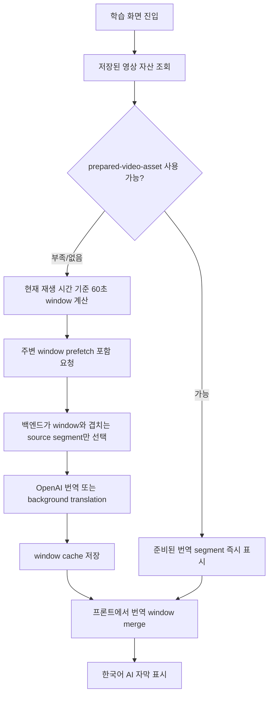

# AI 번역 자막 구현 트러블슈팅 발표자료 전체본

## 1. 발표 핵심 메시지

StudyTube의 번역 자막 문제는 "AI 번역 모델을 한 번 호출하면 끝나는 문제"가 아니었다. 긴 YouTube 강의에서 실제로 어려웠던 부분은 원문 자막 확보, 번역 작업 단위, 사용자 재생 위치와의 동기화, 캐시, fallback, 그리고 이미 준비된 영상 자산과 실시간 window 번역을 어떻게 합칠지였다.

최종 방향은 전체 영상을 한 번에 번역하는 구조가 아니라, 사용자가 보고 있는 구간부터 번역하고, 준비된 자막 자산이 있으면 그것을 우선 사용하며, 부족한 구간은 playback window 단위로 보강하는 구조다.

## 2. 처음 보인 증상

학습 화면에서 사용자는 한국어 AI 자막을 기대했다. 하지만 긴 영상에서는 다음과 같은 일이 반복됐다.

- YouTube 원문 자막은 가져온다.
- 서버 응답에는 caption segment가 있다.
- 그런데 한국어 AI 번역 자막은 늦게 나오거나 비어 있다.
- 화면에서는 자막 생성이 실패한 것처럼 보인다.

처음에는 OpenAI 호출 실패나 프론트 표시 버그처럼 보였다. 하지만 실제로는 여러 문제가 겹쳐 있었다.

## 3. 핵심 원인

### 원인 1. 작업 단위가 너무 컸다

기존에는 영상 전체 transcript를 한 번에 번역하려는 흐름에 가까웠다. 긴 강의 영상은 caption segment가 수천 개까지 늘어날 수 있다. 사용자는 지금 0~60초 구간만 보고 있는데, 서버는 전체 영상 번역을 먼저 끝내려 했다.

사용자 경험 단위는 "현재 재생 구간"인데, 서버 작업 단위는 "전체 영상"이었던 것이다.

### 원인 2. source caption과 translated caption의 의미가 섞일 위험이 있었다

영어 source caption은 번역 재료로는 필요하지만, 한국어 AI 자막 기능의 최종 표시 결과는 아니다. source caption을 그대로 화면에 표시하면 무언가 보이긴 하지만, 기능 요구사항인 한국어 AI 번역 자막과 어긋난다.

그래서 source caption은 pending 상태와 번역 입력으로만 사용하고, 화면에는 `openai-caption-translation` 또는 준비된 번역 자산만 표시해야 했다.

### 원인 3. YouTube caption 수집 자체도 안정적이지 않았다

YouTube timed-text 요청은 rate limit, signed URL, po token, 쿠키, proxy 상태에 영향을 받는다. 즉 "번역" 이전에 "원문 자막을 안정적으로 가져오는 일"도 기술적 챌린지였다.

최신 구현에서는 `YOUTUBE_COOKIES_FILE`이 설정되어 있으면 Netscape cookie file을 읽어 HTTP 요청 cookies로 주입한다. 이로써 yt-dlp 뿐 아니라 서버의 직접 timed-text fetch에서도 같은 인증/세션 힌트를 활용할 수 있다.

## 4. 해결 구조 요약



## 5. 백엔드 기술 포인트

### 5.1 Window 기반 번역

caption API는 `startSeconds`, `endSeconds`를 받아 해당 시간 범위와 겹치는 segment만 번역 대상으로 삼는다.

중요한 점은 segment의 start만 보는 것이 아니라 segment의 시간 범위가 window와 겹치는지 보는 것이다. 예를 들어 58초에 시작해 63초에 끝나는 자막은 60~120초 window에도 영향을 준다.

### 5.2 Inline 번역과 background 번역 분리

짧은 window는 inline으로 바로 번역한다. 처리량이 크거나 즉시 처리하기 어려운 경우에는 source caption 응답을 pending 상태로 돌려주고 background job이 cache에 번역 결과를 채운다.

이때 cache key에는 다음 값들이 포함되어야 한다.

- video id
- target language
- source language
- startSeconds
- endSeconds
- 정책 버전

window 범위를 cache key에 넣지 않으면 서로 다른 시간대의 번역 결과가 충돌할 수 있다.

### 5.3 YouTube 쿠키 파일 지원

최신 변경에서는 `youtube_httpx_request_kwargs()`가 `YOUTUBE_COOKIES_FILE`을 확인한다. 쿠키 파일이 있으면 Netscape cookie format을 파싱해 `httpx.get()` 요청의 cookies에 병합한다.

이 기능은 발표에서 "번역 품질"이 아니라 "자막 원본 수급 안정성"을 높인 챌린지로 설명하면 좋다.

```text
YOUTUBE_COOKIES_FILE -> Netscape cookie file parse -> httpx cookies 주입
```

테스트는 `test_youtube_http_requests_include_configured_cookie_file`로 보장한다.

## 6. 프론트엔드 기술 포인트

### 6.1 Playback window 계산

프론트는 현재 재생 시간을 기준으로 60초 window를 계산한다.

예시:

- 0~59.9초 -> 0~60초
- 60~119.9초 -> 60~120초
- 121.2초 -> 120~180초

이 window 정보가 caption API 요청에 포함된다.

### 6.2 주변 window prefetch

현재 구현은 현재 window만 보지 않고 주변 window도 prefetch할 수 있게 되어 있다. 사용자가 곧 다음 구간으로 넘어갈 것을 고려해, 현재 위치 근처의 번역을 미리 준비하는 전략이다.

이 부분은 `captionTranslationPrefetchWindows()` 테스트로 보장한다.

### 6.3 Prepared video asset 우선 사용

최신 프론트 구조에는 `prepared-video-asset` provider가 있다. 저장된 영상 자산에 이미 번역 segment가 준비되어 있으면 API window 번역을 기다리지 않고 즉시 caption response로 만든다.

준비된 자산은 다음 조건을 만족해야 표시된다.

- status가 `ready` 또는 `partial`
- translatedSegments가 존재
- 현재 영상 id와 언어가 일치

프론트는 `videoAssetCoversTime()`과 `videoAssetCoversRange()`로 준비된 자산이 현재 재생 위치나 window 범위를 충분히 커버하는지도 확인한다.

### 6.4 Prepared asset과 fallback window merge

준비된 자산이 모든 구간을 커버하지 못할 수 있다. 이때 부족한 구간은 window 번역으로 보강한다.

merge 규칙은 다음과 같다.

- `prepared-video-asset`과 `openai-caption-translation`은 표시 가능한 번역 결과로 취급한다.
- `youtube-source-captions`는 merge하지 않는다.
- 같은 시간대 segment는 중복되지 않게 정렬/병합한다.

테스트는 `merges fallback translated windows with prepared asset captions`에서 보장한다.

## 7. 요약 전사문 트러블슈팅

학습 영상 요약의 전사문도 별도 문제가 있었다. 모든 caption segment를 그대로 타임스탬프와 함께 보여주면 너무 길고, 복습용으로 읽기 어렵다.

최신 구현은 전사문을 모든 segment 단위로 뿌리는 대신, `FULL_TRANSCRIPT_INTERVAL_SECONDS = 60` 기준으로 1분 단위 bucket에 묶는다.

즉 다음처럼 바뀐다.

```text
이전: 00:00 문장1
      00:03 문장2
      00:07 문장3

이후: 00:00 문장1 문장2 문장3 ...
      01:00 다음 1분 구간의 핵심 흐름 ...
```

이 방식은 모든 초 단위 자막을 기록하지 않으면서도, 앞부분만 보여주는 문제를 줄이고, 다시 볼 위치를 1분 단위로 찾을 수 있게 한다.

관련 테스트:

- `test_timestamped_transcript_uses_long_timestamp_intervals`
- `test_timestamped_transcript_includes_every_segment_in_long_intervals`

## 8. 왜 임시방편이 아닌가

이 해결은 요약본을 자막처럼 띄우는 것도 아니고, YouTube 기본 자막을 그대로 보여주는 것도 아니다.

요약본은 실제 발화와 시간축이 맞지 않는다. 자막처럼 쓰면 사용자가 듣는 문장과 화면 텍스트가 어긋난다.

YouTube 기본 자막은 source language일 수 있다. 영어 원문을 그대로 표시하면 한국어 AI 번역 자막이라는 요구사항을 만족하지 못한다.

이번 구조는 실제 caption segment의 시간축을 유지하면서, 번역 단위와 표시 단위를 사용자 경험에 맞게 줄인 것이다.

## 9. 검증 포인트

백엔드:

- 요청된 window만 번역하는지
- background job이 중복 실행되지 않는지
- cache key가 window 단위를 구분하는지
- YouTube cookie file이 HTTP 요청 cookies에 반영되는지
- 요약 전사문이 1분 단위 interval로 묶이는지

프론트:

- caption window 계산이 60초 단위로 동작하는지
- 주변 window prefetch가 올바른지
- prepared-video-asset이 caption response로 변환되는지
- prepared asset이 현재 시간/range를 커버하는지
- prepared asset과 fallback translated window가 안전하게 merge되는지
- source caption이 번역 자막에 섞이지 않는지

## 10. 발표 흐름 추천

1. "자막이 안 나온다"는 증상 소개
2. 실제로는 원문 자막은 있었고, 한국어 번역 artifact가 늦었다는 분석
3. 전체 transcript 번역 구조의 한계 설명
4. playback window 번역으로 단위 축소
5. prepared video asset으로 이미 준비된 결과 우선 사용
6. 부족한 구간은 window 번역과 prefetch로 보강
7. YouTube 쿠키 파일 지원으로 원문 자막 수집 안정성 개선
8. 요약 전사문도 1분 단위 타임라인으로 압축
9. 테스트로 보장한 항목 정리

## 11. 발표 마무리 문장

이번 번역 자막 트러블슈팅의 핵심은 AI 모델을 더 세게 호출하는 것이 아니라, 자막 생성 과정을 사용자 재생 경험에 맞게 잘게 나누는 것이었다. 전체 영상을 한 번에 번역하는 대신 prepared asset, playback window, prefetch, cache, provider guard를 조합하면서 긴 영상에서도 더 빠르고 안정적인 한국어 AI 자막 경험을 만들 수 있었다.
