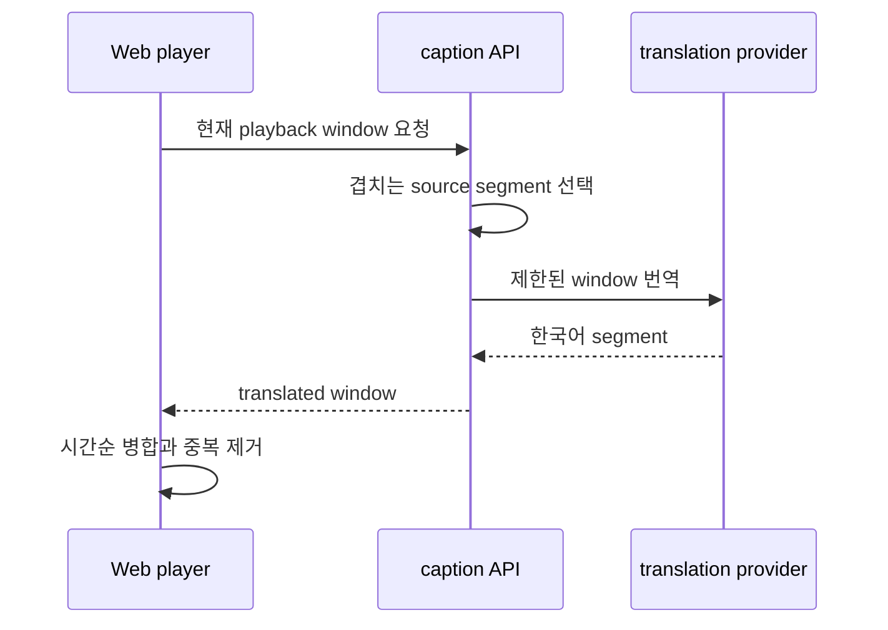

# 긴 영상 자막 번역 지연

## 증상

영어 원본 자막은 조회됐지만 한국어 자막이 재생 시간에 맞춰 나타나지 않았다. 당시 확인한 응답은 `youtube-source-captions`, `translated: false`, source language `en`, segment 2,134개였다.

프론트엔드는 영어 원문을 한국어 자막처럼 표시하지 않았다. 사용자는 실제 조회 성공 여부와 관계없이 자막 기능이 실패한 것으로 볼 수 있었다.

## 원인

사용자는 현재 재생 구간의 자막이 필요했지만 서버는 영상 전체 transcript를 하나의 번역 작업으로 다뤘다. 긴 입력은 여러 batch, timeout과 background 지연을 만들었고 첫 구간도 전체 번역을 기다렸다.

문제는 자막 조회 실패가 아니라 처리 단위와 사용자 경험 단위가 다른 것이었다.

## 당시 해결

재생 시간을 3분 window로 나누고 Web이 `startSeconds`와 `endSeconds`를 보냈다. FastAPI는 window와 겹치는 segment만 번역했고, Web은 `openai-caption-translation` 결과만 기존 상태에 합쳤다.

cache key에는 video, source와 target language, start와 end time을 포함했다. 경계에 걸친 segment도 duration이 window와 겹치면 포함했다.

## 검증 기록

당시 기록에는 Web caption test 88개, Web build, AI test 48개 통과와 environment-dependent skip 6개가 남아 있다. 이 수치는 2026-06-13 구현의 기록이며 current main 전체 test 수가 아니다.

관련 자료는 `docs/demo/studytube-caption-rate-limit-demo.gif`, 당시 Web caption test와 AI test history에 있다.

## 현재 구조와의 관계

Current main은 caption을 immutable generation과 progressive phase로 관리한다. 학습 context, watched range, provider budget, durable work와 active caption version이 추가됐으므로 이 문서의 3분 window 구현을 현재 전체 pipeline 설명으로 사용하지 않는다.

비슷한 증상이 생기면 다음 순서로 확인한다.

1. source와 Korean caption generation의 phase를 구분한다.
2. 요청한 context와 watched range가 current generation과 일치하는지 확인한다.
3. provider budget admission과 work claim 상태를 확인한다.
4. source fallback을 translated caption으로 표시하지 않는지 확인한다.
5. current [architecture](../../architecture.md)와 [verification](../../verification.md)에서 최신 경계를 확인한다.

## 남은 한계

YouTube caption 제공 여부와 외부 translation provider는 영상과 환경에 따라 실패할 수 있다. production STT fallback은 별도 비용 승인이 없으면 활성화되지 않는다.
