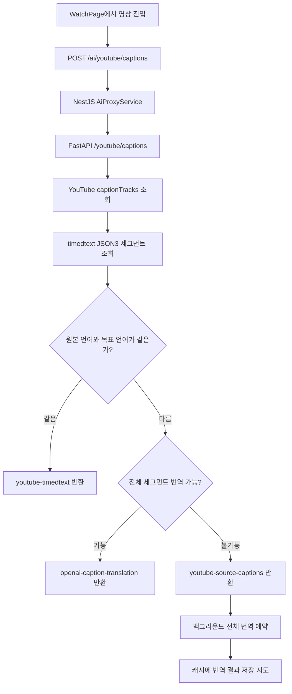
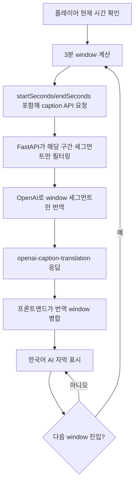
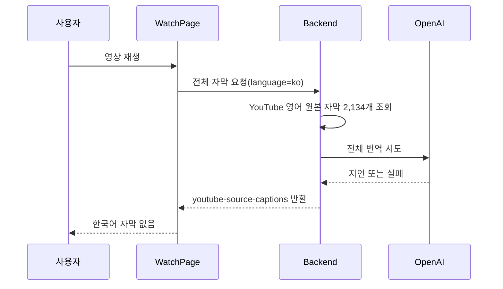
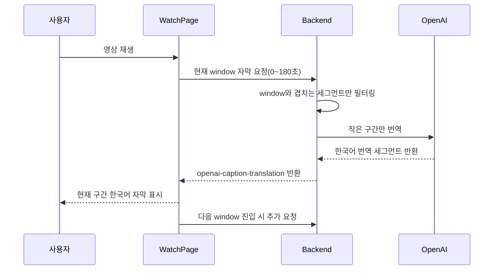

# 자막 번역 구현 과정 트러블슈팅

## 한 줄 요약

긴 YouTube 영상의 자막 번역을 "영상 전체 번역"으로 처리하던 방식이 실시간 시청 경험과 맞지 않아 실패처럼 보였고, 이를 "현재 재생 구간 단위 번역"으로 바꿔 해결했다.

## 발표용 핵심 메시지

- 문제는 자막을 못 가져오는 것이 아니었다.
- 실제 문제는 영어 원본 자막은 가져왔지만, 한국어 번역 자막이 재생 시점에 맞춰 준비되지 않는 것이었다.
- 기존 구조는 긴 영상을 하나의 큰 번역 작업으로 처리했다.
- 긴 강의 영상은 자막 세그먼트가 수천 개라서 전체 번역을 기다리면 사용자 입장에서는 자막 기능이 실패한 것처럼 보였다.
- 해결 방향은 "전체 영상 번역"이 아니라 "현재 보고 있는 구간부터 번역"이었다.
- 백엔드는 `startSeconds`와 `endSeconds`를 받아 해당 구간만 번역하고, 프론트엔드는 재생 시간 기준으로 3분 단위 번역 요청을 보내도록 변경했다.

## 배경

StudyTube의 목표는 YouTube 강의 영상을 보면서 한국어 AI 자막을 함께 제공하는 것이다. 사용자는 등록한 영상을 학습 화면에서 재생하고, 영상 아래 또는 오버레이 영역에서 한국어로 번역된 자막을 확인할 수 있어야 한다.

이번 이슈는 PostgreSQL 긴 강의 영상을 테스트하면서 발견했다. 테스트 대상 영상은 YouTube video id `qw--VYLpxG4`였고, 서버는 YouTube timed-text 원본 자막을 정상적으로 가져오고 있었다.

하지만 실제 API 응답은 다음과 같았다.

```json
{
  "provider": "youtube-source-captions",
  "language": "ko",
  "sourceLanguage": "en",
  "translated": false,
  "message": "Timed-text source captions loaded while translation is unavailable.",
  "segmentCount": 2134
}
```

이 응답이 의미하는 것은 명확했다.

- YouTube 원본 자막 조회는 성공했다.
- 원본 언어는 영어였다.
- 사용자가 원하는 언어는 한국어였다.
- 아직 번역된 한국어 자막은 준비되지 않았다.
- 총 세그먼트 수는 2,134개였다.

즉, 장애의 본질은 "자막 없음"이 아니라 "번역 결과가 재생 경험에 맞는 시간 안에 도착하지 않음"이었다.

## 사용자에게 보인 증상

- 등록한 영상을 재생해도 한국어 AI 자막이 보이지 않았다.
- 서버에는 세그먼트가 존재했지만 프론트엔드에는 표시되지 않았다.
- 사용자는 "자막 생성이 실패했다"고 느낄 수밖에 없었다.
- 다시 요청해도 `youtube-source-captions` 응답이 반복되었다.
- 긴 영상일수록 문제가 더 잘 드러났다.

프론트엔드가 자막을 표시하지 않은 이유도 있었다. 선택 언어가 한국어인데 서버가 영어 원본 자막을 반환했으므로, 한국어 AI 자막 영역에 영어 원본을 그대로 보여주면 제품 요구사항을 어기게 된다. 그래서 기존 표시 가드는 source caption을 한국어 자막처럼 렌더링하지 않았다.

## 기존 자막 처리 흐름



이 구조의 핵심 문제는 번역 단위가 너무 컸다는 점이다. 사용자는 지금 0초부터 180초 사이를 보고 있는데, 서버는 영상 전체 2,134개 세그먼트를 하나의 번역 대상으로 취급하고 있었다.

## 왜 실패했는가

### 1. 전체 영상 번역은 실시간 UI와 맞지 않았다

긴 강의 영상의 전체 자막을 한 번에 번역하면 다음 문제가 생긴다.

- 입력 텍스트가 너무 길어진다.
- 번역 API 호출이 여러 배치로 쪼개진다.
- 중간 실패나 timeout 가능성이 커진다.
- 사용자가 보는 첫 화면의 자막도 전체 작업이 끝나기 전까지 준비되지 않는다.

학습 화면의 요구사항은 "언젠가 전체 번역본을 만든다"가 아니라 "지금 보고 있는 부분의 자막이 바로 필요하다"였다.

### 2. 백그라운드 전체 번역만으로는 UX를 보장할 수 없었다

기존 구조에서는 원본 자막을 먼저 반환하고, 한국어 전체 번역은 백그라운드에서 처리하려고 했다. 이 방식은 짧은 영상이나 세그먼트 수가 적은 영상에서는 괜찮을 수 있다.

하지만 긴 영상에서는 다음 한계가 있었다.

- 사용자는 백그라운드 작업 완료 여부를 체감하기 어렵다.
- 작업이 늦어지면 계속 자막이 없는 화면으로 보인다.
- 재요청해도 아직 캐시가 없으면 다시 source caption만 받는다.
- 영상 앞부분을 보는 사용자에게도 전체 영상 번역 완료를 기다리게 만든다.

### 3. 영어 원본 자막을 임시로 보여주는 것은 해결책에서 제외했다

문제 해결 과정에서 가능한 선택지 중 하나는 영어 원본 자막을 임시로 보여주는 것이었다. 하지만 사용자가 요청한 것은 한국어 AI 자막이고, 선택 언어도 한국어였다.

따라서 이번 구현에서는 영어 source caption을 커스텀 자막 오버레이에 표시하지 않았다. 대신 한국어 번역 결과가 준비된 구간만 안전하게 병합해서 보여주는 방향을 선택했다.

### 4. YouTube `tlang` 번역에만 기대기 어려웠다

YouTube timedtext에는 `tlang` 파라미터를 통해 번역 자막을 요청할 수 있는 경우가 있다. 그러나 이것만으로 제품 기능을 보장하기에는 부족했다.

- 영상별로 caption track 상태가 다르다.
- 자동 번역 결과 품질과 제공 여부가 일관적이지 않다.
- 실패했을 때 우리가 제어 가능한 fallback이 필요하다.

그래서 OpenAI 기반 번역 경로를 유지하되, 처리 단위를 바꾸는 방식으로 문제를 해결했다.

## 근본 원인

근본 원인은 자막 번역의 작업 단위가 사용자 경험의 단위와 달랐다는 것이다.

- 사용자 경험의 단위: 현재 재생 중인 몇 분 구간
- 기존 서버 처리 단위: 영상 전체 transcript
- 실제 실패 지점: 전체 번역 완료 전에 사용자가 자막을 필요로 함

정리하면, 이 문제는 단순한 API 실패가 아니라 비동기 처리 타이밍과 작업 단위 설계 문제였다.

## 해결 전략

전체 영상을 먼저 번역하는 대신, 현재 재생 위치 주변의 작은 시간 구간만 번역한다.



이 방식의 장점은 다음과 같다.

- 첫 자막을 보기 위해 전체 영상 번역을 기다리지 않는다.
- 번역 입력 크기가 항상 제한된다.
- 실패 범위가 전체 영상이 아니라 특정 window로 줄어든다.
- 이미 번역한 window는 캐시로 재사용할 수 있다.
- 긴 영상도 재생 흐름에 맞춰 점진적으로 번역할 수 있다.

## 백엔드 구현 내용

### API 요청 파라미터 확장

FastAPI의 `/youtube/captions` 요청이 `startSeconds`와 `endSeconds`를 받을 수 있도록 확장했다.

역할은 다음과 같다.

- `startSeconds`: 번역을 시작할 재생 시간
- `endSeconds`: 번역을 끝낼 재생 시간
- 둘 다 있을 때만 window 번역 경로를 사용
- 없으면 기존 전체 자막 조회 흐름 유지

### window 필터링 함수 추가

원본 timed-text 세그먼트 전체를 번역하지 않고, 현재 window와 겹치는 세그먼트만 골라내도록 했다.

핵심 기준은 "세그먼트 시작 시간이 window 안에 있는가"만이 아니라 "세그먼트 시간 범위가 window와 겹치는가"이다. 자막 세그먼트는 시작 시간과 duration을 가지므로, window 경계에 걸쳐 있는 세그먼트도 포함되어야 한다.

예를 들면 다음과 같다.

- window: 180초부터 360초
- 세그먼트: 178초부터 182초
- 이 세그먼트는 180초 이후에도 화면에 남아 있으므로 포함해야 한다.

### 캐시 키에 window 포함

기존에는 `videoId + language` 중심으로 캐시를 구성했다면, window 번역에서는 같은 영상과 같은 언어라도 구간별 결과가 다르다.

그래서 캐시 키에 다음 정보를 포함했다.

- `videoId`
- target language
- source language
- `startSeconds`
- `endSeconds`

이를 통해 0~180초 번역과 180~360초 번역이 서로 덮어쓰지 않도록 했다.

### source caption fallback과 window translation 분리

서버는 여전히 YouTube 원본 자막을 fallback으로 가져올 수 있다. 하지만 프론트엔드가 한국어 AI 자막을 요청한 상황에서는 source caption을 최종 표시 데이터로 취급하지 않는다.

이번 수정의 핵심은 source caption을 표시하는 것이 아니라, source caption을 번역 재료로 사용해서 window 단위 한국어 caption을 만드는 것이다.

## 프론트엔드 구현 내용

### caption API 요청 타입 확장

`web/src/api.ts`의 caption 요청 타입에 `startSeconds`와 `endSeconds`를 추가했다.

이를 통해 WatchPage가 현재 재생 시간에 맞는 window 정보를 백엔드로 전달할 수 있게 되었다.

### 재생 시간 기반 window 요청

`web/src/App.tsx`의 WatchPage에서 현재 재생 시간을 기준으로 번역 window를 계산한다.

구현 의도는 다음과 같다.

- 현재 시간이 0~180초면 0~180초 window 요청
- 현재 시간이 181~360초면 180~360초 window 요청
- 이미 요청한 window는 중복 요청하지 않음
- source caption 상태일 때만 window 번역 요청을 수행

중복 요청 방지를 위해 `captionWindowRequestKeysRef`를 사용했다. 이 ref는 이미 요청한 `videoId + language + window` 조합을 기억한다.

### 번역 window 응답 병합

서버가 `openai-caption-translation` 응답을 반환하면, 프론트엔드는 기존 자막 상태에 번역된 세그먼트를 병합한다.

이때 중요한 조건이 있다.

- 병합 대상은 `openai-caption-translation` provider만 허용
- `youtube-source-captions`는 병합하지 않음
- 같은 시간대 세그먼트가 중복으로 들어오지 않도록 정렬 및 병합 처리

이를 통해 영어 source caption이 한국어 자막 목록에 섞이는 문제를 막았다.

## 변경 전후 비교

### 변경 전



### 변경 후



## 테스트로 검증한 내용

### 백엔드 테스트

`ai/test_main.py`에 window 번역 테스트를 추가했다.

검증 포인트:

- `startSeconds/endSeconds`가 있는 요청에서 전체 세그먼트를 번역하지 않는다.
- window와 겹치는 세그먼트만 번역 대상으로 선택한다.
- 응답 provider가 `openai-caption-translation`으로 내려온다.
- source caption fallback이 아니라 실제 번역 결과가 반환된다.

테스트 이름:

```text
test_youtube_captions_translates_only_requested_caption_window
```

### 프론트엔드 테스트

`web/tests/captions.test.ts`에 번역 window 병합 테스트를 추가했다.

검증 포인트:

- 번역된 caption window는 기존 caption response에 병합된다.
- 영어 source caption은 병합되지 않는다.
- provider guard가 깨지지 않는다.
- 병합 후 세그먼트 순서가 안정적으로 유지된다.

테스트 이름:

```text
merges translated caption windows without adding source captions
```

## 실제 검증 명령

프론트엔드 caption 테스트:

```powershell
node --experimental-strip-types --test web\tests\*.test.ts
```

결과:

```text
88 pass
```

프론트엔드 빌드:

```powershell
npm --prefix web run build
```

결과:

```text
build pass
```

AI 서버 테스트:

```powershell
ai\.venv\Scripts\python.exe -m unittest test_main
```

실행 위치:

```text
ai
```

결과:

```text
48 tests, 6 skipped, OK
```

주의할 점:

- AI 테스트는 프로젝트 venv에서 실행해야 한다.
- 번들 Python으로 실행하면 `httpx` 또는 OpenAI 관련 의존성이 맞지 않아 실패할 수 있다.
- 이 실패는 구현 실패가 아니라 실행 환경 차이 문제였다.

## 발표에서 강조하면 좋은 포인트

### 1. 실패를 API 에러로만 보지 않았다

처음에는 "자막이 안 나온다"는 증상으로 보였지만, 응답을 직접 확인해보니 서버는 세그먼트를 반환하고 있었다. 따라서 문제를 "조회 실패"가 아니라 "사용자가 원하는 언어의 caption artifact가 제때 준비되지 않음"으로 재정의했다.

### 2. 작업 단위를 UI 단위에 맞췄다

전체 영상은 서버 입장에서 자연스러운 단위지만, 사용자 입장에서는 현재 보고 있는 몇 분이 중요하다. 이 차이를 줄인 것이 핵심 설계 변경이었다.

### 3. fallback 데이터를 그대로 보여주지 않았다

영어 source caption을 표시하면 당장은 무언가 보이지만, 한국어 AI 자막이라는 기능 요구사항을 흐리게 만든다. 그래서 source caption은 번역 재료로만 사용하고, 표시 데이터에는 번역된 결과만 넣었다.

### 4. 긴 입력을 작은 window로 나눴다

긴 영상 전체를 한 번에 번역하면 실패 범위가 전체 영상이 된다. window 방식은 실패 범위를 특정 시간 구간으로 좁히고, 성공한 구간은 바로 사용자에게 보여줄 수 있다.

## 슬라이드 구성안

### Slide 1. 문제 상황

제목: 긴 영상에서 한국어 자막이 나오지 않았다

핵심 내용:

- YouTube 원본 자막은 존재했다.
- 서버 응답에는 2,134개 세그먼트가 있었다.
- 하지만 provider는 `youtube-source-captions`였다.
- 사용자는 한국어 AI 자막이 실패했다고 느꼈다.

발표 멘트:

> 처음에는 자막 생성 자체가 실패한 것처럼 보였습니다. 하지만 API 응답을 확인해보니 자막 세그먼트는 정상적으로 내려오고 있었고, 문제는 영어 원본 자막이 한국어로 번역되기 전에 화면에 도착한다는 점이었습니다.

### Slide 2. 기존 구조

제목: 전체 영상을 하나의 번역 작업으로 처리했다

핵심 내용:

- WatchPage가 caption API 호출
- FastAPI가 YouTube timed-text 조회
- 원본 언어와 목표 언어가 다르면 전체 번역 시도
- 실패하거나 늦으면 source caption 반환

발표 멘트:

> 기존 구조는 영상 전체 transcript를 먼저 번역하려는 방식이었습니다. 짧은 영상에서는 괜찮지만, 긴 강의 영상에서는 전체 작업이 끝나기 전까지 첫 자막도 준비되지 않는 문제가 생겼습니다.

### Slide 3. 근본 원인

제목: 번역 단위와 사용자 경험 단위가 달랐다

핵심 내용:

- 사용자는 현재 재생 구간의 자막이 필요하다.
- 서버는 전체 영상 번역을 시도했다.
- 긴 영상은 세그먼트 수가 많아 timeout과 지연 위험이 컸다.
- 비동기 백그라운드 번역만으로는 화면 경험을 보장하지 못했다.

발표 멘트:

> 이 문제는 단순히 OpenAI 호출이 실패했다기보다, 우리가 번역해야 할 단위를 잘못 잡은 문제였습니다. 화면은 현재 구간을 요구하는데 서버는 전체 영상을 처리하고 있었습니다.

### Slide 4. 해결 방향

제목: 전체 transcript에서 playback window로 전환

핵심 내용:

- 현재 재생 시간을 기준으로 3분 window 계산
- `startSeconds/endSeconds`를 API에 전달
- 백엔드는 window와 겹치는 세그먼트만 번역
- 프론트엔드는 번역된 window만 병합

발표 멘트:

> 해결 방향은 전체 영상 번역을 기다리는 것이 아니라, 지금 보고 있는 구간부터 번역하는 것이었습니다. 이렇게 하면 첫 자막을 보여주기 위해 전체 영상 처리를 기다릴 필요가 없어집니다.

### Slide 5. 구현 디테일

제목: backend는 작은 번역, frontend는 안전한 병합

핵심 내용:

- FastAPI request schema 확장
- window segment filtering 추가
- cache key에 window 범위 포함
- WatchPage에서 window별 요청 중복 방지
- `openai-caption-translation`만 병합

발표 멘트:

> 백엔드는 작은 구간만 번역하고, 프론트엔드는 그 결과를 기존 자막 상태에 안전하게 합칩니다. 특히 영어 source caption이 한국어 자막에 섞이지 않도록 provider guard를 유지했습니다.

### Slide 6. 검증 결과

제목: 긴 영상에서도 progressive caption이 가능해졌다

핵심 내용:

- 프론트 caption 테스트 88개 통과
- 웹 빌드 통과
- AI 서버 unittest 48개 통과, 6개 skip
- 긴 영상 전체가 아니라 현재 window부터 번역 가능

발표 멘트:

> 최종적으로 자막 번역은 batch job에 가까운 구조에서 progressive streaming에 가까운 구조로 바뀌었습니다. 긴 영상에서도 첫 구간부터 한국어 자막을 준비할 수 있게 되었고, 실패 범위도 전체 영상이 아니라 특정 window로 줄었습니다.

## 최종 변경 파일

- `ai/main.py`: FastAPI caption window 요청, window filtering, window cache, source caption 번역 경로 수정
- `ai/test_main.py`: backend window translation 테스트 추가
- `web/src/api.ts`: caption API 요청 타입에 `startSeconds/endSeconds` 추가
- `web/src/App.tsx`: WatchPage에서 재생 시간 기반 window 요청 및 번역 응답 상태 관리
- `web/src/captions.ts`: 번역 caption window 병합 로직 추가
- `web/tests/captions.test.ts`: source caption 제외 및 translated window merge 테스트 추가

## 트러블슈팅 체크리스트

비슷한 문제가 다시 생기면 아래 순서로 확인한다.

1. caption API 응답의 `provider`를 확인한다.
2. `translated`가 `true`인지 확인한다.
3. `sourceLanguage`와 요청한 `language`가 다른지 확인한다.
4. `segmentCount`가 큰 영상인지 확인한다.
5. `startSeconds/endSeconds`가 요청에 포함되는지 확인한다.
6. 응답 provider가 `openai-caption-translation`인지 확인한다.
7. 프론트엔드 병합 로직이 source caption을 제외하고 있는지 확인한다.
8. 같은 window를 불필요하게 반복 요청하고 있지 않은지 확인한다.
9. AI 테스트는 반드시 `ai\.venv` 환경에서 실행한다.

## 회고

이번 이슈는 "데이터가 있는가"보다 "사용자가 필요한 형태로, 필요한 시점에 도착하는가"가 더 중요하다는 점을 보여준다.

원본 자막 세그먼트는 있었다. 하지만 한국어 학습 자막이라는 제품 기능을 만족하려면 영어 원본 세그먼트를 가져오는 것만으로는 부족했다. 사용자가 현재 보고 있는 구간의 한국어 번역이 필요했고, 그래서 번역 단위를 전체 영상에서 playback window로 바꾸는 것이 핵심이었다.

이 구조는 앞으로 다음 확장에도 유리하다.

- window 단위 prefetch
- 자막 품질 개선 재번역
- 구간별 번역 실패 재시도
- 특정 구간만 요약 또는 퀴즈 생성
- 사용자가 많이 보는 구간 우선 캐싱

## 관련 자료

- 데모 자료: `docs/demo/studytube-caption-rate-limit-demo.gif`
- 프론트엔드 테스트: `web/tests/captions.test.ts`
- 백엔드 테스트: `ai/test_main.py`
