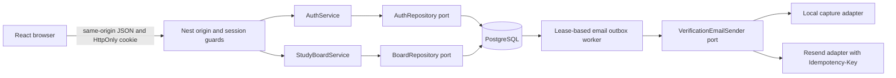
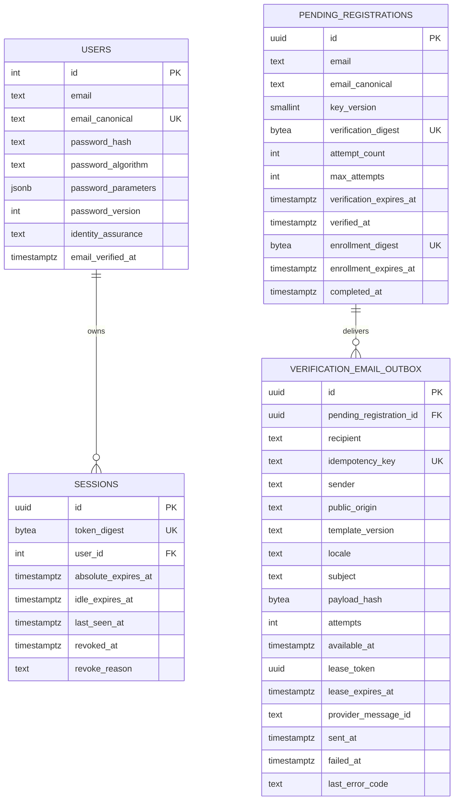
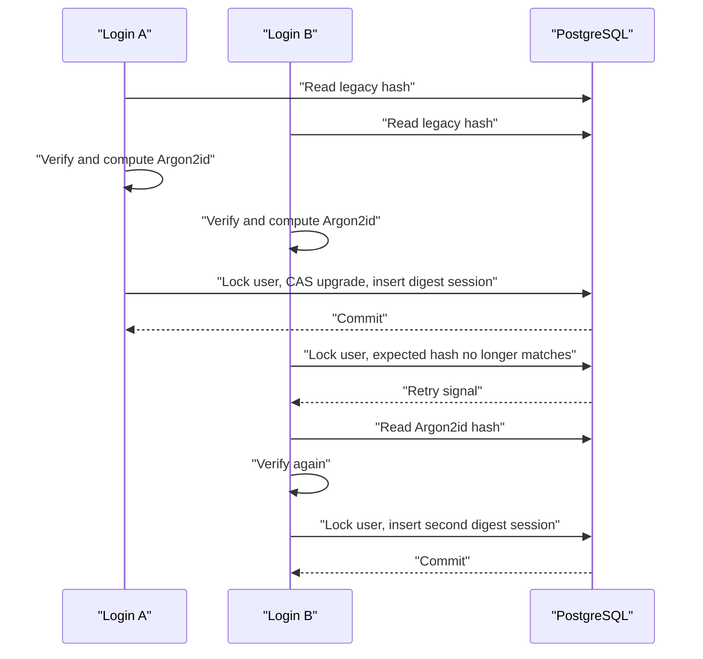

# StudyTube Backend Authentication Hardening Design

## Status

- GitHub issue: `#7 Backend security: build race-safe authentication and cookie sessions`
- Branch: `codex/issue-7-auth`
- Depends on: completed migration foundation in `#6`
- Production browser verification depends on the minimal HTTPS boundary in `#11`

## Problem

StudyTube currently hashes passwords with unsalted SHA-256, stores raw session tokens in PostgreSQL and browser localStorage, and trusts a client-side session object before checking the server. A user cannot reliably log out on the server, sessions do not expire, signup reveals whether an email exists, and email ownership is never verified.

The dangerous part is not only the cryptography. Authentication state is mutated by concurrent signup, login, password change, verification, renewal, and logout requests. A secure replacement therefore needs explicit transaction boundaries and observable race tests, not a collection of endpoint-level checks.

## Goals

- Replace SHA-256 password storage with benchmarked Argon2id and upgrade legacy hashes after a successful login.
- Keep browser credentials only in an HttpOnly cookie and keep only token digests in PostgreSQL.
- Require email ownership verification before the first session can be created.
- Make signup, login, verification, rate limiting, session renewal, logout, and password change race-safe.
- Prevent account enumeration through stable signup and login contracts.
- Persist verification email work in the same transaction as the state that requires the email.
- Recover email delivery after a process crash without sending the same message twice inside the supported retry window.
- Move authorization from ad hoc controller header forwarding into guards and explicit authenticated principals.
- Remove legacy browser tokens without merging local drafts across accounts.
- Produce benchmark, concurrency, failure-recovery, and secret-canary evidence suitable for a backend portfolio case study.

## Non-goals

- OAuth, social login, passkeys, MFA, password reset, and account deletion are separate product work.
- JWT is not introduced. StudyTube needs revocable server-side sessions.
- Redis and BullMQ are not introduced in this issue. The email outbox is PostgreSQL-backed and feature-local; `#2` may later generalize it.
- Terraform, Kubernetes, and required RDS adoption are not part of this work.
- `#11` owns the real HTTPS reverse proxy and final browser-level Secure-cookie verification. This issue owns the application code and header-level tests.

## Security references

- OWASP password storage guidance: <https://cheatsheetseries.owasp.org/cheatsheets/Password_Storage_Cheat_Sheet.html>
- OWASP session management guidance: <https://cheatsheetseries.owasp.org/cheatsheets/Session_Management_Cheat_Sheet.html>
- OWASP CSRF and origin validation guidance: <https://cheatsheetseries.owasp.org/cheatsheets/Cross-Site_Request_Forgery_Prevention_Cheat_Sheet.html>
- Node 24 built-in Argon2 API: <https://nodejs.org/download/release/v24.16.0/docs/api/crypto.html#cryptoargon2algorithm-parameters-callback>
- Resend 24-hour request idempotency contract: <https://resend.com/docs/dashboard/emails/idempotency-keys>

## Threat model

The design directly addresses these attacker capabilities:

- Read browser localStorage through an XSS bug and reuse a stolen credential elsewhere.
- Read a database snapshot and attempt offline password cracking or direct session reuse.
- Submit cross-origin state-changing requests while a victim is logged in.
- Probe signup and login responses to discover registered accounts.
- Race duplicate signup, verification, login, renewal, logout, or password-change requests.
- Restart or scale the API to bypass in-memory limits.
- Crash the process between database commit, provider acceptance, and outbox acknowledgement.
- Trigger errors that cause passwords, cookies, verification tokens, or provider keys to enter logs.
- Log in as a second account in the same browser and observe the previous account's local drafts.

The design does not claim that HttpOnly prevents an active same-origin XSS from issuing requests as the victim. Content Security Policy and broader browser hardening remain part of the HTTPS boundary and frontend security work.

## System boundaries



`AuthService` depends on an `AuthRepository` application port. `DatabaseService` implements that port but secure auth operations fail closed when PostgreSQL is unavailable. They never fall back to the file-backed memory repository because that would silently discard rate limits, revocations, and session history after a restart.

## Core invariants

1. A password is never stored or logged in plaintext and is never silently trimmed.
2. A successful new password hash is Argon2id with the configured parameters.
3. A legacy SHA-256 hash changes only after the supplied password has been verified and the login transaction wins its compare-and-set check.
4. A raw session token exists only in process memory, the Set-Cookie header, and the browser cookie jar.
5. StudyTube's database, logs, and browser storage never retain a raw verification or enrollment secret. The configured email provider, recipient inbox, and explicit local capture adapter are separate trusted delivery boundaries that necessarily receive the verification link.
6. PostgreSQL stores SHA-256 digests of session, verification, and enrollment secrets, never the raw secrets.
7. A new user and its first authenticated session are created only after email proof and password selection complete in the same transaction. Legacy accounts use an explicit grandfathered assurance state rather than a false verified claim.
8. All unsafe browser requests pass exact Origin validation and JSON content-type validation.
9. Signup acceptance does not reveal whether the canonical email already exists.
10. Rate-limit checks and increments are one atomic PostgreSQL operation.
11. Authentication mutations use one of two explicit lock families. New-account completion locks the pending registration, inserts the user, and inserts the first session. Existing-account mutation locks the user, then the current session, then related sessions. Verification consume locks only its pending registration, and the outbox worker locks only outbox rows.
12. Email is never sent before the transaction that created its verification record commits.
13. A provider retry uses the same idempotency key and byte-for-byte equivalent message payload, enforced by stored immutable rendering inputs and a payload hash.
14. Browser private UI and account-scoped local storage are not mounted until `GET /me` confirms the cookie identity.
15. Argon2 work is admitted only after durable rate limiting and through a bounded per-process memory budget and queue.

## Runtime and dependency floor

CI and the local toolchain already run Node 24.16. The API package engine is raised from Node 20 to Node 24.8 or newer because Node 20 is past end of life and Node added built-in Argon2 in 24.7. The password hasher wraps asynchronous `node:crypto.argon2`, emits a strictly parsed PHC string, and verifies with `timingSafeEqual`. This avoids a native npm dependency while keeping the parameters and encoded format explicit.

Express response cookies are serialized through `Response.cookie`; request parsing accepts only the configured exact cookie name and base64url token grammar. The Resend adapter uses Node 24 `fetch` directly. No provider SDK type enters an application port.

`Argon2WorkLimiter` admits a configured number of hashes based on an explicit memory budget, using `floor(memoryBudgetMiB / 64)` as a hard upper bound and reserving application headroom through a lower configured concurrency. The default is concurrency 2 with at most 16 queued jobs. A full queue returns a stable busy response with Retry-After instead of allocating more memory. Startup rejects a concurrency or queue policy that exceeds the declared budget.

## Password policy and migration

### New hashes

The default policy is Argon2id with 65,536 KiB memory, time cost 3, parallelism 1, a 32-byte hash, a library-generated random salt, and PHC string encoding.

This is above the OWASP minimum and must be validated on the actual CI and deployment class. `api/scripts/benchmark-password-hash.ts` runs warmup plus repeated hash and verify samples at concurrency 1 and the configured production concurrency. It records median and p95 latency, peak RSS, event-loop delay, rejection behavior at a full queue, and machine-readable policy evidence. The single-request median target is 100 to 500 ms, while the concurrent run must remain within the declared memory budget and configured latency bound. A parameter or concurrency change requires new benchmark evidence.

Passwords keep their exact Unicode value. Validation enforces 8 to 128 UTF-8 bytes, rejects control characters, and does not apply composition rules or truncation.

### Legacy upgrade

Existing 64-character lowercase hexadecimal hashes are tagged `legacy_sha256` by the migration. The exact `disabled:demo-seed-login` marker is tagged `disabled` and remains unable to authenticate. Any other legacy password representation aborts the migration with the affected user IDs instead of being mislabeled. Existing users receive `identity_assurance = 'legacy_grandfathered'`, not `email_verified`. Login remains available so the cutover does not lock out pre-verification accounts, but the portfolio claim is limited to verified ownership for accounts created after this migration.

Login uses a bounded retry loop:

1. Read the user and encoded hash without a lock.
2. Verify the supplied password outside a database lock. Unknown users run a fixed dummy Argon2 verification.
3. Build a fresh Argon2id hash when the stored hash is legacy or needs rehashing.
4. Start a transaction, lock the user, and compare the current hash and password version with the values that were verified.
5. If they still match, apply the upgrade and insert the new session in the same transaction.
6. If another login upgraded the same password first, refetch, verify the supplied password against the new hash, and retry once.
7. If a password change won, verification against the new password fails and login returns the generic 401 response.

This avoids stale-password session creation and the false 401 that a naive compare-and-set upgrade would cause for two concurrent valid legacy logins.

## Email identity and signup

The first release accepts printable ASCII email only. The canonicalization algorithm first rejects non-ASCII bytes and control characters, trims surrounding ASCII space bytes only, validates the address grammar, and lowercases into a separate `email_canonical` column. `email` remains the trimmed display value. PostgreSQL applies an exact-byte unique constraint to `email_canonical`; it does not attempt a second Unicode or locale-dependent canonicalization. The migration executes the same ordered checks and transformation before backfill, then aborts with affected row IDs for invalid legacy values or an actionable collision report for duplicate canonical values.

`POST /auth/signup` accepts only `email` and always returns HTTP 202 with the same body:

```json
{
  "status": "accepted",
  "message": "If the address can be registered, a verification email will be sent."
}
```

For an email not present in `users`, one transaction inserts a `pending_registrations` row and its verification email outbox event. It does not create a user and does not accept or hash a password. Each permitted attempt has its own UUID and token, so one attempt never reuses credentials chosen by another attempt. For an existing account, no registration is created. Both paths use the same status and body, PostgreSQL-backed rate limits, and a minimum response-duration policy to reduce measurable enumeration leakage.

`POST /auth/email-verifications/resend` accepts an email and uses the same request transaction and 202 contract. It is rate-limited independently but does not mutate an existing user. Multiple pending attempts may coexist within the strict limit, avoiding a token-invalidation denial of service; the first completed user insert wins the unique email constraint.

The two-step flow prevents pre-hijacking:

1. A browser requests verification for an email without choosing credentials.
2. The email owner opens the link and posts the verification token.
3. Successful consume creates a new random 10-minute enrollment token, stores only its digest on the pending row, marks the email proof consumed, and returns the raw token only as an HttpOnly `__Host-studytube_enrollment` cookie.
4. The verified browser submits `name` and `password` to `POST /auth/registrations/complete` with that cookie.
5. After durable rate admission, Argon2 work runs through the memory limiter.
6. One transaction locks the pending registration, rechecks the enrollment digest and expiry, inserts the verified user, creates the first digest session, consumes the enrollment, and commits.
7. The controller clears the enrollment cookie and sets the authenticated session cookie.

An attacker can request mail for a victim but cannot select the victim's password before email proof. Clicking an unexpected link alone never activates attacker-chosen credentials.

## Verification-token design

A verification token has the external format `v1.<pending registration UUID>.<base64url HMAC secret>`.

The secret is derived as HMAC-SHA-256 over `email-verification:v1:<pending registration UUID>` using a versioned server pepper. PostgreSQL stores the UUID, key version, and SHA-256 digest of the derived secret. The email outbox stores the pending UUID but never the raw token. The worker can therefore reconstruct the same token after a crash without persisting it.

The email link uses `https://studytube.example/verify-email#token=<token>`. The web page reads the fragment, immediately removes it with `history.replaceState`, and posts it once. It never writes the token to browser storage.

Pending registrations have a 30-minute email-proof expiry, a maximum of five verification attempts, an email-proof consumed timestamp, an enrollment digest and expiry, and a completion timestamp. Verification consume locks only the pending row, rechecks state, compares digests in constant time, and atomically installs the enrollment digest. Two concurrent consumes can produce only one enrollment. Completion then locks the pending row before attempting the unique user insert; two competing verified registrations can produce only one account and one first session.

## Session design

### Token and cookie

Session tokens are 32 cryptographically random bytes encoded as base64url. The database stores `SHA-256(token)` as `BYTEA` with a unique constraint.

Production uses `__Host-studytube_session=<token>; Path=/; HttpOnly; Secure; SameSite=Lax` with no Domain attribute. Local HTTP development uses the separate name `studytube_session` without Secure because browsers reject a `__Host-` cookie over HTTP. Production configuration cannot select development cookie mode.

Login always creates a new token and ignores any existing cookie, preventing session fixation. Responses contain the public user only; no JSON response contains a token.

### Lifecycle

Each session stores an application-generated UUID, token digest, user ID, creation time, seven-day absolute expiry, 24-hour idle expiry, last-seen time, revoked time, and sanitized revocation reason.

An authenticated request is valid only when it is not revoked and both expiry checks pass. A request touches the row at most once every 15 minutes. The atomic touch uses `LEAST(absolute_expires_at, now() + interval '24 hours')`, so sliding activity can never exceed the absolute lifetime. Concurrent touches converge on the same valid interval and do not rotate the cookie.

Logout atomically revokes the current digest and always clears the browser cookie. After the revoke transaction commits, later lookups fail. A request whose guard linearized before logout may complete; the race test records this boundary rather than claiming cancellation of work already authorized.

### Account and password change

The browser no longer carries the current password in router state. It submits `currentPassword` in the same `PUT /me` request as a name or password change. Preference-only changes do not require a password because they are not account-control mutations.

The service consumes the durable login rate limit, verifies the current password outside database locks through the Argon2 work limiter, and then runs one account-change transaction:

1. Lock the user and compare the verified hash and password version.
2. Lock the current active session.
3. Apply the name change, or write the new Argon2id hash and increment `password_version`.
4. For a password change, revoke every existing session and insert a replacement digest session.
5. Commit before returning a replacement cookie.

If a concurrent legacy upgrade changes only the encoded hash, the service refetches and re-verifies once. If a concurrent password change wins, the old password no longer verifies and the update fails. This keeps current-password proof and mutation in one HTTP use case without a reusable reauthentication grant.

## Data model

The new migration modifies `users`, replaces the legacy raw-token `sessions` table, and adds three feature tables.



`auth_rate_limits` is independent of user existence. Its primary key is the action, HMAC-derived subject digest, and fixed window start. The row contains the atomic attempt count and expiry.

The migration deliberately invalidates every legacy raw-token session. A dual raw-token and digest lookup period would preserve the credential exposure this issue removes. Rollback to raw credentials is unsupported. Production activation is deferred to `#11`, where a maintenance cutover must stop writes, create and verify a `pg_dump`, deploy the versioned web and API, apply the migration, invalidate cached HTML, and run smoke tests before reopening traffic.

## Rate limiting and timing

Rate-limit subjects are HMAC digests of canonical email or source IP using a separate versioned pepper. Raw emails are not duplicated into the rate table.

Initial limits:

- signup verification request: 3 per canonical email and 20 per IP per 30 minutes
- resend: 3 per canonical email and 20 per IP per 30 minutes
- login: 5 per canonical email and 30 per IP per 15 minutes
- verification consume: 5 per pending registration and 30 per IP per 30 minutes
- registration completion: 5 per pending registration and 20 per IP per 30 minutes
- account password proof: 5 per user and 30 per IP per 15 minutes

The repository performs `INSERT ... ON CONFLICT ... DO UPDATE SET attempts = attempts + 1 RETURNING attempts` as one statement. PostgreSQL computes the fixed window from `clock_timestamp()` so multiple Nest processes cannot disagree at a boundary. A rejected attempt still increments the counter. Cleanup is opportunistic and does not participate in the decision transaction.

`ClientAddressResolver` trusts a forwarded address only when the direct peer is loopback and the configured proxy policy is exactly one hop. It canonicalizes IPv4, IPv6, and IPv4-mapped IPv6 before hashing. A direct client's forged `X-Forwarded-For` is ignored. `#11` must bind the API to loopback or a Unix socket before enabling proxy trust.

Signup, resend, and failed login use an injected minimum-duration policy with bounded cryptographic jitter. Unit tests use a fake clock and sleeper; PostgreSQL E2E compares broad timing buckets. This reduces obvious measurable leakage but does not prove that every account-enumeration timing signal has been eliminated.

## CSRF and request validation

A global `OriginGuard` handles POST, PUT, PATCH, and DELETE:

- The Origin header is required.
- `null`, malformed, missing, same-site-but-different-origin, and suffix-lookalike origins are rejected.
- The parsed origin must exactly equal one configured origin.
- State-changing endpoints accept `application/json` only, except requests with no body such as logout.
- OPTIONS is handled by exact CORS configuration and is not treated as a state mutation.

Production allows one HTTPS public origin. Development allows only the configured Vite origin. CORS enables credentials only for that exact origin.

A request-ID middleware accepts only a bounded safe incoming ID or generates a UUID, returns `X-Request-ID`, and exposes it to the exception filter. Error bodies use a stable `{ code, message, requestId }` shape and never include raw database errors.

`configureApplication(app)` installs proxy policy, validation, CORS, filters, and other HTTP security settings. Both `main.ts` and every E2E bootstrap call this function so tests exercise the same boundary as production.

## Authorization boundary

`SessionGuard` reads the configured cookie, hashes it, validates the session, and attaches an immutable authenticated principal to the request. `@Public()` marks `/health`, `/health/live`, a secret-free `/health/ready`, signup, login, verification, enrollment-cookie validation, and explicitly public read endpoints. `@CurrentPrincipal()` supplies `userId`, `sessionId`, and session lifecycle metadata. Detailed `/health/ai` and `/health/db` responses remain protected; the deployment script probes the AI process directly over loopback instead of exposing its diagnostic route.

StudyBoard methods receive an authenticated actor or user ID rather than an Authorization header. Ownership remains enforced inside application services and repository queries, so the guard establishes identity but does not replace object-level authorization.

AI, caption, summary, agent, and private asset routes require a session. Liveness remains public. Public explore reads remain explicitly public and cannot change their response based on a cookie.

The mixed `GET /playlists?scope=mine|public` route is split because Nest public metadata is handler-level. `GET /explore/playlists` is always public and `GET /playlists` is always authenticated. No query parameter can switch a public handler into a private data path.

## Verification email outbox

The signup or resend transaction inserts a `verification_email_outbox` row with a deterministic key `email-verification/<pending registration UUID>`. It never calls a provider. The row freezes sender, public origin, locale, subject, immutable template version, and a SHA-256 hash of the canonical rendered payload. Versioned template functions are never edited after release; a new body requires a new version.

An in-process `EmailOutboxWorker` is enabled by configuration. This avoids adding a deployment topology requirement while retaining durable, multi-process-safe behavior:

1. Claim only unexpired and unconsumed pending registrations in a short transaction with `FOR UPDATE SKIP LOCKED`, generating a fresh UUID `lease_token` for every claim.
2. Commit the claim.
3. Reconstruct the verification link, re-render from the frozen inputs, compare the payload hash, and refuse to send if code or configuration would change the payload.
4. Send outside a database lock.
5. Acknowledge success only with the exact outbox ID and claim-specific lease token.
6. On retryable failure, apply bounded exponential backoff with jitter.
7. On terminal failure or verification expiry, mark the row failed with a sanitized error code.
8. On shutdown, stop claiming and wait only for the configured send timeout. The Nest bootstrap enables shutdown hooks so SIGTERM reaches this lifecycle path.

Adapters:

- `CaptureVerificationEmailSender` is deterministic for local development and tests. It stores one gitignored JSON capture per idempotency key using atomic replace.
- `ResendVerificationEmailSender` calls `POST /emails` with a sending-only API key and the outbox idempotency key. The provider documents duplicate suppression for identical requests within 24 hours. StudyTube caps retries well inside that window and keeps the payload stable.

The provider choice is intentionally revised from the issue's earlier SES/SMTP placeholder to Resend because SES does not expose an equivalent send idempotency contract. The application port remains provider-independent, while each adapter must declare its actual delivery guarantee. Replacing Resend with SES or generic SMTP would require weakening this issue's bounded duplicate-suppression acceptance criterion.

Configuration enforces `provider timeout < lease duration` with safety margin. The crash-after-send test deliberately withholds database acknowledgement, expires the lease, and retries. It also covers the same worker claiming again with a new token, a late response from the old claim, a template deployment between attempts, and a pending registration consumed before claim. The capture/provider fake returns the same message ID without recording a second delivery. This is bounded duplicate suppression within an identical payload and the provider's documented 24-hour retention, not an unqualified exactly-once claim.

## API contract

| Method | Path | Access | Result |
| --- | --- | --- | --- |
| POST | `/auth/signup` | public plus Origin | uniform 202 acceptance |
| POST | `/auth/email-verifications/resend` | public plus Origin | uniform 202 acceptance |
| POST | `/auth/email-verifications/consume` | public plus Origin | 204 and enrollment Set-Cookie, or generic invalid-token error |
| GET | `/auth/registrations/current` | enrollment cookie | `{ "status": "ready" }`, or 401 without exposing pending identity |
| POST | `/auth/registrations/complete` | enrollment plus Origin | public user, session Set-Cookie, cleared enrollment cookie |
| POST | `/auth/login` | public plus Origin | public user and Set-Cookie |
| POST | `/auth/logout` | session plus Origin | 204 and expired cookie |
| GET | `/me` | session | public user |
| PUT | `/me` | session plus Origin | current password in the same request for sensitive changes; new cookie after password change |

Login returns HTTP 401 with `Invalid email or password` for absent users, bad passwords, invalid assurance state, and a lost compare-and-set retry. Signup and resend never return an account-existence error. Registration completion may report that a verified intent can no longer be completed because proof of email ownership has already occurred.

## Browser migration

The web API facade classifies requests as `public-read`, `session-setting`, or `session-required`. Public reads omit credentials. Session-setting and required requests use `credentials: include`. No function accepts a token argument and no code creates an Authorization header.

Signup UI first asks only for email. The verification page reads the fragment into a short-lived local variable, removes the fragment before the consume request, and receives an HttpOnly enrollment cookie. Only then does the completion form ask for name and password. On reload, the browser calls `GET /auth/registrations/current`; only a 200 ready response permits that form to render. The endpoint returns no email or pending identifier, and registration completion accepts no email or pending identifier in its body, resolving the pending row exclusively from the cookie digest. The completion response clears enrollment state and establishes the first authenticated session without exposing the enrollment secret to JavaScript.

Application authentication state becomes:

```ts
type AuthState =
  | { status: 'checking' }
  | { status: 'anonymous' }
  | { status: 'authenticated'; user: User };
```

Migration order is security-sensitive:

1. Parse the legacy `studytube.session` once.
2. Copy only a valid positive `user.id` into `studytube.localOwner`.
3. Remove the legacy key even if parsing failed. Never copy its token.
4. Keep the app in `checking` and call `GET /me` with credentials.
5. On success, replace the local owner with the server-confirmed user ID before private components mount.
6. On 401, clear only the active owner marker and enter anonymous state.
7. Preserve existing `studytube.*:user-<id>` queue and draft keys. Never merge users or automatically adopt anonymous drafts.

Logout calls the server first. On success or an already-invalid 401 it clears auth state and the active owner marker, broadcasts logout to other tabs, and preserves per-user drafts. Network failure keeps the local authenticated state visible with a retry message because pretending to log out would leave a live server session hidden from the user.

An auth generation counter or abort signal prevents responses started before logout from restoring old-user state. Current password is removed from React Router state and is submitted only in the same request as a sensitive profile mutation.

## Transaction and race behavior



Required PostgreSQL races:

- Two signup requests for the same canonical email expose identical 202 contracts and create no user before proof.
- Two consumes of the same verification token produce exactly one enrollment grant.
- Two verified pending registrations race at completion and create exactly one user and one first session.
- An attacker-requested link cannot activate an attacker-selected password because password selection occurs only in the verified browser after consume.
- Two valid legacy logins can both succeed while only one performs the upgrade.
- Password change queued before login prevents the stale login; login queued first creates a session that the password change then revokes.
- Concurrent password changes using the same current password and version produce one winner.
- Logout linearizes with an authenticated request and prevents token reuse after commit.
- Concurrent idle-renewal touches never extend beyond absolute expiry.
- Concurrent rate-limit increments preserve the exact attempt count and enforce the limit.
- Direct and trusted-proxy address tests prove a forged forwarding header cannot split or collapse IP limits.
- Argon2 queue saturation rejects bounded work without exceeding the declared memory budget.
- A worker crash after provider acceptance recovers the same outbox event, payload hash, and idempotency key without a second delivery inside the provider window.
- A late response carrying an obsolete lease token cannot acknowledge a newer claim.

## Logging and secret canaries

Authentication logs contain request ID, action, outcome, user ID when already authenticated, outbox ID, attempt number, sanitized provider error code, and provider message ID. They never serialize request bodies, headers, database error objects, email verification links, or provider responses wholesale.

Canary tests inject unique values for password, Cookie and Set-Cookie token, legacy Authorization token, verification token and URL, and Resend API key. Captured Nest logger output, stdout, and stderr must not contain any canary value on success, expected rejection, provider error, timeout, lease recovery, or unique-constraint race paths.

## Test strategy

### Unit and contract tests

- Password hashing, legacy detection, rehash policy, password byte validation, work-limiter admission, and concurrent benchmark output schema.
- Session and verification token generation, digesting, parsing, and constant-time comparison.
- Cookie names and attributes in development and production modes.
- Exact Origin, missing Origin, malformed Origin, content type, and CORS behavior.
- Direct, loopback-proxy, spoofed-forwarding, IPv4, IPv6, and IPv4-mapped client address resolution.
- Stable auth DTO validation and error response shape.
- AuthService pending registration, enrollment completion, pre-hijacking rejection, login retry, and account update behavior with fake repository, hasher, limiter, clock, sleeper, and token generator.
- Capture and Resend adapter idempotency contracts and sanitized errors.
- Outbox claim, acknowledgement, retry, terminal failure, lease loss, and graceful shutdown.
- Legacy localStorage migration and account-key isolation.

### PostgreSQL E2E tests

- Apply migrations from empty and adopted legacy schema, including exact-byte canonical email collision failure.
- Assert no raw-token column remains and existing sessions are invalidated.
- Run every race listed above with explicit lock barriers, not timing-only sleeps.
- Assert database rows contain digests and PHC hashes but no raw canaries.
- Assert rate limits survive a new Nest application instance.

### Web tests

- Requests use the correct credentials policy and never create Authorization.
- Verification consumes into an HttpOnly enrollment cookie, and only the subsequent name/password completion creates a user and session.
- Login and logout handle Set-Cookie semantics and 204 responses.
- Required-request 401 triggers centralized expiry; login 401 does not.
- Boot waits for `/me` before mounting private routes.
- Legacy owner migration preserves same-user drafts and isolates different users.
- Verification removes the URL fragment before the POST.
- Logout failure, success, duplicate click, stale response, and multi-tab broadcast behavior.
- Source and production bundle scans find no `session.token`, Bearer construction, or credential storage.

## Rollout and rollback

1. Implement and merge `#7` as code-ready, but do not deploy it to the current direct-HTTP EC2 service.
2. Run the Argon2 concurrent benchmark on CI and the deployment host class and record memory, latency, and queue evidence.
3. Configure versioned peppers, memory budget, trusted loopback proxy policy, public web URL, Resend sender, and sending-only key.
4. In `#11`, establish HTTPS, same-origin `/api`, loopback-only API reachability, and cache policy first.
5. Enter a maintenance window, drain and stop writes, create a timestamped `pg_dump`, verify that the dump can be listed and restored to a disposable database, and record the recovery command and RPO.
6. Deploy versioned web and API artifacts, apply the irreversible auth migration, invalidate cached HTML, restart, and force old clients to reload the cookie-v1 contract.
7. Verify signup capture, enrollment completion, login, `/me`, logout, password change, outbox recovery, rate-limit persistence, and real Secure-cookie behavior before reopening traffic.
8. Keep production email disabled until the Resend domain and sender are verified.

Reintroducing the raw-token table is not an acceptable down migration. Cutover rollback restores the verified pre-cutover dump and the prior web/API artifacts, so its documented RPO includes writes paused at the maintenance boundary. The existing deploy script must refuse this migration without the backup preflight marker.

## Portfolio evidence

The development log should preserve:

- before-and-after credential-flow diagram
- the pre-hijacking flaw found in the first signup design and the pending-registration correction
- Argon2 parameter, concurrency, RSS, and event-loop benchmark table with rejected alternatives
- concurrent legacy-login sequence and the false-401 bug avoided by retry
- user/session lock-order table for login and password change
- outbox crash window and provider-idempotency boundary
- PostgreSQL race-test output and a database query proving digest-only storage
- browser storage and network screenshots proving the token is absent
- log-canary test showing secrets remain absent on failure paths
- the limitation that provider duplicate suppression is bounded by its documented 24-hour retention while StudyTube retries verification mail only inside that window
- the accepted legacy risk that pre-migration accounts are grandfathered rather than falsely labeled email-verified

The central narrative is backend judgment: security invariants were converted into database constraints, explicit linearization points, and failure tests. Infrastructure remains supporting evidence only.
