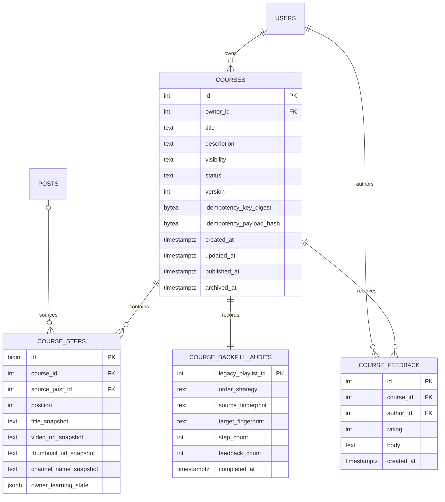
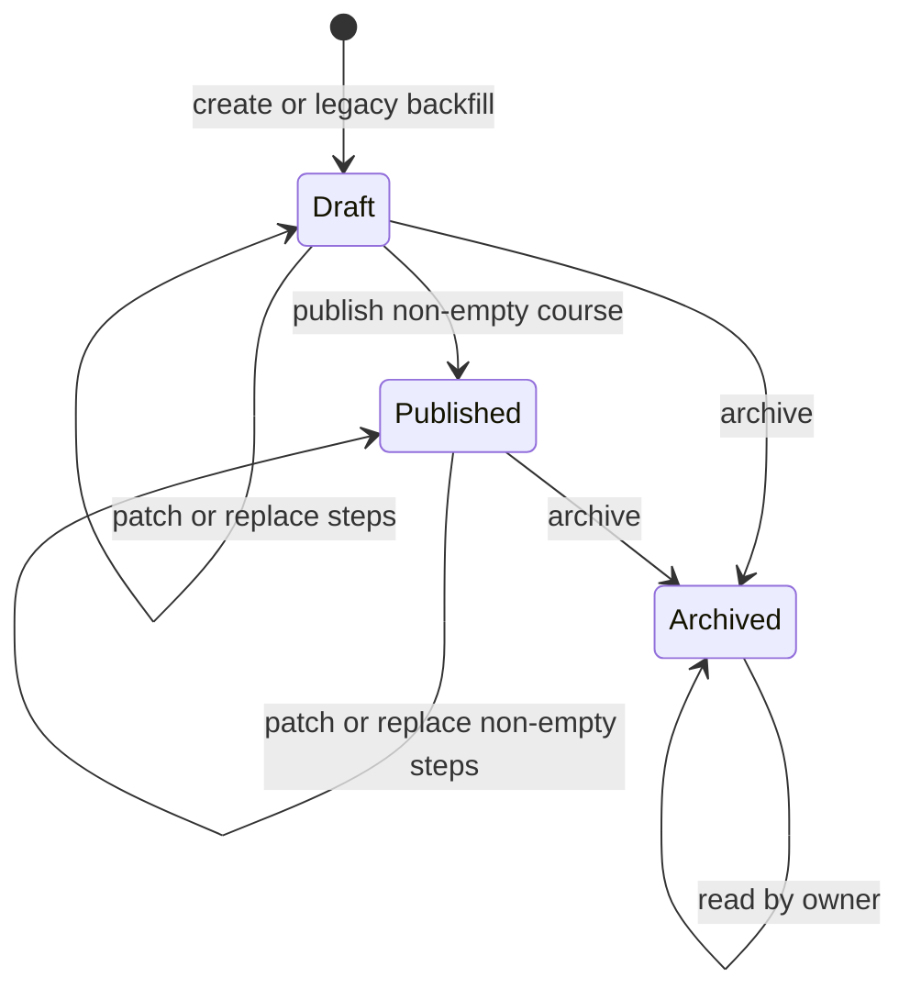
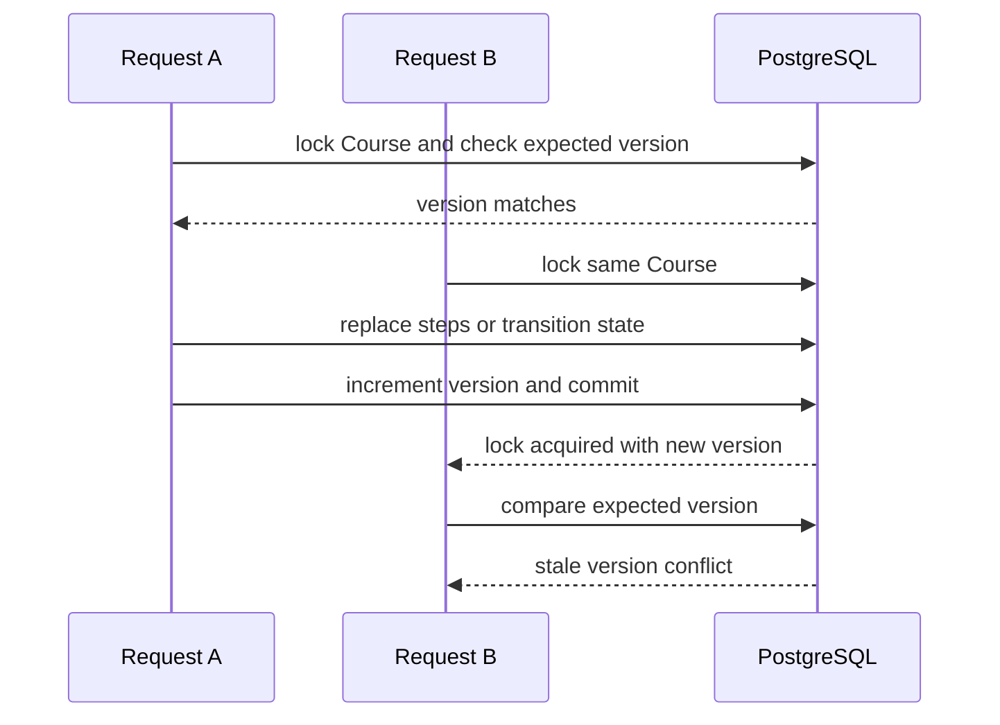
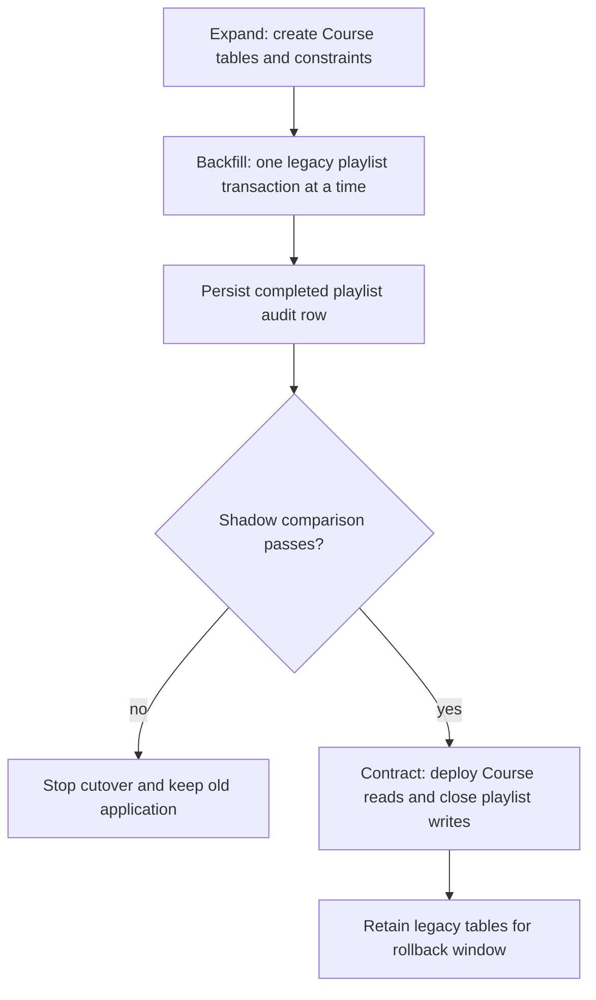

# StudyTube Course Aggregate Migration Design

## Status

- GitHub issue: `#8 Backend domain: migrate playlists to a concurrency-safe course aggregate`
- Branch: `codex/issue-8-course-aggregate`
- Depends on: cookie principal and PostgreSQL migration foundation from `#6` and `#7`
- Follow-up: `#2` owns durable jobs and hybrid retrieval, while `#11` owns the minimum HTTPS boundary

## Problem

The current playlist API returns a `postIds` array and relies on the browser to join posts back into the learning route. Ownership, visibility, lifecycle, ordering, and concurrent edits are spread across controller, service, repository, and browser state instead of being expressed as one domain contract.

The current schema permits every playlist item to use the default position `0`, has no unique position constraint, and deletes an item when its source post is deleted. A second authenticated user can also add an item to another user's playlist because that service path ignores its actor. Last-write-wins updates, retry-created duplicates, and a published empty learning route are all possible.

## Goals

- Replace the playlist array contract with a Course aggregate rooted in PostgreSQL.
- Preserve legacy playlist IDs, owners, creation times, steps, and feedback through an observable backfill.
- Keep step order contiguous and unique after every committed transaction.
- Preserve video snapshots when the source post is deleted.
- Require an expected aggregate version for every owner mutation.
- Make create retries idempotent per owner and reject reuse of a key with a different payload.
- Keep draft and learning state private to the owner while exposing only published snapshots publicly.
- Import user-scoped browser drafts without crossing account boundaries or deleting local data before server acknowledgement.
- Leave the legacy tables intact until rollback through the previous application release is no longer required.

## Non-goals

- Terraform, Kubernetes, RDS migration, and deployment-platform redesign are excluded.
- Background jobs, transactional outbox, hybrid retrieval, progress tracking, and quizzes remain in `#2` and `#3`.
- Course recommendations and AI-generated course editing are not added here.
- The old playlist tables are not dropped in this issue.
- General account onboarding and the production HTTPS browser proof remain separate from the Course domain migration.

## Evidence and references

- PostgreSQL unique and foreign-key constraints: <https://www.postgresql.org/docs/current/ddl-constraints.html>
- PostgreSQL row-level locking: <https://www.postgresql.org/docs/current/explicit-locking.html>
- PostgreSQL Read Committed update semantics: <https://www.postgresql.org/docs/current/transaction-iso.html>
- PostgreSQL atomic `ON CONFLICT` behavior: <https://www.postgresql.org/docs/current/sql-insert.html>
- node-pg-migrate transaction and advisory-lock behavior: <https://salsita.github.io/node-pg-migrate/migrations/>

## Domain model

Course is the aggregate root. `version` starts at 1 and increases once for each successful owner mutation. Feedback does not advance the owner-edit version because it is authored independently and does not change Course invariants.

Feedback still locks the Course root while checking lifecycle state. If feedback wins the lock before archive, the feedback commits and archive follows. If archive wins, the feedback request observes the archived state and fails without inserting. This keeps feedback independent from optimistic edit versioning while preventing a check-then-insert race.

New feedback is limited per principal and Course to five writes in a rolling ten-minute window. The check uses indexed persisted feedback timestamps inside the transaction so it works across application instances. A rejected burst returns 429 with `Retry-After` before acquiring the Course row lock.

Backfilled feedback is historical data and is preserved even though its migrated Course starts private and draft. The published-only rule governs new feedback appends, not whether preserved feedback rows may exist.

CourseStep owns immutable display snapshots. `source_post_id` is nullable and uses `ON DELETE SET NULL`, so deleting a post removes only the optional reference. The title, video URL, thumbnail URL, channel name, position, and owner learning state remain.

`owner_learning_state` stores the current browser learning state as validated JSON. It is included only in owner projections. Public projections never include playback marks, loop ranges, captions, or notes.

## Lifecycle

The lifecycle intentionally has no unarchive transition in this issue. A draft is private. Publishing atomically sets `status = published` and `visibility = public`. Archiving atomically sets `status = archived` and `visibility = private`. The database rejects any state and visibility combination outside those pairs.

A published Course must contain at least one step. Draft and archived Courses may be empty. No physical Course deletion endpoint is added.

## Ordering invariants

Every committed Course with steps satisfies all of these rules:

1. Position starts at 1.
2. Position is unique within a Course.
3. Maximum position equals the number of steps.
4. The API accepts an ordered array and derives positions instead of trusting client-provided integers.

An existing step is referenced by its Course-owned step ID during replacement. The server reloads its immutable snapshot and owner learning state instead of trusting client copies. A new step supplies either a source post reference or a complete local snapshot. A step ID from another Course, a duplicate step ID, or a missing step is rejected without advancing the Course version. This lets an owner reorder a snapshot after its source post has been deleted.

PostgreSQL owns uniqueness through a deferrable unique constraint on `(course_id, position)`. Deferred constraint triggers schedule validation after root status changes and step inserts, updates, or deletes, covering both the old and new Course when a child moves. A cascade from a deleted Course is ignored after the root is gone. The commit-time check verifies contiguity and the non-empty published rule. Application validation rejects malformed arrays early, but database enforcement remains the final boundary for alternate writers and race conditions.

## Concurrency model

The public API uses optimistic concurrency. Every patch, step replacement, publish, and archive request includes `expectedVersion`. A stale request receives conflict semantics and never overwrites the winner.

Simple metadata updates can use one compare-and-set statement whose predicate includes owner and version. PostgreSQL re-evaluates the predicate after a concurrent updater commits under Read Committed isolation, so only one request can advance a given version.

Compound mutations lock the Course row first:

The client contract is optimistic even though a short row lock protects each multi-statement transaction internally. Transactions never wait for user input or external services.

Publish and step replacement follow the same lock order. This prevents a publish request from racing with removal of the last step. One request commits first and advances the version; the other must retry from the new representation.

## Idempotent create

`POST /courses` requires an `Idempotency-Key`. The server hashes the key and a canonical request payload. A non-deferrable unique constraint on owner plus key digest is the concurrency arbiter.

The two digest columns are nullable only as a pair for backfilled legacy Courses, which have no original request key or canonical create payload. A row has either two null digests or two valid 32-byte digests. Native `POST /courses` always writes both.

The insert uses PostgreSQL `ON CONFLICT` semantics so concurrent retries converge on one Course. Reusing the key with the same payload returns the existing Course. Reusing it with a different payload returns a conflict and does not alter the original Course.

The key is scoped by the authenticated owner. Two users may present the same browser draft ID without sharing a Course or learning state.

## Projections and authorization

Mixed public and private behavior is split into explicit routes, following the authentication boundary established in `#7`:

- `GET /courses` returns the authenticated owner's draft, published, and archived Courses with owner-only learning state.
- `GET /courses/:id` returns an owner projection or 404.
- `GET /explore/courses` returns only published Courses and public step snapshots.
- `GET /explore/courses/:id` returns only a published public projection or 404.

Every mutation derives `owner_id` from the cookie principal. It never accepts an owner ID in a request body. A missing Course and a Course owned by another user both return 404 on private routes.

A detail projection is assembled by one SQL statement or one repeatable database snapshot so root version, steps, and feedback cannot come from different aggregate versions. Public SQL never selects owner learning state; privacy does not depend only on removing fields after hydration.

Public feedback includes only its ID, rating, body, creation time, and author display name. It never includes author ID, email, or owner-only profile data. Private owner projections may retain author IDs for moderation and migration evidence.

Owner and public lists use cursor pagination with a stable timestamp and ID tie-breaker. The cursor is opaque to clients and rejects malformed values without falling back to an ambiguous page.

## HTTP surface

- `POST /courses` creates a draft and optional initial steps under an idempotency key.
- `GET /courses` lists the current owner's Courses.
- `GET /courses/:id` reads an owner projection.
- `PATCH /courses/:id` changes title or description with an expected version.
- `PUT /courses/:id/steps` replaces the ordered step set with an expected version.
- `POST /courses/:id/publish` publishes a non-empty draft with an expected version.
- `POST /courses/:id/archive` archives a draft or published Course with an expected version.
- `POST /courses/:id/feedback` appends feedback to a published Course.
- `GET /explore/courses` and `GET /explore/courses/:id` expose public projections.

Legacy playlist mutations are removed from the active controller at cutover. The old schema remains untouched so rollback means redeploying the previous application release, not reversing or deleting migrated data.

## Resumable expand and contract migration

The schema migration creates only additive tables, indexes, constraints, and validation functions. It does not drop or rewrite playlist data.

The backfill process acquires one process-wide advisory lock and handles each playlist in its own transaction. A completion row is written only after the Course, steps, feedback, snapshots, and counts are committed. If the process stops, matching completed fingerprints are skipped and the first missing or mismatched playlist is retried without changing stable IDs.

The audit stores canonical source and target fingerprints. A later run skips a playlist only when its current legacy fingerprint and target fingerprint still match. If a legacy write occurred during the compatibility interval, the backfill rebuilds that Course transactionally and refreshes the audit. The mutating backfill refuses to start in Course mode so it can never overwrite native owner edits. Every mutation acquires a shared PostgreSQL advisory transaction lock. Cutover enters a freeze mode where new legacy and native Course mutations are rejected, then acquires the exclusive advisory lock to drain both mutation families. It runs the delta pass while holding authority, rechecks every audit, and requires a final exact shadow comparison before Course writes are enabled. The system does not dual-write.

The legacy post delete path rejects deletion when the post belongs to a playlist that already has a backfill audit. Otherwise the legacy cascade could erase the source item after its Course snapshot was captured and make exact reconciliation impossible. Course mode permits deletion through the new authority, where `ON DELETE SET NULL` preserves the step.

Legacy order is interpreted in two ways:

- If every item position is positive and unique, relative legacy position then post ID determines the new order.
- If position data is missing or ambiguous, post ID determines the new order.

The chosen strategy is stored in `course_backfill_audits`, and both strategies normalize the final positions to `1..N`.

Legacy playlists have no trustworthy publication state, so every backfilled Course starts as `draft` and `private`. The owner must explicitly publish it after cutover.

The legacy `/playlists` route is authenticated and owner-scoped, so this default preserves the existing access boundary rather than withdrawing an established public catalog.

Shadow verification compares old and new IDs, owners, timestamps, item ordering, feedback rows, counts by owner, and snapshot completeness. Sequence values are advanced only when behind the copied IDs and are never moved backward.

Exact comparison includes root text and timestamps, every ordered snapshot field, and every feedback ID, author, rating, body, and timestamp. Course and feedback sequences are placed beyond preserved legacy maxima before native Course writes can start, then safely rechecked under freeze.

## Browser draft import

The browser already stores drafts under a user-scoped key. Course import preserves that boundary and adds a server boundary:

1. Read only the active cookie user's scoped drafts.
2. Convert video order directly into the request step order.
3. Carry validated learning marks, playback rate, caption settings, and loop state as owner-only step state.
4. Use a deterministic idempotency key derived from the local draft ID.
5. Persist an immutable pending-import envelope containing user scope, draft ID, revision, key, and canonical payload before sending the request.
6. If create succeeds but publish fails, record the returned Course ID and version as a saved-private state and retry only publish.
7. Remove or mark a local draft imported only after the intended create and publish acknowledgements match the envelope's user scope, draft ID, and revision.
8. Leave the draft and pending envelope intact on timeout or error so a retry sends the exact same payload and converges on the same Course. Later edits create a new draft revision instead of mutating the pending envelope.

A protected-request 401 clears only active authenticated UI state. It preserves the prior user's scoped drafts and envelopes, routes to login, and resumes an import only when the new cookie principal has the same user ID. Course list refresh is also atomic for the current array UI: keep the previous list while all cursor pages load and replace it only after the full drain succeeds.

For a step with `sourcePostId`, the server loads the post and creates authoritative snapshots. For a local or recommended video without a persisted post, the request must contain complete snapshot fields and the source reference remains null.

## Error contract

- Invalid text, cursor, step shape, or learning state is a bad request.
- Missing or non-owned private resources are not found.
- Stale versions, invalid lifecycle transitions, and idempotency-key payload reuse are conflicts.
- Constraint races are translated into stable domain errors and never leak a raw PostgreSQL error as a server error.
- Unexpected database failures keep the existing sanitized request-ID error boundary.

## Verification strategy

Unit tests cover domain validation, cursor encoding, canonical payload hashing, projection privacy, and repository error translation.

PostgreSQL integration tests provide the portfolio evidence:

- Two title patches from the same version yield one success and one conflict.
- Two step replacements from the same version yield one committed contiguous order.
- Publishing and removing the last step cannot create an empty published Course.
- Deleting a source post preserves snapshots and ordering.
- Concurrent create retries with one key yield one Course.
- One key with a different payload is rejected.
- A stopped backfill resumes without changing IDs, row counts, or feedback.
- Public reads expose only published snapshots and never owner learning state.

Web tests cover local user scoping, learning-state conversion, retry idempotency, and the rule that local data survives an unsuccessful import.

## Rollout and rollback

The rollout order is schema migration, initial backfill, shadow verification, a deployment in freeze mode, exclusive advisory-lock acquisition and transaction drain, fingerprint-aware delta backfill, final shadow verification, Course-mode activation, legacy-mutation-route retirement, and smoke verification. A failed backfill or comparison stops before Course writers activate.

Rollback before destructive cleanup is an application rollback: retain the additive schema and deploy the previous release to continue using the untouched playlist tables. The migration down path is for an empty disposable database only and refuses to remove Course or audit data. New Course writes made after cutover are not reverse-copied into playlists, so rollback after accepting production Course writes requires a deliberate maintenance window and defaults to a roll-forward fix. The deployment runbook must call out each boundary.
