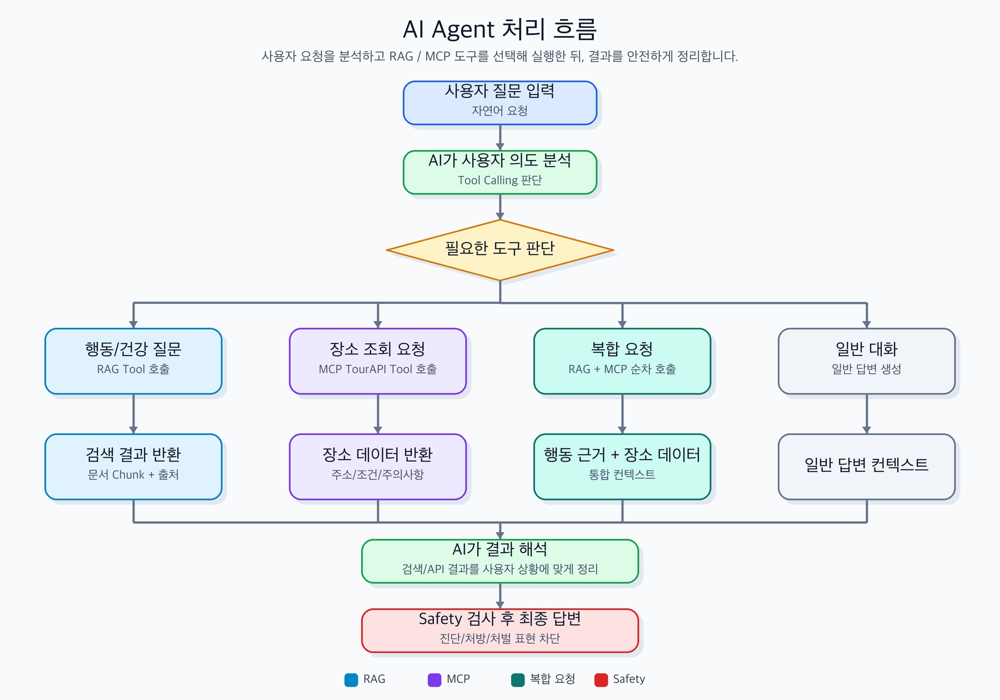

# 과제 -  AI 응용 기술을 활용한 게시판 구현

## Quickstart

발표/시연용 전체 실행 순서는 [docs/demo-runbook.md](docs/demo-runbook.md)를 기준으로 확인합니다.
제출 패키징 기준은 [docs/submission-policy.md](docs/submission-policy.md)를 따릅니다.

1. 환경 파일을 준비합니다.

```bash
cp .env.example backend/.env
cp .env.example frontend/.env
cp .env.example AI/.env
```

2. PostgreSQL을 실행하고 `backend/.env`의 `DATABASE_URL`에 맞춰 DB를 만든 뒤 마이그레이션을 실행합니다.

```bash
cd backend
npm install
npm run migration:run
npm run start:dev
```

3. 프론트엔드를 실행합니다.

```bash
cd frontend
npm install
npm run dev
```

4. AI worker는 현재 Assistant 베타의 내부 서비스/헬스체크 용도입니다. 공개 API는 NestJS `/api/agent/chat`을 사용합니다.

```bash
cd AI
python -m venv .venv
source .venv/bin/activate
pip install -r requirements.txt
uvicorn app.main:app --reload --port 8000
```

5. 검증 명령입니다.

```bash
(cd frontend && npm run build && npm run lint && npm test && npm run test:browser)
(cd backend && npm run build && npm run lint:check && npm test && npm run test:e2e)
(cd AI && .venv/bin/python -m pytest)
node scripts/verify-local-gates.mjs
node scripts/check-submission-manifest.mjs
```

`scripts/verify-local-gates.mjs`는 root live-smoke와 제출 manifest 관련 스크립트의 문법, mock 회귀, 제출 정책 gate를 한 번에 실행하는 빠른 로컬 회귀 묶음이다. 실제 provider/live backend 검증은 아래 live smoke를 별도로 실행한다.
제출 manifest dry-run은 필수 파일/금지 artifact뿐 아니라 token-like secret, `.key/.pem/.log/.db` 고위험 파일, live-smoke target 문서 drift도 함께 검사한다.
`frontend`의 `npm run test:browser`는 mock API 기반 UI 회귀 검증이며, Kakao/TourAPI/OpenAI/live backend 통합 검증은 발표 전 실제 credential로 별도 smoke check를 수행한다.
외부 연동 live smoke는 기본 실행 시 외부 호출 없이 SKIP만 보고하며, 실제 검증은 frontend, backend, AI worker를 띄운 뒤 다음처럼 명시적으로 실행한다. multi-instance upload 검증까지 포함할 때는 secondary backend도 함께 띄운다.

```bash
RUN_LIVE_SMOKE=true node scripts/live-smoke.mjs
```

`frontend-api` target은 실제 브라우저 안에서 배포된 프론트 번들의 API base URL로 backend를 호출해 CORS와 프론트/백엔드 배선을 함께 검증한다.
배포 업로드 저장소 검증은 `upload` target이 담당한다. smoke 계정으로 이미지를 업로드하고 게시글에 연결한 뒤 정적 URL 읽기와 삭제 cleanup을 확인한다. `LIVE_SMOKE_SECONDARY_BACKEND_URL`을 지정하면 같은 이미지 path를 두 번째 backend origin에서도 읽어 shared storage를 검증한다.
발표/배포 release gate에서는 `LIVE_SMOKE_FAIL_ON_SKIP=true`를 함께 사용해 `PARTIAL` 또는 어떤 `SKIP`이든 exit 0으로 통과하지 않게 한다. `LIVE_SMOKE_TARGETS`에서 제외한 target은 `OMIT`으로 표시된다.
live smoke 계정은 `backend`에서 `npm run smoke:user`로 준비하고, 남은 사용자 데이터가 없을 때 `npm run smoke:user:delete`로 정리할 수 있다. production에서는 두 명령 모두 `SMOKE_ACCOUNT_ENABLED=true`가 필요하다.


## 1. 프로젝트 소개
AI 응용 기술이 들어간 게시판입니다.
해당 게시판은 reddit을 참고합니다.

## 2. 프로젝트 기술스택

### 2-1. 프론트엔드
프론트엔드는 React와 TypeScript를 사용한다.

React는 컴포넌트 기반으로 화면을 분리하여 재사용성과 유지보수성을 높일 수 있으며, 
SPA 구조를 통해 게시글 목록, 상세 페이지, 작성 페이지 간의 화면 전환을 빠르게 처리할 수 있다.

TypeScript는 JavaScript의 동적 타입 특성으로 인해 런타임에서 발견될 수 있는 오류를 개발 및 빌드 단계에서 미리 확인할 수 있도록 도와준다. 게시글, 댓글, 사용자, 태그, AI 응답 데이터처럼 여러 데이터 구조를 다루는 프로젝트 특성상 타입을 명확히 정의함으로써 코드 안정성과 협업 가능성을 높이기 위해 채택하였다.

### 2-2. 벡엔드
백엔드는 NestJS를 사용한다.

NestJS는 Node.js 기반의 백엔드 프레임워크로, React와 동일한 JavaScript/TypeScript 생태계에서 개발할 수 있다는 장점이 있다. 프론트엔드가 React + TypeScript로 구성되어 있기 때문에 프론트엔드와 백엔드 간 언어적 일관성을 유지할 수 있고, API 요청/응답 데이터 구조를 타입 기반으로 명확히 관리할 수 있다.

또한 NestJS는 Spring Boot와 유사하게 Module, Controller, Service, Dependency Injection 구조를 제공한다. 이를 통해 인증, 게시글, 댓글, 태그, RAG, MCP, Agent 기능을 각각의 모듈로 분리하여 관리할 수 있으며, 기능이 늘어나더라도 유지보수하기 쉬운 백엔드 구조를 만들 수 있다.

Spring Boot에 비해 Java/Spring 생태계를 새로 학습해야 하는 부담이 적고, Express 같은 단순 Node.js 서버보다 프로젝트 구조가 명확하기 때문에 이번 프로젝트의 백엔드 기술로 채택하였다.

### 2-3. 인프라

Frontend Docker Image
→ AWS ECS 또는 App Runner
→ Nginx가 React 정적 파일 제공

Backend Docker Image
→ AWS ECS 또는 App Runner
→ NestJS API 서버 실행

Uploads
→ 기본 개발 환경은 로컬 `uploads` 저장소를 사용한다.
→ 운영 ECS/App Runner 배포에서는 `UPLOAD_LOCAL_ROOT`를 EFS 같은 영속 공유 마운트로 지정하고 `UPLOAD_LOCAL_ROOT_IS_PERSISTENT=true`를 명시한다.
→ 단일 인스턴스 데모 배포로 인정한 경우에만 `ALLOW_LOCAL_UPLOADS_IN_PRODUCTION=true`를 사용한다.

Database
→ AWS RDS PostgreSQL

Image Registry
→ AWS ECR

도메인/HTTPS
→ Route 53 + ALB 또는 CloudFront

## 3. 프로젝트 아키텍쳐

현재 구현 기준 아키텍처와 자체 리뷰 루프는 [docs/current-architecture.md](docs/current-architecture.md)에 정리되어 있다.

## 4. 주요 기능
- 기본 게시판 기능
  - 회원가입 / 로그인
  - 게시물 CURD
  - 댓글
  - 태그
  - 페이징
  - 검색


## 5. 데이터베이스 설계

PostgreSQL 데이터베이스 사용.

설계 목표
- 회원은 게시글과 댓글을 작성할 수 있다.
- 게시글은 여러 댓글과 여러 미이지를 가질 수 있다.
- 게시글은 여러 카테고리에 속할 수 있다.
- 회원은 게시글과 댓글에 좋아요를 누를 수 있다.
- 한 회원은 같은 게시글 또는 같은 댓글에 좋아요를 한 번만 누를 수 있다.
- 게시글 조회수는 기본값 0부터 시작하며 음수가 될 수 없다.
- 이미지 파일은 실제 파일 자체가 아니라 파일 경로, 파일명, 파일 타입 등의 메타데이터를 저장한다.

주요 테이블

| 테이블명              | 설명                     |
| ----------------- | ---------------------- |
| `users`           | 회원 정보를 저장              |
| `posts`           | 게시글 정보를 저장             |
| `comments`        | 게시글에 작성된 댓글 정보를 저장     |
| `categories`      | 게시글 분류 카테고리 정보를 저장     |
| `post_categories` | 게시글과 카테고리의 다대다 관계를 저장  |
| `post_likes`      | 회원의 게시글 좋아요 기록을 저장     |
| `comment_likes`   | 회원의 댓글 좋아요 기록을 저장      |
| `post_images`     | 게시글에 첨부된 이미지 파일 정보를 저장 |


테이블 관계

* 회원 1명은 여러 게시글을 작성할 수 있다.
* 회원 1명은 여러 댓글을 작성할 수 있다.
* 게시글 1개는 여러 댓글을 가질 수 있다.
* 게시글 1개는 여러 이미지 파일을 가질 수 있다.
* 게시글과 카테고리는 다대다 관계이므로 `post_categories` 중간 테이블을 사용했다.
* 회원과 게시글 좋아요는 다대다 관계이므로 `post_likes` 테이블을 사용했다.
* 회원과 댓글 좋아요는 다대다 관계이므로 `comment_likes` 테이블을 사용했다.

주요 제약조건

* `users.email`은 로그인 식별자로 사용되므로 중복을 허용하지 않는다.
* `users.nickname`은 사용자 구분을 위해 중복을 허용하지 않는다.
* `posts.user_id`는 게시글 작성자를 나타내며 `users.user_id`를 참조한다.
* `comments.post_id`는 댓글이 속한 게시글을 나타내며 `posts.post_id`를 참조한다.
* `comments.user_id`는 댓글 작성자를 나타내며 `users.user_id`를 참조한다.
* `post_likes`는 `user_id + post_id` 조합을 UNIQUE로 설정하여 같은 회원이 같은 게시글에 중복 좋아요를 누르지 못하게 했다.
* `comment_likes`는 `user_id + comment_id` 조합을 UNIQUE로 설정하여 같은 회원이 같은 댓글에 중복 좋아요를 누르지 못하게 했다.
* `post_categories`는 `post_id + category_id` 조합을 기본키로 사용하여 같은 게시글에 같은 카테고리가 중복 연결되지 않도록 했다.
* `posts.views`는 기본값을 0으로 설정하고, 음수가 되지 않도록 CHECK 제약조건을 적용했다.

설계 중 고려한 점

카테고리는 게시글 하나에 여러 개 선택될 수 있으므로 게시글 테이블에 카테고리 값을 직접 저장하지 않고, `post_categories` 중간 테이블을 두었습니다. 이를 통해 하나의 게시글이 여러 카테고리에 속할 수 있고, 하나의 카테고리에도 여러 게시글이 연결될 수 있습니다.

좋아요 역시 단순히 좋아요 수만 저장하지 않고, 어떤 회원이 어떤 게시글 또는 댓글에 좋아요를 눌렀는지 기록하는 방식으로 설계했습니다. 이를 통해 중복 좋아요 방지와 좋아요 취소 기능을 구현할 수 있습니다.

이미지 파일은 데이터베이스에 직접 저장하지 않고, 원본 파일명, 저장 파일명, 파일 경로, 파일 크기, MIME 타입과 같은 메타데이터만 저장하도록 설계했습니다.

## 6. AI 기능 설계


### 6-1. RAG 기능

RAG 기반 반려동물 행동 Q&A

본 프로젝트는 고양이와 강아지의 행동 문제에 대해 사용자가 참고할 수 있는 답변을 제공하기 위해 RAG(Retrieval-Augmented Generation)를 도입했습니다.

일반 LLM 답변은 출처가 불명확하거나 의학적/행동학적 위험 표현을 생성할 수 있기 때문에, 본 서비스는 사전에 정리한 수의 행동학 자료, 논문 요약, AVSAB 가이드라인, 행동 관찰 체크리스트를 검색한 뒤 해당 근거를 바탕으로 답변을 생성합니다.

이 기능은 수의사나 행동 전문가를 대체하지 않으며, 사용자가 문제 상황을 더 잘 관찰하고 병원 상담이 필요한 경우를 판단하도록 돕는 보조 도구를 목표로 합니다.

주요 대상 질문

- 고양이가 화장실 밖에 배변/배뇨하는 경우
- 고양이가 쓰다듬는 중 갑자기 공격하는 경우
- 강아지가 보호자 외출 시 심하게 불안해하는 경우
- 강아지가 산책 중 다른 개나 사람에게 과하게 반응하는 경우
- 장난감, 음식, 공간을 지키려는 자원 지키기 행동
- 노령견/노령묘의 야간 울음, 방향감 상실, 배변 실수
- 반복 행동, 과도한 그루밍, pica 등 이상 행동

RAG 처리 흐름

flowchart TD
    A[사용자 질문 입력] --> B[Red Flag 위험 신호 확인]
    B --> C{응급/진료 우선 상황인가?}
    C -- Yes --> D[병원 상담 우선 안내]
    C -- No --> E[질문 주제 분류]
    E --> F[관련 문서 Chunk 검색]
    F --> G[검색 결과 점수화]
    G --> H[근거 기반 답변 생성]
    H --> I[금지 표현 및 안전성 검사]
    I --> J[답변, 관찰 체크리스트, 참고 근거 제공]

### 6-2. MCP 기능

본 프로젝트는 MCP(Model Context Protocol)를 활용해 외부 공공 API인 한국관광공사 TourAPI와 연동합니다.

서비스 내 별도 메뉴인 `반려동물 동반 장소`에서 사용자는 지역, 키워드, 현재 위치를 기준으로 반려동물과 함께 방문 가능한 관광지, 숙소, 음식점, 쇼핑시설 등을 조회할 수 있습니다.

MCP 서버는 클라이언트의 요청을 받아 TourAPI의 지역기반 조회, 위치기반 조회, 키워드 조회, 반려동물 동반 상세정보 API를 호출합니다. 조회된 장소 정보는 서비스 화면에서 장소 카드 형태로 제공되며, 사용자는 주소, 연락처, 이미지, 동반 가능 동물, 동반 조건, 주의사항 등을 확인할 수 있습니다.

이를 통해 게시판 중심 서비스에 외부 공공 데이터를 결합하여, 사용자가 반려동물과 함께 갈 수 있는 장소를 신뢰 가능한 데이터 기반으로 탐색할 수 있도록 합니다.

### 6-3. AI Assistant 기능

본 프로젝트는 사용자의 자연어 요청을 키워드 기반으로 분류하고, 필요한 내부 기능을 조합해 응답하는 Assistant 베타 구조를 적용합니다.

현재 구현은 LLM이 자율적으로 tool을 선택하는 풀 에이전트가 아니라, NestJS `/api/agent/chat`에서 반려동물 행동 RAG, 반려동물 동반 장소 조회, 게시글 검색, 안전 안내 템플릿을 라우팅하는 방식입니다. RAG 응답 생성에는 OpenAI API를 사용할 수 있으며, API 키가 없거나 AI worker가 지연되면 안전한 fallback 응답을 제공합니다.

```text
RAG Tool:
반려동물 행동/건강 질문에 대해 논문, 가이드라인, 내부 자료집 기반 답변 제공

MCP Tool:
한국관광공사 TourAPI를 호출하여 반려동물 동반 가능 장소 조회

Safety Tool:
위험 신호, 진단/처방 표현, 처벌 훈련 표현 등 안전성 검사

Response Generator:
도구 실행 결과를 사용자 친화적인 답변으로 재구성
```

AI Assistant 처리 흐름



구현 흐름


1. 사용자가 자연어로 질문을 입력한다.

2. 백엔드는 사용자 메시지를 키워드와 대화 맥락 기준으로 분류한다.

3. 백엔드는 필요한 내부 도구를 선택한다.
   예: search_behavior_rag, search_pet_places, get_pet_place_detail

4. 백엔드는 선택한 내부 도구를 실행한다.
   - RAG Tool: 벡터 DB에서 관련 문서 chunk 검색
   - MCP Tool: TourAPI를 통해 반려동물 동반 가능 장소 조회

5. 백엔드는 tool 실행 결과를 취합한다.

6. RAG 응답이 있으면 근거 기반 답변을 사용하고, 그 외에는 안전 템플릿과 검색 결과를 조합해 최종 답변을 생성한다.

7. 답변 생성 전후로 Safety Guardrail을 적용한다.

8. 최종 답변을 사용자에게 반환한다.

## 7. API 명세서

본 프로젝트의 API는 REST 방식을 기준으로 설계한다. 기본 prefix는 `/api`를 사용하며, 인증이 필요한 요청은 `Authorization: Bearer {accessToken}` 헤더를 포함한다.

공통 응답 형식

```json
{
  "success": true,
  "data": {},
  "message": "요청이 성공했습니다."
}
```

공통 에러 형식

```json
{
  "success": false,
  "errorCode": "ERROR_CODE",
  "message": "에러 메시지"
}
```

### 7-1. Auth API

| 기능 | Method | Endpoint | Auth | Request | Response |
| --- | --- | --- | --- | --- | --- |
| 회원가입 | `POST` | `/api/auth/signup` | Public | `email`, `password`, `nickname`, `emailVerificationToken` | 생성된 사용자 정보 |
| 로그인 | `POST` | `/api/auth/login` | Public | `email`, `password` | `accessToken`, 사용자 정보 |
| 로그아웃 | `POST` | `/api/auth/logout` | Required | 없음 | 로그아웃 성공 메시지 |
| 이메일 인증번호 발송 | `POST` | `/api/auth/email/code` | Public | `email` | 인증번호 발송 결과 |
| 이메일 인증번호 확인 | `POST` | `/api/auth/email/verify` | Public | `email`, `code` | 이메일 인증 토큰 |
| 이메일 중복 확인 | `GET` | `/api/auth/email/check` | Public | Query: `email` | 사용 가능 여부 |
| 닉네임 중복 확인 | `GET` | `/api/auth/nickname/check` | Public | Query: `nickname` | 사용 가능 여부 |
| 소셜 로그인 요청 | `GET` | `/api/auth/social/:provider` | Public | Path: `provider` | 소셜 로그인 페이지 URL 또는 redirect |
| 소셜 로그인 콜백 | `GET` | `/api/auth/social/:provider/callback` | Public | Query: `code`, `state` | `accessToken`, 사용자 정보 |

### 7-2. Post API

| 기능 | Method | Endpoint | Auth | Request | Response |
| --- | --- | --- | --- | --- | --- |
| 게시글 목록 조회 | `GET` | `/api/posts` | Optional | Query: `page`, `limit`, `categoryId`, `sort` | 게시글 목록, 페이지 정보 |
| 게시글 상세 조회 | `GET` | `/api/posts/:postId` | Optional | Path: `postId` | 게시글 상세 정보 |
| 게시글 작성 | `POST` | `/api/posts` | Required | `title`, `content`, `categoryIds`, `imageIds` | 생성된 게시글 정보 |
| 게시글 수정 | `PATCH` | `/api/posts/:postId` | Required | Path: `postId`, Body: `title`, `content`, `categoryIds`, `imageIds` | 수정된 게시글 정보 |
| 게시글 삭제 | `DELETE` | `/api/posts/:postId` | Required | Path: `postId` | 삭제 성공 메시지 |
| 게시글 검색 | `GET` | `/api/posts/search` | Optional | Query: `keyword`, `page`, `limit`, `categoryId` | 검색된 게시글 목록 |
| 게시글 조회수 증가 | `POST` | `/api/posts/:postId/views` | Optional | Path: `postId` | 증가된 조회수 |
| 게시글 이미지 업로드 | `POST` | `/api/posts/images` | Required | `multipart/form-data`: `images` | 업로드된 이미지 목록 |
| 게시글 이미지 삭제 | `DELETE` | `/api/posts/images/:imageId` | Required | Path: `imageId` | 삭제 성공 메시지 |

### 7-3. Category API

| 기능 | Method | Endpoint | Auth | Request | Response |
| --- | --- | --- | --- | --- | --- |
| 카테고리 목록 조회 | `GET` | `/api/categories` | Public | 없음 | 카테고리 목록 |
| 카테고리별 게시글 조회 | `GET` | `/api/categories/:categoryId/posts` | Optional | Path: `categoryId`, Query: `page`, `limit` | 해당 카테고리의 게시글 목록 |

### 7-4. Comment API

| 기능 | Method | Endpoint | Auth | Request | Response |
| --- | --- | --- | --- | --- | --- |
| 댓글 목록 조회 | `GET` | `/api/posts/:postId/comments` | Optional | Path: `postId`, Query: `page`, `limit` | 댓글 목록 |
| 댓글 작성 | `POST` | `/api/posts/:postId/comments` | Required | Path: `postId`, Body: `content` | 생성된 댓글 정보 |
| 댓글 수정 | `PATCH` | `/api/comments/:commentId` | Required | Path: `commentId`, Body: `content` | 수정된 댓글 정보 |
| 댓글 삭제 | `DELETE` | `/api/comments/:commentId` | Required | Path: `commentId` | 삭제 성공 메시지 |

### 7-5. Like API

| 기능 | Method | Endpoint | Auth | Request | Response |
| --- | --- | --- | --- | --- | --- |
| 게시글 좋아요 | `POST` | `/api/posts/:postId/likes` | Required | Path: `postId` | 게시글 좋아요 수, 좋아요 여부 |
| 게시글 좋아요 취소 | `DELETE` | `/api/posts/:postId/likes` | Required | Path: `postId` | 게시글 좋아요 수, 좋아요 여부 |
| 댓글 좋아요 | `POST` | `/api/comments/:commentId/likes` | Required | Path: `commentId` | 댓글 좋아요 수, 좋아요 여부 |
| 댓글 좋아요 취소 | `DELETE` | `/api/comments/:commentId/likes` | Required | Path: `commentId` | 댓글 좋아요 수, 좋아요 여부 |

### 7-6. Pet Place API

Pet Place API는 서비스 내 `반려동물 동반 장소` 메뉴에서 사용한다. 백엔드는 MCP 서버를 통해 한국관광공사 TourAPI를 호출하고, 클라이언트에는 서비스에 필요한 형태로 정리한 장소 데이터를 반환한다.

| 기능 | Method | Endpoint | Auth | Request | Response |
| --- | --- | --- | --- | --- | --- |
| 반려동물 동반 장소 지역 기반 조회 | `GET` | `/api/pet-places/area` | Optional | Query: `areaCode`, `sigunguCode`, `contentTypeId`, `page`, `limit` | 지역 기반 장소 목록 |
| 반려동물 동반 장소 위치 기반 조회 | `GET` | `/api/pet-places/nearby` | Optional | Query: `mapX`, `mapY`, `radius`, `contentTypeId`, `page`, `limit` | 거리순 장소 목록 |
| 반려동물 동반 장소 키워드 검색 | `GET` | `/api/pet-places/search` | Optional | Query: `keyword`, `contentTypeId`, `page`, `limit` | 키워드 기반 장소 목록 |
| 반려동물 동반 장소 상세 조회 | `GET` | `/api/pet-places/:contentId` | Optional | Path: `contentId` | 주소, 연락처, 이미지, 동반 가능 동물, 동반 조건, 주의사항 |

### 7-7. AI API

| 기능 | Method | Endpoint | Auth | Request | Response |
| --- | --- | --- | --- | --- | --- |
| AI Assistant 질의 | `POST` | `/api/agent/chat` | Required | `message`, `petProfileId`, `location` | 최종 답변, 사용한 tool 목록, 근거 출처, 장소 추천, safety 결과 |

AI Assistant 질의 예시

```json
{
  "message": "강아지가 산책 중 다른 강아지를 보면 짖어요. 근처에 조용한 반려견 동반 장소도 알려주세요.",
  "petProfileId": 1,
  "location": {
    "mapX": 126.978,
    "mapY": 37.5665
  }
}
```

응답 예시

```json
{
  "answer": "산책 중 다른 강아지를 보고 짖는 행동은 산책 중 반응성과 관련될 수 있습니다...",
  "riskLevel": "behavior_support",
  "usedTools": [
    "search_behavior_rag",
    "pet_place_search"
  ],
  "sources": [
    {
      "title": "AVSAB Humane Dog Training Position Statement",
      "sourceType": "rag_source"
    }
  ],
  "places": [
    {
      "contentId": "123456",
      "title": "반려견 동반 공원",
      "address": "서울특별시 ...",
      "petInfo": {
        "acmpyTypeCd": "일부 구역 동반 가능",
        "acmpyPsblCpam": "반려견",
        "acmpyNeedMtr": "목줄 착용 필요",
        "relaAcdntRiskMtr": "배변 처리 및 안전사고 유의"
      }
    }
  ],
  "safety": {
    "redFlagDetected": false,
    "blockedTerms": []
  }
}
```

### 7-8. Internal Tool

Internal Tool은 클라이언트가 직접 호출하는 공개 API가 아니라, AI Assistant가 `/api/agent/chat` 요청을 처리하는 과정에서 내부적으로 호출하는 도구다.

| Tool | 역할 | Input | Output |
| --- | --- | --- | --- |
| 사용자 의도 분석 | 사용자 메시지를 분석해 필요한 작업을 분류한다. | `message` | `intent`, `requiredTools` |
| RAG Tool | 반려동물 행동/건강 질문과 관련된 문서 chunk를 검색한다. | `query`, `species`, `topic` | 관련 chunk, 출처, score |
| MCP TourAPI Tool | 한국관광공사 TourAPI를 호출해 반려동물 동반 가능 장소를 조회한다. | `keyword`, `areaCode`, `mapX`, `mapY`, `radius` | 장소 목록, 상세 정보 |
| 일반 대화 생성 | RAG나 MCP가 필요 없는 일반 대화 답변을 생성한다. | `message` | 일반 답변 |
| 최종 응답 조합 | 도구 실행 결과와 안전 템플릿을 종합해 사용자에게 전달할 최종 답변을 생성한다. | `message`, `toolResults` | 최종 답변 |
| Safety Guardrail 검사 | 진단, 처방, 처벌 훈련, 위험한 안심 표현을 검사한다. | `answer`, `toolResults` | 통과 여부, 차단 표현, 수정 제안 |


## 8. 회고 / 한계점 / 개선 아이디어

개선아이디어- 사용자가 이미지 업로드시 해당 이미지가 동물에 관련된 이미지인지 확인하는 기능.
