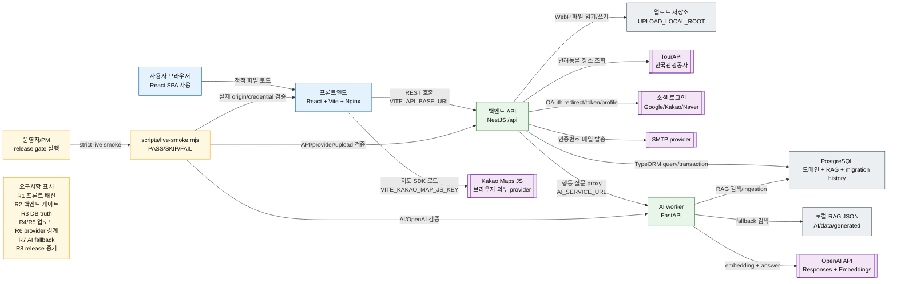
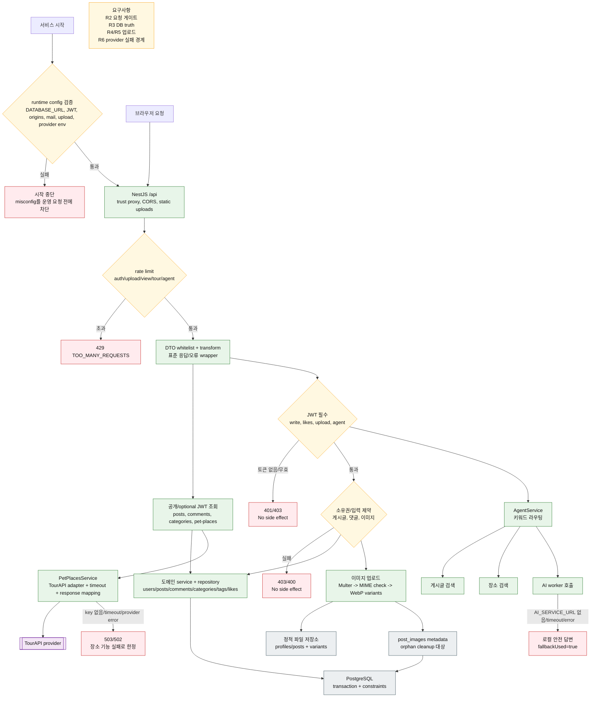
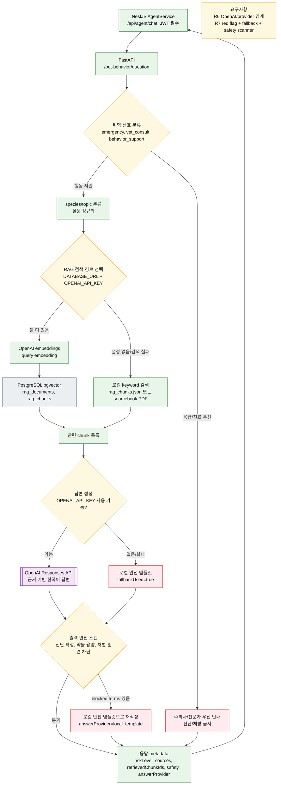
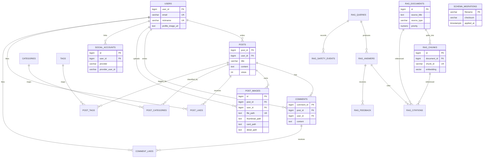

# Tail Talk Current Architecture

작성일: 2026-06-15 KST

이 문서는 현재 저장소에 구현된 Tail Talk 구조를 기준으로 그린다. 배포 예정 구상이나 외부 운영 환경의 성공 여부가 아니라, 코드와 문서에서 확인되는 런타임 경계, 데이터 흐름, 검증 게이트만 포함했다.

## 확인 근거

- 프론트엔드: `frontend/src/routes.tsx`, `frontend/src/api/*`, `frontend/src/utils/kakaoMap.ts`
- 백엔드: `backend/src/main.ts`, `backend/src/app.module.ts`, `backend/src/config/runtime-config.ts`
- 도메인 API: `backend/src/auth`, `backend/src/posts`, `backend/src/comments`, `backend/src/likes`, `backend/src/categories`, `backend/src/pet-places`, `backend/src/agent`
- 데이터/마이그레이션: `backend/src/database/migrations`, `backend/src/database/run-sql-migrations.ts`
- AI worker: `AI/app/main.py`, `AI/app/rag/*`, `AI/scripts/ingest_pdf.py`
- 운영 검증: `scripts/live-smoke.mjs`, `scripts/verify-local-gates.mjs`, `docs/demo-runbook.md`, `docs/release-evidence-checklist.md`
- 외부 provider 공식 확인 링크, 2026-06-15 확인:
  - [공공데이터포털 한국관광공사 반려동물 동반여행 서비스](https://www.data.go.kr/data/15135102/openapi.do)
  - [Kakao 지도 Web API 가이드](https://apis.map.kakao.com/web/guide/)
  - [Kakao Login REST API](https://developers.kakao.com/docs/ko/kakaologin/rest-api)
  - [Google OAuth 2.0 Web Server Applications](https://developers.google.com/identity/protocols/oauth2/web-server)
  - [NAVER Login Web Application](https://developers.naver.com/docs/login/web/web.md)
  - [OpenAI Responses API](https://platform.openai.com/docs/api-reference/responses), [OpenAI Embeddings API](https://platform.openai.com/docs/api-reference/embeddings)

## 요구사항 ID

- R1: 브라우저는 `VITE_API_BASE_URL`로 백엔드 `/api`를 호출하고, 카카오 지도는 브라우저에서 `VITE_KAKAO_MAP_JS_KEY`로 직접 로드한다.
- R2: 백엔드 요청은 CORS, rate limit, DTO 검증, JWT 또는 optional JWT, 표준 오류 포맷을 통과해야 한다.
- R3: 게시글/댓글/좋아요/회원/소셜 계정/RAG 메타데이터는 PostgreSQL에 저장하고, SQL migration checksum으로 drift를 막는다.
- R4: 업로드 이미지는 서버에서 WebP로 재인코딩하고 metadata는 DB, 바이너리는 `UPLOAD_LOCAL_ROOT` 아래 정적 파일로 둔다.
- R5: 운영 모드의 로컬 업로드는 absolute persistent mount와 `UPLOAD_LOCAL_ROOT_IS_PERSISTENT=true`, 또는 명시적 단일 인스턴스 데모 예외가 필요하다.
- R6: 외부 provider는 백엔드 또는 AI worker adapter를 통해서만 호출하고, credential/config 누락은 startup fail, 4xx/5xx, 또는 safe fallback으로 끝나야 한다.
- R7: AI 행동 상담은 위험 신호 분류, RAG 검색, OpenAI 생성, 안전 스캔을 거치며 실패 시 로컬 안전 템플릿을 반환한다.
- R8: release GO는 strict live-smoke, shared upload read, smoke account cleanup, Kakao origin, manifest/secret gate가 모두 증거로 남아야 한다.

## 1. 시스템 컨텍스트

핵심 판단: 브라우저가 직접 만나는 외부 provider는 Kakao Maps JS뿐이고, TourAPI/OAuth/SMTP/OpenAI는 서버 경계 안의 adapter를 통해 나간다. 업로드 저장소는 DB가 아니라 파일 저장소이며, DB는 metadata와 관계의 기준점이다.

배포 메모: `docker-compose.prod.yml` 기준 frontend는 Nginx로 정적 파일을 제공하고 host `127.0.0.1:8080`에 노출된다. backend와 AI worker는 compose 내부 healthcheck와 `depends_on`으로 묶이며, backend upload는 `/app/uploads` named volume을 `UPLOAD_LOCAL_ROOT_IS_PERSISTENT=true` 조건으로 사용한다. PostgreSQL은 compose 안에 정의되어 있지 않고 `DATABASE_URL`로 외부 DB를 바라본다.

## 2. 백엔드 요청 게이트와 데이터 흐름

핵심 판단: irreversible side effect인 DB write와 파일 write는 JWT, DTO, rate limit, 소유권 검사를 통과한 뒤에만 실행된다. TourAPI와 AI provider 실패는 전체 서비스 중단이 아니라 해당 기능의 오류 또는 안전 fallback으로 끝난다.

## 3. AI/RAG 세부 흐름

핵심 판단: 현재 구현은 LLM이 도구를 자율 선택하는 풀 에이전트가 아니라, NestJS AgentService가 키워드/맥락 기반으로 게시글 검색, 장소 검색, 행동 RAG, 안전 답변을 조합하는 라우터다. AI worker는 OpenAI가 없거나 실패해도 응답을 중단하지 않고 안전 템플릿으로 내려온다.

## 4. 핵심 데이터 모델

핵심 판단: 게시판은 사용자 중심 관계형 모델이고, 이미지는 DB에 파일 metadata만 저장한다. RAG는 `rag_documents`와 `rag_chunks`가 검색 기준이며, query/answer/safety/feedback 테이블은 운영 추적과 향후 품질 개선을 위한 durable state로 준비되어 있다. `schema_migrations`는 migration checksum drift를 막는 별도 운영 테이블이다.

## 5. 배포/릴리즈 검증 흐름

```mermaid
flowchart LR
  Dev["개발자/운영자"] --> LocalGates["로컬 검증<br/>frontend build/lint/test/browser<br/>backend build/lint/unit/e2e<br/>AI pytest"]
  LocalGates --> RootGate["root release regression<br/>scripts/verify-local-gates.mjs"]
  RootGate --> Manifest["제출 manifest gate<br/>필수 파일, 금지 artifact, secret-like scan, target drift"]

  Manifest --> EnvPrep{"환경 준비<br/>최종 URL, env, DB migration, smoke 계정"}
  EnvPrep -- "누락" --> NoGo1["NO-GO<br/>환경 증거 부족"]
  EnvPrep -- "완료" --> ProviderPrep{"provider/저장소 준비<br/>Kakao origin, TourAPI, OpenAI, SMTP, persistent upload"}
  ProviderPrep -- "누락" --> NoGo2["NO-GO<br/>외부 연동 또는 upload 증거 부족"]
  ProviderPrep -- "완료" --> StrictSmoke["strict live smoke<br/>RUN_LIVE_SMOKE=true<br/>LIVE_SMOKE_FAIL_ON_SKIP=true"]

  StrictSmoke --> Targets["targets<br/>frontend, frontend-api, backend, auth, agent, crud, upload, tourapi, kakao-map, ai, openai"]
  Targets -- "PASS 모두" --> Cleanup["smoke cleanup<br/>게시글/댓글/이미지/좋아요/RAG 로그 잔여 확인"]
  Targets -- "FAIL/SKIP/PARTIAL" --> NoGo3["NO-GO<br/>선택 target 미검증"]
  Cleanup -- "잔여 데이터 있음" --> NoGo4["NO-GO<br/>cleanup 누락 조사"]
  Cleanup -- "삭제 성공" --> Evidence["release-evidence-checklist.md<br/>비밀값 없이 증거 기록"]
  Evidence --> Go["GO 후보<br/>최종 reviewer 승인"]

  Req["요구사항<br/>R5 shared upload 증거<br/>R6 provider canary<br/>R8 GO/NO-GO 증거"]

  classDef gate fill:#FFF8E1,stroke:#F9A825,color:#111;
  classDef fail fill:#FFEBEE,stroke:#C62828,color:#111;
  classDef internal fill:#E8F5E9,stroke:#2E7D32,color:#111;
  classDef data fill:#ECEFF1,stroke:#455A64,color:#111;

  class EnvPrep,ProviderPrep,StrictSmoke,Req gate;
  class NoGo1,NoGo2,NoGo3,NoGo4 fail;
  class Dev,LocalGates,RootGate,Manifest,Targets,Cleanup internal;
  class Evidence,Go data;
```

핵심 판단: `SKIP`은 성공이 아니다. 릴리즈 판단은 “코드가 있다”가 아니라 최종 origin과 credential, provider, shared upload read, cleanup이 같은 strict smoke run에서 증명되는지로 결정된다.

## 자체 리뷰 루프

| 회차 | 검토 표면 | 빠진 부분 | 보강 결과 |
| --- | --- | --- | --- |
| v0 | 런타임 컨테이너 | 프론트가 Kakao Maps를 브라우저에서 직접 로드한다는 경계가 약했다. | 시스템 컨텍스트에 Kakao Maps JS를 프론트 직접 외부 provider로 분리했다. |
| v1 | 백엔드 요청 게이트 | CORS/rate limit/DTO/JWT/소유권이 한 박스로 뭉쳐 있어 우회 가능성을 판단하기 어려웠다. | 백엔드 흐름에 startup config, rate limit, JWT, owner gate, 4xx reject path를 명시했다. |
| v2 | 데이터/업로드 | DB와 파일 저장소가 섞여 보여 upload metadata와 바이너리 책임이 불명확했다. | `post_images` metadata와 `UPLOAD_LOCAL_ROOT` 파일 저장소, WebP variant 생성, persistent mount 조건을 분리했다. |
| v3 | 외부 provider | TourAPI/OAuth/SMTP/OpenAI의 실패가 서비스 전체 장애인지 기능별 장애인지 보이지 않았다. | provider boundary와 timeout/error/fallback 결과를 각 흐름에 넣었다. |
| v4 | AI 안전성 | RAG 성공 경로만 보이고 red flag, blocked term rewrite, OpenAI 실패 fallback이 빠져 있었다. | AI/RAG 그림에 위험 신호, 검색 fallback, 생성 fallback, safety scanner를 추가했다. |
| v5 | 운영/릴리즈 | 로컬 테스트와 실제 release GO 조건이 섞여 있었다. | 별도 릴리즈 검증 그림에 strict live smoke, SKIP/FAIL NO-GO, shared upload, smoke cleanup, evidence checklist를 추가했다. |
| v6 | 데이터 모델 | 전체 프로젝트 그림인데 DB 관계가 시스템 박스 하나로만 보였다. | 게시판, 업로드, 소셜 계정, RAG, migration history를 ERD로 추가했다. |

## 최종 누락 점검

- 사용자 입력 시작점: 브라우저 SPA, Agent chat, image upload, OAuth redirect, smoke operator 입력을 표시했다.
- 필수 검증/변환: runtime config, CORS, rate limit, DTO validation, JWT, owner gate, image MIME/WebP 변환, AI safety scan을 표시했다.
- side effect 전 gate: DB/file write 전에 JWT/owner/DTO/rate limit을 배치했다.
- durable state: PostgreSQL domain/RAG/migration history, upload metadata, upload file storage를 분리했다.
- 외부 provider: Kakao Maps JS, TourAPI, OAuth providers, SMTP, OpenAI를 내부 서비스 밖에 표시했다.
- 실패/거절: startup fail, 429, 401/403, TourAPI 502/503, AI local fallback, safety rewrite, release NO-GO를 표시했다.
- credential/config: `VITE_API_BASE_URL`, `VITE_KAKAO_MAP_JS_KEY`, `DATABASE_URL`, `JWT_SECRET`, `FRONTEND_ORIGINS`, `TOUR_API_SERVICE_KEY`, OAuth client config, SMTP env, `AI_SERVICE_URL`, `OPENAI_API_KEY`, upload env, smoke env를 요구사항과 검증 흐름에 반영했다.
- 구현 우선순위/범위: 현재 S3/object storage는 구현되어 있지 않으며, 최종 staging/production GO는 `docs/release-evidence-checklist.md`를 채운 strict smoke 증거가 있어야 한다.
